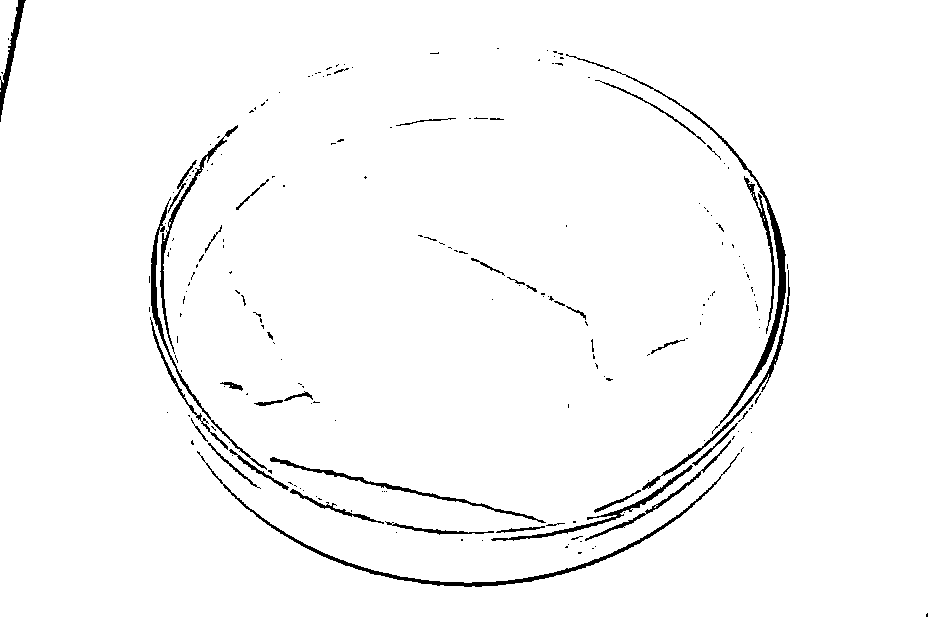

# 看不见的“小偷”

> 原文：[`mp.weixin.qq.com/s?__biz=MzIyMDYwMTk0Mw==&mid=2247539233&idx=7&sn=f838dd12eb4431a5c5b538e3006e374d&chksm=97cb9119a0bc180f51de83a5800a8f22ae98b944d1a1d3bebc8b3c75751666ea0b2ef3461de6&scene=27#wechat_redirect`](http://mp.weixin.qq.com/s?__biz=MzIyMDYwMTk0Mw==&mid=2247539233&idx=7&sn=f838dd12eb4431a5c5b538e3006e374d&chksm=97cb9119a0bc180f51de83a5800a8f22ae98b944d1a1d3bebc8b3c75751666ea0b2ef3461de6&scene=27#wechat_redirect)

.png")<svg viewBox="0 0 375 64" style="box-sizing: border-box;display: inline-block;width: 100%;max-width: 100% !important;visibility: visible;"><foreignobject width="100%" height="100%" data-role="block-content" style="visibility: visible;">**看不见的“小偷”**</foreignobject></svg>**“小偷”**它是一个恶魔般的“小偷”偷走金钱偷走爱情偷走健康让人一无所有将人推向无尽深渊

**《看不见的“**小偷**”》**

**↓↓↓**

[`mp.weixin.qq.com/mp/readtemplate?t=pages/video_player_tmpl&action=mpvideo&auto=0&vid=wxv_2457356182592897025`](https://mp.weixin.qq.com/mp/readtemplate?t=pages/video_player_tmpl&action=mpvideo&auto=0&vid=wxv_2457356182592897025)

毒品

一个可怕的恶魔

一个令人走上歧途的惯犯

它虽能给人带来一时的快乐

却会夺走大家原本拥有的一切

**毒**

《看不见的“小偷”》真实还原了

毒品毁掉一个人的全过程

呼吁全社会携手禁毒

别被毒品偷走

人生

**认识毒品**

根据我国《禁毒法》和《刑法》规定，毒品是指鸦片、海洛因、甲基苯丙胺(冰毒)、吗啡、大麻、可卡因以及国家规定管制的其他能够使人形成瘾癖的麻醉药品和精神药品。

**传统毒品：**

海洛因

鸦片

吗啡

可卡因

大麻

**合成毒品：**

冰毒

麻古

摇头丸

开心水

神仙水

**新精神活性物质：**

氯胺酮

合成大麻素类

卡西酮类

芬太尼类

苯乙胺类

色胺类

植物类

**毒品的伪装**

近年来，新型毒品层出不穷，从各种精麻药品到“上头电子烟”“聪明药”，再到“神仙水”“巧克力”等，极具隐蔽性、迷惑性、危害性。

以下是毒品曾使用的伪装

注意甄别

**如何远离毒品**

不轻信他人

不到复杂的场所 

不接受陌生人的食物

不要对毒品抱有任何好奇

来源：广州禁毒

← 向右滑动与灰产圈互动交流 →

