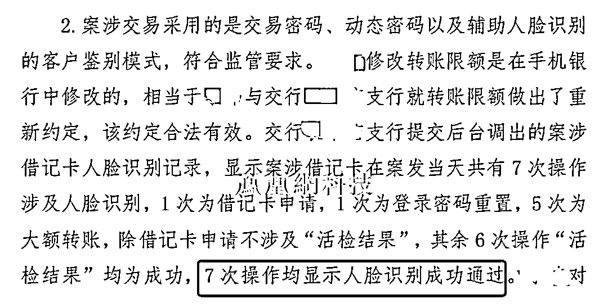
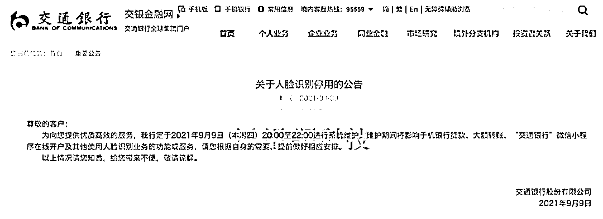
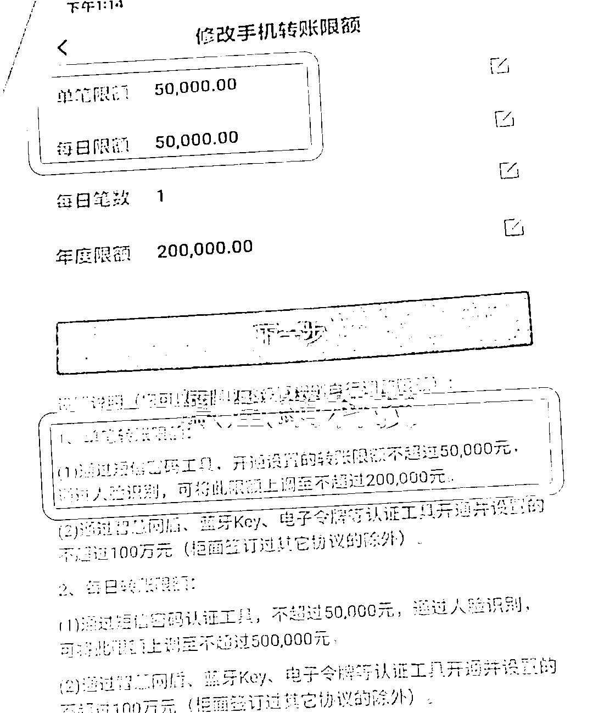
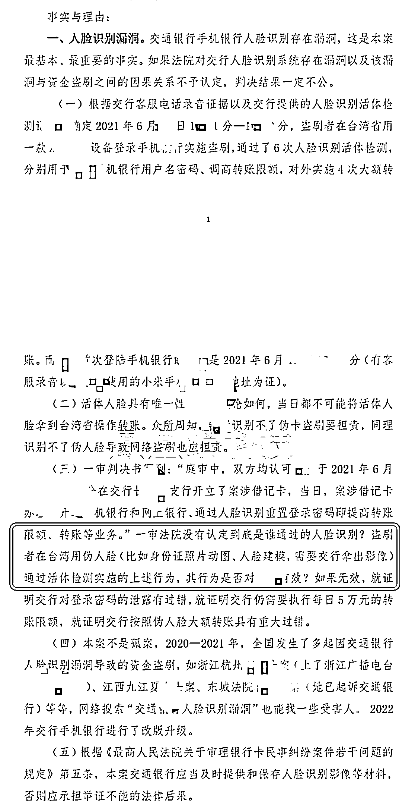
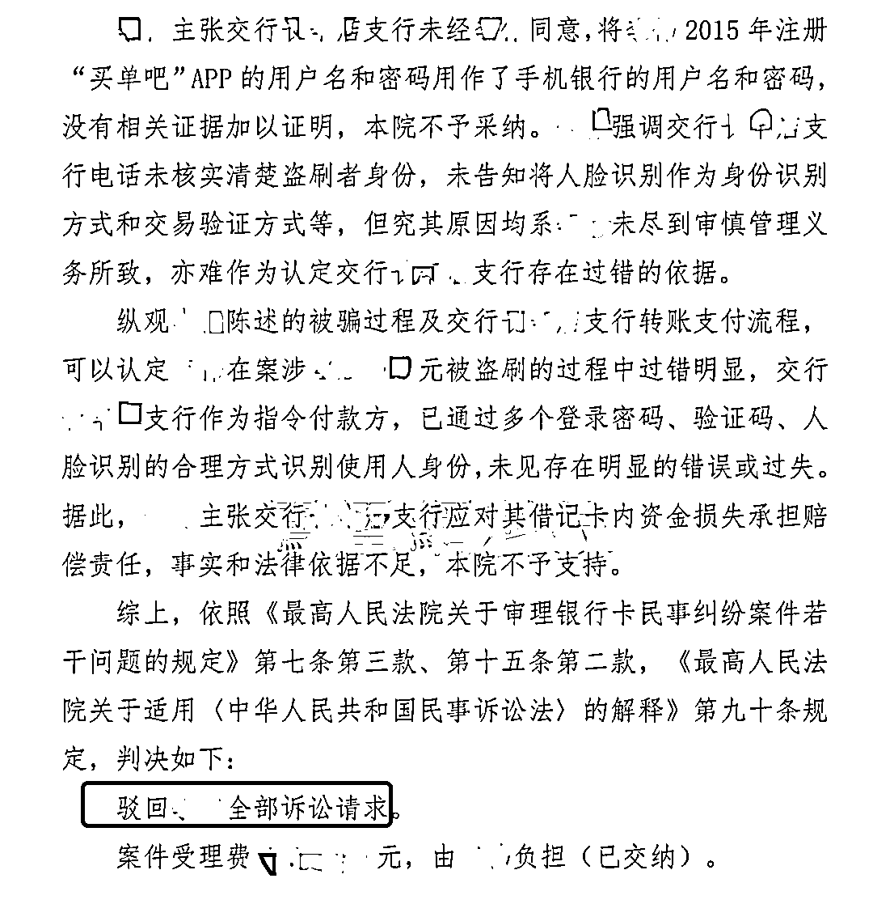

# 储户近 200 万巨款不翼而飞 人脸识别漏洞成骗子作案工具

> 原文：[`mp.weixin.qq.com/s?__biz=MzIyMDYwMTk0Mw==&mid=2247539325&idx=1&sn=4251fb7020c0feba1d8bff3cff0b56f3&chksm=97cb9145a0bc185382ba9fcff81ad52de624b5d7f65ba9b43ab6c9be165129b4ac8db6da8b22&scene=27#wechat_redirect`](http://mp.weixin.qq.com/s?__biz=MzIyMDYwMTk0Mw==&mid=2247539325&idx=1&sn=4251fb7020c0feba1d8bff3cff0b56f3&chksm=97cb9145a0bc185382ba9fcff81ad52de624b5d7f65ba9b43ab6c9be165129b4ac8db6da8b22&scene=27#wechat_redirect)

###  核心提示：

1.《新视界》独家获悉，目前已有 6 位交通银行用户被盗刷数百万元，他们的共同点，都是被犯罪分子诱骗，将钱存入了交通银行，犯罪分子使用假人脸通过了银行“人脸识别”这一关。交通银行不承认存在过失，拒绝承担任何责任，被马跃等受害者告上法庭。 

2.6 月 30 日，马跃的起诉被法院驳回。法院判定，交通银行未见存在明显的过错和过失。马跃认为，法院回避了交通银行人脸识别漏洞问题，表示会坚持上诉。

3.交通银行目前暂未回应。其技术提供方眼神科技回复《新视界》称，作为交通银行的人脸识别算法和技术服务提供商之一，未收到交通银行相关反馈。

4.这些案例几乎都被定性为电信诈骗，但藏于电信诈骗的外壳下的人脸识别风险，也值得重视。 

自人脸识别商业化以来，学界一直在呼吁重视其安全风险。

早在 2021 年，清华大学法学教授劳东燕就预测，包括人脸数据在内的利用个人信息进行精准诈骗等犯罪的浪潮才刚到来。**“犯罪的高潮还在后面，尤其是这种多中心的信息收集模式，一定会到处暴雷。”**

她认为，推广人脸识别宣称的安全、便利两大主要理由都不成立。她指出，**“所谓的便利，不是对一般大众来讲，而是主要给企业、产业界、相关部门带来商业或管理方面的便利。”**如劳东燕所料，目前，制作模拟人脸模型以破解人脸识别验证的黑产已相当“成熟”，许多软件代码已经开源，用身份证照片就可以从技术上模拟张嘴、眨眼等动作，可以骗过许多人脸识别平台。

去年 2 月，清华大学 Real AI 研究团队利用对抗样本干扰技术，15 分钟内破解 19 款安卓手机人脸识别系统。央视 3.15 也曾曝光过主持人现场直接“换脸”，骗过 APP，完成了活体检测认证。

**银行类 App 也会用到人脸识别，是否存在被对抗算法攻破的隐患？RealAI 团队测试中利用同样的方法成功“骗”过了部分金融 App 的人脸识别**，“眨眨眼、张张嘴等活体经过我们验证基本是无效的，相比之下支付类 App 使用的人脸识别技术更加谨慎。”

**该团队当时就指出，银行类 App 目前风险较高。**

****

人脸识别风险问题与学界的提醒几乎同时发生了。

**《新视界》独家获悉，2020 年 10 月至 2021 年 10 月间，五大国有银行之一的交通银行，发生了多起疑似与人脸识别漏洞有关的盗刷案。交通银行的人脸识别系统多次被犯罪分子通过活体验证，目前已被多名用户起诉。**

这些案例几乎都被定性为电信诈骗，但事实上，藏于电信诈骗的外壳下的人脸识别风险，也值得重视。

**犯罪分子异地通过交通银行人脸识别**

马跃是起诉交通银行的用户之一，他在金融系统工作多年，一年前的 6 月的某个下午，他的妻子刚把 50 万元存进刚开的交通银行卡中，不久，账户中的资金就不翼而飞了。报警、联系银行，马跃很快得知，存款被盗刷了。

警方向银行调取的内容显示，**犯罪分子的 IP 地址为中国台湾，转账使用了短信+人脸识别的方式。马跃提供的法院判决书显示，交通银行承认，用户本人当天并未离开北京，但远在台湾的犯罪分子，却 7 次通过了交通银行的人脸识别，6 次通过活检。**

“6 次人脸识别，交行一次都没识别出来犯罪分子使用的是假人脸。”马跃说。

**受害者在北京，犯罪者在台湾，IP 地址、登录手机型号都能证明，交行通过的人脸识别对象非受害者本人。但一个“假人脸”如何 6 次通过交通银行人脸验证的？人脸识别还有多少安全风险不为人知？**

直觉告诉马跃，这可能不是个案。马跃一边收集资料走诉讼流程，一边留意是否有类似的“受害者”，一年不到，5 位和他妻子一样疑因“交通银行人脸识别漏洞”被盗刷的用户找到了他。

马跃家银行卡被盗刷半个月后，7 月，同在北京的安女士也遭了“黑手”。**她和马跃的经历巧到，盗刷者除了都是台湾 IP 地址，连使用的手机型号都是一样的摩托罗拉 XT1686。**

还是 2021 年 7 月，夏女士被盗刷；9 月，海女士被盗刷；10 月，柳女士被盗刷；最早的一位受害者是赵女士，2020 年 10 月被盗刷。赵女士表示，“交通银行存在支付安全漏洞，没有办法识别出是否是真的人脸。”

他们的共同点，都是被犯罪分子诱骗，将钱存入了交通银行。6 位受害人都是女性，有金融体系从业者、有国内 top10 研究生、律师，他们几乎都是高收入、高学历群体，都在一、二线城市生活。盗刷时间几乎都集中在 2020 年 10 月至 2021 年 10 月。

马跃说，“当时犯罪分子说出了我老婆的姓名、身份证号、工作单位，还有我老婆的照片，说我们信息泄露了，账户风险很大，最好去开一张交通银行卡，国有大行安全措施比较好。”

**但没想到，犯罪分子看中的就是交通银行的“安全措施”。**

马跃认为，**犯罪分子一定要让受害者办一张交通银行的卡，而不是其他银行，是因为犯罪分子发现了交通银行存在人脸识别漏洞，并利用了这一漏洞。**

安女士告诉《新视界》，“以前可能都是一些普通人遭遇这些事情，无法找到这么多问题，而他们正好背景是搞技术、搞法律的内行，所以才有可能发现存在的问题。如果交行能改进，会大大减少普通百姓受骗受损”。

**“道高一尺，魔高一丈”**

科大讯飞副总裁、大数据研究院院长刘鹏此前接受《中国消费者报》采访时表示，他反对用人脸识别作为用户的密码去访问一些重要服务。

刘鹏认为，除了识别技术本身良莠不齐外，计算机的人脸生成技术如今已经相当成熟，因此，人脸信息作为密码本身就有风险。“目前还没有一个兜底的方案，来保证它的安全性。”

当风险已经来临的时候，仰赖于“魔”与“道”的斗法，看谁更技高一筹。只是“神魔打架”，总是凡人遭殃。**人脸识别技术提供方每一次技不如人，都可能造成数位用户的财产损失。**

为交行提供人脸识别服务的公司，叫做眼神科技，是一家成立于 2016 年 6 月的生物识别企业。

其前身为 1997 成立的天诚盛业公司，创始人、董事长兼 CEO 周军毕业于山东大学，高级副总裁王丙光与周军同是中欧国际工商学院 EMBA 校友，曾就职于中央国家机关工委、国务院国资委和宝钢、宝武集团等。CTO 沈昕阳毕业于哥伦比亚大学，是前 Google 数据科学家。首席安全专家顾问王小云是中国科学院数学物理学部院士。

这家公司技术水平如何？36kr 研究院分析师李晓晓曾出过一篇眼神科技的分析报告，她告诉《新视界》，这家公司比 AI 四小龙商汤、旷视、云从、依图开始的还要早，她认为，这家公司自身实力比较殷实，不是融资驱动型，相对低调。

**眼神科技相关负责人向《新视界》介绍，公司服务包括工、农、中、建、交、邮储六大国有银行和多家股份制银行在内的一百多家银行十余年，**专注于生物识别技术研发、应用和服务，在行业内深耕二十余年，拥有人脸、指纹、虹膜、指静脉等多种自主知识产权算法。

**该负责人透露，公司人脸识别技术和产品通过了公安部、银行卡检测中心、信通院等权威机构检测认证；使用过程符合监管机构管理要求；通过银行客户技术测试和公开招标入围，合法合规。**

眼神科技曾将加入中国信通院云计算与大数据研究所发起的“可信人脸识别守护计划”（简称“护脸计划”）视为“权威认可”，但**《新视界》了解到，“护脸计划”并无门槛要求。**

其创始人周军曾强调，将研究“生物密码”，即“用户到哪里密码就跟随到哪里”、”只有本人可用”希望结合密码技术来改善网络安全防御体系。

**眼神科技 CSO 王姝琦也提到过，眼神科技服务金融行业 18 年安全稳定无事故。但“生物密码只有本人可用”、“稳定无事故”的说法已被现实打脸。**

2020 年 9 月，眼神科技官方宣布，中标交通银行人脸识别项目。眼神科技向交通银行全行提供人脸识别产品，在现金管理、支付结算及账户管理等业务场景中实现人脸活检及身份识别功能，

但一个月后，赵女士的资金被犯罪分子通过交通人脸识别盗刷。而赵女士，是我们了解到的最早一个交通银行人脸识别被盗刷的案例。

其余几位受害人的被盗刷时间，都集中在 2021 年 6 月到 9 月。那个时间，马跃、夏女士、海女士、赵女士刚好在集中与交通银行交涉人脸识别安全漏洞问题。

交通银行“恰好”在 2021 年 9 月停用过人脸识别。

不久，马跃就发现交通银行系统改版了，手机银行已经登不上了，必须升级，马跃认为，银行可能已经修复了漏洞。

但 10 月份，交通银行又出现了一起人脸识别盗刷案，柳女士交通银行账户资金被犯罪分子用人脸识别+短信拦截。而这仅是马跃知道的 6 位。马跃猜测，可能还有更多的受害者。

**在这 6 位受害者的时间线里，交通银行与人脸识别技术服务商眼神科技，在活体检测技术上，已经输的一塌糊涂。**

**起诉交通银行被驳回**

**判决书未定性“人脸识别漏洞”**

根据交行的规定，登录手机银行需要手机验证码+人脸识别双重验证，根据交通银行客服的说法，“马跃”使用了人脸识别重置了密码。

**简单概括就是，犯罪分子拦截了短信验证码，通过短信+假人脸识别完成了密码重置、限额调整、大额转账。**

**境外新设备登录、修改密码、频繁大额转账，如此异常的位置、设备及交易行为，交通银行的风控如何应对的？人脸识别如何通过的？转账限额如何被更改的？**

**马跃认为，“开卡协议里头约定的是限额 5 万，超过限额的到柜面办理，协议写的很清楚。《新视界》查看了手机银行的单笔转账规定，通过短信密码工具，转账限额不超过 5 万，通过人脸识别，可将上限上调至不超过 20 万。**

“如果你确实识别了我真实的人脸，是经过我同意了，但是你识别的不是真人的脸，说不过去。” 

自被盗刷以来，马跃等多次上诉至法庭，但对其提出的“谁通过了人脸识别”这一问题，没有具体定性。

**图：马跃的诉状**

7 月 5 日，马跃告诉《新视界》，6 月 30 日他的申请已被法院驳回，法院判定，交通银行未见存在明显的过错和过失。

**图：马跃提供的法院判决书**

但他认为，法院回避了交通银行人脸识别漏洞问题，表示会坚持上诉。

**拒绝受害者有罪论**

**如果仅以信息泄漏简单概括这 6 位受害者的经历，将所有的电信诈骗都归于用户不够谨慎，而不对背后的根源深究，可能会有更多的人继续遭受损失。**

奇安信集团行业安全研究中心主任裴智勇此前接受《中国消费者报》采访时说过，智能换脸的技术门槛比绝大多数人的想象要低得多。通过人工智能技术，可以将一张普通的静态照片(正面、侧面均可)，转化生成一张表情生动的人脸，以**2017 年左右的技术水平，已经完全有能力骗过绝大多数人脸识别系统。**

裴智勇举过一个用大数据安全验证模型保障用户账户安全的例子，如果用户刷脸支付时，装有支付 APP 的手机原先一直在北京活动，某一天刷脸行为突然发生在广西，支付系统就应阻止验证被通过。

马跃也在想，**如果交行的人脸识别系统安全，应该能识别出当时那张脸非用户本人，及时阻止验证被通过，那犯罪分子根本无法登录账户，后续的密码重置、限额调整、大额转账也就无从下手了。**

清华大学公共管理学院副教授贾西津认为，银行系统不能识别真实的脸和假的面孔，那就属于系统漏洞，剩余责任肯定是在银行，不能把责任都推给客户。用户如果存在信息泄露的话有一定过错，但银行肯定不是无责的。

“第一，人脸识别不该通过，但是通过了，第二，安全体系设计本身有漏洞，异地登录、假人脸识别都通过了。在短信出现差错的时候，要看整个安全体系有没有纠正过来。”

中国人民大学法学院副教授郭锐告诉《新视界》，**在法律上，即便是由于技术本身无法实现百分之一百的精确，对于造成的损失，银行也应该承担责任，不能以用户信息泄漏的说法逃避责任，除非能够证明用户和犯罪分子进行了互相配合，导致了损失。**

**“犯罪分子通过假的人脸识别骗过银行的身份认证系统，本质上和犯罪分子伪造文件单据骗过银行的身份认证系统没有不同。**从侵权法的立法政策上看，银行有能力改进技术减少损失，而用户完全无能为力。所以把责任分配给银行，从经济角度看，能够减少损失。”

**郭锐认为，银行有责任采纳成熟的技术，减少识别错误。**

7 月 5 日，交通银行手机银行用户协议中，人脸识别技术提供方仍是眼神科技。

凤凰网《新视界》联系到了交通银行及眼神科技，对于以上用户提出的交通银行人脸识别漏洞是否存在？为何真假人脸无法识别？

眼神科技没有正面回复。其相关负责人对凤凰网新视界表示，作为交通银行的人脸识别算法和技术服务提供商之一，**目前为止尚未收到客户有关此案件的相关反馈。**并非当事双方人，不便做过多评论。

**截至发稿，交通银行对此事暂无回应。**

（应受访者需求，马跃、安女士、夏女士、海女士、柳女士、赵女士为化名，为保护受访者隐私，个人信息做了模糊处理）

凤凰网 新视界 出品 作者: 季倩 编辑:于浩 微信编辑:李金洋

← 向右滑动与灰产圈互动交流 →

