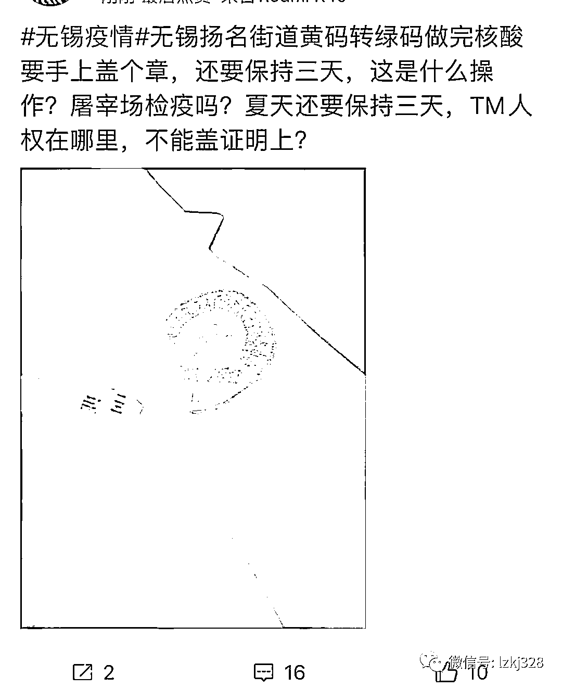
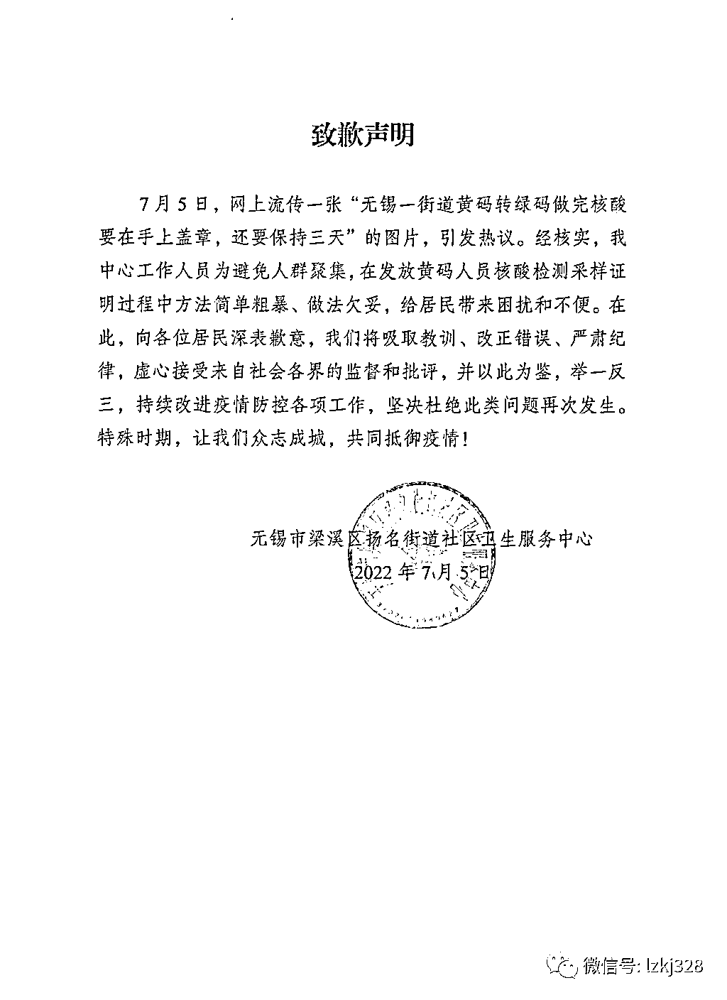

# 黄码转绿码，人手当猪手？无锡当事单位工作人员厚着脸皮“辟谣”公然撒谎！！！

> 原文：[`mp.weixin.qq.com/s?__biz=MzIyMDYwMTk0Mw==&mid=2247539325&idx=2&sn=6b796b2cc3a1c6f44fe1babceb4389fd&chksm=97cb9145a0bc18536ca2ac497d96c80cdc954362a2c7344b4e867b6877b065bf552f51c911d0&scene=27#wechat_redirect`](http://mp.weixin.qq.com/s?__biz=MzIyMDYwMTk0Mw==&mid=2247539325&idx=2&sn=6b796b2cc3a1c6f44fe1babceb4389fd&chksm=97cb9145a0bc18536ca2ac497d96c80cdc954362a2c7344b4e867b6877b065bf552f51c911d0&scene=27#wechat_redirect)

**信誓旦旦说此事系谣言的江苏省无锡市梁溪区扬名街道社区卫生服务中心工作人员，该当何罪？！**

7 月 5 日，网上流传一张“无锡一街道黄码转绿码做完核酸要在手上盖章，还要保持三天”的图片，引发网友热议。

5 日下午，新黄河记者联系到疑似盖章单位的江苏省无锡市梁溪区扬名街道社区卫生服务中心，有工作人员表示已留意到相关言论，但他们未实施相关措施，此事系谣言，“我们也在奇怪这个话从哪里来的，我们工作人员不会这么说的”。关于是否为该部门所持有印章，未得到对方证实。

据网友提供的图片信息显示，其手腕处被盖有一个印章，其中文字隐约显示“扬名街道社区卫生服务中心”。

图片配图称，“街道黄码转绿码做完核酸要在手上盖章，还要保持三天。”

记者多次致电扬名街道新冠肺炎疫情联防联控指挥部、梁溪区人民政府和无锡市宣传部，均未能接通。

随后记者拨打扬名街道下辖多个社区防疫电话进行咨询，有工作人员介绍，也注意到有关消息，但不了解具体发生在哪里，其称，辖区内苏康码黄码人员在指定医院完成抗原和核酸检测后，可自行通过“灵锡”APP 或到所在社区申请转码。

“看疾控中心赋黄码时候对你的核酸要求，有的是三天两检，有的是三天三检。做完之后凭核酸报告结果，可以到社区去填表申请。”

记者随后联系江苏省无锡市梁溪区扬名街道社区卫生服务中心，工作人员对此事进行了辟谣。

另有扬名街道办昨日发布的疫情防控通告显示，该街道在隔离管控和区域核酸检测中发现多例新冠肺炎阳性感染病例，疫情防控形势严峻复杂。

因此决定扬名街道除中高风险区以外，其他区域（除建乐家园、九龙仓时代上城 A 区、古运五爱苑 A 区以外）即日起参照中风险区管理，即采取“足不出区、错峰取物”的临时管控措施，除必要的就医之外，原则上每户家庭每天可派 1 人凭小区出入通行证，外出不超过 2 小时购买必要生活物资。

记者采访得知，出入通行证由各社区（小区）自行印发。

根据无锡官方发布的消息，该市昨日新增本土无症状感染者 34 例，自 6 月 29 日本轮疫情发生以来，全市已进行六轮核酸检测。

此外，扬名街道目前有一个高风险、两个中风险区域，街道下辖 12 个社区，辖区内共 18 万人。

[`v.qq.com/iframe/preview.html?width=500&height=375&auto=0&vid=w3346sftkw7`](https://v.qq.com/iframe/preview.html?width=500&height=375&auto=0&vid=w3346sftkw7)

扬名街道社区卫生服务中心工作人员信誓旦旦地“辟谣”过后，当晚，无锡市梁溪区扬名街道社区卫生服务中心发布致歉声明。声明称，工作人员为避免人群聚集，在发放黄码人员核酸检测采样证明过程中方法简单粗暴，做法欠妥，给居民带来困扰和不便。

信誓旦旦说此事系谣言的江苏省无锡市梁溪区扬名街道社区卫生服务中心工作人员，该当何罪？！

要点脸吧！！！

[`v.qq.com/iframe/preview.html?width=500&height=375&auto=0&vid=e3346f650kz`](https://v.qq.com/iframe/preview.html?width=500&height=375&auto=0&vid=e3346f650kz)

来源：宾曰语云综合自新黄河客户端、无锡市梁溪区扬名街道社区卫生服务中心等

← 向右滑动与灰产圈互动交流 →

