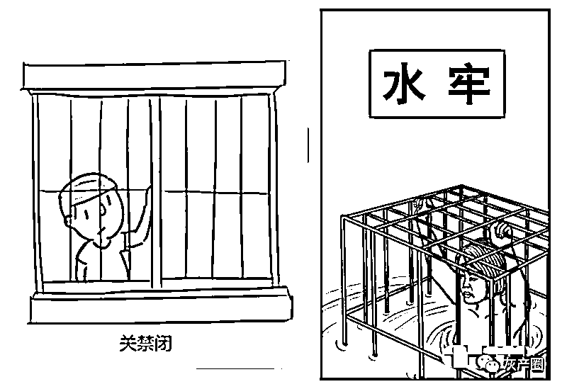
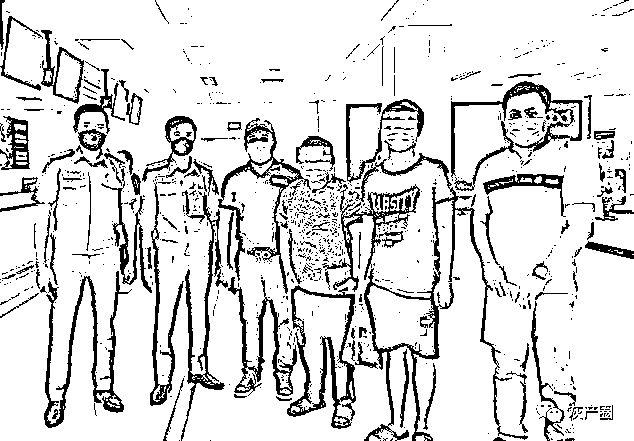
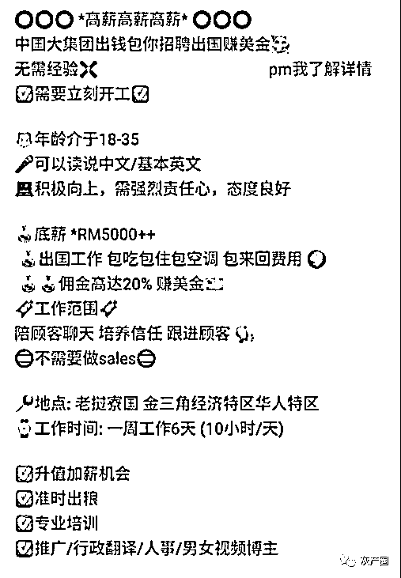
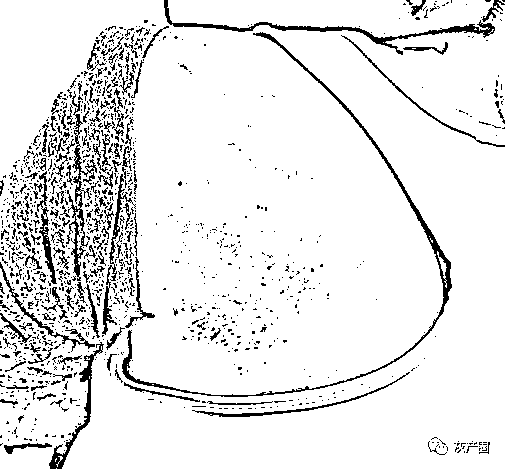
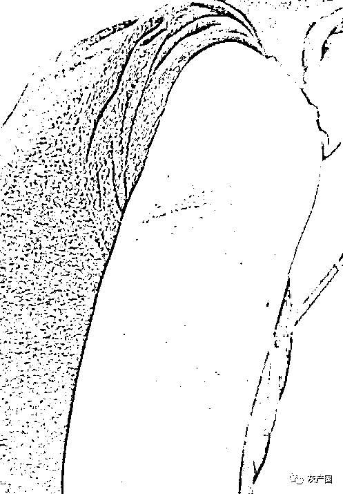

# 关水牢两周每天电三次，其中 1 人被虐打至遍体鳞伤，再有两名大马“猪仔”成功被救回国...

> 原文：[`mp.weixin.qq.com/s?__biz=MzIyMDYwMTk0Mw==&mid=2247539325&idx=3&sn=bd5a2d55f104ad7de9ca1d781a3d038b&chksm=97cb9145a0bc1853ed2c4f077210f75dacc61637c150b0d636930ab0aee722e99bd89abd32af&scene=27#wechat_redirect`](http://mp.weixin.qq.com/s?__biz=MzIyMDYwMTk0Mw==&mid=2247539325&idx=3&sn=bd5a2d55f104ad7de9ca1d781a3d038b&chksm=97cb9145a0bc1853ed2c4f077210f75dacc61637c150b0d636930ab0aee722e99bd89abd32af&scene=27#wechat_redirect)

又有两名“猪仔”成功从老挝金三角被救回国！其中一人在国外被虐打得遍体鳞伤，他们劝告时下年轻人不要被高薪广告所骗，也不要轻易相信朋友，避免坠入陷阱。

**囚禁水牢每日遭电棍殴打**

其中女事主更是因为有意偷渡回国而被发现，最终关在水牢长达两周，每天浸泡在水里，水淹至颈部，大小解皆在水中。由于没有食物和水，为了活命，她只能饮用水牢的水，每天甚至还要被人以电棍殴打三次，饱受折磨。

化名为“阿伟”（22 岁，来自吉隆坡，居住在马六甲）及“阿雯”（35 岁，来自槟城)是于今年 4 月份联系民主行动党格西当州议员谢守钦，并通过大使馆及当地执法单位，成功逃出魔掌。

**阿伟（背对镜头者左一起）及阿雯向谢守钦（面对镜头者左一起）及助理张文杰，叙述他们的遭遇**

他们昨日在谢守钦陪同下召开新闻发布会，叙述本身的经历，希望能够提醒年轻人，多加警惕，避免成为下一个目标。

“阿伟”指出，他是于去年 11 月初被脸书高薪招聘广告吸引，由于待遇不错，他 WhatsApp 了解就答应对方通过视频的方式面试，对方提到基于冠病疫情的关系，只能偷渡去竂国，当时他就答应对方去打工。

“两三天后，对方就安排一个司机到门口接我，载我去吉兰丹，并走森林路到泰国边界，我们只能待在森林过夜。翌日则有泰国司机接待我们，每到一个地方就换不同的司机，期间也有一些缅甸人一起，但是每个人到站的地点不一样，而我是最后一站抵步老挝，整个过程花费一周的时间。”

他说，到了老挝金三角，他做了冠病检测后就被安排至由中国人管辖的经济特区，大约隔离一个月才到园区内上班，园区围着铁丝网及有守卫看守。

**薪水从 5 千令吉变 5500 人民币**

他表示，之前说好的薪水为 5000 令吉（人民币 7000 令吉），孰料抵步后才得知薪水只有人民币 5500，而且还是要骗到人才有薪水及佣金。

“工作时间一般上是 12 小时，没有业绩就要加班，一切视主管而定，我最长工作长达 16 小时，工作内容就是“杀猪盘”，我们必须要编一个人设、年龄、感情经历及创业经历，同时也要变换性别，假装“白富美”或“高富帅”，可通过社交媒体获得素材去找目标人物聊天。”

**盗用照片博受害者信任**

他说，他们也会通过社交媒体盗用一些照片，包括生活照，也传发予受害者，当两人达到一定信任度，就会介绍受害者“投资平台”，哄骗他们“投资”赚钱，受害者分别来自亚洲市场或欧美国家。

他说，双方聊天语言中英文皆有，若不谙英文则使用翻译软件沟通。为了取得受害者的信任，他们还必须要盗用他人的语音或者卡（cut）视频，剪短社交媒体的视频，上载视频不超过一分钟，以骗取受害者的信任。

“这段期间，我们的手机会被没收，除非是有开业绩或休息时，才能拿回手机，他们也会检查手机内的信息。”

“当时我一直在想找人求救，找谢守钦之前，曾有联络一个组织求助，但是却没有下文，直到我联络上谢守钦，后者了解情况后，就帮我们联系大使馆。”

他说，期间本身也不时被打骂，包括用电线鞭打，当公司得知他们向大使馆举报时，老板就想卖掉他，心情不好时就指示他跪着，没得吃饭。

“公司主管检查手机，我忘记删除了相册的照片，我被发现在相册内保存宿舍及园区的照片，就被殴打，主管问我还要做吗？不要做就给赎金，我只好联络谢守钦，假称他是我叔叔。”

“阿伟”表示，这段期间他被卖过 4 次，只要没有业绩被卖走，即两三个月没骗到人就会被卖。其他三间公司也是通过爱情投资骗局方式骗钱，主要是针对对方的弱点下手，有时不一定是爱情，例如缺钱者则聊钱，包括可带对方赚取多少钱，若对方感到寂寞则聊感情。

**开心被救出 学习脚踏实地工作**

他在老挝逗留半年左右，如今成功被救出感到很开心，能够放下很多包袱，他回来就想见家人，重新改变，脚踏实地工作。

“之前在工厂上班，收入仅有 1200 令吉，入不敷出，只能省吃俭用，因此冲动想去拼一下，赚更多钱，没想到是这个遭遇！”

我劝告，年轻人若下次要出国找工必须要保持谨慎，一定要通过正规管道找工，不要通过脸书，尤其是身边朋友介绍出国打工更要保持警惕，因为很多“猪仔”是被朋友骗过去。

他说，公司曾叫他介绍朋友过去，一个人头一万人民币，不过却没有强制性。

**两好友半哄半骗下答应**

“阿雯”表示，她是在去年 2 月份看到招聘广告，刚好在认识两年多的两个朋友串通半哄半骗下，答应去打工。

“当时行管令（MCO）期间，我经营的饮食业不好，他们建议我过去上班，虽然我要求正规方式过去，对方指 MCO 期间没有飞机，而大马偷渡过去不属于犯罪。”

当“阿雯”答应后，对方当晚就载她去吉兰丹过夜，半夜出发去泰国边界，他们一组 5 个人，皆来自我国，只能步行通过森林，从泰国曼谷、清迈、缅甸及老挝，步行长达 10 天。

她说，本身也没有进行冠病检测，就直接上班，主要是爱情投资骗局，即使开了业绩也不会给钱，本身从总部卖给分部，一共被卖了 3 次。

“刚过去不到两个月，我原本打算和大马的女性朋友（对方曾被强奸）一起偷渡回国，被发现后，我被关在水牢内虐打，整个人被浸泡在水里，水到颈部，我不时被拉头发上来再被压下去，每天被挨打三次。”

她说，对方用中国电棍殴打，也没给饭吃，为了活命，她只能饮用水牢内的水，大小解皆在该处。

**家人汇 5 万对方坚称没收到**

“阿雯”指出，本身不听话就被对方用衣架殴打，其中以 5 月 26 日被殴打得最严重，遍体鳞伤，对方更威胁她拍视频骗家人钱，勒索 18 万人民币，虽然家人已经汇入 5 万令吉进入公司的户头，对方却坚持没收到，甚至要她的命！

她说，每次被殴打了都没得看医生，还必须继续工作，最后一次被关在房间挨打，直到大使馆的人救出。

她说，和她一起到金三角的其他人都失踪了，没有消息，至于长得美的女性则被公司的人强奸。

她说，回国后感到安心，无需担心受怕，她第一件事就要想回家和家人团聚。她也计划休息后，再做生意。

她也劝告年轻人不要轻易相信朋友，以为国外薪水高，却被朋友骗去赚取佣金，她回国还被有关“友人”威胁不要乱讲话。

**谢守钦：4 月接到阿伟信息求救**

谢守钦则表示，本身于 4 月 8 日接到“阿伟”的第一个信息，指被骗偷渡去寮国金山角，之后每次过了凌晨 12 时才联络，本身要求后者提供家人的联络及本身的遭遇，包括建筑物外观及地点

“阿伟”告诉我，有时必须做 15 小时，还需面对体罚、精神压力等经历。”

谢守钦指出，本身提供大使馆包括“阿伟”等人的资料及来龙去脉，大使馆开始和当地警方投报，期间也面对不少问题，包括警方找不到地点或找到也进不到特区。

“我们和大使馆提供意见，包括和当地部长、高层交涉，但是大使馆也有一定的程序，不能越权，由于地点距离太远，大使馆也不能亲自上门，据了解，涉及老挝、缅甸、泰国的受害者，中国人比较多。”

他说，受害者面对很大的心理压力，担心随时被卖走及被发现后没收电话。

“曾经阿伟的上司要求我缴付 23 万人民币赎金，我只能说没钱敷衍，“阿雯”的上司则要求家人缴付 18 万人民币，我告诉大使馆，不管受害者利用什么方式偷渡，都是属于大马身份，大马有责任去救出他们，而不是以谈判赎金方式救出。”

**好几次拯救失败**

他表示，所幸最终通过大使馆向当地副部长级的人帮助，把受害者救出，整个事件约 3 个月时间。

“大使馆及当地警方尝试几个礼拜，好多次都拯救失败，金三角不容易进入，包括老挝的警方都无法进入。”

据他向大使馆了解，整个经济特区占地 30 平方公里有很多集团、企业，是由中国人为主控制特区，也有守卫守着。

**警方提醒**

一、根据我国法律规定，偷越国（边）境、电信网络诈骗和赌博活动是违法犯罪行为，害人害己，公安机关将严厉打击，请广大公民切勿从事相关活动。

二、《中华人民共和国刑法》第三百二十二条规定：违反国（边）境管理法规，偷越国（边）境，情节严重的，处一年以下有期徒刑、拘役或者管制，并处罚金。

三、警方提醒，广大群众要提高警惕，通过正规、合法的劳务中介外出务工，切勿轻信赴缅北地区的招工信息。如遇此类招工信息，请及时向公安机关报警。

四、警方劝告滞留缅北人员及其家属，请及时联系劝导亲人尽快回国入境投案自首。如实供述自己的罪行的，可以依法从轻或者减轻处罚；犯罪情节较轻、有重大立功表现的，可以依法减轻或者免除处罚；拒不入境投案自首的，公安机关将依法从严惩处。

来源：大 R 说安全

← 向右滑动与灰产圈互动交流 →

