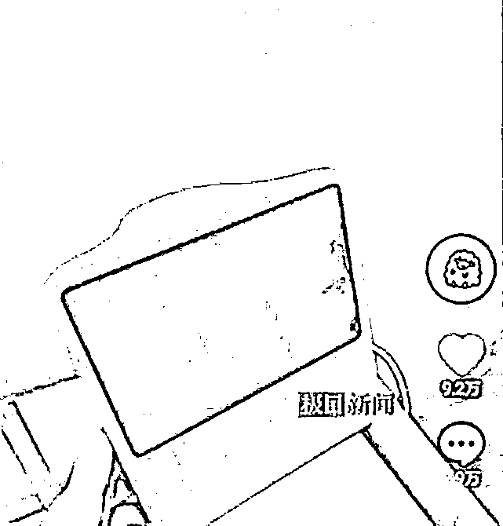
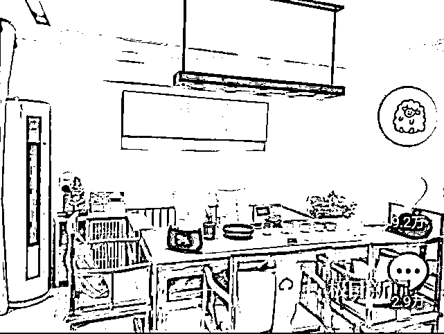
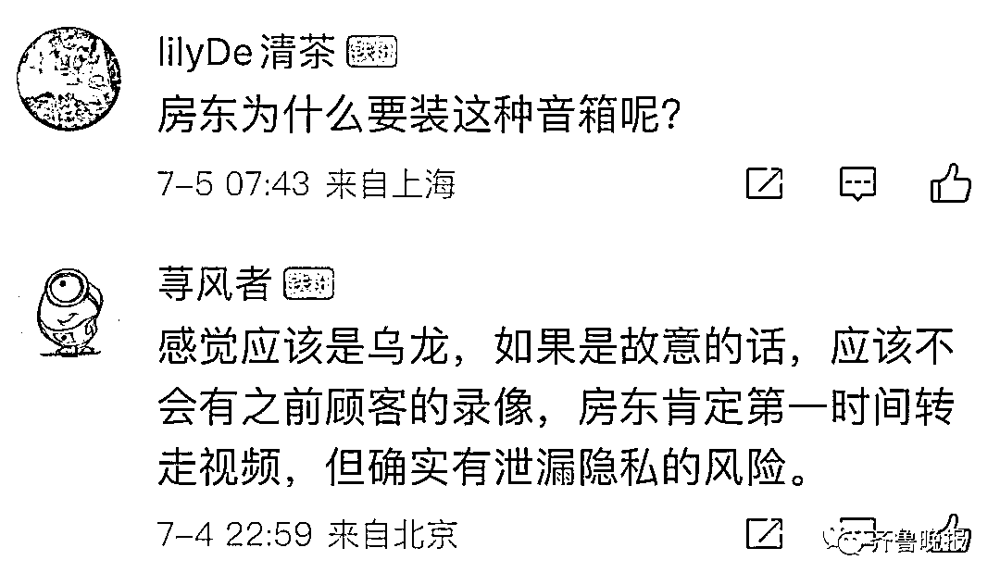
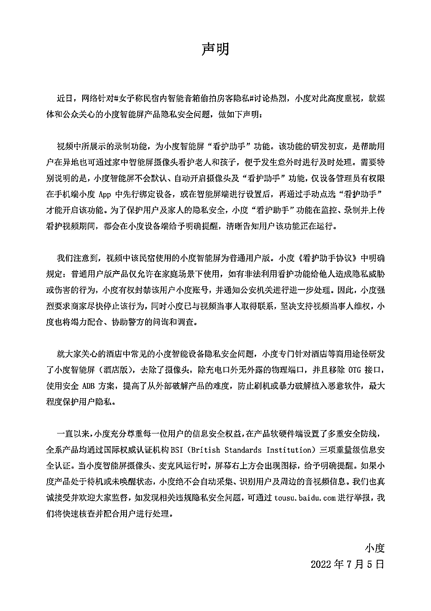
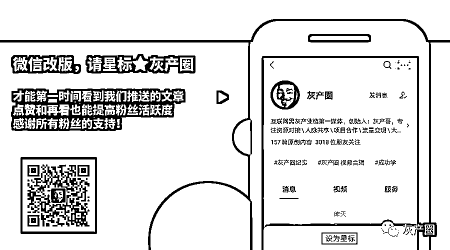

# 智能音箱内藏多个隐私视频，多名房客被偷拍！涉事品牌回应

> 原文：[`mp.weixin.qq.com/s?__biz=MzIyMDYwMTk0Mw==&mid=2247539325&idx=4&sn=478689cf7b61d55dc17d08e3fc28cbcf&chksm=97cb9145a0bc18534ac28fd0d5aac35d0c241603117f12fe618918f1183886ea14e9b1084792&scene=27#wechat_redirect`](http://mp.weixin.qq.com/s?__biz=MzIyMDYwMTk0Mw==&mid=2247539325&idx=4&sn=478689cf7b61d55dc17d08e3fc28cbcf&chksm=97cb9145a0bc18534ac28fd0d5aac35d0c241603117f12fe618918f1183886ea14e9b1084792&scene=27#wechat_redirect)

外出住酒店、民宿

有可能碰到隐私被偷拍的风险——

**“卡通挂件、打火机、插座、挂钩、烟雾报警器、运动鞋、饮料罐、沐浴乳、纸巾盒、牙刷、路由器、钢笔…”**

这些物品容易被伪装成偷拍设备

除此之外

又有“新设备”被发现也用作了偷拍！

近日 

辽宁杨女士（化姓）发视频爆料

她在预定的民宿中玩智能音箱时发现

**音箱也偷拍了**

****

打开这款音箱的显示器

发现里面有她朋友在房间的视频

还有多段之前客人的隐私视频

杨女士曝光的视频中提到的偷拍的智能音箱（视频截图）

7 月 3 日

杨女士又发布了一段此事后续进展视频

**她表示已经报警**

**警察也已经进入她所住的房间取证**

**但智能音箱已经不知被谁拿走**

视频中的录音还显示

疑似房东打电话给杨女士质问她

为什么给警察开门

杨女士（化姓）发布在视频中房间照片（视频截图）

记者就此致电辽宁本溪市公安局指挥中心

工作人员表示

已经接到这个警情

目前明山区公安分局正在落实调查此事

辖区明山公安分局高峪派出所

**一名工作人员称**

**此事是他们派出所民警出的警**

**目前已经立案**

民警正在连夜调查网友反映的情况

7 月 5 日

百度旗下人工智能助手@小度小度

就该事件发布声明：

**强烈要求商家尽快停止该行为**

**已与视频当事人取得联系**

**支持当事人维权**

**并将竭力配合、协助警方的问询和调查**

**专家：民宿平台监管部门应负起相关职责**

专家表示，我们除了要提高自身的安全意识，掌握一定的防偷拍知识外，更重要的是，民宿平台和市场监管部门要负起相关责任，实行严格的准入制度，不定期进行安全检查等，为消费者筑起隐私保护的高墙。

[`v.qq.com/iframe/preview.html?width=500&height=375&auto=0&vid=a334602515l`](https://v.qq.com/iframe/preview.html?width=500&height=375&auto=0&vid=a334602515l)

**来源 ：**** 齐鲁晚报、极目新闻、@小度小度、网友评论**

← 向右滑动与灰产圈互动交流 →

