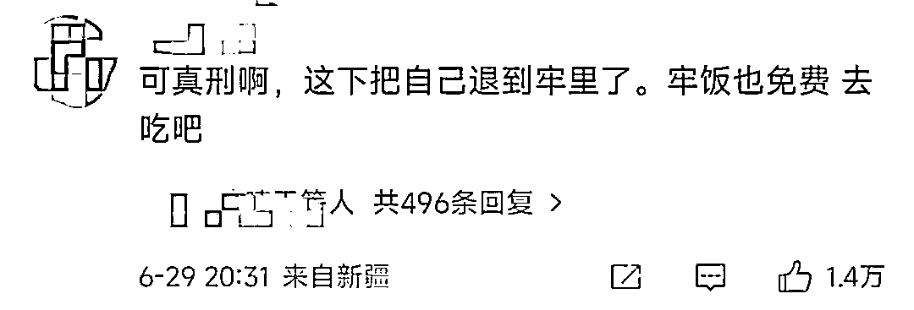

# 怎么做到的？一男子网购 300 多次，次次只退款不退款，一年骗了商家近 4 万！

> 原文：[`mp.weixin.qq.com/s?__biz=MzIyMDYwMTk0Mw==&mid=2247539325&idx=5&sn=f8c9e112691b56c559fc0311338c6426&chksm=97cb9145a0bc18533ef872608ad817ad6ed0ee60ffd7d587e6ea4c05cc32a3ae793b6c69a9a1&scene=27#wechat_redirect`](http://mp.weixin.qq.com/s?__biz=MzIyMDYwMTk0Mw==&mid=2247539325&idx=5&sn=f8c9e112691b56c559fc0311338c6426&chksm=97cb9145a0bc18533ef872608ad817ad6ed0ee60ffd7d587e6ea4c05cc32a3ae793b6c69a9a1&scene=27#wechat_redirect)

说起来

上海人民在家过了

几个月无欲无求的生活后

变得格外珍惜网购的机会

加上解封初期物流各种异常

快递各地旅游啊、不发上海啊

被扣华东操作部啊等等

搞得上海人民也没脾气了

只要可以发上海就好 

只要最终能送到就好

也不敢指望隔日达什么的了 

而相比起上海人民的卑微

其他地方的朋友可就硬气多了

甚至会反过来套路商家

前不久看到一则新闻

一男子网购 300 次

只退款不退货

骗取商家退款总计**39318 元**

****

**emmmmmmm**

**匪夷所思啊** 

**比起抨击他的无耻**

**更想知道的是**

**这人是怎么做到只退款不退货的？**

****

****网购 300 多次，只退款不退货****

****事情还要从 2020 年的 5 月说起****

****武汉一男子在一次网购经历中****

****偶然间发现一家店****

****因为对于快递单号的审核不严****

****可以做到只退款但不退货的操作****

****成功一次以后就被他摸到了诀窍****

****于是在一年多的时间里****

****在这家淘宝店里购物 300 多次****

********

****每次都用同样的手段重复退款****

****到店主发现后已经累积被男子白嫖了****

****39318 元的衣服！****

****************

****这还真是各方面的槽点都很多****

****特别是对于男子这个操作到底可不可行****

****网友都很疑惑****

****都 2022 年了，淘宝也出来 20 年了****

****不至于就简单就给这男子钻了空子吧？****

********

****结果还真就让他钻了空子****

****操作其实也就很简单****

****只需要在申请退货退款的界面****

****选择“自行寄回”****

****然后填写一个虚假的快递单号就可以了****

********

****而这家淘宝店铺也因为工作交接的问题****

****竟然没有专门的人员负责退货这一块的审核****

****平台也不会进一步去帮店家核实快递单号****

****只要等到 7 天之后男子就会自动得到退款****

****这一来二去还真就让他白嫖成功了...****

****************

****怎么说呢......****

****一时也不知道****

****到底是平台心更大，还是卖家心更大****

****还是徐某某自己心更大了****

****一边是完全不审核的平台****

****明明菜鸟裹裹都和支付宝绑定了****

****追查个订单好像也不难吧****

********

****一边是心真大的卖家****

****退款退货虽然不如确认订单发货重要****

****但也不至于完全忽视吧****

********

****有没有一种可能****

****商家是在欲擒故纵****

****不然不到一定金额报不了案哇****

******** ****************

****这个徐某某本人也不好定义****

****也不知道是聪明还是不聪明****

****说聪明吧****

****还真给他找到这么一个白嫖的 bug****

****说不聪明吧****

****你薅羊毛也不能只盯着一头羊薅啊！****

******** ****************

****金额小点，偶尔钻次空子****

****店家还可能会嫌烦就置之不理了****

****你这 300 多次，总计快 4 万...****

****民警直接在家里就搜出了 300 多件衣服****

********

****是生怕店家找不着你吗？？？****

********

****这下贪便宜给自己贪进牢里去了****

****去牢里薅羊毛吧！****

********

******保护买家 or 养白嫖党？卖家怎么办？ ******

******这起事件中******

******虽然卖家的管理不周也有一部分的责任******

******但更大的责任还是在想要白嫖的买家******

******和疏忽这种白嫖行为的平台身上******

******不禁让人产生疑问******

******这些购物 APP 这么多年的更新迭代******

******为啥能用这么简单的手段就钻了空子？******

********虽然买卖关系中消费者一直处于弱势********

******但也不代表卖家就能被乱剥削吧******

****更何况像徐某某这样****

****无耻的消费者还不是少数****

********

****这不禁让人联想到****

****这几年大风大火的直播行业****

****最近常出现未成年人用自己父母的钱****

****给主播打赏的事件****

****因此后来的各大直播平台也推出了****

******允许未成年人申请退款的选项******

****乍一听还挺人性化的****

****你以为是你给钱，主播退钱的和谐过程****

****其实是，**你给钱，主播倒贴，平台赚差价******

************

******也就是说******

******假如你打赏 200 块礼物给一主播******

******主播本身只能收到 100 元******

******另外 100 元给了平台******

******但要是这个时候未成年人申请退款******

******主播会把自己收到的 100 元退回去******

******而平台不会吐出已收入囊中的 100 元******

******那少的 100 元怎么办？******

******就由主播再倒贴 100 元咯******

************

******这倒贴的钱对体量大一点的主播还能接受******

******但对体量小一点的主播就是毁灭性打击了******

************

******最可悲的是******

******被平台压制的主播与商家们还没办法离开平台******

******离开了就没有流量，没有钱******

******他们依托于平台来生存******

******也就只能服从平台的规则******

******就算不服气，那又能怎么办呢？******

************

******来源：实测，上海全知道******

************************

******← 向右滑动与灰产圈互动交流 →******

************