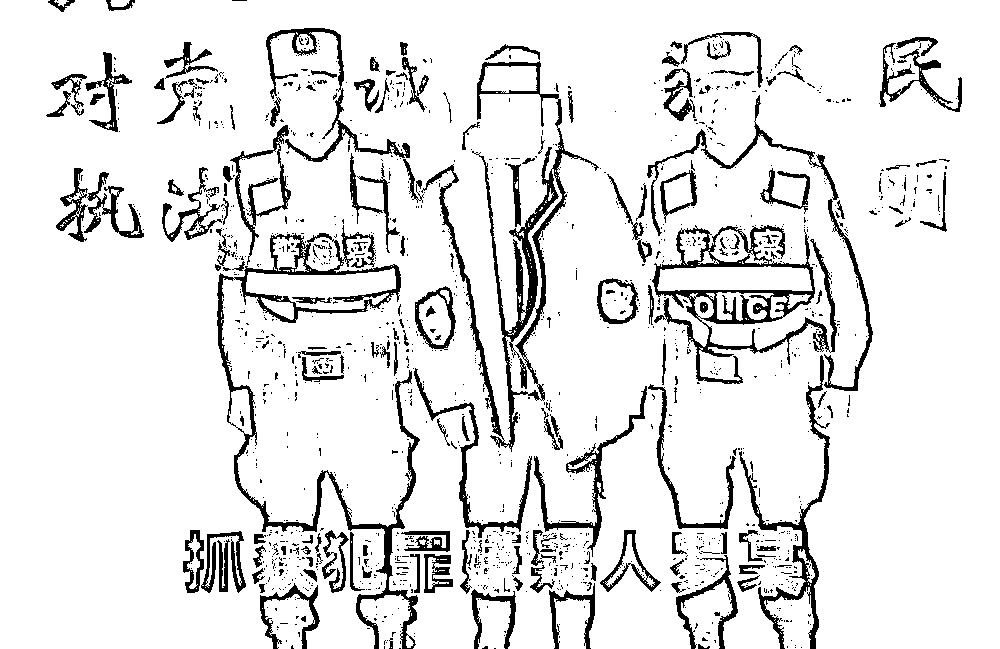

# 三男子网恋被骗 15 万，甜蜜女友竟是“精神小伙”！

> 原文：[`mp.weixin.qq.com/s?__biz=MzIyMDYwMTk0Mw==&mid=2247539325&idx=6&sn=d2e79fd690d2571565830ef11ff7f2b9&chksm=97cb9145a0bc1853f9b29ebaa0499a5f46225083cd6cb4ac934beee9bee2db0cdcad025be6ab&scene=27#wechat_redirect`](http://mp.weixin.qq.com/s?__biz=MzIyMDYwMTk0Mw==&mid=2247539325&idx=6&sn=d2e79fd690d2571565830ef11ff7f2b9&chksm=97cb9145a0bc1853f9b29ebaa0499a5f46225083cd6cb4ac934beee9bee2db0cdcad025be6ab&scene=27#wechat_redirect)

六年多时间里

从征婚广告认识到恋爱再到报警

**李某、张某、杨某共同经历了** 

**一场不同寻常的恋爱......**

**征婚广告
引得几十名男士争先联系**

**“我叫雨童，女，27 岁，单身，想找一个真心对自己好的男士。”**2016 年，这则由丹巴男子罗某冒充单身女性在网络平台发布的征婚广告，引得几十名男士争相加其好友，其中就有丹巴小伙李某、张某和九龙小伙杨某。在刚开始交流时，罗某把自己精心打造成为尽孝而放弃在大城市打拼返乡的上进女孩，而且非常善解人意，三男子一旦在生活中遇到不顺事，总能在美女“雨童”处找到宽慰。

伪装成美女的罗某与张某和杨某的聊天记录

**日久生情**

**四男子陷入甜蜜“爱情”**

渴望爱情的李某、张某、杨某，在“雨童”的温柔攻势和精心打造的人设中步步沦陷，与其发展为恋人关系。之后，**“雨童”就经常以生病住院、租房、买衣服、亲人过世等各种理由向三人索要钱财。**三男子为表爱情忠心，每次都会尽力满足，但对于视频或见面的请求，“雨童”总有各种理由推辞。

罗某同时与张某、李某、杨某发展关系六年多时间里，李某、张某、杨某先后与“雨童”陷入甜蜜的爱情。直到今年 3 月，李某感觉女友对红包情有独钟，**交往以来为“雨童”转账 419 次 66000 余元，怀疑自己可能被骗，犹豫再三还是到丹巴县公安局报了警。**

罗某与李某的部分转账记录

**深陷甜蜜**

**报警后仍然心存幻想**

“雨童是一个精明能干的女孩，原来一个人在外打工，因父亲病危辞职回家，是一个温柔可爱善良，适合过日子的好女孩。”报警时受害人李某仍然这样描述“雨童”。民警在侦办案件期间，也多次接到李某的电话，要求民警要与“雨童”好好沟通，不要为难她，他仍愿意接受“雨童”的小脾气，与其继续交往。丹巴县公安局仅用 10 小时就抓获扮演善良女孩“雨童”的嫌疑男子罗某，直至此时，受害人李某才如梦初醒。 

李某对罗某的真实身份曾有所怀疑

**扩线深挖**

**又牵扯出 2 名受害人**

民警将嫌疑人罗某抓获后，立即开展调查工作，发现张某、杨某与嫌疑人罗某资金交往密切，民警立即找到张某、杨某，此时的张某、杨某还正在为联系不到女友“雨童”而苦恼。当民警把真相告知两人时，两人根本无法相信和接受，在民警苦口婆心地解释和宽慰下，两人才慢慢接受了现实，并向民警哭诉了自己与“雨童”交往的过程。**张某与“雨童”交往 2 年多，累计为她转款 165 次 54000 余元，杨某与“雨童”交往 6 年多，累计为她转款 248 次 31000 余元。**无一例外，两人也都没见过“雨童”，没听过“她”的声音，只看过“她”发来的一些照片。

**“杀人诛心”**

**嫌疑人是恋爱高级玩家**

经审讯，犯罪嫌疑男子罗某供述，自己在网络上塑造成美女“雨童”并多次发布征婚信息后，一旦遇到主动添加的，就以美女“雨童”口吻与被害人甜蜜交流，并确定网络“恋爱”关系。确定恋情一段时间后，嫌疑人便陆续编造父亲病危需要医疗费、父亲去世需要丧葬费、相见需要包车费、自己住院生病需要医疗费等虚假理由对被害人实施诈骗。期间往往会配上虚假住院单、办丧事视频等“佐证”材料，再辅以“老公”“宝贝”“亲爱的”等称呼甜蜜“暴击”，被害人往往难以抵制此类糖衣炮弹，抱着帮对方解决困难就可以一起生活的幻想，一次次上当受骗。 

 **警方提醒** 

网络交友需谨慎，在深入接触前一定要认真核实对方的身份和真实情况，涉及钱财一定要三思而后行，切勿轻信，将一颗“真心”错付他人。一旦发现被骗，应当立即报警，以便尽可能挽回损失！

来源：甘孜州反诈中心 编辑：袁广  责任编辑：罗彦加

← 向右滑动与灰产圈互动交流 →

