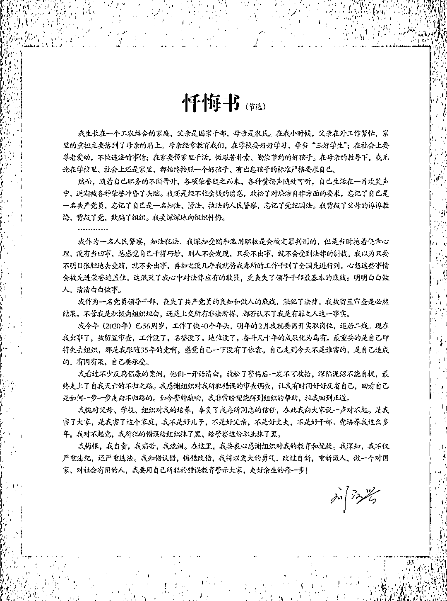

# 原戒毒所所长忏悔录曝光，这也太离谱了……

> 原文：[`mp.weixin.qq.com/s?__biz=MzIyMDYwMTk0Mw==&mid=2247539325&idx=7&sn=4892009910cccd26a8d348949858b365&chksm=97cb9145a0bc1853a588f16ad40aa683298254c68ca9a1f70d392a228ed38eeb9514bd2fbd40&scene=27#wechat_redirect`](http://mp.weixin.qq.com/s?__biz=MzIyMDYwMTk0Mw==&mid=2247539325&idx=7&sn=4892009910cccd26a8d348949858b365&chksm=97cb9145a0bc1853a588f16ad40aa683298254c68ca9a1f70d392a228ed38eeb9514bd2fbd40&scene=27#wechat_redirect)

在失去自由的第一天晚上，刘汉兴整夜没睡。回想 2008 年，他刚赴任陕西省榆林市公安局强制隔离戒毒所所长，有人送来现金 3 万元，希望他能尽快放人……7 月 3 日，陕西省纪委监委官方微信平台发布《戒毒难戒欲，诫人未诫己》一文首次披露，刘汉兴在任榆林市公安局强制隔离戒毒所所长 7 年间，多次以违规批假、伪造诊断评估档案等方式，共为 1099 名强制戒毒人员解除强戒措施。其中，有 15 人提前结束强制戒毒后，又重新犯罪，致使国家和人民利益遭受重大损失，造成了恶劣的社会影响。

刘汉兴人生中最珍贵的时光，是在军营和警营中度过的。

对任何一个人来说，这都是淬炼理想信念、磨炼铮铮铁骨的绝好机会，是无上光荣、值得自豪的人生经历。

遗憾的是，从部队转业进入榆林市公安系统后，特别是在担任榆林市公安局强制隔离戒毒所（后更名为榆林市第一强制隔离戒毒所，以下简称“榆林市第一强戒所”）所长期间，刘汉兴把军人的初心和警察的使命都忘得干干净净。他利用职务上的便利为他人谋取利益，非法收受他人财物，数额巨大；滥用职权，违规提前释放强制隔离戒毒人员，致使国家和人民利益遭受重大损失。

**2020 年 11 月，刘汉兴因涉嫌受贿罪、滥用职权罪，被榆林市人民检察院提起公诉**。有着 16 年军旅生涯、21 年警龄的他以不光彩的形象再度出现在公众视野，令人扼腕叹息。

**主动“自首”**

****向组织提供虚假情况****

**2019 年 2 月，时任榆林市公安局环境与食品药品犯罪侦查支队支队长的刘汉兴在忐忑不安中度过了自己的 55 岁生日。**

**随着扫黑除恶专项斗争在全国范围内深入展开，纪检监察机关持续深入推进“打伞破网”。一次偶然的机会，刘汉兴听说榆林市纪委监委成立了一个专案组，正在对当地某黑社会性质组织的“保护伞”进行调查。**

**刘汉兴对这个涉黑组织并不陌生。早在他担任榆林市第一强戒所所长时，就曾为这个涉黑组织中的一名成员刘某违规办理过请假出所手续，并安排管教民警为刘某伪造了虚假评估出所档案，致使原本应该接受强制隔离戒毒的刘某脱离管教，实施违法犯罪活动。**

**无意中听到的这个消息，让刘汉兴一下子警觉起来。2019 年 6 月 4 日，刘汉兴主动来到榆林市纪委监委“自首”。为此，他还准备了一套避重就轻的说辞，并向组织提供虚假情况，企图蒙混过关。**

**纸包不住火。随着审查调查的深入，**刘汉兴充当黑恶势力“保护伞”、违纪违法和涉嫌犯罪的事实一桩桩、一件件浮出水面**。**

**2008 年，在榆林市公安局经济文化保卫支队工作的刘汉兴被任命为榆林市第一强戒所所长。根据我国法律规定，戒毒人员的强制隔离戒毒期限为两年，执行强制隔离戒毒一年后，对戒毒情况良好的戒毒人员诊断评估后，就可以提前解除强制隔离戒毒，但必须经报备批准。**

**刘汉兴刚到榆林市第一强戒所工作时，一名民警因为家人被强制戒毒，给他送来 3 万元现金，希望能帮帮忙，尽快把人放出来。**

**“刚进来不可能出去。”第一次经历这样的场面，刘汉兴表现得很谨慎。他虽然把钱收了，但仍是在强戒满一年后，才给对方办理了评估出所手续。**

**当真正尝到大权独揽带来的快感后，刘汉兴就再也不愿意放手了。他在忏悔书中直言：“只要人可靠，我就会以各种形式为一些涉毒家庭开绿灯。”他的胆子也越来越大，“开始收 3 万元，后面有 5 万元的，个别甚至高达 10 万元。”**

**2011 年 1 月，神木籍老板刘某的妻哥被送往榆林市第一强戒所戒毒。刘某给刘汉兴送来 5 万元希望获得“关照”。很快，他便拿到了刘汉兴同意解除强制戒毒的批准。**

**2011 年 7 月，佳县籍商人张某的儿子因吸毒被强制隔离戒毒两年。为了让儿子提前解除强戒措施，2011 年 10 月、12 月，张某先后两次送钱给刘汉兴，总计 10 万元，刘汉兴给张某的儿子办理了出所手续。**

**……**

**“总感觉自己干得巧妙，别人不会发现。” 刘汉兴在忏悔书中坦言，有少数吸毒人员不想戒毒，家里人就想办法找人甚至花钱办理出所，“这样找关系的人就多了，有的人还不惜花大价钱。”**

******滥用职权******

********公然藐视法律法规********

******蒙混过关——这不仅可以解释刘汉兴“自首”时的侥幸心理，更可以高度概括刘汉兴从破规逾矩到违纪违法、执法犯法的堕落轨迹。******

******深耕警界多年，刘汉兴很清楚，受贿和滥用职权是犯罪。但在他看来，只要不明目张胆收钱，只要收的是熟人给的钱，就不会出事，就可以瞒天过海，躲过法律制裁。******

******当然，他还有另一重盘算。公开资料显示，刘汉兴出生于 1964 年，榆林佳县人，虽然在农村长大，但父亲是干部，家庭条件并不算差。早年与刘汉兴共事过的一个同事回忆：“他很有胆识，做事果断，执行力很强。”刘汉兴曾将榆林市第一强戒所打造成“全国标兵强制隔离戒毒所”“全国优秀公安基层单位”，他本人也在组织的关怀和呵护下获得不少荣誉，被业界称为“戒毒专家”。******

********刘汉兴觉得，荣誉可以成为他的“护身符”和“挡箭牌”。然而，在纪律和法律面前绝无功过相抵一说，更不会有网开一面与法外开恩**。******

****经查，在担任榆林市第一强戒所所长 7 年时间里，**刘汉兴利用职务便利和职务影响力，收受他人所送钱物合计 53.8 万元。他多次以违规批假、伪造诊断评估档案等方式，共为 1099 名强制戒毒人员解除强戒措施**——他们的戒毒时间全都不满一年，又全都由刘汉兴签字同意出所。****

****更有甚者，这些人中竟有 335 名强制戒毒人员是刘汉兴以“转家戒”方式，提前释放出所的**。“转家戒”是刘汉兴自创的一种模式，言下之意就是通过送钱等不正当手段，以所谓的“家庭戒毒”为由，把强制戒毒人员提前“捞”出来**。这种荒唐之举是典型的滥用职权，不仅严重违反了党的纪律，更是对毒品犯罪的纵容，也是对深化禁毒人民战争的严重亵渎，挑战了法律的严肃性、权威性。****

******这些提前结束强制戒毒、走出戒毒所的戒毒人员，有 15 人又重新沾染上了毒品或者参与到犯罪中**，致使国家和人民利益遭受重大损失，造成了恶劣的社会影响。****

****强制戒毒，是戒毒人员回归社会、走向新生的最后一站，戒毒民警因此被称为戒毒人员的“心灵摆渡人”。显然，刘汉兴担不起这个称谓。也是在榆林市第一强戒所所长任上，刘汉兴通过超标准收取戒毒人员伙食费，向戒毒人员收取保证金、药品费、物品费、日常生活用品折旧费、资料费、自戒费等形式，**违规设立了 1734 万余元（含部分应收但未入单位行政账的费用） 的“小金库”**。****

****这些钱，用于违规发放津补贴、考察学习、购买公车等。其中，在中央八项规定出台后的 2013 年 1 月至 2016 年 7 月间，就违规发放补助 174 万余元。****

****同样是违反廉洁纪律，刘汉兴还以现金入股的方式，在榆林市投资了朋友开设的一家 KTV，违规从事营利活动。****

********执法犯法********

********视公权力为牟利工具********

******毒品的罪恶不仅是摧毁身体、消耗生命，更多的是瓦解良知、泯灭人性。这一点，对于每天和戒毒人员打交道的刘汉兴来说，并不是不清楚。******

******丧失理想信念是刘汉兴堕落的根源。身为党员领导干部的他长期忽视思想政治学习，一边想办法捞钱，一边隐瞒不报个人有关事项，世界观、人生观、价值观发生了扭曲，把“功”看得太重，把“过”看得太轻。当他开始后悔，想要找回初心、回归组织的时候，却为时已晚。******

******对党纪国法毫无敬畏之心是刘汉兴堕落的推手。“要为戒毒学员营造一个重获新生的和谐家园，为保一方平安作出更大贡献。”2010 年 6 月，刘汉兴在接受一家媒体采访时曾高调表态，“不为人情所左右，不为金钱所动心，不得接受戒毒人员亲属的宴请，坚决抵制各种诱惑，做到警钟长鸣、防微杜渐。”那个时候，在媒体镜头前的刘汉兴意气风发。******

******事实上，他执法犯法，将公权力当作谋取私利的工具，从没为自己敲响悬崖勒马的警钟，且在党的十八大后不收敛、不收手。******

********刘汉兴被给予开除党籍、开除公职处分**。在失去自由的第一天晚上，他一整夜没有睡觉，反复琢磨一句话“不是不报，时候未到”。他叹道：“这一天到来了，我醒了，我怕了，我累了。”******

****金钱观严重扭曲是刘汉兴堕落的动因。随着职务的晋升、权力的增长，刘汉兴身边聚拢了越来越多想方设法讨好他的人。共产党员艰苦奋斗的本色被刘汉兴忘得一干二净，特别是在享乐主义和拜金主义等一些不良社会风气的影响侵蚀下，刘汉兴追求金钱和物质的欲望愈发强烈。他把收受的贿赂全都用来买房置业，满足家庭开支。****

****经常会有戒毒人员说，千万不要尝试去吸第一口，因为比毒瘾更难戒的其实是“心瘾”。从某种意义上说，人在许多方面都会经历“第一次”。面对这些关口，正确的选择，可以引导着我们走好有意义的一生；反之，错误的决定，则一定会招致数不清的问题和祸患。****

****“权力是把‘双刃剑’，握不好就会使自己鲜血直流。所有有求于我的人，无非是看中我手中的权力，让我收受贿赂、滥用职权去满足他们的利益。”刘汉兴的忏悔虽姗姗来迟，却为后来者敲响了警钟。（相关素材由榆林市纪委监委提供）****

******刘汉兴忏悔书（节选）******

********

****来源：陕西纪委监委网站，红网，长安剑****

****************

****← 向右滑动与灰产圈互动交流 →****

********