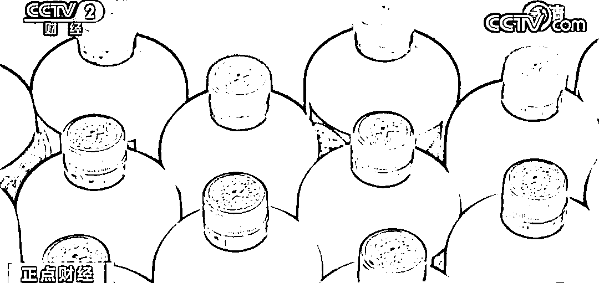

# 一瓶飞天茅台，只卖几百元？！警方出击→

> 原文：[`mp.weixin.qq.com/s?__biz=MzIyMDYwMTk0Mw==&mid=2247539394&idx=6&sn=56ed09cb4ebc33a70aa39783bae05c15&chksm=97cb91faa0bc18ecf4fd74e6479e30c3b8d1ba090d2fcae1149dbcdff85666aea937920e2f31&scene=27#wechat_redirect`](http://mp.weixin.qq.com/s?__biz=MzIyMDYwMTk0Mw==&mid=2247539394&idx=6&sn=56ed09cb4ebc33a70aa39783bae05c15&chksm=97cb91faa0bc18ecf4fd74e6479e30c3b8d1ba090d2fcae1149dbcdff85666aea937920e2f31&scene=27#wechat_redirect)

网络售货中，有一伙人这样推销他们的商品：“几千块钱一瓶的酒，在这里只卖几百块钱；别的地方加价买也买不到，但我这里，想买多少就有多少。”这样的吆喝，获得了不少美酒爱好者的青睐。然而就在前不久，这伙卖酒的人却被重庆警方悉数抓捕归案，为了这次抓捕，警方侦查了很长一段时间。

**名酒售假案曝光 重庆警方解开整个作案流程**

[`mp.weixin.qq.com/mp/readtemplate?t=pages/video_player_tmpl&action=mpvideo&auto=0&vid=wxv_2476208833309474822`](https://mp.weixin.qq.com/mp/readtemplate?t=pages/video_player_tmpl&action=mpvideo&auto=0&vid=wxv_2476208833309474822)

△央视财经《正点财经》栏目视频

“2019 年 53 度飞天茅台今日批发行情价，整箱 2450（元），散瓶 2120（元）。” 

视频中商家声称自己的酒是高端品质，低端的价格，商家的鼓吹不断地刺激着消费者的购买欲望。

商家所售卖的这款酒，在市面上价格不菲，而且一直供不应求，可视频里，酒的售价不仅便宜很多，同时货源充足。如此好事，对于求购者来说自然极具吸引力，可商家所售卖的这款酒到底靠不靠谱呢？这样的问题，也同时出现在重庆市公安局打假总队办案民警的脑海里。

警方发现，除了售卖的视频，商家还发布了多个鉴定真假酒的教学视频。一方面商家说得头头是道，另一方面他们对自己所售卖的酒又信心满满，难道他们卖的酒真的是正品吗？又或许是他们有什么不一样的进货渠道呢？

通过研判，民警看到，这款酒在重庆市黔江区有多次销售记录，为了弄清楚事实的真相，重庆市公安局打假总队将线索推送至了黔江区公安局，黔江警方随即展开调查。

**编造各种卖惨经历 成为销售宣传噱头之一**

[`mp.weixin.qq.com/mp/readtemplate?t=pages/video_player_tmpl&action=mpvideo&auto=0&vid=wxv_2476206310519504898`](https://mp.weixin.qq.com/mp/readtemplate?t=pages/video_player_tmpl&action=mpvideo&auto=0&vid=wxv_2476206310519504898)

△央视财经《正点财经》栏目视频

线索纷纷汇聚到黔江警方这里，民警决定，首先要确定的是，商家的酒到底是如何进行销售的呢？警方在调查中发现这个团伙在销售宣传时，会编造各种卖惨经历。

民警发现，在多个平台上都有他们所发布的视频，视频中成箱的酒堆积如山，数量惊人，而且为了增加可信度，这些主播往往还会编出各种各样的卖惨故事进行宣传。然而，无论是何种说法，他们都宣称：自己的酒是实打实的正品。民警尝试着与卖酒的商家进行了接触，并表达出自己有强烈的购买欲望，直到这时，商家才坦白：酒是高仿的，但是和正品没有任何区别。 

这一过程中，商家会说，自己这边也有真酒，不过暂时没货了，真货太贵不建议购买，反倒是自家的高仿酒可以以假乱真，价格又低出许多。

**重庆市黔江区公安局治安支队二大队教导员 华翊：**正品的飞天茅台酒的价格应该是 2800 元左右，而他们的销售价格在 800 元左右，一件 6 瓶装的，应该是在 4800 元到 5800 元之间，远远低于市场价格。

聊天中，商家还会声称，自己家卖的酒是正品的散装酒，真芯片、过官网、支持验货、不满意可以拒收，无论包装还是酒体都足以媲美真酒。

**销售范围涉及全国多个省市 货源从哪里来**

警方通过调查了解到，这款酒的销售范围涉及全国多个省市，初步估算就有数万瓶之多，可如此庞大的数额，货源从哪里来，制酒团伙和销售团伙又存在着怎样的联系呢？

原来，这是一个涉及加工制造、生产包装、宣传推广、网络销售等多环节的犯罪团伙。通过进一步研判，民警得知：这款酒的基酒原材料是在贵州仁怀采购的，而销售地却位于湖北恩施。

不同于以往的制售假酒案件，所有步骤都在一个地方完成，这伙人从采购原材料到最后销售，几乎每个步骤都有单独的窝点。

在前往贵州仁怀进行实地侦查后，警方发现，这里实际上只是这个团伙的一个白酒采购窝点，至于后续的其他流程，实际上却另有别处。在此期间，民警注意到，这个团伙用酒桶装好收购来的散装白酒，然后用小货车运输到恩施，再进行包装造假。

因此，怎样不打草惊蛇，同时精准地找出这个团伙各个窝点的具体位置，成为警方的工作重点。此时，一辆多次往返于渝、鄂、贵三地的湖北牌照小轿车引起了民警的注意，车辆的所有人是一个名叫魏某的男子，在对魏某进行调查后，民警发现，魏某的银行卡流水数目巨大，而且几乎每一次款项进入后，都会立刻被提现。

**捣毁产储销窝点 4 处 查获制假设备 14 台**

随后，警方又通过魏某关联出向某、黎某等人，至此，这个集产、推、供、销于一体的制售假酒团伙彻底浮出了水面。经过历时 3 个多月的调查，警方将这一团伙的组织架构，以及生产、灌装白酒、贴标等地逐一掌握清楚。2021 年 12 月 29 日，重庆警方出动 100 余名警力，多警种联合行动，全面展开收网。

经过连续 2 天的集中抓捕、清查，警方成功摧毁了这个以魏某为首的制售假酒犯罪团伙，共抓获犯罪嫌疑人 24 名，捣毁产、储、销“黑窝点”4 处，现场查获假冒品牌酒成品 800 多瓶、待灌装基酒 3000 多斤、制假设备 14 台。

**重庆市黔江区公安局治安管理支队副支队长 葛状：**在现场查获了已经生产好的假茅台是 800 多瓶，总的这个案子涉案价值应该上亿了。

**产销分布多地 以假乱真动足歪脑筋**

[`mp.weixin.qq.com/mp/readtemplate?t=pages/video_player_tmpl&action=mpvideo&auto=0&vid=wxv_2476207459171598340`](https://mp.weixin.qq.com/mp/readtemplate?t=pages/video_player_tmpl&action=mpvideo&auto=0&vid=wxv_2476207459171598340)

△央视财经《正点财经》栏目视频

此前，警方也曾破获过多起制售假酒案件，可不同于以往那些案件，这起案件不仅产销分布多地，而且为了让假酒尽可能以假乱真，犯罪嫌疑人魏某等人可谓是动了一番歪脑筋。

为了尽可能地还原真酒的口感，魏某等人精挑细选，最终选择了贵州一家酒厂所生产出来的酱香型白酒作为基酒，再以此为基础进行勾兑。

在制酒过程当中，所有流程都由不同的专人分别负责，他们分工明确，相互配合。

民警介绍，购买假酒的群体主要有酒类经销商、企业、建筑商和普通群众，而假酒的制售极大地扰乱了市场秩序。目前，犯罪嫌疑人魏某等人已被重庆市黔江区公安局以生产、销售假冒注册商标罪立案审查，案件还在进一步侦办中。警方提示，对于消费者而言，切勿贪图便宜，购买来路不明的酒。‍

来源：央视财经（ID：cctvyscj）、央视新闻客户端

← 向右滑动与灰产圈互动交流 →

