# 继“飞盘媛”后，“山媛”又火了？

> 原文：[`mp.weixin.qq.com/s?__biz=MzIyMDYwMTk0Mw==&mid=2247539514&idx=2&sn=20164e56cae15269a9e8348639f8fa18&chksm=97cb9002a0bc19148307a65e83016f6834021ef9d8e6a8c7f0ef2c8f2005cdfb097d91298718&scene=27#wechat_redirect`](http://mp.weixin.qq.com/s?__biz=MzIyMDYwMTk0Mw==&mid=2247539514&idx=2&sn=20164e56cae15269a9e8348639f8fa18&chksm=97cb9002a0bc19148307a65e83016f6834021ef9d8e6a8c7f0ef2c8f2005cdfb097d91298718&scene=27#wechat_redirect)

自从“上海名媛、佛媛”引起网友的关注后，“媛”字似乎就被划分到了贬义区！

随之出现 了一系列的病媛、幼儿媛、核酸媛、超市媛、飞盘媛...

女性的一言一行，甚至穿搭，瞬间被推上风口浪尖！

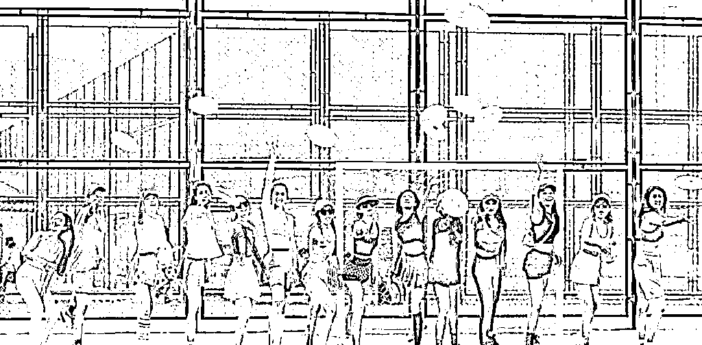

近日上网时发现，居然还有“山媛”的存在！？

打开某红薯，原本是三位小姐姐高高兴兴的去爬山，

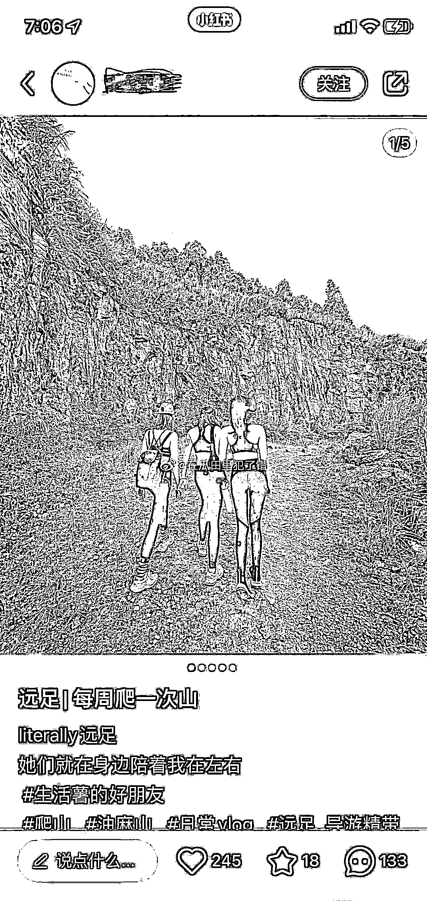

然而却遭到网友的嘲讽：“山媛吗”、“穿瑜伽裤爬山？”

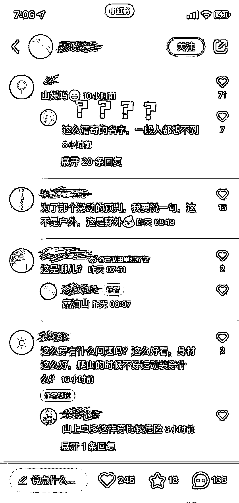

妙啊，瑜伽裤外穿=丢人？！

如果你留意各大城市的街头，不难发现：瑜伽裤早已成为一道街头风景线~

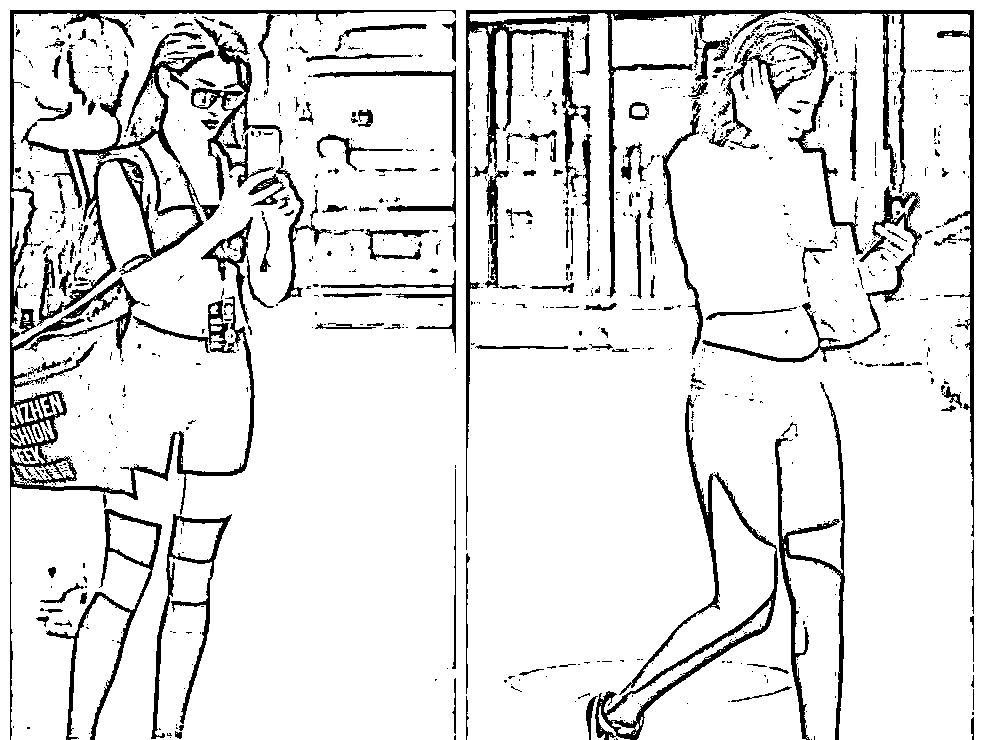

瑜伽裤的流行背后，离不开舒适、自由、健康，

且正在逐渐成为女性心目中穿衣风潮的关键词！

毕竟来势汹汹的 YQ 让更多人意识到，健康的身体永远位是第一位。

运动不仅成为当下流行的生活方式，更成为日常生活中不可或缺的一部分。

以身边朋友的穿搭感受为例，只要是穿过瑜伽裤的女生，都会有种“穿上就爱上”的感觉。

从材质来看，它具有贴身透气、轻薄吸汗等等特点，

其次，自身的一片式穿着设计（没有裤缝），能明显突出臀部和腰部的曲线。

不同于传统观念里的秋裤、打底裤，它的起初设计灵感来源于舞蹈演员，

后来由于瑜伽等运动的兴起，逐渐被广泛关注，在拒绝“body shame”思潮的影响下，

即便不具备凹凸有致的身材，也不影响女性把瑜伽裤穿出街。

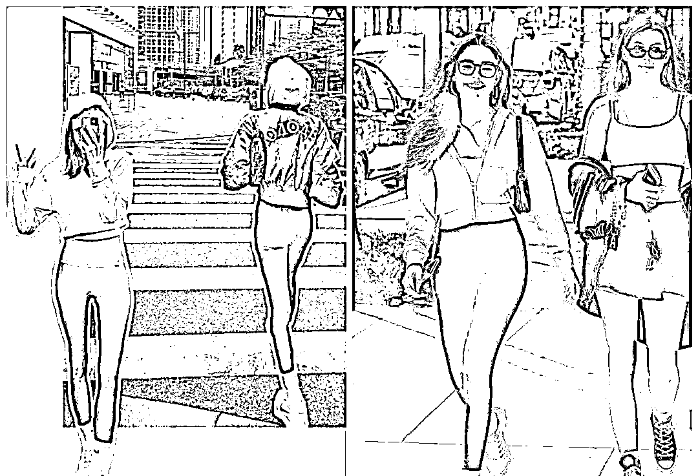

在某红薯上搜索“瑜伽裤”能够发现，有 5 万+篇笔记推荐；

某音上带有“瑜伽裤”话题的视频，播放更是高达 17.3 亿次...

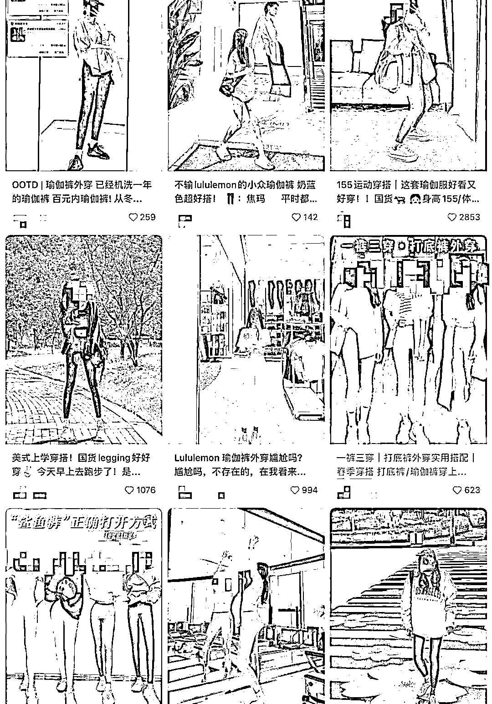

But！瑜伽裤有多火，争议就有多大。

很多运动博主就曾吐露自己因为瑜伽裤外穿遭歧视的经历，类似的事情并非罕见，

总有网友冒出“穿成这样就敢出门？”、“真当自己超模身材了？”

等等对瑜伽裤外穿的嘲讽...

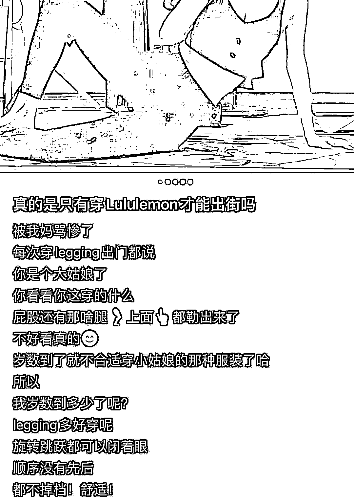

甚至还遭到道德层面尖锐的谴责：

一些人认为瑜伽裤的轮廓过于贴合身体，以至于走在街上难免会有男性想入非非。

早前，知乎上的一个提问：健身穿 Legging 里面要不要穿内裤？

原本女生间细致全面的经验分享，却引发了部分男士的冷嘲热讽。

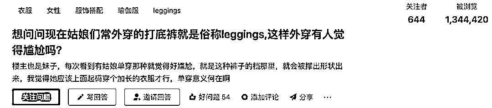

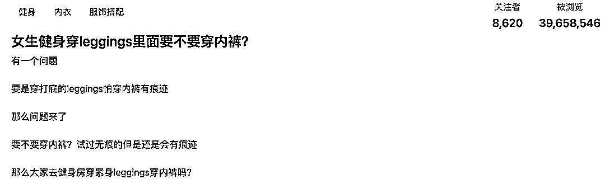

随着讨论的激烈，话题逐渐升温，创造了近四千万浏览量。

翻看这些热度极高的留言可以发现，当女性们给出建议穿着浅色或同色内裤，不要穿着普通或有花边内裤的同。

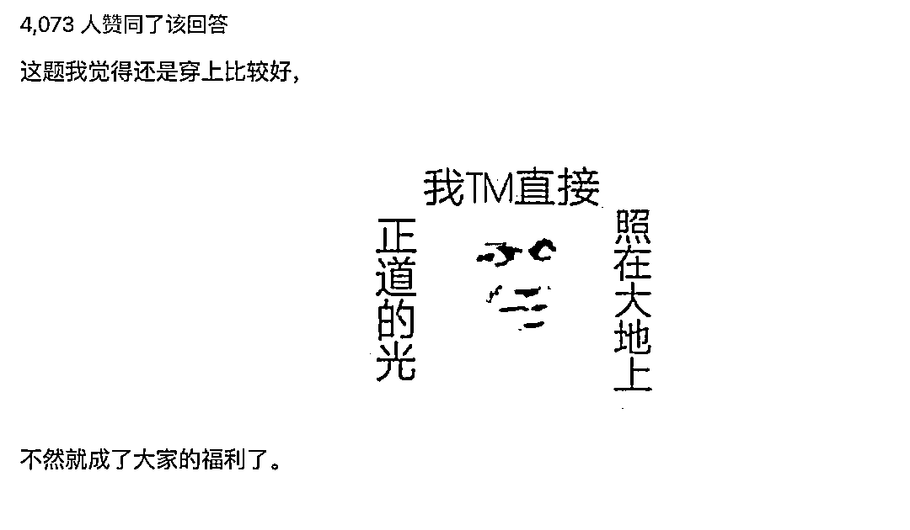

讲真，类似的争议并不是第一次发生~

在前几年关于“穿吊带逛街为什么总被盯着看？”、“为什么说穿黑丝的女生就是经验丰富？”的评论区，和这次几乎没有太大差异。

比基尼、吊带衫、一字肩上衣…女孩子们一次又一次因为自己的穿着喜好，

遭受着从穿衣风格上升到精神人格的侮辱... 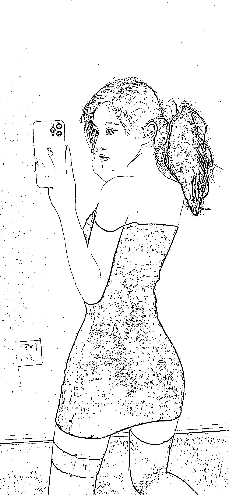

但凡可以凸显出女性身材曲线的服饰，总会被标上“品行不端”的指摘~

这不禁让人反思：为什么衣服款式和布料的多少，会成为社会的热议话题？

女性选择性感的衣着，并不代表她需要承受被骚扰或侵犯的后果，

穿得少=骚？，穿得多=安全？

身材不好，被骂！身材好，实现穿衣自由，也被骂？

显然，问题的关键不在于服装本身，而在于落后思想凝视下的刻板印象。

不过值得庆幸的是，现如今很多女孩都越来越自信、独立、强大~

还有越来越多的国产运动品牌，开始关注到中国女性户外着装的需求，并侧重于高品质运动服的打造...

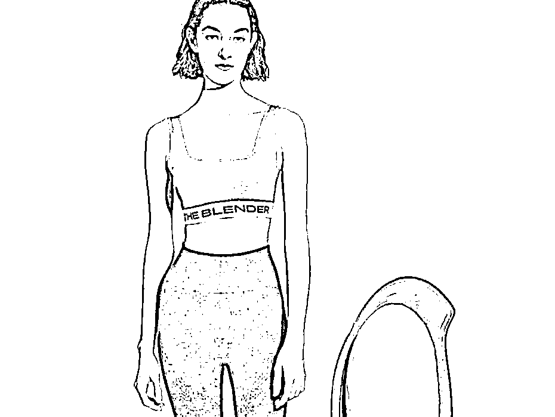

希望大家嘴下留情，努力改变对女性的刻板印象~

与其花时间研究别人，不如花点精力好好提升自己！

来源：跑步殿堂，大 R 说安全

← 向右滑动与灰产圈互动交流 →

