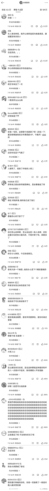
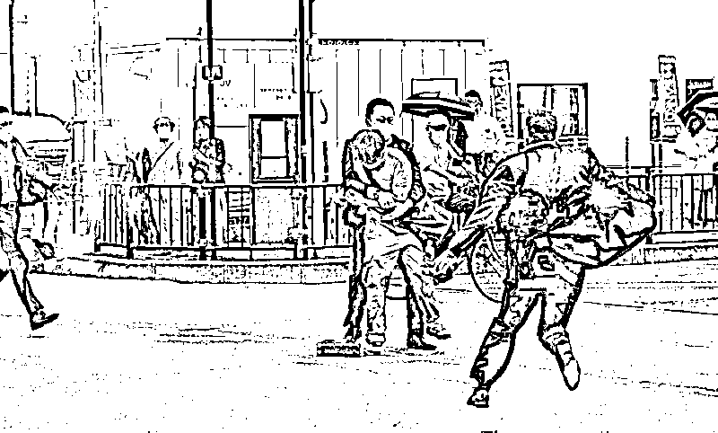
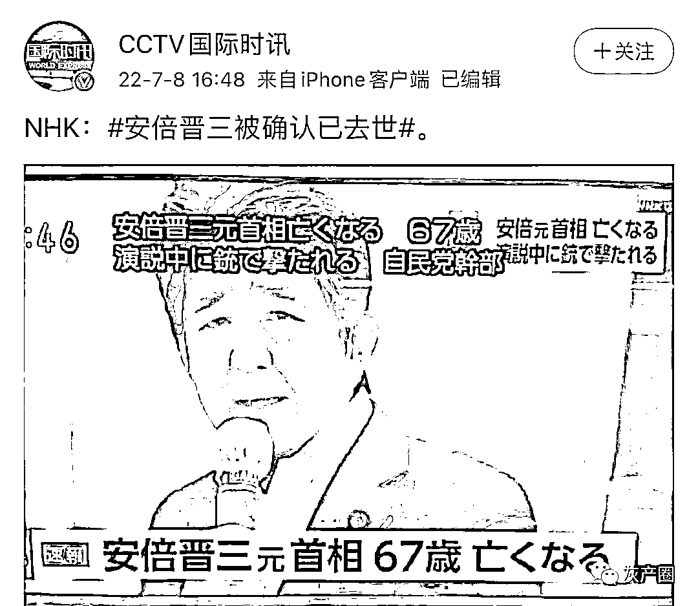

# 安倍晋三伤势过重，不治身亡！中国网友的第一反应！

> 原文：[`mp.weixin.qq.com/s?__biz=MzIyMDYwMTk0Mw==&mid=2247539514&idx=3&sn=6380e4273dc96535ccbe751a9ab494d3&chksm=97cb9002a0bc1914e6afd0e87ebe6cf5475998dafeacd997dd2a5d5fada1188aa9529cef2f15&scene=27#wechat_redirect`](http://mp.weixin.qq.com/s?__biz=MzIyMDYwMTk0Mw==&mid=2247539514&idx=3&sn=6380e4273dc96535ccbe751a9ab494d3&chksm=97cb9002a0bc1914e6afd0e87ebe6cf5475998dafeacd997dd2a5d5fada1188aa9529cef2f15&scene=27#wechat_redirect)

今天，简体中文网络掀起一片欢呼声，原因是日本前首相、现国会议员安倍晋三遭枪击。 

**最新消息，据央视新闻，7 月 8 日，日本前首相安倍晋三在遭到枪击后，因伤势过重不治身亡。**

随便去媒体后面看评论，就知道人们有多高兴。

这是刚刚央视新闻后面的：

这是这前环球网下面的： 

这是百度的：

说说你的看法？不，我没有看法。但我想说，这些网友的看法，代表不了我的看法。可能这就是我的看法吧。

日本前首相安倍晋三在当地时间 7 月 8 日上午 11 时 30 分左右，位于奈良县的近铁“大和西大寺站”发表演讲时，刚刚开始演讲不到 2 分钟，一名中年男子从背后三米处向他连开两枪。安倍当即倒地，几乎立即失去知觉。

据目击者称，一枪击中安倍左胸部位，另一枪击中脖子，打出了一个大洞。安倍晋三被救护车送走时处于昏迷状态。

北京时间下午 2 点半左右，日本总务省消防厅发布消息称，前首相安倍晋三的右颈部因枪击受伤出血，还发现左胸皮下出血，正在重症救护室抢救。

日本京都府立医科大学教授太田凡称，院方在考虑安装人工心肺装置等治疗方案。因安倍心脏周围有血块，院方或考虑去除血块后进行心脏按摩术，使其心脏重新跳动。

太田凡表示，一旦心肺功能停止，血液就不会回流到脑中，如果长时间这样会损伤大脑，安倍就很难恢复意识。日本医科大学急救中心主任则表示:“如果心脏或大动脉受到损伤，就要通过开胸手术进行止血。

但最终，安倍还是身亡。

（安倍演讲中被人枪击） 

*枪击事件发生时，安倍在地铁站外一个非常简陋的露天场所演讲，听众并不是很多，现场大约有 30 多人。*

***（警方当场抓捕到凶犯）*

*凶犯被警方人员当场控制。据奈良市警视厅通报，查明枪击嫌疑人系原日本自卫队低级军官，名叫山上徹也；使用的是一把信号枪改装的自制手枪。*

**

*（警方当场抓捕到凶犯）*

*日本以社会治安良好、枪械管控严格著称。即使安倍在任时，也经常跟夫人一起外出骑车、购物，通常只有 1-2 名便衣警卫较远距离跟随。辞去首相职务后，虽然仍有议员身份，但安保措施跟平民无异。正因为没有保护措施，导致嫌犯可以近距离连开两枪，击中安倍晋三身体要害。****（警方当场抓捕到凶犯）*

*虽然警方尚未公布嫌犯作案动机，但合理猜测是日本极左政治人士所为。激进极左人士只占日本国民极少的比例，但具有较强的暴力攻击性，往往以极端手段来表达自己的政治主张。当然也不排除凶犯有精神疾病。*

***（警方当场抓捕到凶犯）*

*综合日本共同社等多家媒体早些时候报道，奈良县警方透露，枪击安倍的嫌犯山上彻也在供述中称，他的作案动机“不是出于对安倍政治思想的怨恨。”山上还在供述中说，枪击安倍的动机是“对他不满，就是为了想杀他” 。*

**

*（安倍被击中倒地）*

*安倍应该是为当地选举人士进行拉票活动。7 月 10 日，日本参议院将进行改选。根据日本共同社 7 月 6 日发布的民意调查结果显示，自由民主党、公明党以及日本维新会等朝野修宪势力将可能在 10 日参议院选举后继续控制三分之二以上议席，再次越过启动修宪进程的“门槛”。安倍遇袭，只会激起民众的同情，打击极左政党的选情，扩大日本右翼政党的优势。*

*日本政府 8 日收到前首相安倍晋三被枪击受伤的消息，在首相官邸危机管理中心设置了官邸对策室。日本内阁官房长官松野博一回应称：“绝对不能允许这种野蛮行为，对此表示强烈谴责。”*

*日本首相岸田文雄闻讯后，立即停止了正在山形县进行的参议院选举有关活动，返回东京首相官邸应对。日本首相岸田文雄于北京时间 13:30 左右发表讲话，谴责这起凶残的暴力事件，安慰日本民众情绪。*

**

*截至本文发稿时，西方多个国家政要发表讲话和社交媒体发文，对安倍被枪击事件表示震惊与悲痛，严厉谴责此类暴力犯罪。*

**

*（警方当场抓捕到凶犯）*

*日本舆论普遍认为，安倍晋三平易近人，清廉自律，目光远大，执行力强；在安倍担任日本首相期间，实施“安倍经济学”恢复了日本经济增长，并成功推动了日本以“成为一个正常化国家”为核心的对外政策转型。因政绩卓越，安倍一直深受日本绝大多数民众敬重，是日本历史上在位时间最长的首相，也被认为是日本历史上最伟大的首相。*

*鉴于安倍晋三在日本政坛和主流民意中的巨大影响力，这起事件可能激发日本“修宪”的冒险，但短时间内不会改变日本内政外交政策。*

*虽然由于众所周知的原因，绝大多数国人对安倍恨之入骨，可以看到简体中文网络上铺天盖地的欢呼声。对这个不幸事件，我仅代表个人谴责这种残忍的犯罪行为。我注意到官方和著名左派媒体人胡锡进先生也表达了跟我类似的立场。*

**

*当然康复的祝福已经没有用了，官方会有新的表态。* 

*最后想说几句，网上有人对安倍遇刺喜大普奔，大声叫好——*

**

*安倍其实代表的是日本国内“维持现状、伺机而为”的保守主义力量，当然这个“保守主义”是相对于当前的“激进主义”而言的，而不是传统说的极右势力。

中美两国争斗日趋激烈，日本的日子也越来越不好过，家电、电子行业早就日薄西山，现在汽车产业也即将迎来大洗牌，电动车崛起必然会导致世界汽车产业链大调整，日本还能分到多少份额，不看好。

日本这个国家，其实已经从冷战期间的“准棋手”，逐渐沦为彻底的“棋子”，现在安倍挨了一枪，将会沦为最为悲惨的“棋盘”。*

*安倍遇刺身亡，对于中国是个突发的极大的不确定事件。*

*很快我们会看到东海舰队、航母战斗群还有轰炸机忙起来的。*

*现在的情况是，东欧打仗，西欧政治巨变；美国保守派正在全面上台，亚洲有人搞暗杀。*

*整个世界经济形势萎靡、各国通胀高居不下、疫情仍然蔓延、各国民族主义蔓延和抬头、恐怖主义滋生不断。*

*距离上次世界大战已经过去 77 年了，但是过去的 77 年里，这个世界从来没有和平过。中东和非洲过去几十年一直生活在战争、瘟疫、饥荒的阴影之下，而恐怖主义滋生不断。*

*世界的大洗牌终于要来了吗？*

**

*7 月 8 日，日本前首相安倍晋三在遭到枪击后，因伤势过重不治身亡，终年 67 岁。*

*来源：大 R 说安全*

****

*← 向右滑动与灰产圈互动交流 →*

**