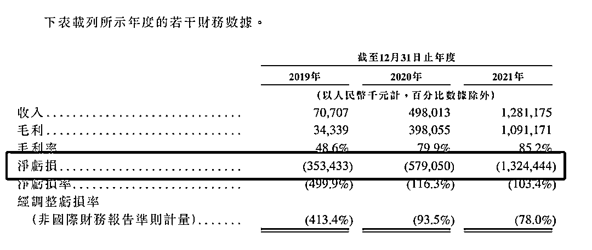
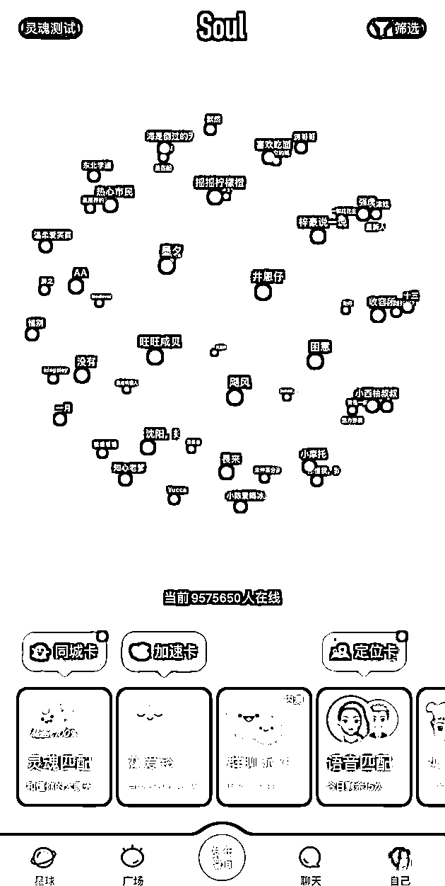
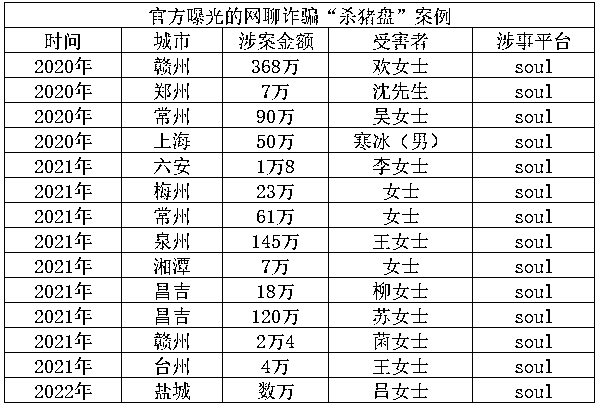
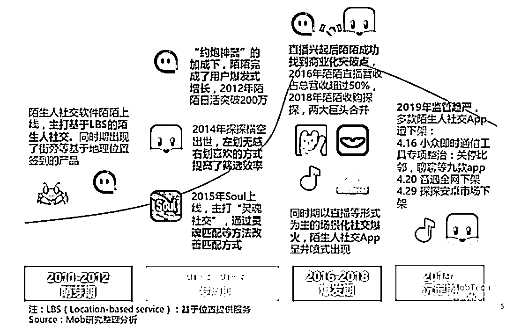

# Soul：灵魂社交，还是色情温床？

> 原文：[`mp.weixin.qq.com/s?__biz=MzIyMDYwMTk0Mw==&mid=2247539514&idx=4&sn=94b5116f54edc8c9293809309daa3d1e&chksm=97cb9002a0bc1914bd09ca0d2a1966578d5bf3249721dd9499f3f3e216cb307bc54b199ae6fb&scene=27#wechat_redirect`](http://mp.weixin.qq.com/s?__biz=MzIyMDYwMTk0Mw==&mid=2247539514&idx=4&sn=94b5116f54edc8c9293809309daa3d1e&chksm=97cb9002a0bc1914bd09ca0d2a1966578d5bf3249721dd9499f3f3e216cb307bc54b199ae6fb&scene=27#wechat_redirect)

Soul，何时才能真的有 Soul？

1****3 年亏了 22 亿****就差临门一脚——这是一年前，匿名社交软件 Soul 的遗憾。那时候，Soul 在上市前夜，突然发出了暂停上市的声明。****惜败一步之遥，********终止美股上市一年后，****Soul********把目光投向了港交所。****就在 6 月 30 日晚上，Soul 的运营主体 Soulgate 递交了港股上市申请书。Soul 的母公司上海任意门科技有限公司成立于 2015 年，在 2016 年推出 Soul，这款社交软件 2018 年日活用户数超过 100 万人，2021 年日活用户峰值破 1000 万人。从实际数据来看，Soul 在 2021 年月活达到了 3160 万，日均用户时长达 45.3 分钟，在非视频领域，已然是国内互联网市场不可忽视的新秀。****翻开招股书，一个更加立体的********Soul********映入大众眼帘。********先看营收。****招股书显示，2019 年至 2021 年，Soul 的收入分别是 7070.7 万元、4.98 亿元和 12.81 亿元。这个挺猛的，2020 年的收入在 2019 年的基础上增加了 6 倍，2021 年收入同比增长 157.3%。Soul 的毛利率也还可以，从 2019 年的 48.6%提升到 2021 年的 85.2%。****那么，********Soul********靠什么赚钱？****根据招股书，Soul 的收入主要来源于增值服务、广告服务和其他三部分组成。在这其中，最大头的又数增值服务，2019 年~2021 年的营收占比分别是——*100%、97.4%及 93.9%**。*啥叫增值服务？其实就是卖虚拟形象、虚拟礼物和会员等业务，在 Soul 内买这些东西，要先充值“Soul 币”。****再看用户。****社交生意，用户是一切的基础。Soul 在 2019 年~2021 年月活分别为 1150 万、2028 万和 3160 万，2020 年、2021 年增长率分别为 80.7%及 51.6%。与此同时，平台的“氪金玩家”——月付费用户也在快速上涨。2019 年~2021 年，Soul 的月均付费用户数目分别为 26.89 万名、92.93 万名及 170 万名，而来自每名付费用户的月均收入分别为 21.9 元、43.5 元及 60.5 元。2021 年 Soul 付费率为 5.2%。相比于同行，依然存在差距。陌陌和探探的母公司挚文集团，2022 年第一季度，直播服务与增值服务付费用户去重后总数已经达到 1110 万。值得一提的是，2021 年，Soul 的月活跃用户中有 74.9%为 Z 世代（1995 年后出生的群体），不愧是“年轻人的社交元宇宙”。****再看利润。****这点不太理想。根据招股书披露的数据，2019 年-2021 年三年时间，公司的净亏损已经高达 22.56 亿元，一年比一年亏得多。钱都花哪去了？主要是营销太烧钱。2021 年 Soul 的销售及营销开支达 15.13 亿元——****是总收入的****1.18 倍********。****这也难怪，这两年 Soul 的广告几乎无处不在，不管微博、抖音还是知乎，似乎都能看到它的广告。****钱还没赚多少，花钱倒是挺猛。****2****“灵魂社交”背后的********杀猪盘与软色情*****还孤单一个人吗，快来 Soul 银河寻找那个 TA。*这曾是 Soul 对外打出的广告语。Soul 是灵魂的意思，借着铺天盖地的广告，Soul 想传递给大家的意思很明显——*Soul 是一个主打“灵魂社交”的 APP，在这里，“用户可以无顾虑地表达自己，认知他人，探索世界，交流兴趣和观点，获得精神共鸣和认同感”。*每个注册 Soul 的新用户都需要进行灵魂测试，确定自己的类型，并入驻某个星球。用户可以通过“灵魂匹配”的方式，寻找合适的聊天对象。现代社会的钢铁丛林里，大家孤独敏感又渴望被理解，能找到一个灵魂共鸣的人，的确令人心动。但实际上，根据锌财经的采访，Soul 的这种匹配方式非常浮于表面，仅仅是用户给自己设定一些标签，系统再把相似标签的人匹配到一起——****很多人聊不过三句就聊****“死”了。****能不能找到真正的“灵魂伴侣”且放一边，更重要的是，****作为一款陌生人社交软件，有些问题，****Soul 注定无法回避。****首先是色情信息。未来网曾报道过，Soul 内一个名为“硕博高质量相亲”的派对聊天室中，娇喘声频频传来，露骨的对话不断爆出——*“弟弟你好奶哦～”“你声音太软了，听的我都酥了，哎呀不能说这些太色情了。”“我们私聊吧，你跟他走还是跟我？”……*不知从何时起，灵魂交流少了，软色情多了。Soul 上还曾有用户发“想养个萝莉，一个月愿意给一万生活费”，评论区有多名用户回复。来自树洞的语音，也有很多是淫秽信息。2019 年 6 月，国家网信办发布《国家网信办集中开展网络音频专项整治》通知，要求对包括 Soul 在内的多款 APP 进行集中整治，Soul 因色情内容被迫下架两个月。比软色情更可怕的是“杀猪盘”——*通过恋爱交友软件结识，诈骗人与受害者逐渐“培养感情”，在频繁持续的聊天中，发展成为恋爱关系，这个“培养感情”的过程被称为“养猪”，等到时机成熟了，就开始实施诈骗行为，以各种理由骗取钱财。*据不完全统计，目前与 Soul 有关的杀猪盘骗局已被曝光多达几十起，诈骗金额从几万元到几百万元不等，而这还仅仅是公安部门公布在网上的典型杀猪盘案例。▲图源网络你以为找到了“灵魂伴侣”，结果却是人财两空。****灵魂社交，怎么到头来变成了****“灵魂杀猪”？****这些诈骗犯，有的被绳之以法，有的却依然逍遥法外。真正欲哭无泪的，只有那些受害者。有的受害者在得知被骗后无力工作，严重失眠，最终被诊断为重度抑郁。****更多的悲伤，还在我们看不见的角落。****3****悬在********Soul 头上的利剑****面对汹涌的舆论，Soul 给出过回应，“加强管理”和“深表同情”似乎成了两张挡箭牌。但有媒体采访过北京云嘉律师事务所律师、中国政法大学知识产权研究中心特约研究员赵占领，赵律师给出的解释是——*Soul 与普通的社交平台不同，如果根据 Soul 的“灵魂匹配”功能，经过数据算法推荐，给用户匹配的是骗子等犯罪分子，那么 Soul 平台可能要承担社会责任。*是什么让 Soul 沦为软色情和“杀猪盘”聚集的地方？****这个问题的答案，得从陌生人社交中寻找。****从最早的“漂流瓶”到陌陌、探探，再到如今的 Soul，陌生人社交在中国已经走过了十几年的历程。资料显示，仅 2008 年至 2015 年，8 年间社交类 APP 产品共上线 153 款，平均每年上线 19 款；2018 年，共诞生 159 款社交类 APP 产品。****2018 年，国内陌生人社交用户规模就已经达到 5.92 亿人。****日渐庞大的市场引来了热钱的注入，据 2021 年企查查数据研究院发布《近十年陌生人社交投融资数据报告》显示，2011 年以来的十年，以“陌陌”“探探”“Soul”等为主的陌生人社交赛道共计发生融资 474 起，披露总金额达 292.99 亿元，阿里、腾讯等大厂也纷纷入局。在这片社交战场上，2011 年上线的陌陌，2014 年上线的探探和 2016 年上线的 Soul，可以看做是三个里程碑。****庞大的市场不仅吸引资本，也引来了乱象。****陌生人社交平台一度成为微商、酒托、色情交易等产业链寄生所之一，一家卖化妆品的小公司，每套产品销售单价上万元，年流水可以达到数百万。陌生人社交中的匿名和神秘，注定让平台面临着巨大的监管压力，软色情、杀猪盘还只是冰山一角。对 Soul 们来说，合规化依然是一把高悬头顶的利剑。毕竟，在重大原则问题上，有一句话已经被反复验证——****我消灭你，与你无关********。****

← 向右滑动与灰产圈互动交流 →

