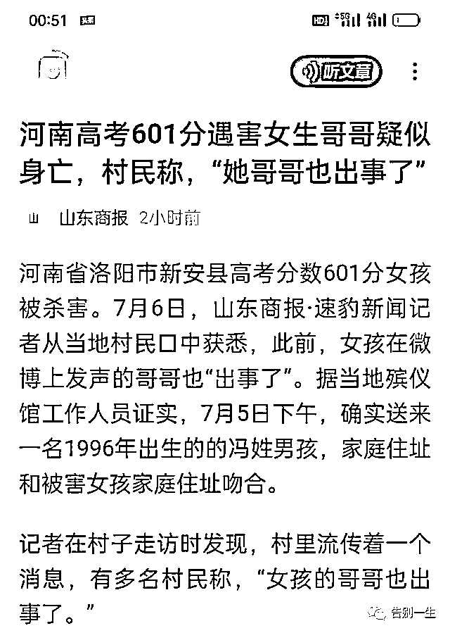
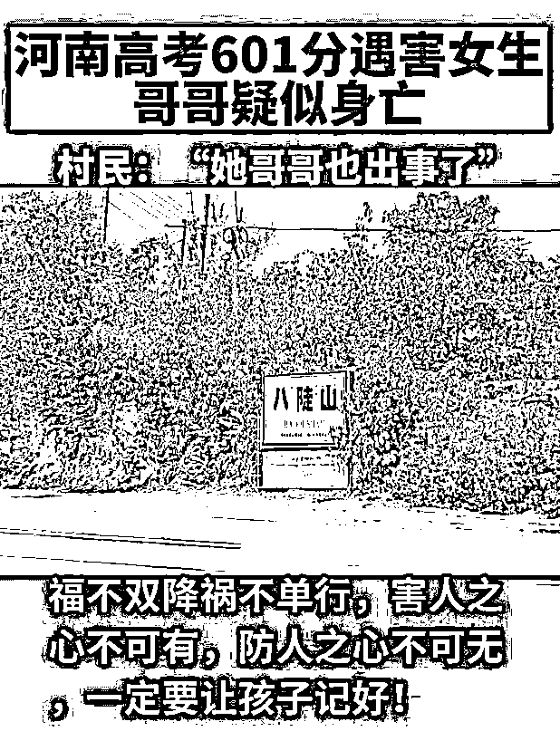
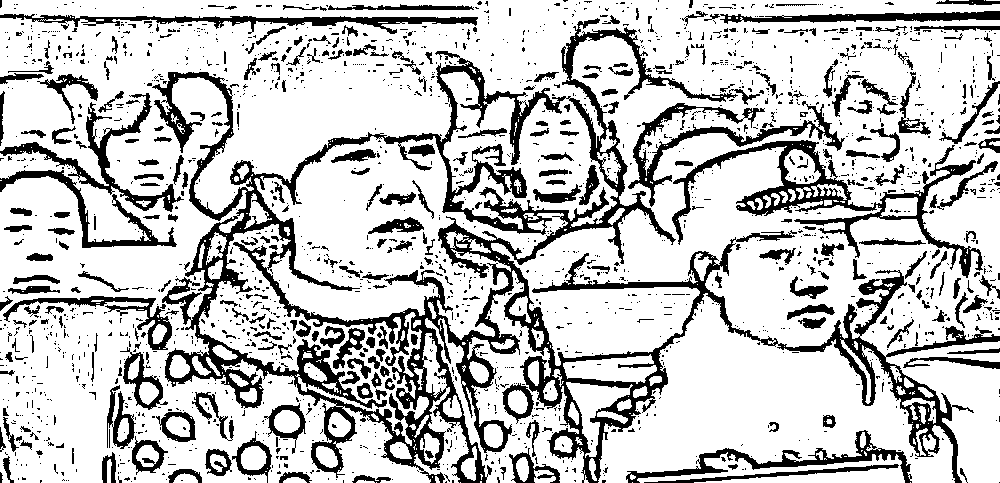

# 悲！河南高考 601 分遇害女生哥哥也疑似身亡

> 原文：[`mp.weixin.qq.com/s?__biz=MzIyMDYwMTk0Mw==&mid=2247539514&idx=5&sn=690ce8c768e5edc19dd503427da1ad5a&chksm=97cb9002a0bc191473fcd4a7539ca84d6a9d421dce45ac9e1b1547c855f9d3d9488cab8bb8aa&scene=27#wechat_redirect`](http://mp.weixin.qq.com/s?__biz=MzIyMDYwMTk0Mw==&mid=2247539514&idx=5&sn=690ce8c768e5edc19dd503427da1ad5a&chksm=97cb9002a0bc191473fcd4a7539ca84d6a9d421dce45ac9e1b1547c855f9d3d9488cab8bb8aa&scene=27#wechat_redirect)

**一**

这是一个无比悲惨、无比惊悚并且疑云重重的故事。

7 月 1 日，河南省洛阳市新安县八陡山村的一名高中毕业女孩被人杀害。

综合媒体报道，该女生高考考出了 601 分的好成绩，遇害前已填报好志愿，第一志愿是郑州大学。

但谁也没有想到，她的人生就此戛然而止——据其亲属讲述，同村一个 50 岁的光棍汉见女生考出了好成绩，便对她及其家庭产生嫉妒心理，于是痛下杀手（此前报道）。

更令人想不到的是，此前在网上替妹妹发声的女孩哥哥也“出事了”！

《山东商报》报道，据当地殡仪馆工作人员证实，7 月 5 日下午，确实送来一名 1996 年出生的的冯姓男孩，家庭住址和被害女孩家庭住址吻合。“是派出所送过来，家属还没有过来。”

从中可以看出，所谓“出事”，其实就是死亡。

按村里人的说法，是跳楼所致。

那么，男孩为什么要跳楼？是谁给了他纵身一跃的压力？

**二**

我们先来说一下男孩妹妹、刚刚填报高考志愿的女孩之死。

有人觉得老光棍嫉妒杀人不可信，毕竟，老光棍又没有和女孩同时参加高考。

我认为持此论者未免低估人性的幽暗了。人家一家人和和美美、儿女双全，女孩又有出息，考上了不错的大学，而自己孤零零一个，相比之下天差地别，嫉妒如火，会迅速将某些人正常的人性给吞噬。

要知道，在这个热衷于攀比的国度，很多人的幸福来源于别人——主要指身边的熟人——过得不如自己。否则，扭曲的心理便会失衡。

2015 年，同样是河南，一五旬村妇因嫉妒杀害了邻居 4 岁男孩。

当时的报道中有这样的对话：

“你为什么要杀害王明涵？他只是一个 4 岁的娃娃。”民警语气沉重地问。

“因为我觉得这小孩很聪明，我不能让他超过我孙子，我就是嫉妒。”李秀玲咬牙切齿地回答。

刚落网时，李秀玲丝毫没有为自己犯下的罪行感到后悔且愧疚，反而庆幸自己除去了心腹大患，为孙子扫清了前进的障碍。

在庭审现场，李秀玲越讲越激动——

“但是，我恨啊，我嫉妒啊，他凭什么比我孙子聪明！他生得漂亮，天真又可爱，机灵又会说话，谁都喜欢他，就连我自己都忍不住喜欢他，那谁来疼我可怜的孙子！”

看看吧，好比人家有一只精美瓷器，而自己没有，一定要将人家的也打烂了才舒坦。

所以，光棍汉因嫉妒而杀害同村高考女孩，我并不觉得奇怪。

但是，在目前有限的信息下，我很难理解：女孩哥哥为什么要自杀？

**三**

当然，此前已有蛛丝马迹。

几天前，他发布视频称，“妹妹冯梦月于 7 月 1 日下午在家中遇害，父母已伤心欲绝……希望有关部门能够予以关注，希望恶霸得到应有惩罚，给妹妹一个公道。”

但随后他竟然突然删除相关视频，而且还发布道歉视频：“视频是我发的，对社会和政府造成影响，深感歉意，愿意承担后果，请勿殃及家人朋友，谢谢。”

为什么会这样？

自己的妹妹死了，在网上给妹妹讨个公道，这是再正常不过的举动啊，为何还要道歉？

这一声道歉何其沉重，不是一个正常社会所能承受。

更匪夷所思的是，究竟发生了什么，让他觉得自己的发声可能“殃及家人朋友”？

他有任何出格的言论吗？

“对社会和政府造成影响“，谁认定的？

这一对可怜的兄妹，无疑都是死于他杀——女孩死于人性扭曲的嫉妒，男孩死于某种恐吓、某种让他无法面对的压力。

对方只是一个身体残疾的老光棍，背后不可能有令男孩屈服的强大力量。

这样一件不具备争议空间的事情，他也不至于因此而遭遇网暴。

那么，这股压力究竟来自何方，其实也就不言而喻了。

尽管我没有将那个字眼写出来。

我现在关心的是，这一对兄妹的父母，如何面对这样的飞来横祸。短短几天内，儿女相继离去，这是怎样的非人间。这样的至痛，非言词可形容。

他们遭遇的，是愚昧的人性与蛮横的权力的合力绞杀。

这样一张纵横交错的合力之网，我们谁也不能保证自己离它很远。

来源：常识流通处  作者：里约热泪奴

← 向右滑动与灰产圈互动交流 →

