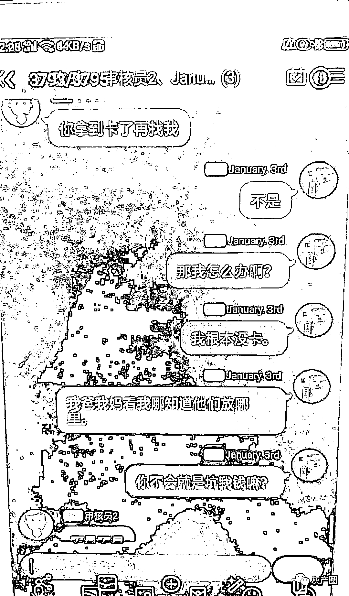

# 闹心的事说来就来，14 岁女孩打赏主播 18000 元，12 岁女孩为保护妈妈被骗 8200 元

> 原文：[`mp.weixin.qq.com/s?__biz=MzIyMDYwMTk0Mw==&mid=2247539514&idx=6&sn=493191a597d4922e26dc9c08b8832867&chksm=97cb9002a0bc1914d1eb32441d8cfc8e34619bac223f36d9b315f4730a0a2d9d71320c5ee2df&scene=27#wechat_redirect`](http://mp.weixin.qq.com/s?__biz=MzIyMDYwMTk0Mw==&mid=2247539514&idx=6&sn=493191a597d4922e26dc9c08b8832867&chksm=97cb9002a0bc1914d1eb32441d8cfc8e34619bac223f36d9b315f4730a0a2d9d71320c5ee2df&scene=27#wechat_redirect)

暑假才没过几天，闹心的事说来就来。

这几天，孩子被骗的案子多发了。 

今天要说的事情，都跟孩子玩手机有关。 

**14 岁女孩打赏宠物主播 18000 多元**

余杭良渚的王大妈报案说她的银行卡被盗刷了 18000 多元，怀疑是遇到了电信网络诈骗。

辅警朱俊超通过手机银行账单进行分析后，发现所有的金额都是充值到了抖音平台上，尤其近几天，接连充值了好几次，有几百元的，也有几千元的。

“手机是给我孙女在用”，王大妈孙女 14 岁，正好放暑假在家。

小女孩关注的大多是一些宠物博主，有一些游戏主播，有可能是小女孩给主播进行了打赏。 

“她在那边玩手机，有时能玩一个下午，每个月叫她支付宝上充过话费，所以密码她是知道的。”王大妈说，她知道孙女爱玩手机，但玩什么不是很清楚。

“阿姨您放心，现在平台对未成年人擅自充值，有一个未成年人退款的操作，可以申诉，平台会如数退还给您的！”朱俊超马上进入平台钱包找到了未成年人退款的功能，然后填写了王大妈的身份信息以及小孩的身份信息，对充值账单申请了退款。

但平台客服马上回复称，王大妈是孩子的奶奶，不属于直系监护人，需要孩子的爸妈才能进行退款申述。

“孩子爸爸妈妈都不在杭州啊”，王大妈又开始犯愁了，一时半会也联系不到，无法提供直系监护人证明。 

朱俊超反复跟平台客服沟通，最终说定，要王大妈所在社区开具孩子监护人证明才能进行申诉，在朱俊超的协调下，王大妈很快就领取了小孩监护人证明，朱俊超把材料填好又发了过去。

王大妈随后收到平台客服发来的全额退款的短信，核对账目钱没少。

**孩子给主播打赏的钱怎么追回？**

根据《民法典》规定：十八周岁以上的自然人为成年人。不满十八周岁的自然人为未成年人。不满八周岁的未成年人为无民事行为能力人，由其法定代理人代理实施民事法律行为。八周岁以上的未成年人为限制民事行为能力人，实施民事法律行为由其法定代理人代理或者经其法定代理人同意、追认；但是，可以独立实施纯获利益的民事法律行为或者与其年龄、智力相适应的民事法律行为。

简单来说就是，八周岁以下的未成年人打赏主播，不发生法律效力；八周岁以上的未成年人打赏主播，法律效力待定，如果法定代理人（家长）不同意或者追认，那么不发生法律效力。也就是说，不让未成年人为超出自己年龄和智力范围内的民事行为“买单”。 

2020 年 5 月 15 日，最高人民法院出台的《关于依法妥善审理涉新冠肺炎疫情民事案件若干问题的指导意见(二)》第 9 条明确规定：**限制民事行为能力人未经其监护人同意，参与网络付费游戏或者网络直播平台“打赏”等方式支出与其年龄、智力不相适应的款项，监护人请求网络服务提供者返还该款项的，人民法院应予支持。**

根据 2020 年 11 月出台《国家广播电视总局关于加强网络秀场直播和电商直播管理的通知》的规定，网络秀场直播平台要对网络主播和“打赏”用户实行实名制管理。未实名制注册的用户不能打赏，未成年用户不能打赏，并封禁未成年用户的打赏功能。对发现相关主播及其经纪代理通过暗示、引诱未成年用户以虚假身份信息“打赏”的，平台须对主播及其经纪代理进行处理。

如果发现孩子打赏了，家长怎么要回呢？

1、直接找到平台、主播要求退回。一般来说，打赏主播的钱会先进入平台账户，而后平台会根据与主播签订的协议进行分成，由平台将属于主播的部分打给主播私人账户。因此，平台和主播都有义务返还自己取得的部分。如果是私下与主播转账，那么主播个人承担退还义务。

2、平台、主播拒不退回，向法院提起诉讼。有时候，孩子可能会使用家长的账户进行打赏，因此平台、主播可能会以无法证明是未成年人打赏为由拒绝退回这些钱。遇到这种情况，要求退还钱财的一方承担的举证责任并不轻松。

**“让你妈妈去坐牢”，12 岁女孩为保护妈妈，被骗 8200 元**

上述王大妈通过辅警帮忙，总算把钱要回来了。

义乌 12 岁女孩晓晓也遇到了骗子，可恶的是骗子利用了孩子的单纯，恐吓孩子，“让你妈妈去坐牢”，晓晓想保护妈妈，结果被骗走 8200 元。

7 月 3 日中午，放暑假在家的晓晓玩手机，QQ 上收到一条好友申请，她以为是同学加她，就同意了。

随后，她被拉入一个三人群，另两个昵称“处理中心”、“审核员”。“审核员”告诉晓晓“你妈跟别人有经济往来，交易环节有违规操作，导致对方公司资金被冻结……”让晓晓“配合”工作，不然的话就“从你爸爸妈妈的银行账户里扣钱”，同时威胁道“钱不够赔偿的话，你妈就会惹上官司，让你妈妈去坐牢……”

听对方这么一说，晓晓害怕极了。她跟妈妈生活，“妈妈千万不能有事”，这是她唯一的念头。

对方告诫她“不要惊动大人”，按他们的要求去做就会“没事了”。

接着，晓晓偷偷拿走正在午睡的妈妈手机解了锁，在“审核员”的授意下，在手机上下载了“云闪付”，以她妈妈的身份信息注册并登录账号。

因为登录需要人脸识别，晓晓拿着手机冲妈妈刷脸，“要在线补课”，妈妈睡得迷迷糊糊的，也未在意。

“怎么个流程我已经记不得了，都是他在电话里一步步教我如何操作的”，晓晓说。

可这一刷不得了，晓晓无意中给妈妈绑定了很多张银行卡。完成绑定后，对方又让她扫码，发来的“都是收款码”。

晓晓知道妈妈的支付密码，先后转出去两笔钱共计 8200 元。

“我妈没钱她会发现的，她要出去了”，晓晓看到妈妈微信钱包里的钱都没了，感觉不太对劲。

对方催着让她“去拿你爸爸手机”“妈妈的所有银行卡拿过来”。

晓晓提出疑问，“审核员”称此举是为了“检测一下有无风险”“没有风险才可以退”……

见晓晓不再就范，对方就不再理会她，还让晓晓把好友添加记录、聊天记录、转账记录等全部删除干净，留下一句“你拿到卡了再找我”。

“那你给我撤销撤掉呀，不然我不是白弄了”，最后关头，晓晓仍不忘“保护”妈妈，殊不知对方是可恶的骗子。

晓晓妈妈出门买菜时发现微信里没钱了，问女儿，晓晓才道出原委。

妈妈带着晓晓赶紧跑到义乌市公安局稠江派出所报了案。

这类针对孩子的骗局，本质就是冒充公检法，有时，骗子还会发来一段视频，是派出所接处警大厅的场景或者骗子假扮民警说话的场景，孩子看了越发害怕。

孩子苦苦哀求，背后的骗子得意忘形。

骗子往往选的孩子——初中生、小学生群体是“主力”，年龄越小，对他们来说越容易掌握，有的被骗孩子才八九岁。

这类骗局过程往往是这样的： 

第一步：加 QQ、微信等社交平台好友。

第二步：孩子不知有诈，就通过了好友，对方发来恐吓话术：“你的账号做过违规事情！”“你是未成年人，所以你的父母要为你顶罪坐牢！”“你要好好配合我们的调查！”……

第三步：孩子被吓坏了，不想连累父母，按对方所说操作，对方发来收款码让孩子扫码操作，有的会让孩子发红包等方式，随后这些钱被骗子通过网上洗钱后转走。 

骗子会再三“掌握”孩子身边有没有大人，会要求孩子一个人躲在没人的地方去操作。

还有的骗局中，还打着免费送游戏皮肤等广告引诱孩子。

孩子加入群后，就会说通过了，但需要成年人微信辅助验证才能领取，孩子拿来大人手机。确定孩子拿来大人手机后，开始让孩子扫码操作。

骗子会让不知情的孩子扫码，而这个二维码其实是一个微信登录二维码，孩子用大人手机扫码后相当于授权骗子在另一端登录了，骗子要来支付密码后，再修改支付密码。

如果孩子一旦迟疑，骗子就会恐吓孩子不立即扫码就会影响父母的征信，要坐牢等等，孩子怕被父母知道，又担心连累父母，想要保护父母，一步步按骗子说的去做。

孩子们都天真，以为自己能悄悄把事情摆平了，不会受到大人严厉批评，所以往往也不会去问大人这种事情怎么办。

骗子为什么要孩子拿大人手机呢？因为孩子手机上没钱啊，他们知道钱都在父母手上。

有的孩子为了摆脱这样的大难临头，如果遇到大人密码是刷脸的，还会在大人睡着时或者不留神时，去悄悄刷脸，把钱转出去…… 

所以，哪怕给孩子备用手机，也要小心。最重要的是，家长也千万不让孩子登录自己的微信和支付宝账号，知道支付密码、锁屏密码。如果遇到孩子拿着手机让你来刷脸，千万要警惕！大人一定不能告诉孩子支付密码，同时在支付宝、微信支付上设置延长到账时间，可以延长到 24 小时。也不要绑定多种银行卡。

来源：全民反诈 文： 金炯明 楼剑 编： 杨丽   林纪彤

← 向右滑动与灰产圈互动交流 →

