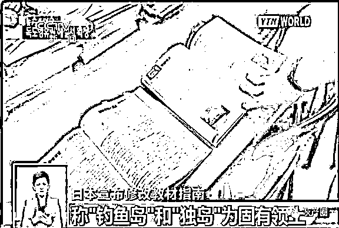
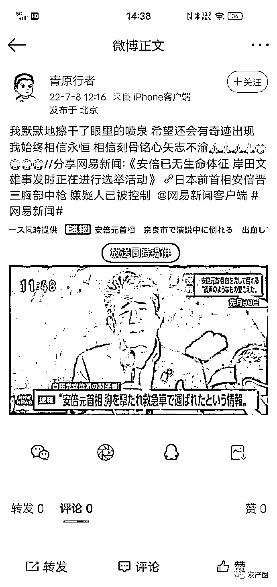
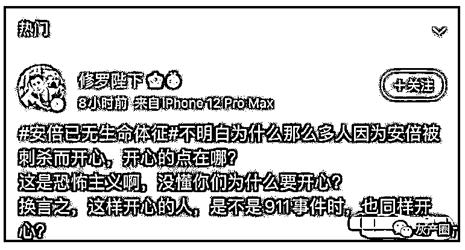

# 安倍被毙，网友评论亮了！日军未哭，伪军先哭，哭的是真伤心

> 原文：[`mp.weixin.qq.com/s?__biz=MzIyMDYwMTk0Mw==&mid=2247539603&idx=2&sn=3b0dfdb043d287a27b8a36953517f8c3&chksm=97cb90aba0bc19bd844d26af41cbae5f47428ea16c0465a01b336722dcee4cf8f644985f74bd&scene=27#wechat_redirect`](http://mp.weixin.qq.com/s?__biz=MzIyMDYwMTk0Mw==&mid=2247539603&idx=2&sn=3b0dfdb043d287a27b8a36953517f8c3&chksm=97cb90aba0bc19bd844d26af41cbae5f47428ea16c0465a01b336722dcee4cf8f644985f74bd&scene=27#wechat_redirect)

7 月 8 日，日本前首相安倍晋三在遭到枪击后，因伤势过重不治身亡，终年 67 岁。

[`mp.weixin.qq.com/mp/readtemplate?t=pages/video_player_tmpl&action=mpvideo&auto=0&vid=wxv_2478132261583028224`](https://mp.weixin.qq.com/mp/readtemplate?t=pages/video_player_tmpl&action=mpvideo&auto=0&vid=wxv_2478132261583028224)

微博上，因为这件事沸腾了 

大部分网友还是很兴奋的

因为，对安倍晋三，中国人对他的印象很差！

外交部曾多次严辞批评安倍的恶劣行径 

安倍 2013 年 12 月 26 日参拜供奉甲级战犯的靖国神社，企图颠覆东京审判，美化日本军国主义对外侵略和殖民统治历史，中国外交部发言人代表中国政府做出的罕见表态：中国人民不欢迎安倍。

这次安倍晋三可以如愿以偿，拎包入住靖国神社了

在辞去首相职务后，安倍于 2020 年 9 月、10 月以及 2021 年 4 月、8 月分别参拜靖国神社。2022 年 4 月 21 日，安倍晋三最后一次参拜靖国神社。

据不完全统计，不仅参拜，他还在 2016 年 10 月，2017 年 10 月，2018 年 4 月 21 日 ，2019 年 10 月,2020 年 4 月向靖国神社供奉祭品，中国外交部，多次谴责。

他这么热衷于惨败靖国神社，和他的身世有关

2015 年，*安倍*第二次上台后不到半年,就在国会表达要*修改教科书*审查标准的想法。通过审定的教科书将钓鱼岛和独岛都称为是“日本固有领土”，并更改了对南京大屠杀的表述。

**2015 年 5 月 28 日，日本首相安倍在国会接受质询时，未否定南海也在自卫队为美军提供支援的“重要影响事态”对象范围内。** 

21 年下了台的安倍还不老实，三在台湾所谓“国策研究院”相关论坛线上演讲时称，台湾有事即日本有事，也就是日美同盟有事。

对这种，数次惹怒中国人民的日本领导人被击毙，网友们一时无法控制自己的情绪，贡献了很多精彩的评论

你可以永远相信汪峰 

和尚去世了叫圆寂，皇上死了叫驾崩，诸侯死了这叫薨，士死了叫不禄，大夫死了，叫卒。普通人死了，那才叫死，那还有一些跟我作对的人去世了，叫欧耶！---郭德纲

没有武林外传蹭不上的热度

网友：炮仗已备好，就等官宣了……😂

调皮的店家连开席套餐都安排上了。

六公主正在播放的电影有点东西，还是那么会选片

中国人刚把筷子掰开，东京电视台已经开席了 

中国网民的态度，外交部都不管，但有人非要管 

著名的“骑墙派”---胡锡进 

网友这么评价他：我尊重老胡的感受，我也尊重我自己内心的真实感受，不过，安倍参拜靖国神厕的时候可从来没有尊重中国人民的感受。

安倍死了，有些日本人还挺高兴 

这群幸灾乐祸的日本人急需下面这帮中国人帮他们反思

日军未哭，伪军先哭，哭的是真伤心啊！

日本自己都没有定性为恐怖袭击，而是定性为谋杀案，那些替日本定性为恐怖袭击的，有点自作多情了

有考据的历史以来，都是日本侵略中国，中国从来没有侵略过日本，所以，“中日之间永远不要再有战争”这句话，请你去找日本人说，别找中国人说。

这位导演舔日本的角度刁钻……

与皇军共情的只有汉奸。

苏州足协里面有坏人呀！ 

还有唐山师范学院的教授，已被永久禁言

到底谁才是“施暴者”，这位网友的逻辑让人顿悟！

前段时间我们坠机事件的时候推上的日本人不知道有多开心，反思怪现在倒反过头来让我们反思啦

最后，网友玩了一招走公知的路，让公知无路可走……

* * *

地瓜熊老六：安倍和他的家人会原谅枪手吗？不会！那我为什么要原谅安倍呢？

米斯特偷马头:杀人的不是我，杀中国人的是他们，参拜靖国神厕的是他，就算是全世界为他默哀，我也要在他坟前啐两口

顾鸳糖:抛开身份，抛开国籍，抛开政治，抛开行为，是挺可怜的，但是哪能全抛开……

荐见：俄乌战争、英国首相辞职、日本前首相被刺杀……这怎么越看越像历史书啊 

来源：微博那些事儿

← 向右滑动与灰产圈互动交流 →

