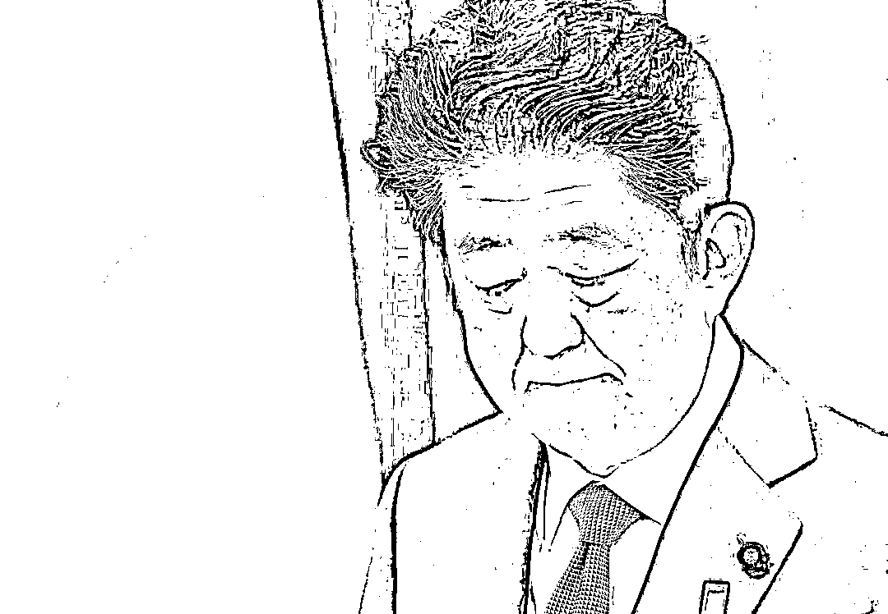
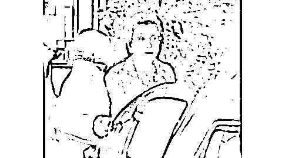
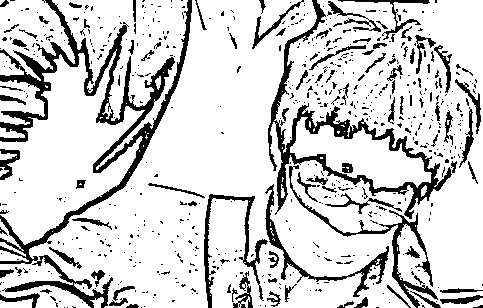
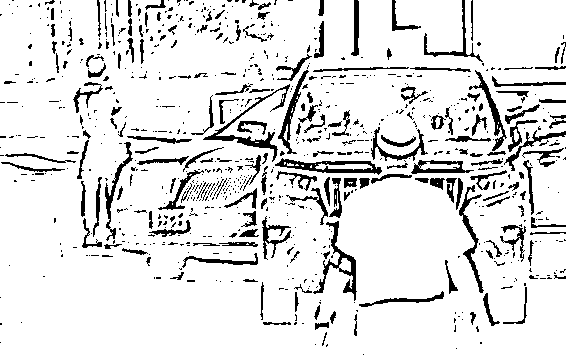
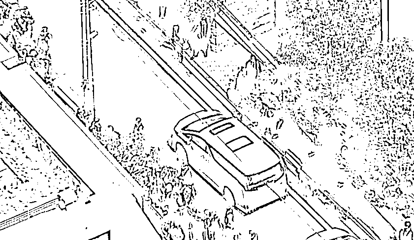
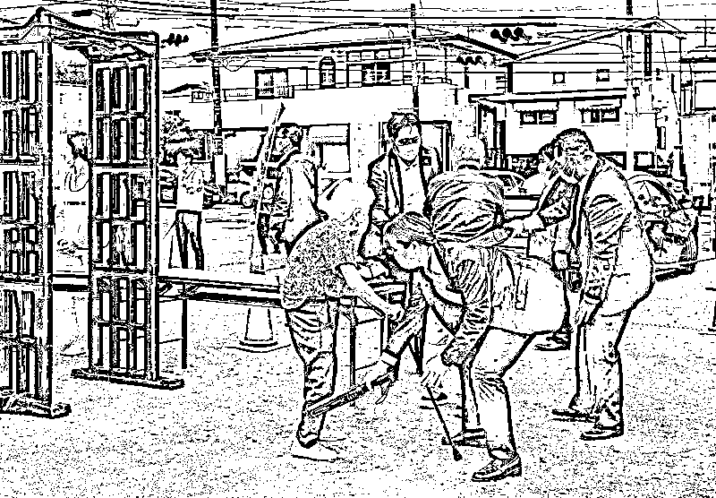
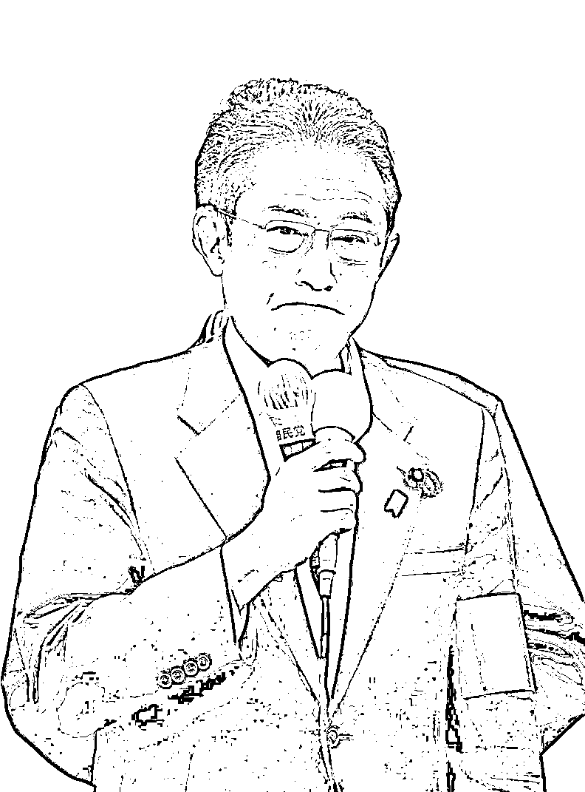

# 嫌犯起杀机竟是因为她

> 原文：[`mp.weixin.qq.com/s?__biz=MzIyMDYwMTk0Mw==&mid=2247539603&idx=3&sn=40f38b1adb367dd630bec36482d371d0&chksm=97cb90aba0bc19bd6fdb91d645efbd4709ea7c1ea7d717f6e21a8a5105b79f56d7e69dc9d537&scene=27#wechat_redirect`](http://mp.weixin.qq.com/s?__biz=MzIyMDYwMTk0Mw==&mid=2247539603&idx=3&sn=40f38b1adb367dd630bec36482d371d0&chksm=97cb90aba0bc19bd6fdb91d645efbd4709ea7c1ea7d717f6e21a8a5105b79f56d7e69dc9d537&scene=27#wechat_redirect)

**日媒：安倍原本不打算前往遭袭地奈良**

**前一天临时改变计划**

据日本《日刊体育》8 日报道，日本前首相安倍晋三当天上午在奈良市街头演讲时被一名前海上自卫队成员枪击。

相关人士透露，安倍 8 日原本打算前往长野市，前一日才调整行程改为前往奈良等地。

**日本自民党有关人士称，安倍 8 日前往长野的计划被取消是在 7 日下午。行程经过重新调整后，安倍决定在 8 日前往奈良、京都和埼玉 3 个县。**

**安倍遇刺当天 11 点 31 分，奈良市消防局收到报警电话，11 点 32 分，急救队等队伍出动，11 点 36 分，发出了启动医疗救援直升机的请求。随后，上午 11 点 37 分，急救队等队伍赶到现场，11 点 54 分，急救队将安倍撤出现场，12 点 20 分，医疗急救直升机将其送往奈良县立医科大学附属医院。**

# ****安倍母亲“当场落泪”，弟弟发声****

**据日本《星期五》杂志等多家媒体 9 日报道，安倍 94 岁的母亲洋子吃午饭时看到相关新闻愣住了，她一时间难以理解，随后放声大哭。**

****日媒称，在日本各大媒体报道这一消息时，身处养老院的洋子当时正在吃午饭，突然看到了这条新闻。****

****相关人士透露，洋子得知自己儿子中枪后愣住，一时间无法理解发生了什么，陪在她身边的人则慌张地试图关掉电视。之后，洋子放声大哭。****

********

****安倍的母亲洋子****

****另据日媒《产经新闻》8 日消息，日本前首相安倍晋三在奈良街头演说时遭遇枪击身亡。当天晚间，安倍的弟弟、日本防卫大臣岸信夫对记者表示，从没想过哥哥会以这种形式离开。****

****岸信夫还称，哥哥为政治事业拼上了性命，在参议院选举期间发生这样的事情，可以说是封杀言论的暴力行径，绝不认可这样的行为。****

### ******日媒：枪杀安倍嫌犯母亲执迷******

### ******与安倍有关系的某宗教团体，******

### ******故对安倍起杀机******

****综合日本《东京新闻》、《朝日新闻》9 日最新报道，日本警方人士向媒体透露对枪杀安倍晋三的嫌犯山上彻也的调查进展。****

****《东京新闻》报道，警方透露，山上在供述中称：“我的母亲执迷某宗教团体，导致我心怀怨恨。我了解到安倍与这个团体有联系，所以对安倍起了杀机。”《朝日新闻》还称，山上说：“在过去，我的家人曾成为某宗教团体的信徒，并向这个团体捐献钱财，导致生活困顿。”****

********

****枪杀安倍晋三的嫌犯山上彻也 8 日被现场警备人员控制住，日媒报道配图****

****《朝日新闻》称，当地警方认为，是山上对这个宗教团体的怨恨，演变成对安倍的杀意。目前警方正在对案件进行进一步的详细调查。****

****值得注意的是，包括《东京新闻》、《朝日新闻》在内，多家日媒报道了山上在供述中提及所谓“与安倍有关系的某宗教团体”，但尚未有日本警方或媒体透露该团体的具体名称。****

### ******枪杀安倍嫌犯谈枪支来源：******

### ******调查如何自制后买了零件******

### ******火药从网上购买******

****据全日本新闻网 9 日报道，日本前首相安倍晋三 8 日遭枪击后不治身亡。就使用的自制手枪来源，嫌疑人山上彻也在审讯中承认，他在调查了枪支的制作方法后购买了零件，火药也是在网上买的，并且也弄到了空弹壳。****

****日本警方已从山上的住所中发现了疑似爆炸物和多把自制枪支，并通过处理爆炸物的车辆将危险物品运出。****

# ******安倍安保人员被质疑“重大失职”******

****据《日本经济新闻》7 月 9 日报道，日本前首相安倍晋三 8 日在奈良街头演讲时遭枪击，经数小时抢救后不治身亡，终年 67 岁。一时间，日本网络上充斥着对安保人员失职的指责。****

****报道称，虽然日本的警察当局没有详细公布当时的安保部署，但专家们认为，日本选战当中的安保难度较大，与其他国家相比对枪支的警备仍有极大改善空间。警察当局也急需完善警备制度。****

****据报道，安倍遇刺时站在一个数十厘米高的台子上。当时周围聚集了超过 100 名民众。而警察和选举工作人员更是多达数十人。按照日本惯例，现任阁僚和前首相都必须有警视厅警备部安排的“安全警察”随行，提供安全警备服务。****

****日本的“安全警察”制度始于 1975 年，当时的日本首相三木武夫曾在街头遭壮汉暴力殴打。此后，日本参照美国总统的特保模式建立了“安全警察”制度。****

****一位不愿透露姓名的经营安保公司的前警察告诉记者，“安全警察”按要求应该身着防弹衣并携带警棍。常年担任首相的安倍显然应该是日本最高级别的安保对象之一。****

****当天，安倍身边有奈良县的地方警察和日本警视厅的“安全警察”同时在场，据说也事先确认了现场有无安全隐患。但在演讲现场，演讲者通常会站在高处宣讲，甚至在演讲前后与选民握手互动。****

****一位执行过选举警备任务的警察告诉记者，这就导致日本选举宣传的警备难度更高。****

****国际保安协会亚洲区负责人小山内秀友说，日本要人的警备更侧重刀具和钝器的防备训练，而欧美侧更重于枪击。****

****欧美国家不但会提前确认现场安全，也会更注意周围人的手部动作，甚至还会部署狙击手。****

****在枪支管控非常严格的日本，不得不说警察当局对枪击的警备存在漏洞，安保水平与美国等国有质的差距。****

****另外，日本前警视总监米村敏朗 8 日在接受媒体采访时也称，这次刺杀事件当中，警备人员很可能没有事先确认警备死角，“作为警察来说，存在重大失职”。****

# ******安倍灵车抵达东京住宅******

****据日本电视台等媒体 9 日报道，载有日本前首相安倍晋三遗体的灵车已抵达其位于东京的住宅。****

********

****载有日本前首相安倍晋三遗体的灵车（视频截图）****

********

****安倍住宅前（视频截图）****

****当地时间 8 日上午，安倍在奈良市一车站附近演讲时遭枪击，重伤不治身亡。9 日早晨，载有安倍遗体的灵车从奈良县立医科大学附属医院驶往东京。****

# ******岸田戴了黑纱，“十米一警”******

****据日本《读卖新闻》报道，当地时间 7 月 9 日，日本首相岸田文雄在山梨县富士吉田市举行有关参议院选举的演讲。现场安保工作明显有所增强，大约每十米左右就有一名警方人员，同时现场也设置了金属探测仪。**** 

********

****现场安保工作明显有所增强****

****当天，岸田文雄左臂佩戴了黑纱。****

********

****岸田文雄左臂佩戴了黑纱****

****来源：极目新闻，南风窗********************

****← 向右滑动与灰产圈互动交流 →****

********