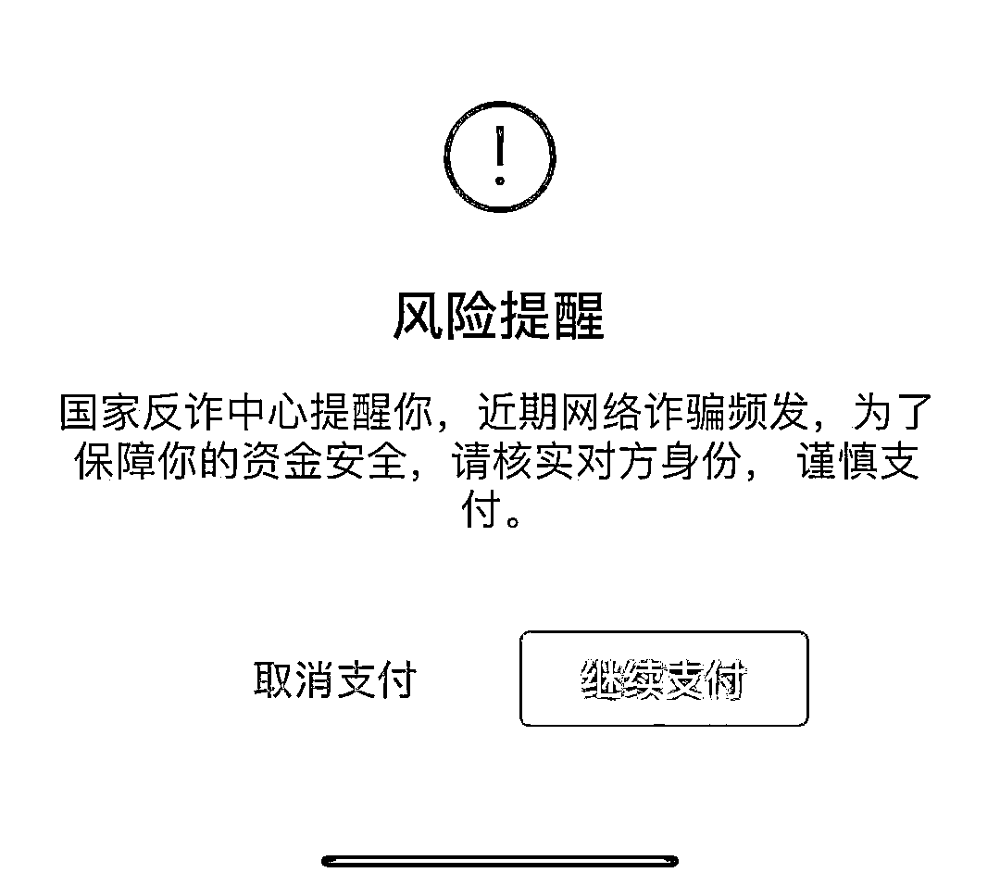

# 色情导流、杀猪盘诈骗、伪装领导和名人，网络诈骗就在你身边…

> 原文：[`mp.weixin.qq.com/s?__biz=MzIyMDYwMTk0Mw==&mid=2247539603&idx=4&sn=6db9ce17cb64440d4d02ba7ba6f9e02f&chksm=97cb90aba0bc19bd60582dc77c9c87b839c56d643cd3714688bddd467039e936f9cf36c5ceb3&scene=27#wechat_redirect`](http://mp.weixin.qq.com/s?__biz=MzIyMDYwMTk0Mw==&mid=2247539603&idx=4&sn=6db9ce17cb64440d4d02ba7ba6f9e02f&chksm=97cb90aba0bc19bd60582dc77c9c87b839c56d643cd3714688bddd467039e936f9cf36c5ceb3&scene=27#wechat_redirect)

**导语**

骗子也会与时俱进，研究各种新骗术，等着你来交智商税。每年年底了，骗子们也要冲业绩，看好自己的荷包吧。

此前，为了降低风险，微信支付出了个风险提醒，使用微信转账时可能会收到下列弹窗文字： 

这样的风险提醒或拦截一出现便是警告用户，很可能正身处骗局之中。 

可能有的人不理解，微信支付是怎么识别骗子的呢？

据悉，微信支付构建了识别恶意账号和交易的安全风控系统，付款的过程中如果收款账户有异常特征时，微信会根据风险程度对用户进行交易风险提醒，如果收款方恶意程度较大，微信就会对交易进行拦截保护，提醒用户注意资金安全。 

此外，除了对用户进行提醒，微信支付还给用户提供了一个 15 分钟的“转账冷静期”。在这个期间，用户可以核实对方身份，从而让自己做出更加准确的判断。

然而，有些人明明看到了微信官方的提醒，却不重视，或者被三言两语忽悠了，急忙忙转钱，导致被骗。

现在，微信支付又特别邀请**国家反诈中心**，共同推出风险提醒，希望来自官方的提醒能够得到大家的重视。

在使用微信支付时，如果看到了下面的弹窗文字，千万别冲动。

**“国家反诈中心提醒你，近期网络诈骗频发，为了保障你的资金安全，请核实对方身份，谨慎支付。”**

在网络这层“画皮”下，诈骗份子转眼就成了亲友、领导、明星、甚至是公检法人员。普通用户网络安全意识不强，未经核实就轻易转款，受损金额从几千到上百万元不等，危害性极大。 

腾讯 110 重拳打击仿冒骗局，近一年已累计打击 6 万个相关违规帐号。从年龄分布来看，90 后损失金额最高，00 后遭遇仿冒明星诈骗最多；从手法类型来看，**仿冒老师、明星、领导、公检法最为高发。**

早在去年，著名央视主持人尼格买提在微博上发布这样一张聊天群对话截图，表示自己被仿冒诈骗，进群打假后却被直接移出群聊。 

彼时，媒体报道，诈骗团伙逐渐形成了“盗用明星肖像制作海报”、“批量生产高仿明星号”的仿冒诈骗新套路。 

一方面，诈骗分子盗用明星名人的肖像照片制作宣传海报，并以附带的二维码吸引用户添加好友或进群，再利用巧言令色引诱用户支付“项目费用”。

另一方面，诈骗团伙利用“高仿明星号”迷惑粉丝。通过在个人社交帐号发布明星名人的照片素材，获取用户的信任。随后，引导用户添加好友或进群后，发布“三无”产品或返利诈骗信息，诱导用户转账付款骗取钱财。

此前，周杰伦、宋祖儿等明星名人也曾先后发声打假，号召粉丝擦亮双眼慎防上当。

但直至目前，关于“诈骗团伙抓住粉丝对明星名人的信任，通过仿冒明星骗取用户钱财”的事件仍时有发生。

其中在网上广泛传播的当属发生在今年的“六旬大妈称要嫁给靳东” 一事了。据悉，这位大妈自从在某款热门短视频 APP 上刷到靳东后便不能自拔，等待他每天的问候，甚至花钱买“靳东”带货商品。

而根据视频显示，只不过是剪辑了一些靳东的访问，并且配上一些花花草草当作背景，然后再配音合成一段视频，制作水平相当业余，口型都对不上。就是这么一些剪辑粗糙、特效简陋、无加 V 认证，横看竖看漏洞百出的视频，却令不少中年网友深信不疑。

该短视频平台的安全中心负责人表示，在假靳东背后，有一批黑灰产团队在操控假名人账号，他们的目的，是希望“养号”，之后做直播带货变现。并且，短视频平台还有**色情导流、羊毛党、杀猪盘诈骗、网络诈骗导流**等黑灰产团伙。不过，平台方已经承诺将采用反黑产技术对其进行整治。

除了仿冒明星名人，诈骗团伙还会制作钓鱼网站、冒充领导甚至国家机关工作人员、医保社保机构、网络警察，仿冒客服返现等。

**#零成本赞赏区#**

整理不易，打下方 Ka 片，无需成本的赞赏，进去后退出即可！……感谢您的支持，靠他吃饭↓↓↓

**“某某某，我是某位领导，速来我办公室一趟”**......在以前，冒充领导诈骗的手法，基本上以恐吓为主，语气比较严厉，利用了领导这层身份进行施压，让大家失去判断能力。TA 会不停的催受害者打款，利用这种短时间的高密度信息轰炸，给人造成紧张感和压力感，最终实施诈骗。

现在的诈骗自然已升级。TA 懂得了首先要进行简单的问候，礼貌又不失威严。采用关心企业或员工本人发展、给予相关政策扶持等方式拉进关系，再以亲戚、朋友公司需要资金周转、上级领导要求等为由，请受害者帮忙转账至不法分子指定的账户。技高一筹的骗子还会事先伪造好假的转账截图，谎称已将钱款转到受害者提供的账户以博取信任，最后实施诈骗。

冒充公检法等国家机关工作人员的套路也不复杂。

首先要知道的是，骗子既然敢冒充公、检、法部门，就必然会有强大的个人隐私数据作为支撑，能够准确说出受害人的姓名以及身份证号码是最基本的诈骗环节。

随后，骗子通常会以“冻结银行卡”“手机号码停机处理”“勒令到指定地方接受调查”等借口引发受害者恐慌。

所谓做戏要做足，骗子还会利用微信、QQ、苹果手机自带通讯功能等系统与受害人取得联系，向受害人发送假警官证照片、假逮捕令、假拘留证。

更有甚者会为受害人“量身定制”一段视频录像，录像内容大概是两名“警察”在审讯室讯问“犯罪嫌疑人”“犯罪嫌疑人”清楚说出受害人的身份信息并称其参与违法犯罪活动。击垮受害人最后一道心理防线。

直至受害者彻底相信骗子身份后，再缓和语气，操控受害者转账了。

除了上述近年来最高发的诈骗手法类型外，大家也要谨慎其他常见的诈骗手段。尤其是今年以来，受疫情影响，大量年轻人中，缺钱的想贷款，没工作的想兼职，给骗子可乘之机。

骗子也会与时俱进，研究各种新骗术，等着你来交智商税。每年年底了，骗子们也要冲业绩，看好自己的荷包吧。

**转告**

**告知更多人骗子的招数**

**有力抵制打击网络骗子**

来源：大 R 说安全

← 向右滑动与灰产圈互动交流 →

