# 为安倍哭丧的中国女记者，被扒出更多黑料！

> 原文：[`mp.weixin.qq.com/s?__biz=MzIyMDYwMTk0Mw==&mid=2247539699&idx=1&sn=caad2e65fdc782fb061f84e70480bcee&chksm=97cb90cba0bc19dd2e78fe1561e860c0b50a0d0ff60cfcb0f709088f5b847c97e8e85160343d&scene=27#wechat_redirect`](http://mp.weixin.qq.com/s?__biz=MzIyMDYwMTk0Mw==&mid=2247539699&idx=1&sn=caad2e65fdc782fb061f84e70480bcee&chksm=97cb90cba0bc19dd2e78fe1561e860c0b50a0d0ff60cfcb0f709088f5b847c97e8e85160343d&scene=27#wechat_redirect)

**01**

安倍遇刺后，各大媒体纷纷报道评论此事。

澎湃新闻驻日记者曾颖，在直播报道此事时，聊到安倍生前的“贡献”时，控制不住情绪，几度哽咽。

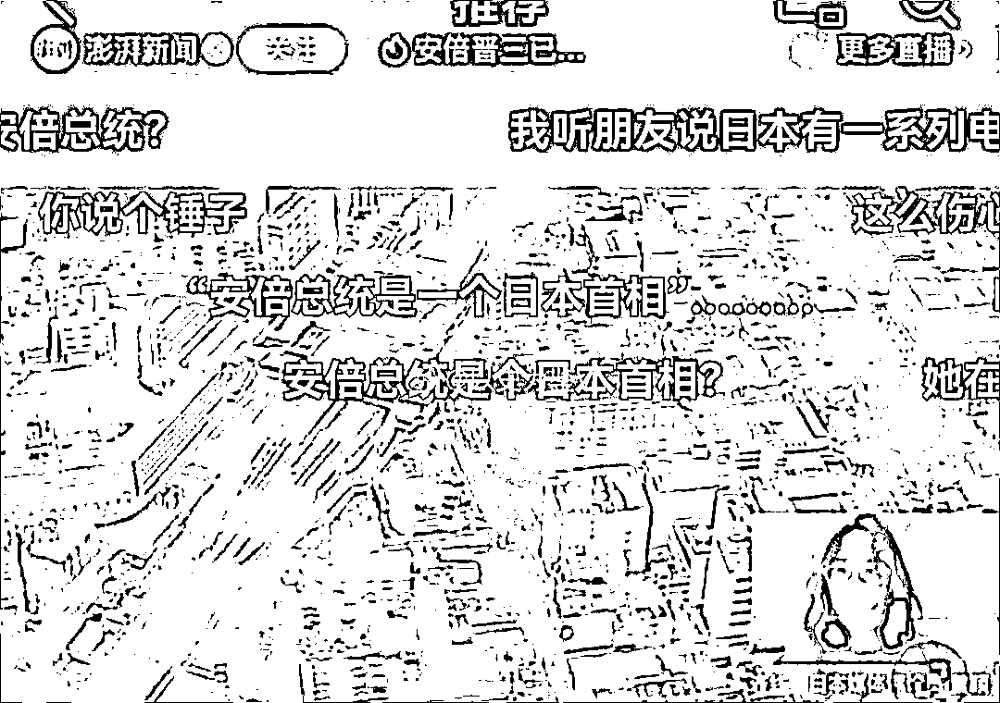

**我很能理解一些记者在播报时痛哭的场景，毕竟记者也是人，看到一些悲痛之事时情难自制在所难免。**

**记得当年汶川大地震，有主持人在播报时，说着说着就流下泪来，一边哽咽，一边念出伤亡数字。**

**对于这样的主持人，大众都能感同身受，这样的播报也是真情流露，大家也是一片褒奖之声。**

**可这一次，曾颖为安倍痛哭的视频曝光后，立刻引发了中国网民的批评和谩骂。**

**有网友批评曾颖没有记者的职业素养，“要哭回家哭去，这是在报道新闻，不是给谁家办追悼会。”**

**更有网友则是痛骂曾颖，“对华友好，你逗我呢？”**

**“昨天七七也没见你哭，现在哭啥。”**

**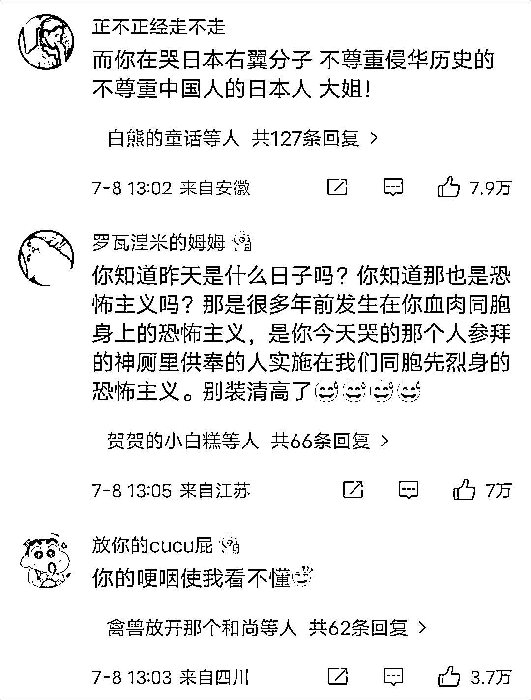**

**众所周知，安倍曾多次发表过错误言论，还多次参拜靖国神社，插手台湾事务；**

****

**不仅如此，安倍还曾否认日本战时犯下的种种罪行，否认慰安妇的存在。**

**这些言行，让每一个有良知的国人出离愤怒。**

**被网友指责后，这位女记者甚至还发了一篇长文，表达自己的委屈。**

**她声称自己没有忘记历史，只是觉得安倍是一个值得尊重的人。**

**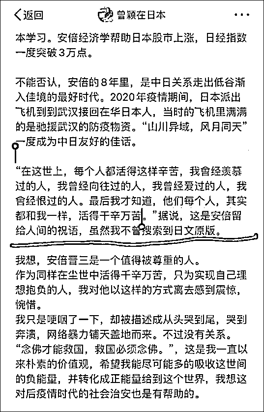**

**却只字不提安倍犯下的种种恶行。**

**可笑的是，这位女记者还引用了一段疑似是安倍晋三说的话来纪念他：**

**“在这个世界上，每个人都活得这样辛苦，我曾经羡慕过的人，我曾经向往过的人，我曾经爱过的人，我曾经恨过的人，后来我才知道，她们每个人，其实都活得这样辛苦。”**

**但其实，这段话早就已经辟谣不是安倍晋三说的，而是我国小说作家匪我思存说的。**

**匪我思存早就已经发文表示：“匪老师躺着也中枪，这段话不是安倍说的，是我的小说《千山暮雪》里的。”**

**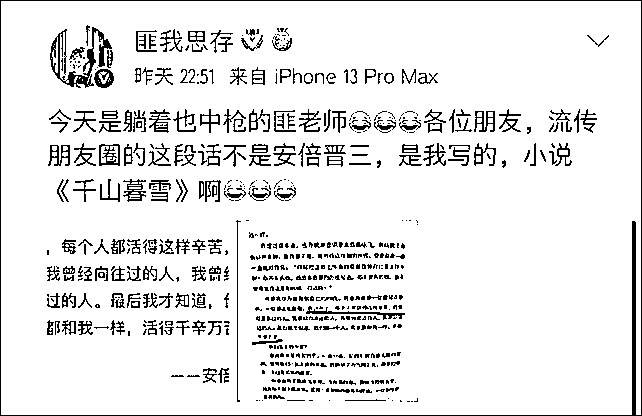**

**而且网友扒出，就在安倍去世的前一天，就是 7 月 7 日，一个让所有中国人永远铭记的日子：卢沟桥事变。**

**那天，女记者曾颖没有痛哭，反而在微博开心地抽奖。**

**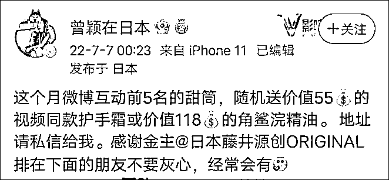**

**然后一天后，安倍遇刺，她在直播中痛哭流涕。**

**对比不可谓不明显。** 

**作为驻日记者，她在日本生活了很多年，对那里的风土有感情可以理解。**

**但她骨子里流的还是中华民族的血液，所以不管做任何事，都应该站在中国人民的立场上考虑问题。**

**曾颖之所以被骂上热搜，其根本原因还是因为她不考虑中国人民朴素的爱国主义情感。**

****02****

**随后网友深挖，才逐渐明白，原来曾颖早就彻底“日化”了。**

**两年前，她在日本街头，以武汉的报恩的名义发口罩，被日媒报道.**

**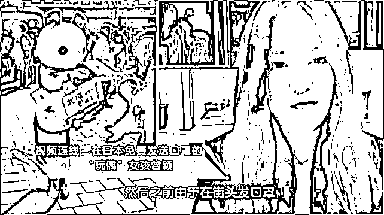**

**她之前在微博上说，要入日籍参加日本选举的发言。**

**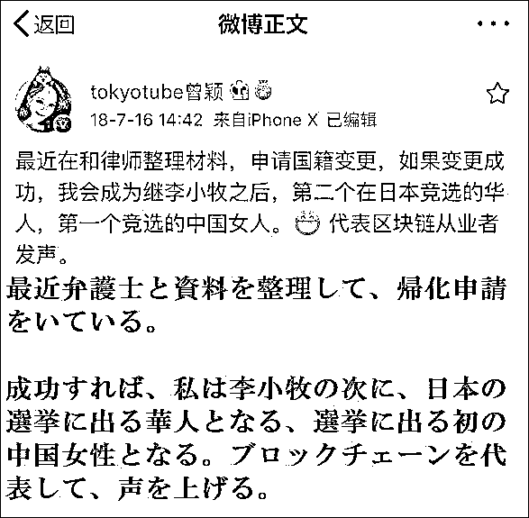**

**还有在薛之谦被李雨桐锤的时候，她的精彩发言：“李雨桐应该把吞进去的 Jing 子还给薛之谦。”**

**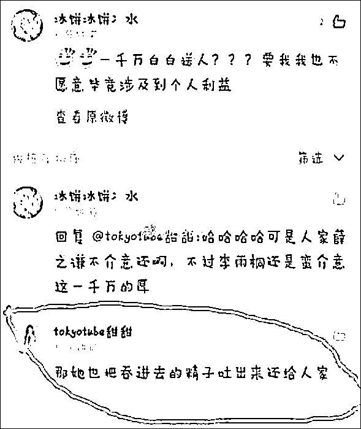**

**后来曾颖改了名，删了以前的微博。**

**然而在 6 月 26 日她发表了一篇微博，里面有张图，是她在一个著名业界公司的倩影，公司墙上有一个如雷贯耳的单词：prestige。**

****

**看到这幅图，我是懵逼的，虽然本人对东瀛动作爱情片一向不感兴趣，什么三上、桥本、相泽之类的，一概不知。**

**但 prestige 是啥啊，堪称 NBA 中的湖人，顶级豪门，很多人的初恋作品都出自这里。**

**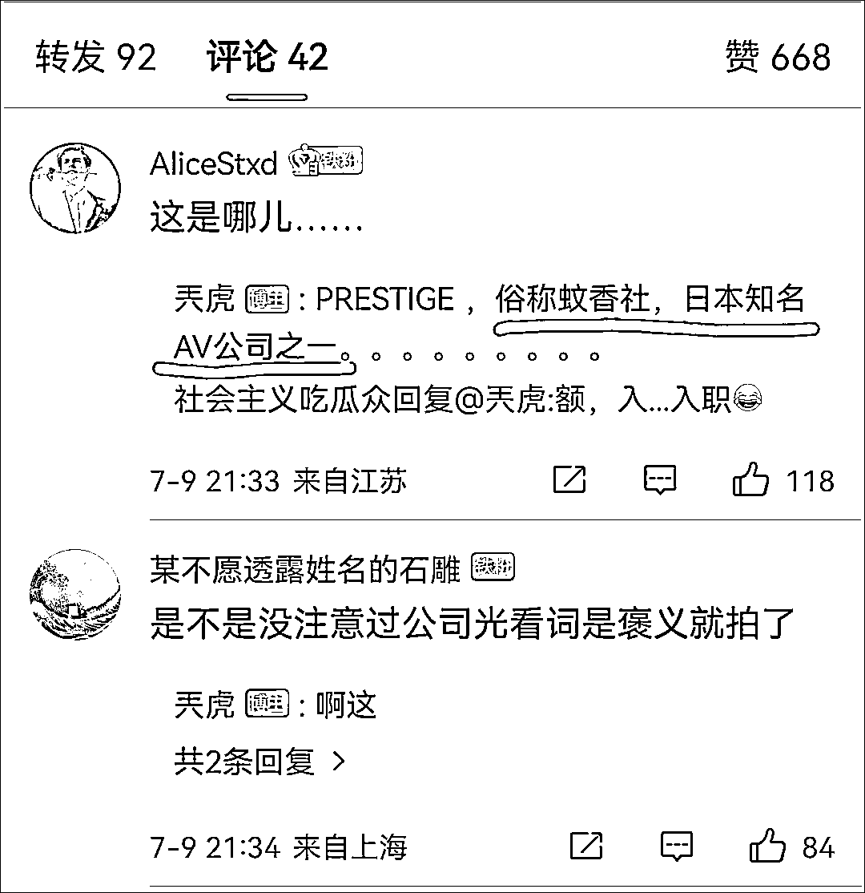**

**曾颖女士是准备在此出道吗，不然真就浪费了梨花带雨的演技。**

**而且，除了驻日记者的身份外，曾颖女士还是日本同道文化 CEO，在日本互联网上拥有超过 1700 万粉丝。**

**同时，她还是踏足虚拟币，是某虚拟货币交易所创始人。**

**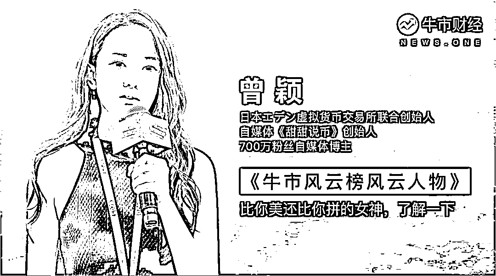**

**同时，曾颖身上还有诸多的光环，“早稻田大学校花”、 “漫画家”、“演员”、“网红”、“虚拟币创业者”。**

**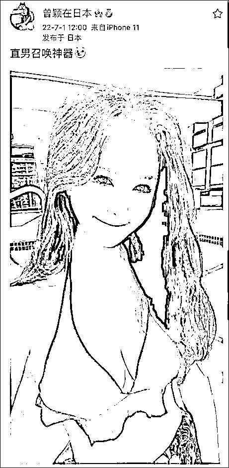**

**有了这么多标签，我大概明白曾颖女士是干什么的，人在日本，做着国内的生意。**

**浓浓的韭菜收割机范。**

****03****

**我记得在老家，如果有人去世了，除开亲属之外，只有专业哭丧的会痛哭流涕。**

**为什么？他们就是挣这份钱的。**

**回到曾颖这个事上，她被骂纯属自找。**

**不过从她事后的态度看，她也无所谓，反正也不是哭给中国人看的。**

**最后，希望国内的媒体，别再随便找什么臭鱼烂虾当记者评论员。**

**如果她不是记者、媒体评论员类的媒体人，只是生活在日本的一名留学生、女商人，安倍晋三遇刺了，她把自己关在家里，爱咋哭咋哭。**

**对安倍的一些做法，她感恩戴德，是她自己的事情。**

**但是，作为媒体人，把她错误的观点，通过新闻直播，传送到中国，传递给无数中国人，就是极大的错误。**

**这种人，活该被骂！**

**来源：在下刘三刀**

********

**← 向右滑动与灰产圈互动交流 →**

****