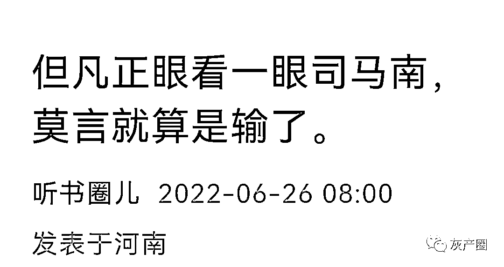
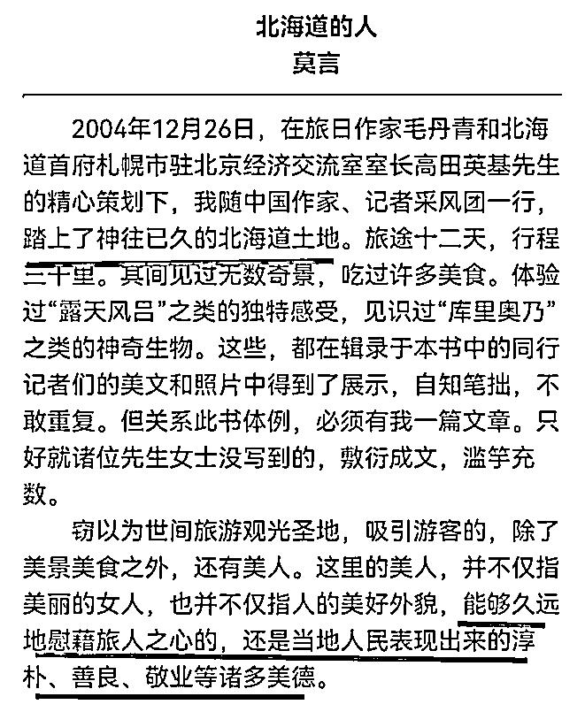

# 穿和服的司马南炮轰莫言“颂日” 胜负已分：官媒为莫言发声

> 原文：[`mp.weixin.qq.com/s?__biz=MzIyMDYwMTk0Mw==&mid=2247539699&idx=3&sn=10aec36b26a0b4bd6701761fe17886e2&chksm=97cb90cba0bc19dde0539ecd7fa52ce50727fb8f83e33cb4cc1618fa26624f4cb411fb0c9d4b&scene=27#wechat_redirect`](http://mp.weixin.qq.com/s?__biz=MzIyMDYwMTk0Mw==&mid=2247539699&idx=3&sn=10aec36b26a0b4bd6701761fe17886e2&chksm=97cb90cba0bc19dde0539ecd7fa52ce50727fb8f83e33cb4cc1618fa26624f4cb411fb0c9d4b&scene=27#wechat_redirect)

前段时间，司马南连做多期节目，狠批莫言。 

简单来说就是莫言的一段话惹得司马非常不爽，莫言说：

**“**如果谁想用文学来粉饰现实，如果用文学来赞美某一社会，我觉得这个作品的质量，是很值得怀疑的。我有一种偏见，觉得文学艺术永远不是唱赞歌的工具，文学艺术就是应该暴露黑暗，也包括人类心灵深处的阴暗面。**”**

司马先是提出质疑：**文学作品怎么能只能用来批判社会、揭露黑暗呢？赞美祖国、赞美人民有什么不对呢？**

这一高论抛出，立马让司马聪明的追随者们跟着嗷嗷亢叫。

司马接着又趁热搬起石头丢向莫言：**情不自禁地歌颂日本，莫言先生为啥自己破防了？**

我们来分析下所谓的莫言“歌颂日本”。 

在《北海道的人》里，莫言说道：**踏上了神往已久的北海道土地……能够久远地慰藉旅人之心的，还是当地人民表现出来的淳朴、善良、敬业等诸多美德。**

****

**我们权且赞同这是莫言在歌颂日本，是在媚日吧。司马南忘记了当年自己是怎么赞美日本的。**

**司马南在 2018 年去日本写下东京纪事系列，司马南穿着日本和服，吃着日本美餐，看着日本风光，好不惬意。**

****

**司马南佩服，“日本人能够把一个小小的村落，建设出一种富有中国禅宗，特别是南派禅宗意味的禅意乡村。”**

**司马南还把日本农村看成是中国的发展目标，“日本农村风光，让俺心里生出一种感觉，不知道说出来会不会被揍一顿：我们社会主义新农村建设，不就是要把农村建设成这个样子吗？换句话说，我们的社会主义新农村建设是否可以参介日本农村发展的经验？”**

****

**司马南的政治觉悟怎么消失了，司马南的四个自信哪里去了？**

**司马南在视频里煞有其事批评莫言歌颂日本，却忘记自己穿着和服赞美日本的事情来，给别人上纲上线，最后打脸的就是自己：当初穿和服可惬意？日本料理可美味？日本风光可养眼？日本的温泉澡可舒服？日本人的酒会可尽兴？**

**光明网 7 月 6 日刊发了《莫言研究的一次重要集结》，认为“如果我们把文学史的发展看作漫长的过程，经典作家便是其发展道路上的路标，而莫言和他的变革之路是中外文学与文化的一次深有意味的交汇。”**

**文中结尾总结道：**“****说明了莫言之于当代长篇小说创作和新时期以来城市伦理书写的重要意义。****”**肯定了莫言的文学创作价值观和艺术成就。（原文刊发于 2022 年 7 月 06 日的《光明日报》。）**

**可以说司马南炮轰莫言，胜负已分。**

****

****

**据百度百科显示，**光明网是中央重点新闻网站，定位于思想理论领域。光明日报是”创刊于 1949 年 6 月 16 日，是中共中央主办，以知识分子为主要读者对象的思想文化大报。“权威性不容置疑。**文中引用了多名专家学者对莫言作品的解读，对其作品的文学性，思想性，时代性都给予了极高的评价。**

**可以说光明网的这篇文章来的十分及时，当下国内舆论，特别是民间网络上对莫言等作家的作品不理解，屈解的现象很多，这篇文章从理论高度，结合专家视角，给人民群众上了一堂生动的文学理论和实践课程。**

**这样的文章应该多发一点，多多益善，特别是在社会各种思想激烈碰撞的时候。**

****

****光明网《莫言研究的一次重要集结》****

**“莫言与当代中国文学创新经验研究”丛书（作家出版社 2021 年 11 月出版）是国家社科基金重大招标项目“世界性与本土性交汇：莫言文学道路与中国文学的变革经验研究”的结项成果。丛书以“莫言的创新之路”为关键词，将其放在中外文化因素交汇之中，进而揭示莫言与新时期文学和百年中国乡土文学的内在联系和变革创新。这套丛书提供了莫言研究及当代文学研究领域的新路径，是莫言研究领域的重要收获。**

**这套书的独特之处在于，将莫言视为中国文学史上重要的文学路标——如果我们把文学史的发展看作漫长的过程，经典作家便是其发展道路上的路标，而莫言和他的变革之路是中外文学与文化的一次深有意味的交汇。由多个研究方向汇聚而成的丛书，既有个案考察也有宏观研究，拓展了莫言的研究空间，有助于我们进一步了解莫言的本土性与世界性意义。**

**作为莫言研究领域有重要贡献的学者，张志忠的《莫言文学世界研究》以在场者视角总结了莫言研究四十多年来的进程，深具总体视野，对莫言创作若干重要命题进行了深入阐释，对莫言的重要作品进行了饶有新意的解读，比如文本如何实现从视觉中心到声音中心的转换，作家将新闻事件生发为长篇小说所进行的艺术营构等。**其中关于莫言作品的文学地理学、劳动美学及文学阅读史研究的分析和理解都是新鲜而富有文学史意义的观点。****

**李晓燕的《神奇的蝶变——莫言小说人物从生活原型到艺术典型》则是立足于田野调查，发掘莫言小说中的人物所来自的现实生活原型。因为作者本人是高密人，因此她的讲述和分析有一种“可信性”。考察原型是重要的，但更重要的是考察现实中人到作品人物形象的转化过程。**这也是这本书的新意所在，即立足于一种艺术形象发生学角度，考察现实生活中的人如何“蝶变”。****

**樊星编著的《莫言和新时期文学的中外视野》，立足于梳理莫言在兼容并包世界文学与中国本土文学方面表现出的个性特色。此书还收录了比较视野下的论文，**既包括莫言和其他山东作家笔下所写山东地域的神秘文化比较，也包括凡·高、高更等画家的色彩、意象和画面感是如何给莫言以启发，莫言与大众文化的关系等论文，视野开阔而视点多样。****

**陈晓燕的《文学故乡的多维空间建构——福克纳与莫言故乡书写比较研究》和李楠的《海外翻译家怎样塑造莫言——〈丰乳肥臀〉英、俄译本对比研究》，两部专著深入勾勒莫言与世界文学关系。陈晓燕聚焦于福克纳的约克纳帕塔法文学领地和莫言的高密东北乡文学王国的建构与扩展，分析两位作家建构文学故乡地理空间、叙事空间、情感空间和历史空间等方面的不同之处；李楠则将《丰乳肥臀》的两种译本与原作进行梳理对读，研究不同语种的文字转换和其中蕴含的跨文化传播问题。**李楠的著作是跨越了两种译本的对比，研究难度大，但对莫言研究具有补白作用。****

**张相宽的《莫言小说创作与中国口头文学传统》不仅讨论到莫言受口头文学及说书体的影响，而且对作家所引述的俚谚俗语、民间歌谣及民间小戏进行了搜集和分析，**这构成了我们理解莫言的新维度，同时也使我们看到了当代作家与古典文学、民间文学之间的隐秘关联。****

**丛书另有两本是对莫言研究的一个延展，王春林的《新世纪长篇小说叙事经验研究》分析的是当代长篇小说叙事经验，江涛的《从“平面市井”到“折叠都市”——新时期文学中的城市伦理研究》则探讨的是新时期文学中的城市伦理问题。**这是两个方向的延展，说明了莫言之于当代长篇小说创作和新时期以来城市伦理书写的重要意义。****

**（作者：张莉，系北京师范大学文学院教授）**

**来源：宾曰语云（ID：Lzkj328）综合自光明日报  作者：张莉；文小刀的文  作者：小刀 o；踏破黄龙府；非常道毕延河  等**

********

**← 向右滑动与灰产圈互动交流 →**

****