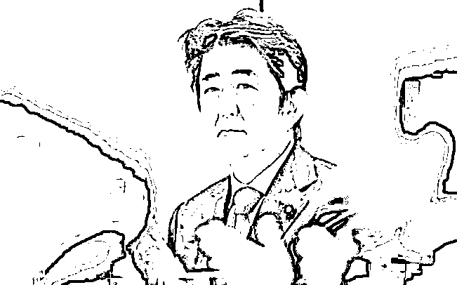

# 安倍死了，国内跳出一批孝子贤孙！

> 原文：[`mp.weixin.qq.com/s?__biz=MzIyMDYwMTk0Mw==&mid=2247539699&idx=5&sn=8a82e424ea0151b78a1bae78058865c7&chksm=97cb90cba0bc19dd31d68107a8756e1ff9eaa505f2ca753186cf01c0f81e8f8835c0aee1e839&scene=27#wechat_redirect`](http://mp.weixin.qq.com/s?__biz=MzIyMDYwMTk0Mw==&mid=2247539699&idx=5&sn=8a82e424ea0151b78a1bae78058865c7&chksm=97cb90cba0bc19dd31d68107a8756e1ff9eaa505f2ca753186cf01c0f81e8f8835c0aee1e839&scene=27#wechat_redirect)

昨天到今天，安倍遇刺身亡都是绝对的热点。

[`mp.weixin.qq.com/mp/readtemplate?t=pages/video_player_tmpl&action=mpvideo&auto=0&vid=wxv_2478132261583028224`](https://mp.weixin.qq.com/mp/readtemplate?t=pages/video_player_tmpl&action=mpvideo&auto=0&vid=wxv_2478132261583028224)

**安倍晋三这个人，在中国人民心中并没有什么好形象。** 所以，安倍遇刺身亡之后，人民群众纷纷表达了自己的想法和看法。 话风如下：说客观点，一个人被刺杀了，能让成千上万的人都嚷嚷着“开席”。**再说这个人自己没问题，那就是不尊重客观事实了。**回首安倍执政的这些年，作的恶真的是有目共睹。 咱就先不说安倍晋三执政 2799 天，逐步推动修宪，企图把把日本改造成战争机器，严重危害地区安全； 也暂且不提安倍把美国力量引入亚太地区，插手台海问题，人为制造地区不安； 也先把安倍主张以邻为壑，把核废水排向大海，重启核电站这个恶劣问题放在一边。 **就说一下安倍和中国人民之间的恩怨。**从他出身说起：外祖父，岸信介，日本侵华战争甲级战犯，右翼势力鼻祖，阻碍中国统一，往中国大规模输送鸦片。这种“家学”余毒，一点一滴很好地反映在了安倍晋三执政理念之中。到了安倍晋三，他把侵华那些罪犯奉为“民族英雄“，推动篡改教科书，否认侵华战争，美化日本法西斯行径。 2015 年，安倍第二次上台后不到半年,就在国会修改教科书审查标准，将钓鱼岛和独岛都称为是“日本固有领土”，并更改了对南京大屠杀的表述。在“慰安妇”问题上，安倍将日本政府的态度塑造得十分强硬，声称在这一问题上日本无责，无需道歉，且再也不会有一毫米的让步。 而在涉及我们主权核心利益的“钓鱼岛”问题上，在安倍的主导下，日本人非常嚣张，扣留中国渔船，甚至多次叫嚣要登岛。在中国人最为痛恨的“参拜晋国神社”问题上，安倍以一手之力挑战中国人的敏感神经： 在任期间不仅多次参拜，还在 2016 年 10 月，2017 年 10 月，2018 年 4 月，2019 年 10 月,2020 年 4 月向靖国神社供奉祭品。**故意挑战中国人神经。**即便是在辞去首相职务后，安倍于 2020 年 9 月、10 月以及 2021 年 4 月、8 月分别参拜靖国神社。2022 年 4 月 21 日，安倍晋三最后一次参拜靖国神社。**完全摆出一副“我就喜欢看你打不到我还不爽的”模样！**凡事有因必有果！ 现在网络上针对安倍晋三被刺的“欢声笑语”，不是无风掀起的浪，不是无缘无故的恨。总而言之，言而总之，就一句话： **中国人民不欢迎（喜欢）安倍！**然而，令人不解的是，在大多数人都在声讨安倍的时候，有一些中国“理性怪”却跳出来，批评中国人素质低，没人性。比如，著名“骑墙派”老胡就公开发言： “需要把与他之间的政治纠葛放到一边”。 有不少人也附和： 是的，首先，他是个生命。 说老胡是个“有良知的人”。**这话说的，好像广大网友似乎都“没有人性”，也没有良知。****只有他们有这种“悲天悯人”的圣人之心。****但问题是，我们评价一个政客，评价一个连历史都要篡改的人，难道要去捂着眼睛，昧着良心不去看他的恶？**安倍晋三，对于中国人来说，如果不是他对中国人作恶多端，谁知道他是谁呀？！ 日本每天死那么多人，谁没事儿去抨击日本人呢？至于有些人说，他首先是个生命，是个“长者”，是个“优秀的政治家”。 我觉得纯粹是放狗屁。暂且不说，他配不配得上“长者”这个敬词，是不是“优秀”的评价，就这话的逻辑就有问题：**我们看问题说事情，难道能仅仅停留在“首先”这么肤浅的层次？**没有人不尊重生命。安倍刚出生的时候，并没有人想着当时就把他溺死在尿罐里。但他后来真的做了那么多让中国人无法释怀，不可忍的事儿。凭什么现在让中国人放下过去，只看到他是个老人？！做了坏事儿，能一笔勾去？ **这种“共情”安倍的心理，本质上就是又当又立！**更让我震惊不已的是，对安倍之死“哭丧”的孝子贤孙，还真是不少。有些人还是受过这个国家高等教育的高级知识分子，居然最终得出的结论是： **我为我的民族感到羞耻！**他妈的，这是什么狗日的逻辑！震惊之余，其实还有很多无语。一个驻日本的记者曾女士，在连线报道安倍遇袭事件时，她居然抑制不住伤心，难过得哭了出来。 

[`v.qq.com/iframe/preview.html?width=500&height=375&auto=0&vid=j3346mugsng`](https://v.qq.com/iframe/preview.html?width=500&height=375&auto=0&vid=j3346mugsng)

哭了还不算完，还要用白纸黑字为安倍之死尽一点“孝心”。 在日本人都没说话的时候，在没有掌握任何证据的前提下，就把刺杀归结为“恐怖主义”。这表孝心，表得是不是有点难过分？ 果然，没有任何意外，她的评论区很快沦陷了： **其实，这并不意外！****在任何一个国家，任何时代，任何民族，吃里扒外的东西，都为人所不齿！** 现在就真的很奇怪，安倍死了： **日本人未哭，反倒是有一群中国孝子贤孙先去哭丧，哭得昏天暗地，一塌糊。**安倍遇刺的时候，其他国家电视台都紧急切换新闻，关注“安倍遇刺身”。 而东京电视台却安之若素，播放着“美食料理”。即便是在确认安倍死亡的新闻发布会上，日本人也笑得合不拢嘴。 而且，据说人家日本人自己也是在新闻下方纷纷盖楼，历数安倍不对之处。 更尴尬的是那些在日本，自己加戏把自己感动哭了的人，干嚎了两声，才发现不对劲儿。 为啥自己如丧考妣，身边的日本人反倒觉得事不关己？ **不觉得奇怪么？** **这些哭安倍的中国人，没见他们在铭记国仇家恨这事儿上多有出息，反而是为安倍吊丧哭得很是积极。**我现在有点明白，为什么就算是国内毒教材，国内都有人硬着头说： 那是美学，那是合理！ca！现在是和平年代，如果日本再有事与我中华，这些人会不会偷偷在后方举起膏药旗？原谅我今天行文用语有点粗俗，原谅我对安倍之死表示咎由自取。我在此声明： 这可能是我个人素质问题，跟国家没有关系。**我实在看不惯这种，****“只许安倍反华，不许人民高兴”****的混账逻辑。**实际上，中国人向来也不是这样小肚鸡肠，更不是像有些人说的那样脑残无知。**我们这个民族几千年了，论智慧，论礼仪，论素质，都还轮不到那些安倍的孝子贤孙来说三道四。** **更不要说“以自己的民族为耻”这样数典忘祖找骂的话！**同样是外国人，白求恩逝世的时候，中国人怎么说？**举国哀悼，纪念白求恩！**就算同为日本人，同样为昨天去世的漫画作家高桥和希，还有不少中国人去寄托哀思。 但为什么就偏偏对安倍晋三大家纷纷表达不一样的态度呢？ 说白了，中国人的待客之道非常朴素：**“朋友来了有美酒，敌人来了有刀枪”。****否则，以德报怨，何以报德？**网上有人自觉圣母，什么都没说，就先说“抛开安倍的政治行径不谈”。**而这不就是扯淡？！**抛开他的政治言行是非不谈，那谈什么？难道谈对安倍的感情和理解？不去叫年年拜鬼意图篡改历史的政客反思，反而让自己的同胞反思，这是什么逻辑？ 不去声讨一个罪行不可磨灭的人，反而让大家忘记他的罪行尊重他这个人。 这不净扯淡？这不是强正常人之所难？最后，用那些圣母婊和反思怪的逻辑说一下： 希望安倍能放下仇恨，原谅枪手。人都死了，就不要揪着过去不放！更要自我反思一下，为什么现场那么多人，只有你一人被打了呢？**而且，还是两枪！**********

← 向右滑动与灰产圈互动交流 →

