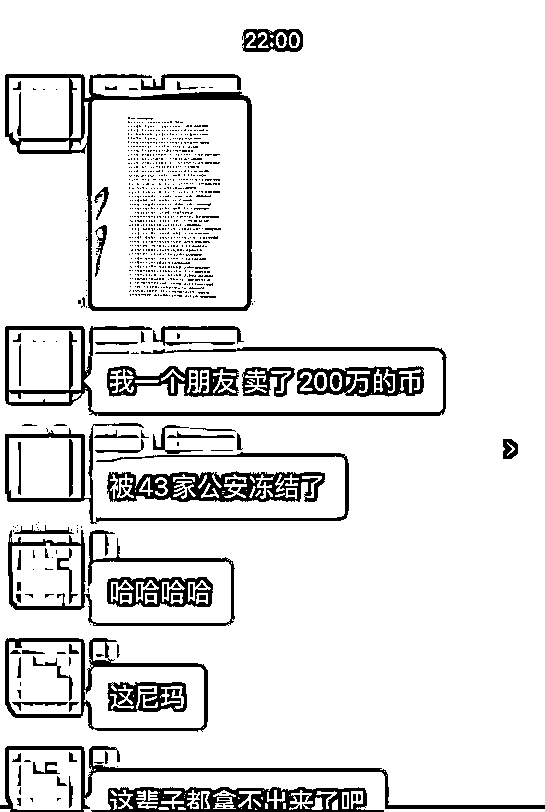

# 在某头部交易所卖 USDT 被 18 家公安冻结，炒个币容易吗？

> 原文：[`mp.weixin.qq.com/s?__biz=MzIyMDYwMTk0Mw==&mid=2247539699&idx=6&sn=782e99beb95fb2ff24cc5e3e6632a5e5&chksm=97cb90cba0bc19dd1a4092870f31794c51fe3677ea44afb45bea9bbbb09882ba5743b30e19a6&scene=27#wechat_redirect`](http://mp.weixin.qq.com/s?__biz=MzIyMDYwMTk0Mw==&mid=2247539699&idx=6&sn=782e99beb95fb2ff24cc5e3e6632a5e5&chksm=97cb90cba0bc19dd1a4092870f31794c51fe3677ea44afb45bea9bbbb09882ba5743b30e19a6&scene=27#wechat_redirect)

最近，某位粉丝找百晓生说，他在某头部交易所买了 6 万块钱的 U，结果，被 18 家公安机关联合冻结了银行卡。

这个粉丝之前也是看过百晓生文章，卖的时候选择的 Usdt 的价位也不是最高的，选择的 OTC 币商也是一个交易量很高的币商，此币商是去年年底注册的，没想到，这都被冻了卡。 

你以为 18 家很多，之前还有个大佬，直接被 43 家公安冻结。

为什么会冻卡？

如今虚拟货币火热又成了跨境洗钱的工具。不法分子利用交易所洗黑钱相信哪个交易所都有发生？在币圈通过资金盘传销币以及地下钱庄非法获得的钱财都需要交易所变现，那么这个过程就是“洗钱”的过程。

多久能解冻？

百晓生这边遇到的有 24 小时解冻的，也有三天后解冻（不包含休息日），甚至更长时间，因为每笔涉及的资金严重性不一样。解冻的时间也会不同。

印象中，国内币圈最早冻卡应该在 2013 年，从年初不到 100 元到年末 8000 元，近百倍涨幅让这个小圈子沸腾起来。

野蛮生长下，各种乱象频发，gbl 交易平台跑路，警方冻结涉案资金，部分来往密切的银行卡也受到了不同程度的影响。

2013 年 12 月 5 日五部委发文后，2014 年 ok、比特币中国、火币等交易所取消直接充值企业账号方式，回归原始币圈状态，想入金需要充值给平台员工账户，在被做空交易者密集举报后这些账户也都 gg。

那是个空军只要举报，哪怕是造谣也会下跌的时代背景。

## 之后充值码出现

币圈的出金入金从此一直是猫鼠游戏，直到充值码的出现，印象中是比特时代首创。

代理商交保证金后可以 99 购买面值 100，再 100 卖给平台用户们。

这个充值码有时候因为行情好，交易者着急进场也会有溢价情况，是不是感觉有点像 usdt？

第一代 otc 场外交易商就是这些平台的代理商，大平台“可能”还是平台员工在充当代理商，像比特时代当时基本都是玩家做代理商，可以说是比较硬盒了。

我的一个朋友就是代理商，因此知道不少奇葩用户、暴富传奇、赌徒故事，他也是最早被冻卡那批人。

时过境迁，当年和现在当然是不可同日而语。社会对于比特币的接受度也在提高，过去基本没人知道比特币，现在起码经侦警察基本都知道比特币，甚至还炒币。

## 个人经历

我的第一次冻结卡是当我使用支付宝绑卡支付，付不出钱的时候，登陆网上银行可以看到余额但是不可用。

第一个弯路：电话联系银行，答复是查询不到要去线下银行网点。

第二个弯路：去线下银行网点查询结果是：司法冻结。柜员看我的神色怪怪的，我解释给他听:可能是我卖的比特币，给我钱的人资金有问题，然后又解释什么是比特币、什么是数字货币、什么是中本聪和区块链，从占拜庭聊到哈耶克。

直到柜员小姐姐劝我远离传销为止。孙宇晨说忘不了王小川采访他时那种看骗子的眼神，那时我是非常理解孙宇晨的，当时在银行我也有这种窘迫的感受。不同的是我感觉：柜员小姐姐认为比特币是传销，而我是受害者。

遇到冻结，最先做的应该是：查询冻结原因和冻结方是哪个地区的警察，如果有联系方式问一下就可以了，不要和柜员多 bb。冻结这件事有错误的是资金方，你是受害者，不需要解释给别人听。

目前买卖比特币在法律层面是不违法的，积极联系警方，大部分发达地区还是很容易解冻的，一般资金少涉案人数多是 3 天后自动解冻。

如果你收到的钱涉及敏感问题、涉案金额比较大、资金流向靠近第一手黑钱等，那么一般是半年，半年后续冻。

有群友被冻半年后每天去银行尝试取现，最后有拿回来的，说明可能不完全是自动续冻，可能部分地区不是这样。

黑钱普遍是电信诈骗，理论上能够结案就会解冻。

如果涉恐涉毒涉赌行贿等敏感问题比较棘手，最多现在有超过两年没解冻的。电信诈骗分子骗钱后会转移，资金会从受害者 a 到 b 到 c 到 d 这样，你距离第一手 a 越近解冻难度越大。

联系警方，常见的有以下几种

1、让你传资料类似手持和声明等，大部分一个月左右解冻。

2、让你到异地配合调查，偏远地区为了追求破案进度，有可能关你一段时间。

3、主动上门找你的，这种还算好，不过一般都是需要结案后解冻。

4、让你等待破案。

5、告知你 xx 天后自动解冻。

想提前解冻一般需要偿还电信受害者的资金，个人不推荐，毕竟法律层面你没有过错。这里还有个资金周转利用的情况，也要看每个人实际情况做判断。

菠菜网站、外挂平台、色情网站、电信诈骗、黑客盗取资金、传销资金、涉恐敏感资金。

这么说吧，币圈黑钱态势越演越烈。

你在充钱炒币，他们在利用你洗黑钱。

## 防冻结思路：

刚出金一般不会马上冻卡，往往需要几天几周甚至几个月后你发现卡冻结了，涉及币圈业务的卡专卡专用。

所以，出金卡不要搞成常用的生活卡、工资卡、股票卡等等。

另外：涉及币圈的卡提现出金前先尝试往支付宝充值 1 元钱，看看被没被冻结再提现出金。

真的有很多倒霉蛋在不知道卡已经被冻结的情况下，往被冻结卡转钱

防冻基本步骤：

1、出金提现完尽早转到其他银行卡、股票账户、理财账户里。

（一般转入地方性银行会安全。比如锦州银行、铁岭银行这些只有当地有。这些落后地区地方银行很难弄异常冻结手续，警方冻结需要去银行当地，考虑部分币友出金金额还没有机票贵，一般不会特意跑去冻结你的。）

2、出金提现完尽可能去银行取现后再转存其他安全卡。如果身体条件允许，可以取完换家银行存，注意别被抢了。

3、出金提现完，去银行取完钱转存到父母妻子丈夫的卡里。

4、选择平台认证商家，最好看其注册时间，交易量可以造假，注册时间不能造假。

终极防冻：几乎百分百不被冻卡，遵法守法是王道，切勿因小失大小额出金防止遇到黑钱冻结方案 

1、平时消费用信用卡，钱到账还信用卡。

2、先借一下借呗等金融工具到正常卡里，再用币圈的钱还借呗。

3、还可以用支付宝口令红包，发口令红包给亲人账号，记得口令设计的复杂一点。

4、让老婆/老公申请淘宝店，你去拍商品，可以发空包快递。

注意：遵法守法是王道，切勿因小失大。根据定义，黑产的所有赚钱的途径都已经写入刑法里了，请勿尝试。

来源：百晓生道破盘界

← 向右滑动与灰产圈互动交流 →

