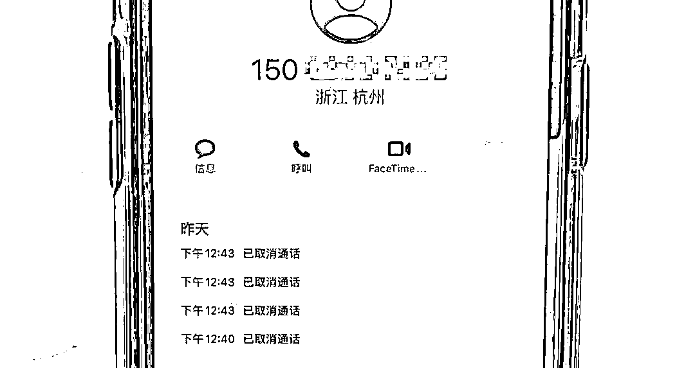
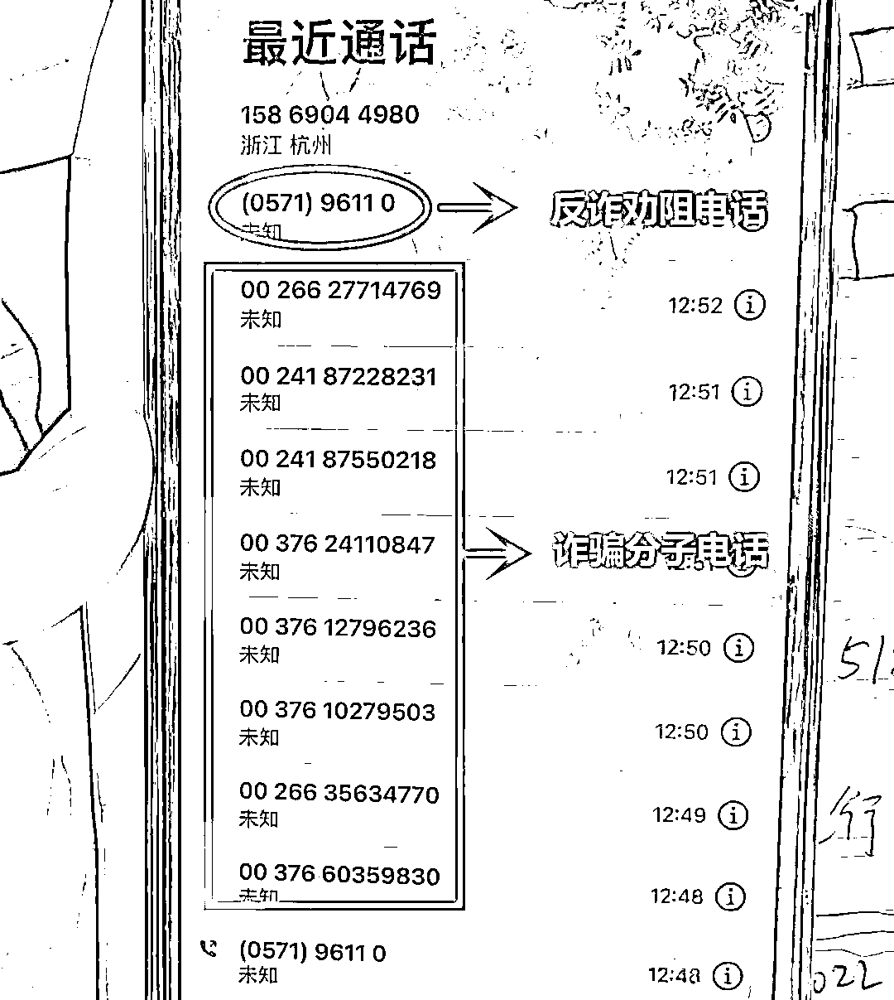
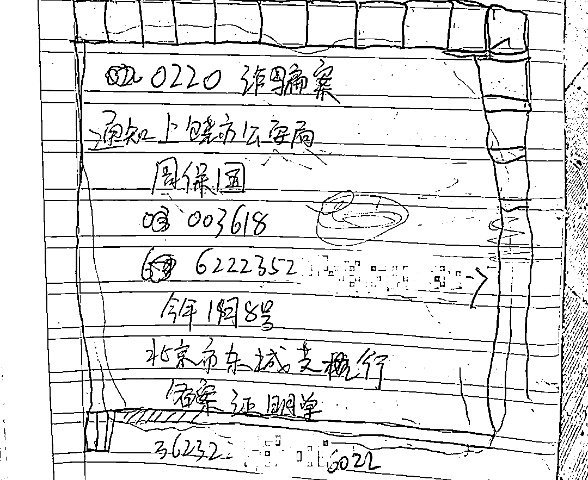
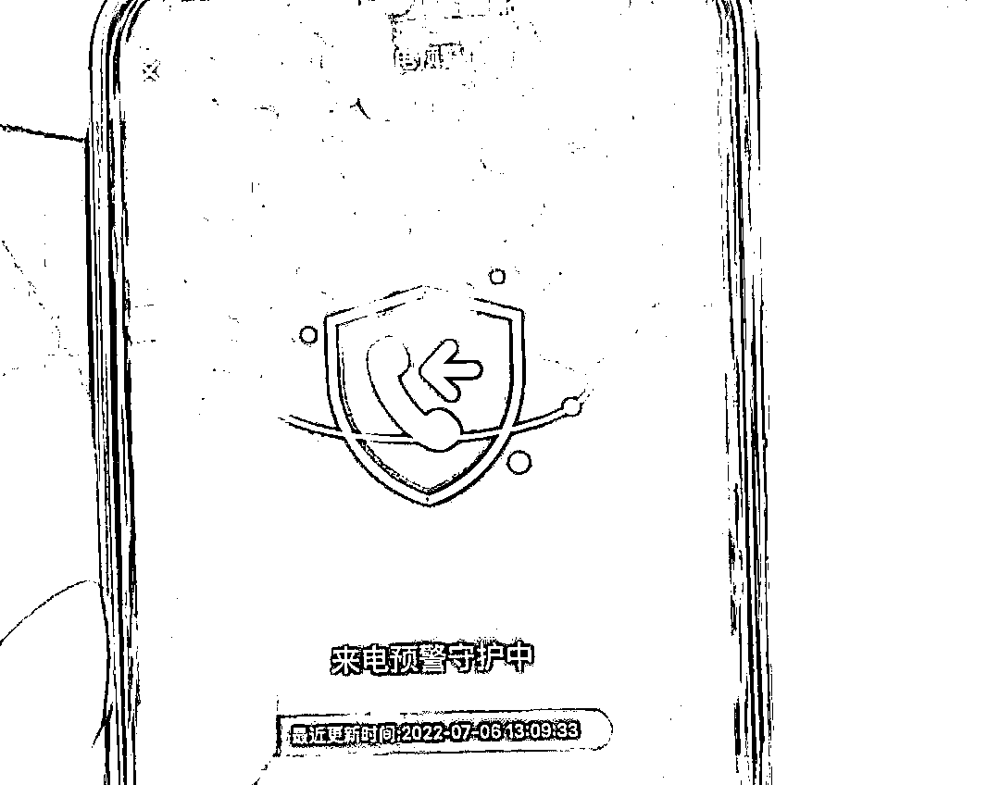
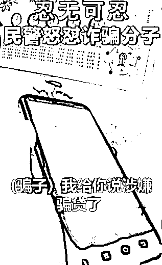
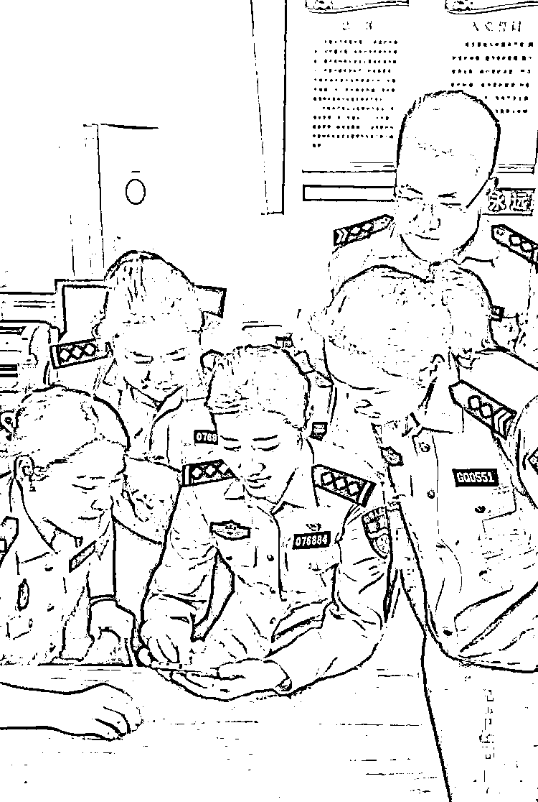
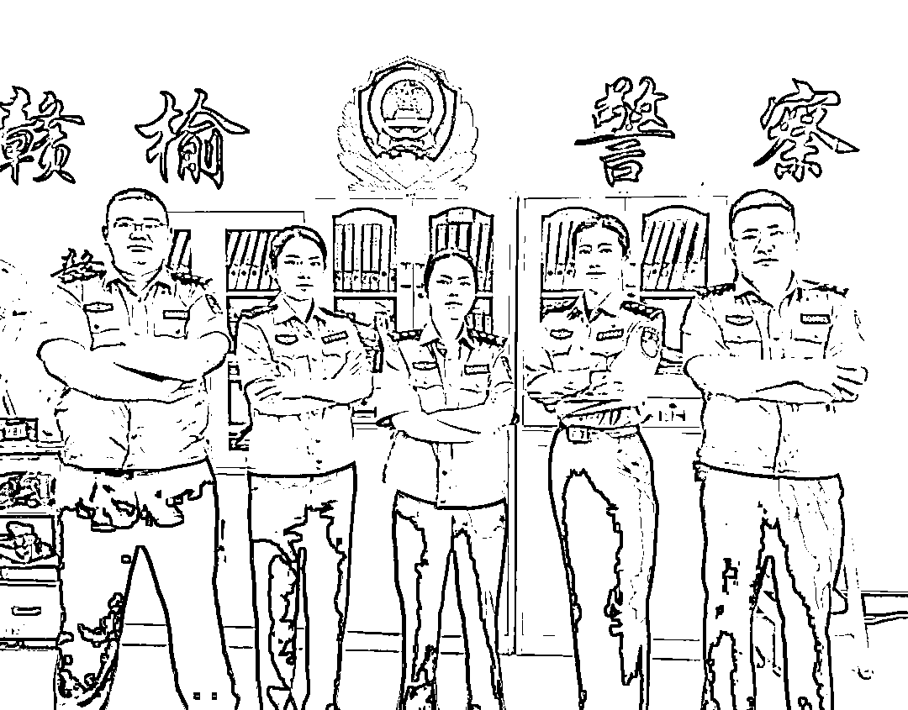
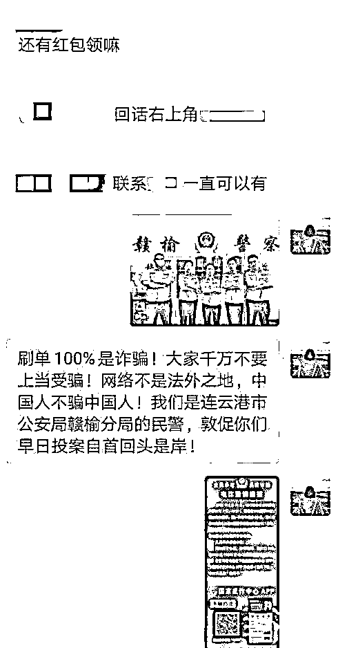

# 反诈民警到底有多拼？

> 原文：[`mp.weixin.qq.com/s?__biz=MzIyMDYwMTk0Mw==&mid=2247539699&idx=7&sn=fbddef7fa2a84d33bcf17b8118c56900&chksm=97cb90cba0bc19dd0949c64be56e8b49111971bf50b2f89e9508b1d01425e7c6015bdf216e9e&scene=27#wechat_redirect`](http://mp.weixin.qq.com/s?__biz=MzIyMDYwMTk0Mw==&mid=2247539699&idx=7&sn=fbddef7fa2a84d33bcf17b8118c56900&chksm=97cb90cba0bc19dd0949c64be56e8b49111971bf50b2f89e9508b1d01425e7c6015bdf216e9e&scene=27#wechat_redirect)

**近日，一名女士遭遇冒充“公检法”诈骗，民警 5 分钟拨出 11 个电话，争分夺秒和骗子争抢“通话权”，最终成功保住受骗女子 3 万元。**

7 月 6 日中午，浙江省杭州市公安局余杭区分局仁和派出所接到紧急预警，辖区居民刘女士可能正在遭受电信网络诈骗。反诈专班第一时间拨打刘女士电话，同时立即指令民警上门开展劝阻工作。 

经多次拨打，刘女士的电话始终处在通话中，民警立即向分局反诈专班申请保护性止付等操作，并持续拨打刘女士电话。

反诈专班人员连续拨打刘女士电话

几分钟后，刘女士总算接通了电话，“喂您好，是刘女士吗，我们是仁和派出所的，您可能正在被诈骗……”**还没说上几句话，电话就再次被呼叫转移**，仁和所立即再次进行操作，**与骗子争抢对刘女士的“通话权”**。

通过几次的挂断、重拨，民警终于再次拨通了刘女士的电话。电话那头的刘女士声音颤抖，呼吸急促，她说自己刚才接到了一个电话，**对方自称是江西上饶市公安局的民警**，叫“周保国”，还报出了警号。

听到这里，民警立即明白过来，这是一起典型的**冒充****“公检法”诈骗**，“不要再接这个电话了，你待在原地，我们民警马上就到！”

民警到达现场时，刘女士仍有些惊魂未定，“我的个人信息他全都知道！而且他一上来就说自己是上饶的民警，我老家就在上饶，他能说出我的信息，我就很相信他了！”

随后刘女士拿出了一张纸，上面记录着“单位”“姓名”“警号”等信息。刘女士说，**这些都是对方“民警”的信息**。

随后，她向民警展示通话记录里一长串“00 开头”的电话号码，“**他们给我打了好多电话，我以为一定是有什么急事呢！**”每通电话的间隔都不超过 1 分钟。民警也看到，**有多个“96110”的未接电话**。

刘女士说，对方还给她寄来了法律文书，问她有没有收到。“说得好吓人，我都被他弄懵了，**然后又说我的身份信息被冒用了，涉及一起 200 多万元的诈骗案，需要我配合调查**，他的口音很正经，跟你们现在说话一模一样。”刘女士向民警说道。

“我当时真的吓坏了，迫切地问对方应该怎么操作！”刘女士说，**对方告诉她需要将自己的钱转到一张指定的银行卡里，以此来洗脱自己的嫌疑**，让她抓紧时间拿着身份证和银行卡去转账，否则就要去抓她。

然后，对方又要求刘女士下载 QQ，再次劝说她先转钱，正当犹豫之时，刘女士接到了仁和派出所民警的电话，**这才有所醒悟**。

民警向刘女士分析诈骗套路，对方先是利用老乡的身份获取信任，后编造一些案件让受害人产生担心害怕的心理，然后提出解决方案假装为受害人提供帮助，让受害人在心理上更依赖和信任对方，**最后使出“杀手锏”，就是提供账户让受害人转账**。

民警提醒刘女士，**公安机关绝不会简单通过电话办理案件**，并帮助刘女士下载了国家反诈中心 APP。

幸好及时劝阻，刘女士没有遭受财产损失，**成功保住了银行卡里的 3 万余元**，她对劝阻人员的耐心解释和宣传教育表示由衷感谢。

其实 

在日常生活中 

这样的场景经常上演

除了疯打电话

蜀黍还有哪些防骗“绝技”呢 

下面 

让小编带你们一起看看

人民警察为了不让你受骗

能有多拼

**怒怼骗子**

[`mp.weixin.qq.com/mp/readtemplate?t=pages/video_player_tmpl&action=mpvideo&auto=0&vid=wxv_2473259175598096386`](https://mp.weixin.qq.com/mp/readtemplate?t=pages/video_player_tmpl&action=mpvideo&auto=0&vid=wxv_2473259175598096386)

近日

重庆市公安局南岸区分局

天文派出所民警马继松

通过辖区群众反映的线索

及时劝阻了一起网上贷款

并冒充公检法的双重电信诈骗

为当事人王女士保住了 2 万元

其间

骗子质疑起民警的身份

**民警当场怒怼**

**“你当演员当上瘾了吧”**

当日某店铺老板张女士

给民警打电话

称其担心店内员工王女士可能被骗

原来

王女士最近急需用钱

一直在关注各类贷款信息

当日在网上碰到一个

自称可以办理优惠贷款的陌生人

便添加了对方 QQ

骗子引导王女士填写了

所谓的“网上合同”

并称已成功办理了贷款

需要转 2 万元到指定账户完成手续

否则就是违约，将会被起诉

随后还发送了一段经过篡改的视频

视频里的“警察”称王女士涉嫌违法

看了视频

她准备按对方要求转钱

民警拿过手机向骗子发出警告

对方居然要求出示警官证

民警当即怒怼

随后骗子心虚挂断电话

王女士终于明白自己是遭遇了骗局

对民警感激万分

**用横幅讲故事**

[`mp.weixin.qq.com/mp/readtemplate?t=pages/video_player_tmpl&action=mpvideo&auto=0&vid=wxv_2477594060623544323`](https://mp.weixin.qq.com/mp/readtemplate?t=pages/video_player_tmpl&action=mpvideo&auto=0&vid=wxv_2477594060623544323)

浙江宁波的一网友

拍下了近百字的反诈横幅

讲述了王女士被骗 80 万的全过程

视频拍摄者还绘声绘色地

全程读了出来

网友：蜀黍生怕你不好好看

“按头安利”了这属于是

**潜入诈骗群**

[`v.qq.com/iframe/preview.html?width=500&height=375&auto=0&vid=a33421w2477`](https://v.qq.com/iframe/preview.html?width=500&height=375&auto=0&vid=a33421w2477)

江苏连云港的一名民警

接到一个境外电话

对方称民警的社交账号较活跃

只要进群就可以

免费抽取流量和现金

根据工作经验

民警判断，这是诈骗电话

随即加了对方微信好友

进群与骗子“过招”

手机屏幕的两端

**一端是骗子在卖力表演**

**一端是一群警察在默默围观**

正如民警们所料

经过一番“洗脑”后

骗子开始诱导群内成员

下载某款 App 进行刷单

随后，民警把群里每个微信头像

都点开查看朋友圈信息

发现基本上都是骗子的小号

还有几个不明身份的网民号

**这就是典型的刷单做任务的诈骗群**

民警判断

这个刚刚组建的 37 人“刷单群”

90%以上都是骗子

**眼见有人可能上当受骗**

**民警立即在群里发了一张照片**

同时发布预警信息

提醒大家谨防刷单诈骗

正面喊话骗子立即收手

看到照片后

**骗子瞬间气急败坏**

**把民警踢出了群聊**

但此时民警已经将

这个涉嫌诈骗的微信群

举报给了客服申请封群

相关情况正在进一步调查中

**用纪录片方式打开宣传片**

[`mp.weixin.qq.com/mp/readtemplate?t=pages/video_player_tmpl&action=mpvideo&auto=0&vid=wxv_2477604930061697024`](https://mp.weixin.qq.com/mp/readtemplate?t=pages/video_player_tmpl&action=mpvideo&auto=0&vid=wxv_2477604930061697024)

“高端的骗术

往往只需要最简单的手法......”

安徽滁州警方原创短视频

《“舌尖上”的诈骗》

**用《舌尖上的中国》拍摄手法**

**向大家讲述投资理财诈骗的套路**

**冒充骗子**

“你好

我是湖北省武汉市公安局的民警

刚刚我们接到了中国银保监会

下发的一条核查信息”

……

湖北经济学院法商学院

大一新生张美琪接到了

一通“警方”来电

称其银行卡涉嫌洗钱犯罪

如果不及时配合处理

将被列为网逃

这通看似冒充公检法的

电信网络诈骗来电

其实是由

湖北省武汉市公安局江夏区分局

藏龙岛派出所教导员邱波拨打的

不法分子为了获取不义之财

冒充成公职人员的诈骗手法

屡见不鲜

**民警为何要费尽心机冒充骗子**

原来

为了筑牢新生们的防诈骗意识

**警方和学校一起**

**量身打造了一套“以诈反诈”测试方案**

**以冒充公检法诈骗为剧本**

**在每个班“抽样检测”**

“喂，老师

我刚才接到诈骗电话了”

…… 

挂断电话后

张美琪立即将情况报告给了辅导员

“这是我们在对你进行反诈测试

恭喜你通过了”

菜市场安插反诈顺口溜

鸡蛋上印反诈标语

开展反诈相声专场

……

**蜀黍们在反诈的“战场”上**

**使出了“十八般武艺”**

**只为帮你抵挡住** 

**来自骗子的伤害** 

**哪怕只有一点点的可能**

陈星 摄

不过 

反诈也是“两厢情愿”的事 

希望屏幕前的你们 

能跟蜀黍共同努力

**对诈骗案例能够熟记**

**对陌生电话多份警惕**

**对转账汇款非常谨慎**

**对蜀黍提醒能常想起**

你还知道哪些 

反诈民警够拼的招数 

咱们评论区见吧

## 

## 

来源：余杭公安 重庆法治报 滁州警方连云港警方 铁骥视频 长江日报

← 向右滑动与灰产圈互动交流 →

