# 不敢相信北大洪教授猥亵女生，不敢相信这行为也有“师承”

> 原文：[`mp.weixin.qq.com/s?__biz=MzIyMDYwMTk0Mw==&mid=2247539786&idx=1&sn=68a334542cd663c4c03dfc15edaf151d&chksm=97cb9772a0bc1e642053942f9626105f1a1de034a6a82c2d60158319cc747c947945366b6604&scene=27#wechat_redirect`](http://mp.weixin.qq.com/s?__biz=MzIyMDYwMTk0Mw==&mid=2247539786&idx=1&sn=68a334542cd663c4c03dfc15edaf151d&chksm=97cb9772a0bc1e642053942f9626105f1a1de034a6a82c2d60158319cc747c947945366b6604&scene=27#wechat_redirect)

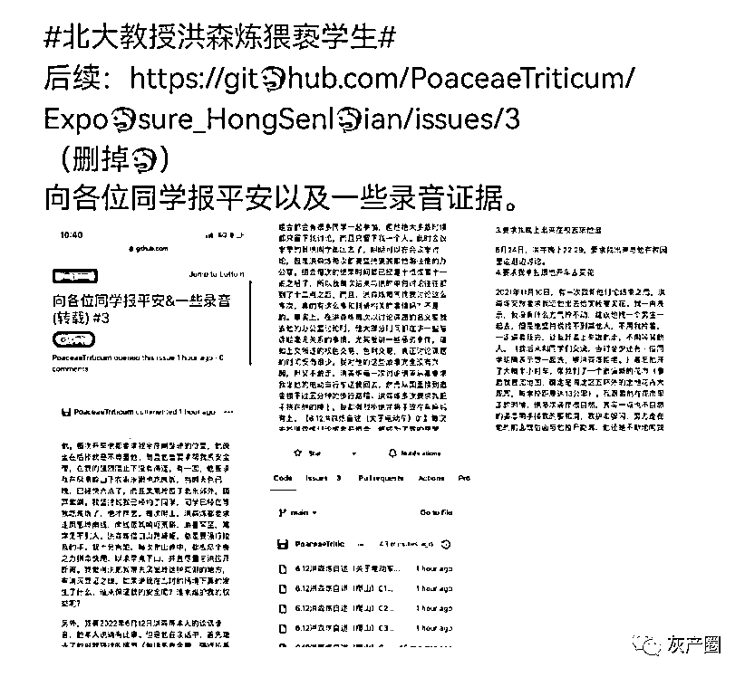

2019 年 12 月上中旬，国内名校北大和上财相继通报处理了师德败坏事件，当事人均受到了严厉的惩处。 

12 月 2 日，一女子在网上爆料称，“北大数学中心”一助理教授冯仁杰与多名女子发生不正当关系。

9 天之后的 12 月 11 日，北京大学通报：经查，冯仁杰作为高校教师，严重违反师德师风，违反了《新时代高校教师职业行为十项准则》等等相关规定，造成恶劣影响。根据《教师法》等相关规定，经研究决定，撤销冯仁杰教师资格，取消其有关人才计划入选资格，报上级部门批准；取消其研究生导师资格；予以解聘。

事实上，当时《新时代高校教师职业行为十项准则》颁布才 1 年多。该准则第 6 条明确规定，“不得与学生发生任何不正当关系，严禁任何形式的猥亵、性骚扰行为。”

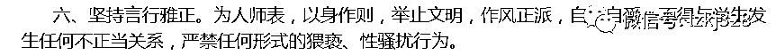

但准则根本阻止不了叫兽们的流氓行为。

北大女生举报禽兽教师 4 天后的 12 月 6 日，上海财经大学会计学院一名硕士生在社交平台举报上海财经大学会计学院副教授钱逢胜涉嫌性骚扰。当日晚间，上海财经大学官方微博发布声明称，已成立调查组就相关情况展开调查工作。

12 月 9 日晚，上海财经大学公布对副教授钱逢胜处理结果。决定给予钱逢胜开除处分，并按程序报请上级部门批准；撤销其副教授专业技术职务；撤销其教师资格。

当时两家大学均表示，他们高度重视师德师风建设，对违反师德师风的行为始终坚持零容忍的态度，一经查实，绝不姑息。

几天后的 2019 年 12 月 16 日，教育部等七部门印发《关于加强和改进新时代师德师风建设的意见》，再次提出要大力提升教师职业道德素养。

教育部官员发声：教育部一直高度重视师德师风建设，对极个别教师性骚扰学生等侵害学生身心健康的行为“零容忍”。

昨天（7 月 10 日），又有北大女生发文，称“在校内多次遭到北京大学医学部教授洪某炼猥亵”。

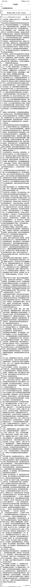

这是官网对被举报老师的介绍： 

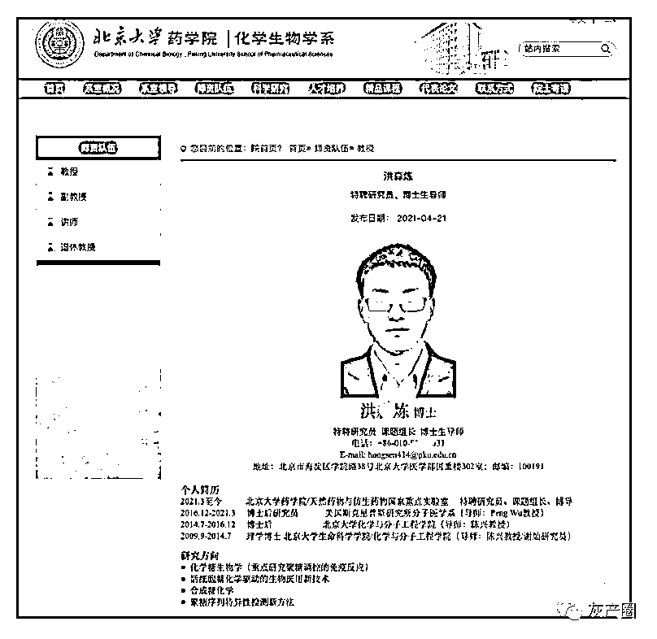

随着事件的发酵，今天凌晨 02:06，北京大学医学部教职工职业道德和纪律委员会办公室在北大未名 BBS 上回应称，针对药学院某同学举报导师的情况，医学部高度重视，已成立专项调查组，已完成初步调查。该同学的导师已报警，医学部及学院将全力配合警方调查。目前，医学部教职工职业道德和纪律委员会正开展全面调查，将尽快回应师生关切。

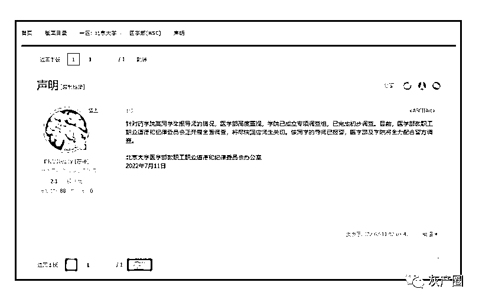

这件事还在发酵。

网友@抱紧我的草莓奶盖：#北大教授洪森炼#？？？我真的是服了，不过确实震惊，那可是北京大学，无数学子向往的大学，现在爆出性骚扰一事，迟迟不出来澄清或者是公布对这位教授的惩罚，我个人比较倾向于心虚，毕竟这种有损校园名誉的事情，不尽早澄清，反而是躲在互联网背后，颇有些掩耳盗铃的味道，根本不敢想象，这是中国出名大学之一，是双一流，是其他大学的榜样，代表，如今却被爆出如此不耻之事，难道是在引导这般风气吗？

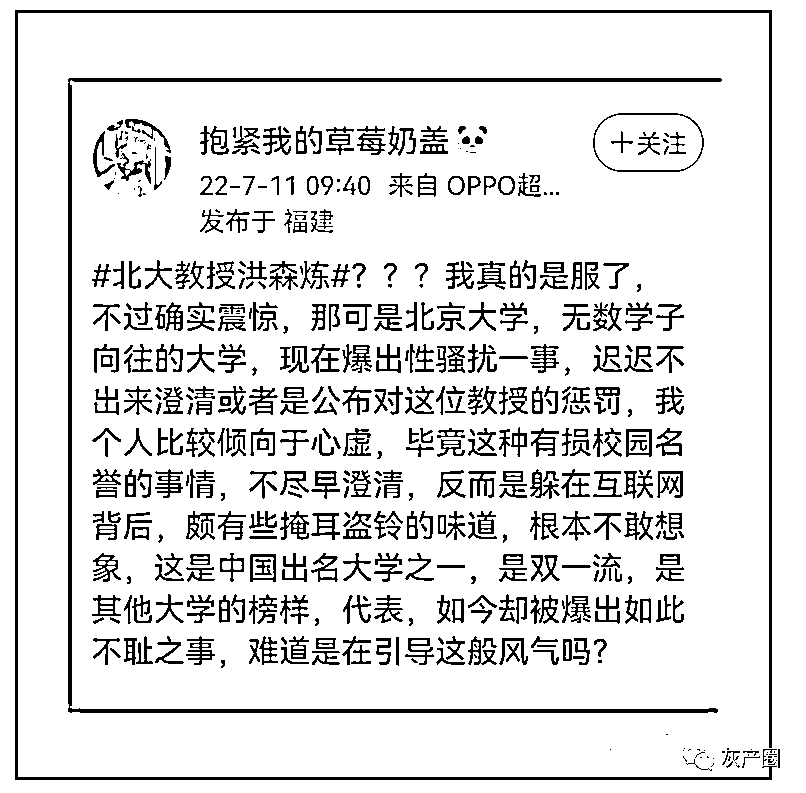

网友@沈宸玖：#北大教授洪森炼被指猥亵学生#牛逼？刷热搜刷不上去这么久了不正面回应是因为去买别的热搜压吗？贵校难不成就是这个态度对待大家？以后人才怎么敢进去！

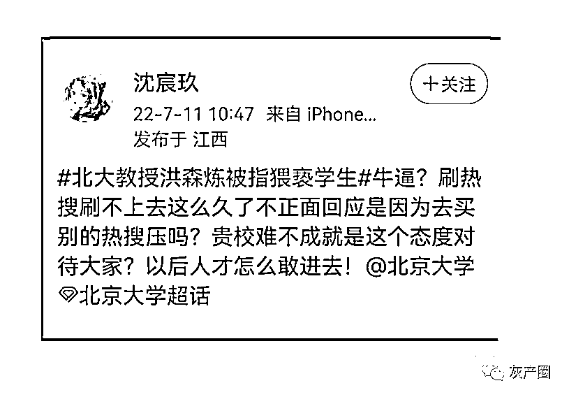

网友@喜饼还是三明治：#北京大学#作为中国的最高学府之一，面对这样残酷的事情不发声，不给社会公众一个彻查，真的让人对你这所大学挺失望的，纸是包不住火的！压热搜是没有用的！及时处理这件事情！及时给公众一个真相！

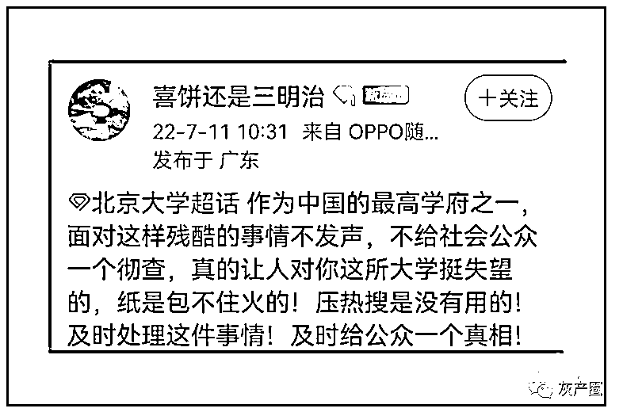

有网友庆幸自己很幸运。

网友@luckyforever2011: 非常幸运，一路走来，女导师女领导，就连合作也是跟开朗的女性更合拍～从而在这个 shithole 得以心理健康。

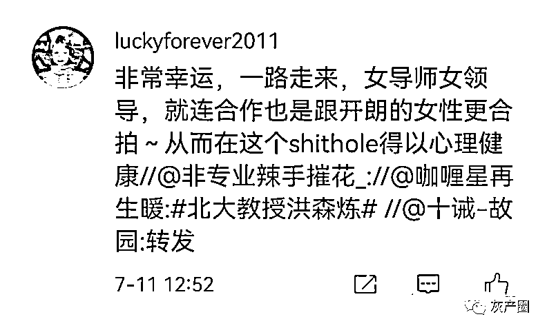

高校教师性骚扰女生，早已不是什么新闻。为了遏制住这股骚气，2018 年 11 月，教育部颁布了《新时代高校教师职业行为十项准则》，提出教师要有道德情操，有仁爱之心，要遵守法律法规，不得违背社会公序良俗，要言行雅正，自重自爱，不得与学生发生任何不正当关系，严禁任何形式的猥亵、性骚扰行为。

2019 年 12 月 16 日，教育部等七部门印发《关于加强和改进新时代师德师风建设的意见》，再次提出要大力提升教师职业道德素养：针对高校教师性骚扰学生等开展集中治理。一经查实，要依规依纪给予组织处理或处分，严重的依法撤销教师资格、清除出教师队伍。

当时定的总体目标是，经过 5 年左右努力，基本建立起完备的师德师风建设制度体系和有效的师德师风建设长效机制。现在看来，5 年时间已经过去一大半了，管不住自己下半身的禽兽教授还有不少。

今年 4 月，教育部公开曝光了多起禽兽教师骚扰女生事件。

2020 年 10 月，河南大学文学院教师侯运华借约学生到其办公室讨论问题为由，对该生实施了骚扰行为，今年 4 月份，被教育部作为违反教师职业行为十项准则典型问题在全国范围公开曝光：根据《教育部关于高校教师师德失范行为处理的指导意见》等相关规定，给予侯某某调离教师岗位、撤销文学院博士后管理工作办公室主任职务、取消硕士研究生导师资格的处理；撤销其教师资格，收缴教师资格证书，将其列入教师资格限制库，5 年内不得重新取得教师资格。文学院党政负责人向学校党委作出深刻检讨。

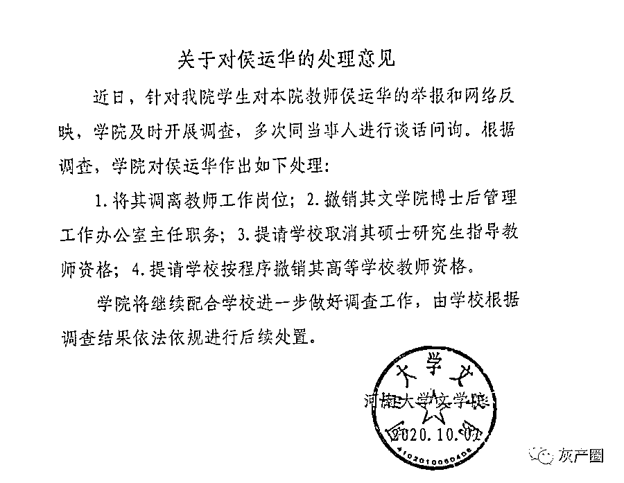

2021 年 9 月 17 日，网民在自媒体平台反映内蒙古财经大学教师乌峰骚扰猥亵学生信息后，校方决定给予乌峰开除党籍处分，岗位等级由三级教授降为九级科员。撤销其所获荣誉、称号，追回相关奖金，报请自治区教育主管部门撤销其教师资格，列入教师资格限制库。对其所在学院党政主要负责人给予诫勉谈话处理，其所在学院党政主要负责人向学校作出检讨。

2020 年 12 月至 2021 年 7 月，安徽农业大学教师高某多次对本校女学生进行性骚扰，最终，给予高某撤销党内职务和行政职务、降低岗位等级处分，撤销其教师资格，列入教师资格限制库。责令其所在学院党委和党委主要负责人作出书面检查。

今年 1 月 16 日晚，有网友发文称，成都中医药大学一辅导员强奸女学生。1 月 17 日中午，成都中医药大学官方微博通报，给予涉案辅导员董某某开除处分；同时启动党纪处分程序。

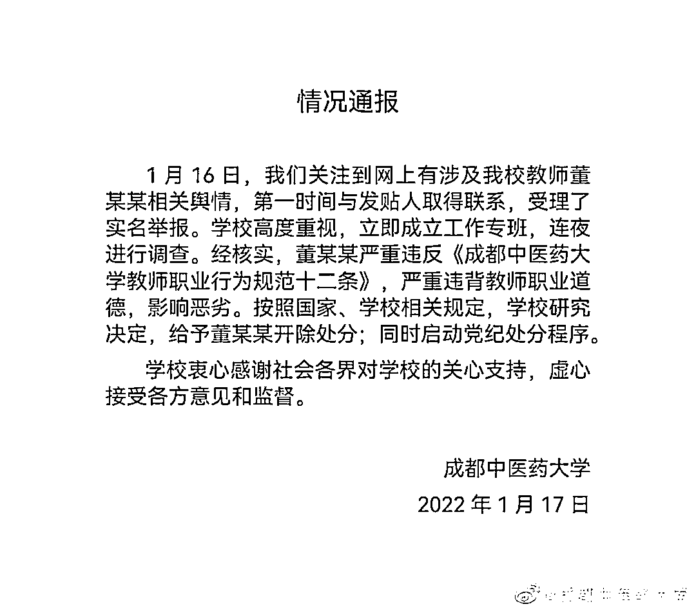

规定真够多的。以北京市为例，除了国家层面的《中华人民共和国教师法》、《新时代高校教师职业行为十项准则》、《教育部关于高校教师师德失范行为处理的指导意见》，而北京市又有自己的《新时代北京高校教师职业行为十项准则》、《北京大学教师行为规范》、《关于北京高校教师师德失范行为处理的指导意见》、《北京大学教师违规违纪调查处理试行办法》等规定，各个省、市、自治区和大专院校还有自己的多个规定，怎么就管不住禽兽教师的下半身呢？

多位网友在网上爆料称，北大教授洪某炼被爆猥亵学生，其博士生导师谢某在 2018 年 7 月也曾经被爆骚扰过一名女记者。

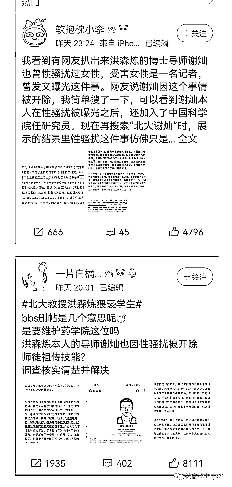

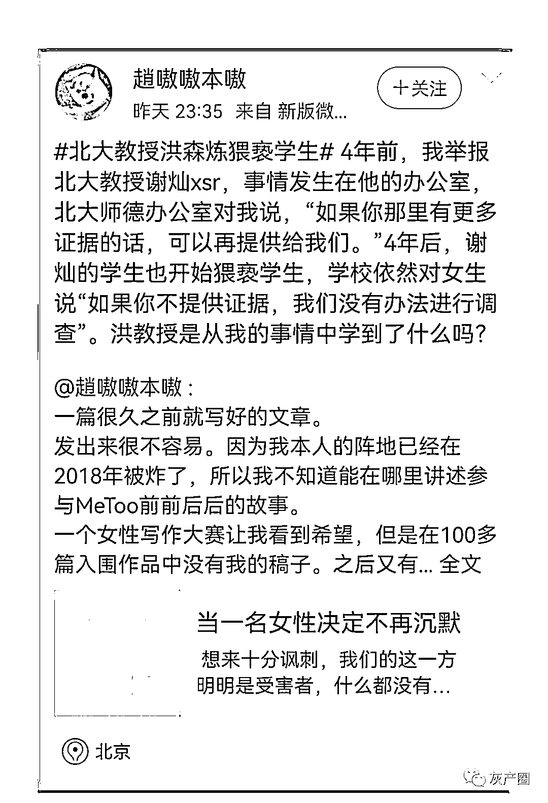

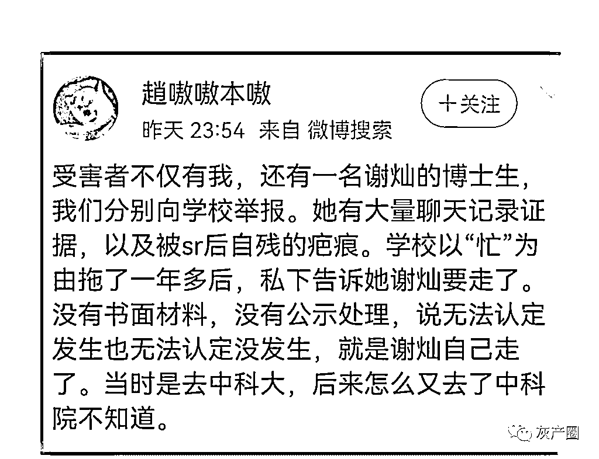

有网友问如何评价，宾曰语云在网上找到了女记者当时的举报信和谢灿教授 2018 年 8 月 7 日的一个公开回应。

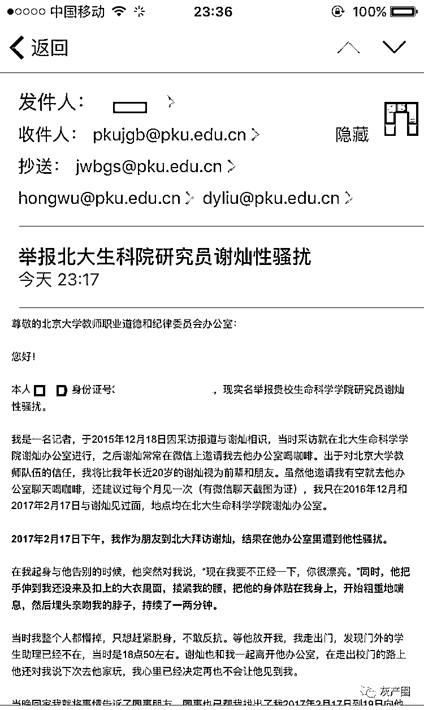

谢教授通过微信公众号科学罗盘回应：**我可以肯定地告诉大家，她（女记者）对我的指责与事实不符，我从未对她有性骚扰的行为。**

**我与女当事人一共见过三面，这三次见面都是在我在北大的办公室进行的。因此，不具备通常发生性骚扰的客观条件。**

**面对网络上关于我性骚扰的不实传闻和种种解读，我深感无力。**

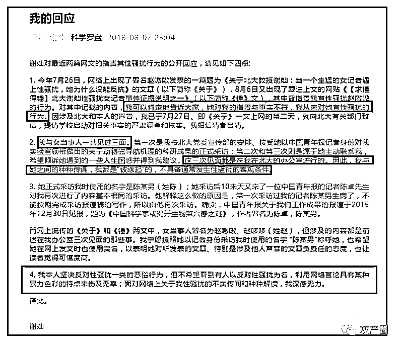

我不敢相信谢灿教授性骚扰女记者了。我更不敢相信这种事情也有“师承”。

你信吗？

来源 ：宾曰语云  ID 号：lzkj328 编辑：夏荷   审稿：宾语

← 向右滑动与灰产圈互动交流 →

