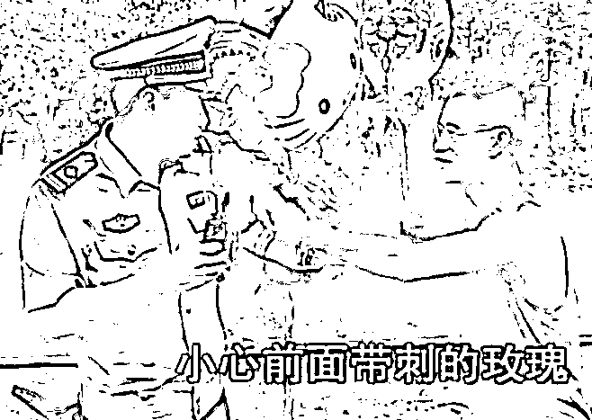
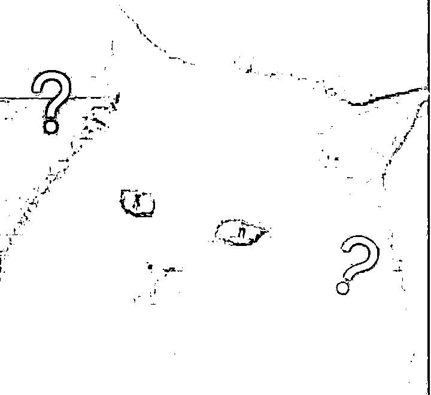
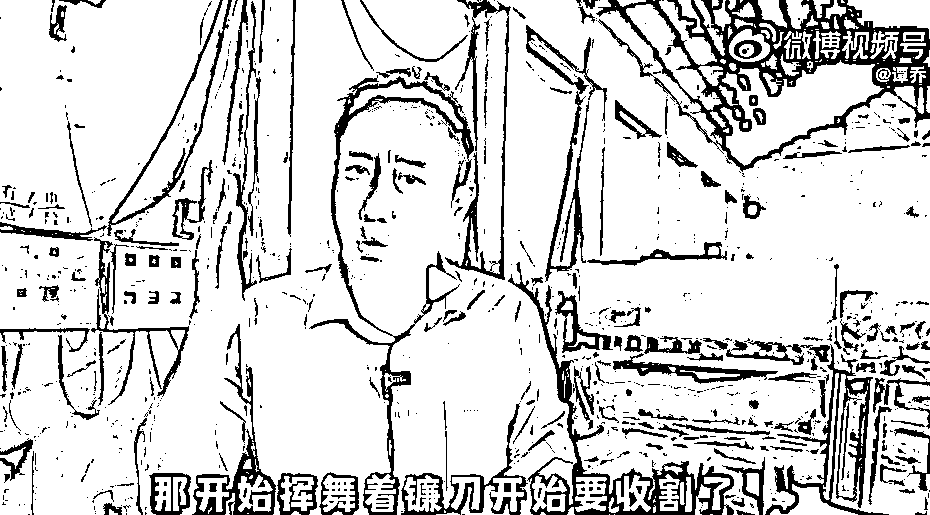

# 《谭谈交通》全网瞬间被下架！谭 Sir 要请罗老师出山？

> 原文：[`mp.weixin.qq.com/s?__biz=MzIyMDYwMTk0Mw==&mid=2247539786&idx=2&sn=8bccfc00a2cfed07be0f86a775a7eedc&chksm=97cb9772a0bc1e64dad0e4a87505ae091f39585e77d03f4b133064969b0243ebf000a56aa09c&scene=27#wechat_redirect`](http://mp.weixin.qq.com/s?__biz=MzIyMDYwMTk0Mw==&mid=2247539786&idx=2&sn=8bccfc00a2cfed07be0f86a775a7eedc&chksm=97cb9772a0bc1e64dad0e4a87505ae091f39585e77d03f4b133064969b0243ebf000a56aa09c&scene=27#wechat_redirect)

真是**“人怕出名猪怕壮”**啊，《谭谈交通》的谭 SIR 怎么被人“盯”上了？

说起**《谭谈交通》**，相信经常在网上冲浪的各位应该不陌生吧。

这档被网友冠名**“综艺天花板”**、**人间真实的普法宣传节目**从 2005 年开播一直到 2018 年停播，整整播了**十三年**，火遍了大江南北。

主持人谭乔硬是把一个交通普法节目弄成了**娱乐真人脱口秀**，语言诙谐生动，讲解浅显易懂，谭警官的幽默风趣也给我们带来了不少的欢乐。

‍‍‍‍‍‍‍‍‍‍‍‍‍‍‍‍‍‍‍‍‍‍停播之后热度也依然不减，近年来通过**网友们的二次传播和主持人谭乔的推广**，使得《谭谈交通》成为交通普法界的**“顶流栏目”**。

谁能想到这个大家喜闻乐见的交通普法节目昨天居然被**全网下架**

7 月 10 日晚，**《谭谈交通》主持人谭乔**在微博自曝节目将被全网下架。

**“你们的谭 SIR 最后可能陪得裤子都没了..”**

他个人或面临**数千万巨额赔款**甚至**牢狱之灾**。

 不仅如此，除了谭警官本人账号下的视频被下架外，**一些对《谭谈交通》进行****二创或者剪辑的爆款视频也被投诉下架**了。

据透露，投诉者为**“成都游术文化传播有限公司”**，该公司投诉《谭谈交通》的理由是**违反“著作权法等相关法律规定”**。 

随后，谭乔警官发视频回应 

《谭谈交通》是由他本人**原创拍摄**，带有**新闻传播属性的公益普法视频**，自 2005 年开播以来，一直以**无偿**的方式提供给观众和网友。

作为节目的创作者，谭警官**从未主张过版权的存在**。

而且他很支持大家二次创作和传播，也是为了达到更好地宣传普法。

《谭谈交通》在**创作之初从未签订过任何合同协议**

但现在作为唯一的原创作者，**谭警官需证明自己是谭警官**、是《谭谈交通》的作者。

谭警官表示，这次《谭谈交通》所面临的问题，**有可能是我国新著作权法实施以后，第一个具有代表性、里程碑式的案例。**

消息公开后，迅速引发关注。 

有网友发现起诉《谭谈交通》的“成都游术文化传播有限公司”是一家**2018 年才成立的民营公司**

而这家公司还拥**有大量未解决的官司**，最近密集起诉了多家视频公司，其中包括快手、优酷、咪咕等，案由均为“侵害作品信息网络传播权纠纷”。

不知是否与《谭谈交通》中涉及的著作权有关系。

有网友表示质疑，**这家公司怕不是个专业碰瓷公司吧？**

作为 2018 年才成立的公司，为何他们会拥有 2005 年就开播的节目的版权呢？

《谭谈交通》本就是官方的一档公益类交通普法栏目，其**内容也不涉及商业行为**，如何产生的侵权行为呢？

按理说，《谭谈交通》的著作权拥有者应该是**电视台**和谭警官所在的**交警部门**，就算维权，也应该是两家单位出面。

**一个民营企业，是怎么拿到国营单位的著作权的？**

电视节目的版权是个无形资产的问题，国有资产是怎么流失到民营企业中去的？是栏目被售卖了？还是什么原因呢？

现在在**没有任何机构和个人跟谭乔警官沟通**的前提下，突然跑出一家民营公司出来维权，**索赔数千万**，这未免有点**太离谱**。

而更离谱的恐怕是，谭警官**未必能赢得诉讼**。

还有网友们建议谭警官请罗翔老师来帮忙

    

就像谭警官自己在视频里吐槽说自己**一个交通法的顶流可能要变成民法甚至刑法的顶流了**，说不定真要请罗翔老师来给大家聊聊。

他一个人接下来将要面对的是一个**庞大的法务团队**和各种**网络水军**，网络上或许还会出现许多他的黑料。 

**一个普法者遇到了版权流氓，还有可能输掉官司？**我真是越来越看不懂这个世界了...

版权保护、知识产权保护，这些本身是**为了保护创作者们的合法权益不受侵害而定制的**，本身的初衷是好的。 

但是当这些“版权保护”成为**资本家手中的利器**，味道显然就变了，过度的规则化已经让社会出现变质。

**什么时候“版权保护”成为了资本家赚钱的工具?**

这毫无疑问的说不过去，**一边没收了这些大家喜闻乐见的节目，一边又惩罚了作品的原创者。**

这不得不说，**资本真是好手段**！

来源：新媒体管家 

← 向右滑动与灰产圈互动交流 →

