# 肛门拭子只是入门！越过山丘，还有肛检和肠镜在等候

> 原文：[`mp.weixin.qq.com/s?__biz=MzIyMDYwMTk0Mw==&mid=2247539786&idx=3&sn=83b83f2ee41333eadcc5d2483581b76d&chksm=97cb9772a0bc1e646ca6dbac5bb1b2a7a8586a324ede064335a18a506482cb333915961b431f&scene=27#wechat_redirect`](http://mp.weixin.qq.com/s?__biz=MzIyMDYwMTk0Mw==&mid=2247539786&idx=3&sn=83b83f2ee41333eadcc5d2483581b76d&chksm=97cb9772a0bc1e646ca6dbac5bb1b2a7a8586a324ede064335a18a506482cb333915961b431f&scene=27#wechat_redirect)

武汉大学“霍乱病”的事儿大家应该都听说了吧？！

已经确诊了，经过有效的诊疗，病情已得到控制。

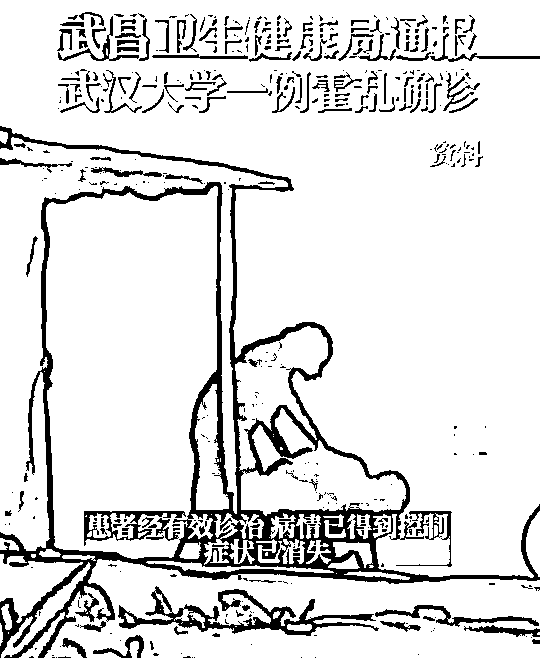

疫情还未消停，又是猴痘都是霍乱的，这让不少网友开始担惊受怕。

不过大家不用紧张，相比较而言，霍乱病就好控制多了。

毕竟人类已经有过对抗霍乱病毒的经验，有药剂预防和治疗。

可即便这样，我们仍旧不能小觑！

一旦患上“霍乱病”，还是很遭罪的！

上吐下泻，活生生的“脱水”而死，那感觉也真是求生不得求死不能啊（一个小胃肠感冒都让尸哥感觉快要拉/吐死了）

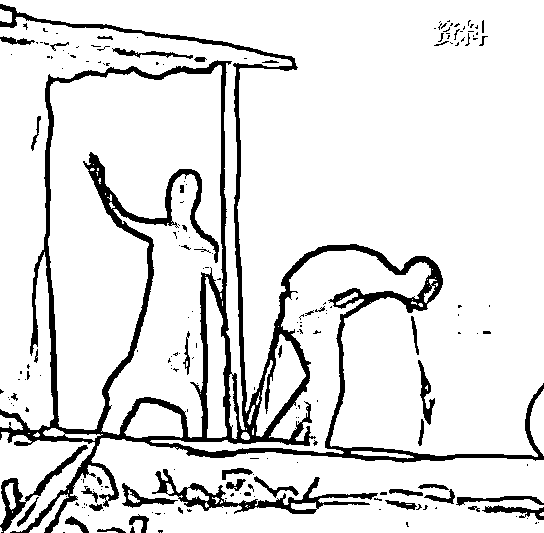

“霍乱病” 年纪轻的孩子可能都没听说过，

尸哥也是通过《霍乱时期的爱情》这部改编自同名小说的电影，才了解到霍乱病的存在。 

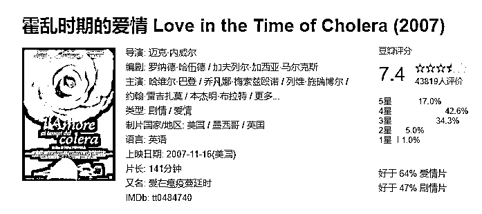

书里说：

**“霍乱就和爱情一样，迅速扩散、持久蔓延、难以治愈。”**

迄今为止，霍乱病已经霍霍地球人 7 次之多了。

霍乱(cholera)，早期译作虎力拉，前天晚上尸哥还更新过一篇关于“[追缉胡烈拉](https://mp.weixin.qq.com/s?__biz=Mzg2NDY2NjY1Mg==&mid=2247508419&idx=5&sn=2489bfcbba0b8e28545535a851562fc4&chksm=ce6734b0f910bda6e152b08cb6ea82ce5fde75d056d96a7c18f0dbe873c6a557363154d131ae&token=1709727570&lang=zh_CN&scene=21#wechat_redirect)”的长文，有兴趣的可以看看。

大约在 19 世纪初，霍乱病从**恒河三角洲**开始传播，一直传播到了亚洲和欧洲各国。

起初一些印度人突然就开始没完没了的腹泻和呕吐，吃什么药都不好，直至脱水死亡，并且病情还有传播的迹象。

人们此时才开始意识到，这或许是一种严重的传染病。

当年仅印度**，就超过 3800 万人死于霍乱病。**

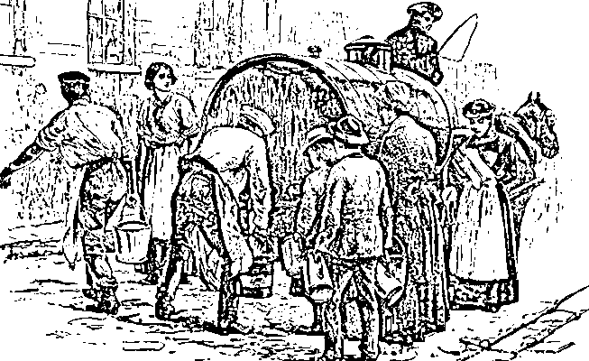

在 1817 年恒河水泛滥之后，霍乱病毒就随着水源不断的蔓延到了全世界。

1821 年疫情还传到了我国的东南沿海，造成霍乱在亚洲地区大流行，直到 1824 年才基本结束。

每隔上几年或几十年，霍乱就会出来大流行一次，

命硬的就像个打不死的小强，

**因此成功挤进最引人注目的，19 世纪世界病之一。**

**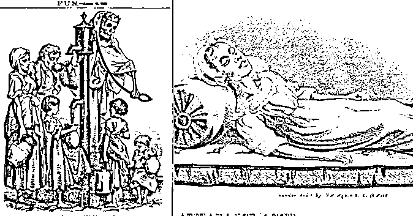**

**后经研究标明，霍乱病是通过“水”这个介质传播的。**

**20 世纪 60 年代初，第七次霍乱大流行流入我国后，我国加强了防疫和检测系统的建设，**

**并且我国在 2004 年研制出了**口服霍乱病疫苗**，有效的控制和治疗好了霍乱病。**

**所以大家平时一定要**用肥皂****勤洗手**，**喝水也要挑选安全可靠的水源**，这样能从跟本上降低感染霍乱的风险。**

**说了这么说，好像和今晚的主题没啥关系....**

**诶，一科普起来就收不住的毛病，尸哥以后要改改了！**

**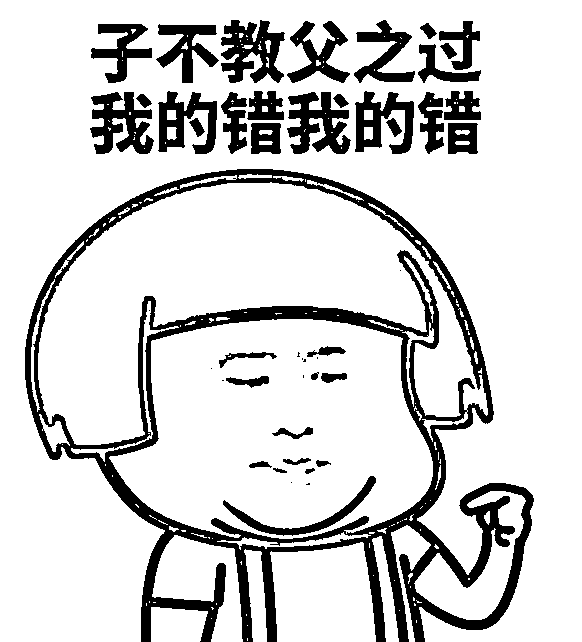**

**在武汉大学有学生疑似霍乱病之后，** 

**据说**全楼**的学生都被强制做了一波“肛拭子”检测....**

**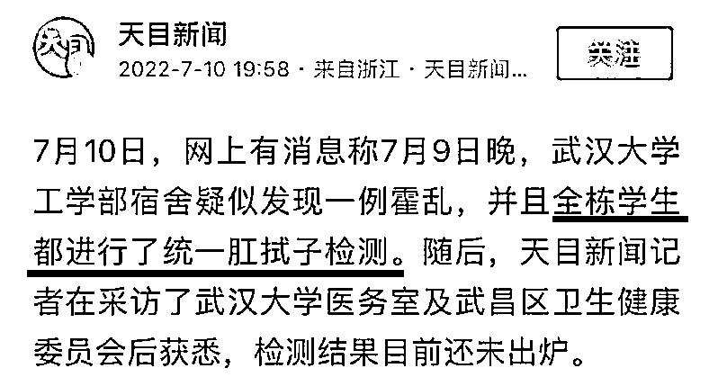**

**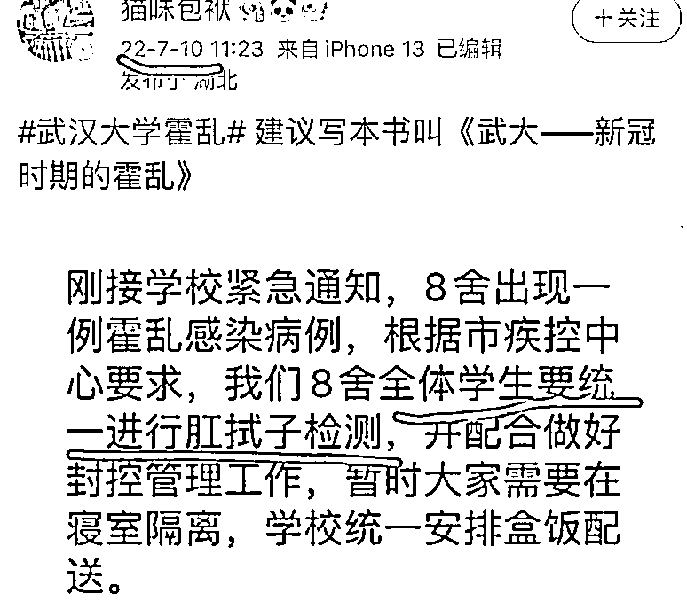**

**霍不霍乱的，其实很多网友并不担心。**

**毕竟国家对抗霍乱病毒，已经有足够的经验。**

**网友主要八卦的是，他们集体翘屁股做肛拭子检查的事情**

**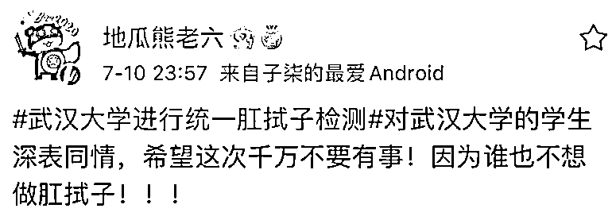**

**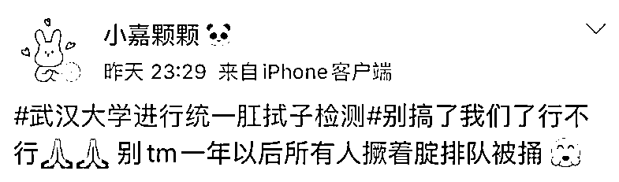**

**肛拭子检测，可以说是检测界噩梦般的存在了。** 

**有多少人做完了肛拭子检测后，恨不得把内裤套头上溜走的....**

 **[`mp.weixin.qq.com/mp/readtemplate?t=pages/video_player_tmpl&action=mpvideo&auto=0&vid=wxv_2481019424599408641`](https://mp.weixin.qq.com/mp/readtemplate?t=pages/video_player_tmpl&action=mpvideo&auto=0&vid=wxv_2481019424599408641)** 

**尽管我们都很排斥做肛拭子检测，但不得不承认，**

**直肠样本检测，要比鼻咽样本检测更可靠、更精确，虽然说过程可能有点尴尬....**

**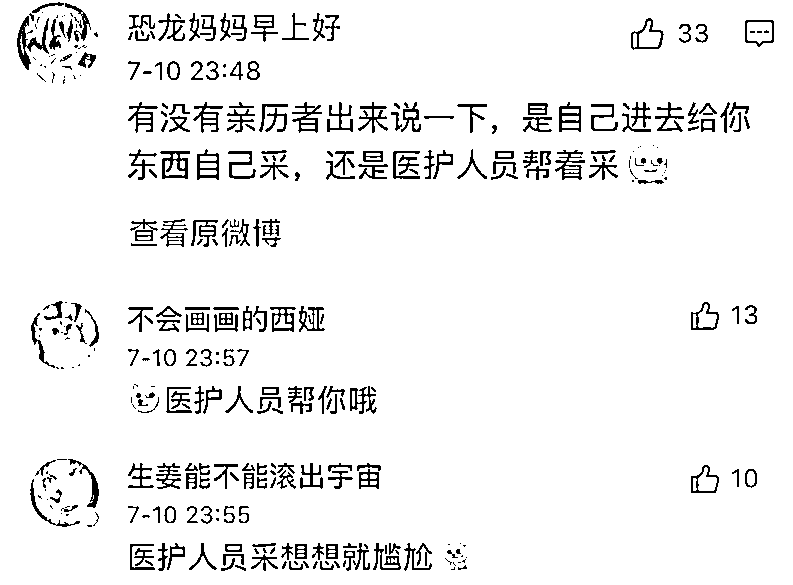**

****其实肛门拭子只是入门体验，****

****越过山丘，还有肛检和肠镜在等候！****

**肛门拭子只是采取“门口”周遭的表皮组织，肛检和肠镜那才是真正的**菊部灾害！****

**关于菊花周遭的疾病，尸哥已经发过很多次了。**

**包括但不限于**肛周湿疹、痔疮、肛瘘、肛周脓肿**等等疾病。**

**所以必要的肛检，很有必要**

**可也有不少从来都没做过肛检，并且根本就不知道肛检存在的人，**

**在某次体检中，**

**仅仅只是善意的回答了医生一个“好”字，就被拉进了小黑屋...**

**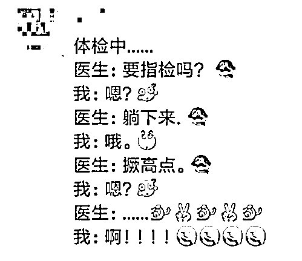**

**出来后整个人都震惊了！** 

****“我刚刚答应了医生什么？****而我刚刚又经历了什么？”****

**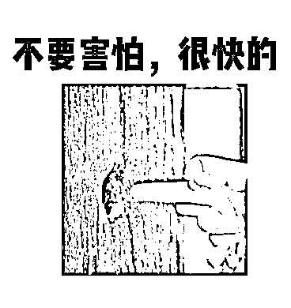**

**虽然一指禅（肛检）真的很强大，**

**小到息肉、痔疮，大到癌症等疾病都可以通过直肠指检来发现，**

**但有人还是**碍于颜面**，不肯做这种检查；**

**也有人是因为**承受不了那种痛**，才选择了放弃。**

**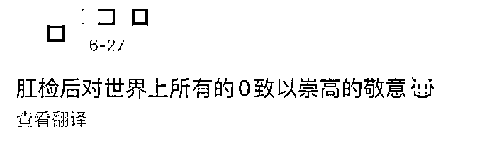**

**有些人，** 

**当他爬上诊室床的那一刻，括约肌就已经开始不自觉的紧张了起来。** 

****正常人，****

**这辈子，屁股除了走过之外，哪还见识过其他的东西进出。**

**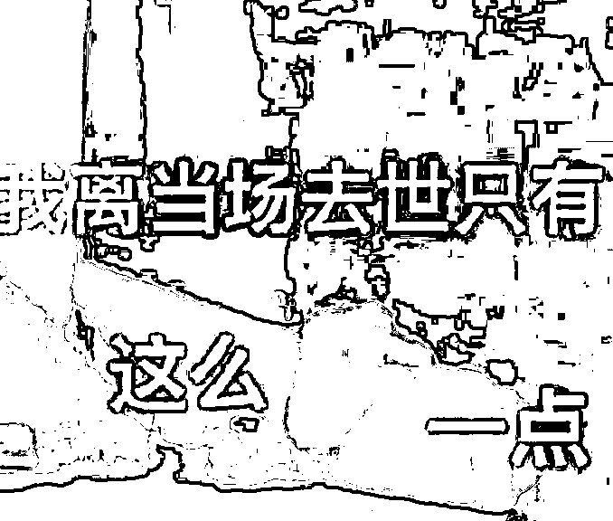**

**并且肛检过后，很长一段时间里，**

**你还是会觉得屁股里好像横着一根棍子般的不自在，**

**时刻的都在提醒着你，曾经医生的手指来过.....** 

**你受尽了委屈，可也只能心情低落的原地挤出来一串屁，以此让那种不自在的感觉尽量降低。**

**可如果肛检前，你没有提前排空直肠里的，那你此时放出来的，可能就不止是个屁....**

****

**虽然医生不说，**

**但在肛检的时候，或许已经在心里骂了你八百个来回了。**

**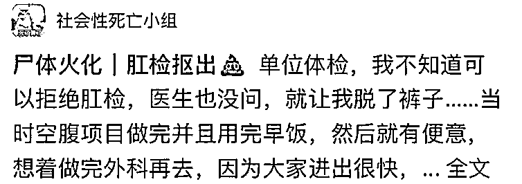**

**也有一些男性，**

**因为自己的生理构造，在肛检的过程中，被强行输出.....**

**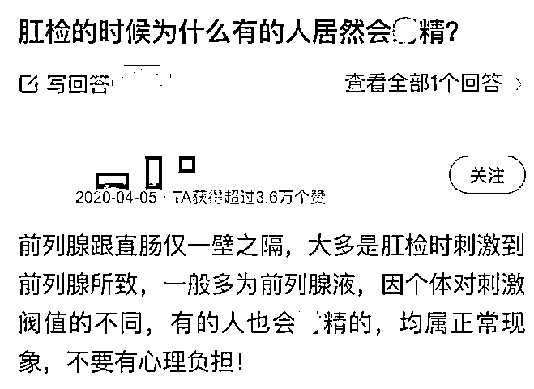**

**看到这里，似乎能理解为什么有些男性喜欢被“搅”了，**

**原来当“0”也会有快乐.....**

**是我孤陋寡闻了，之前一直不太理解。**

**男人的快乐，总是这么简单。**

****但是如果放进去的东西不“合适”，那就不是爽了，是要命。**** 

**听说过“黄鳝门”，但你们听说过男性也玩泥鳅的吗？**

**而且还是同时玩三条....**

**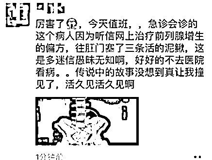**

**还有一些诡计多端的 0，为了掩盖自己的“秘密”，玩起了保卫萝卜。**

**说之所以这样，是为了治疗便秘......** 

**大叔，医生不是傻子好嘛......**

**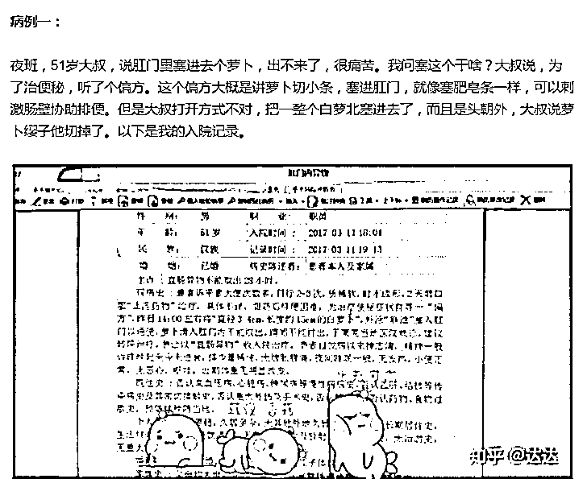**

**而肛肠医生还要强迫自己化身语文老师，**

**在安抚病患的同时，还要努力将其行为，进行正能量的解读.....**

**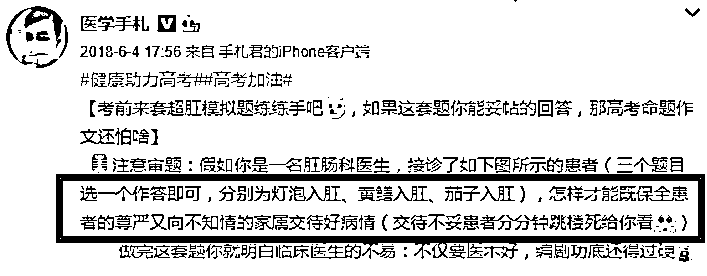**

**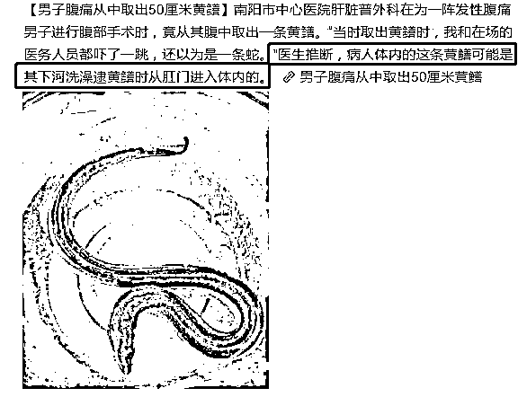**

**说完肛检说肠镜！**

**尸哥是那种特别怕疼的人，因为这个原因，挽救了自己很多次的生命。**

**不然我可能早就卧轨或者是跳楼了！**

**但每当心情不好有这种想法的时候，都是因为怕疼，**

**所以就没做，以后再说吧....**

**2020 年的时候吧，有幸做了一把肠镜。** 

**但让各位失望的是，尸哥做的全麻，全程不知道医生对我做了什么。**

**只是在看结果的时候，从片子中隐约看到了没有排干净的，才顿时觉得对不起医生... 玷污了他们的眼睛...**

**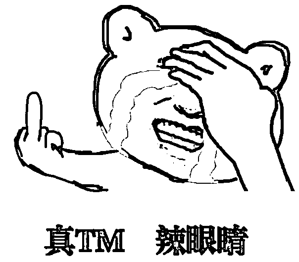**

**但相比网友的经历，我觉得我对医生还是不薄的，**

**至少麻醉醒来后，我翻看了垫在身下的尿不湿，并没有外露**

**可网友就不一样了.... 简直是一泻千里**

**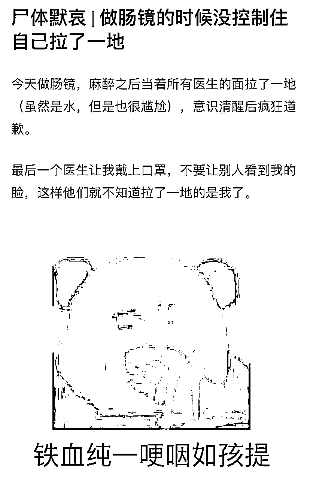**

**医生还是很讲究的，此时还不忘记提醒戴口罩哈哈哈哈**

**无论是有痛还是无痛肠镜，做之前都要喝掉好几升的**电解质溶液，****

**这样可以有效的帮助排空直肠里的奥利给，当肠镜进入直肠后能观察的更清楚。**

**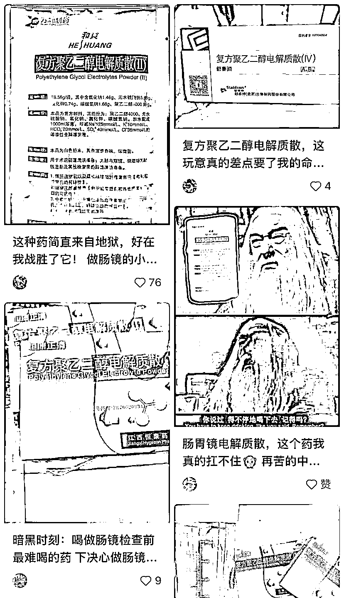** 

**可喝完之后，并不是一次性全部排空。** 

**而是不间断的排，隔一会儿你就会感觉有“水”抵达了肛门处，**

**提醒你开闸放水，如果不放，可能就要拉裤子了。**

**感觉很奇妙，是水到渠成的出来，而没有拉肚子那种被迫感。**

**如果你是全麻肠镜，躺上手术台上后麻醉师便会过来给你麻醉，吸入的什么东西尸哥也没心情去搜，** 

**然后让查数，数到 8 我就不省人事了....**

**当尸哥醒来后，大夫护士都没人影了.....**

**不知道他们是被我肠子里的“景象”恶心走了，还是去忙别的患者去了，**

**真的是，也不打个招呼。**

****

**术后就只觉得肚子里涨涨的，咕噜噜的叫，其它还真没什么感觉。**

**但如果你要不是全麻肠镜，**

**那么你可能会有如下的体验感，据一些亲历者说：**

****“那种胀痛很难形容，感觉塞进肚子里的不是肠镜，是一个金刚芭比。”****

**首先是侧着身子躺下，**

**然后那根大管子就进入到你的肠子里来回的游走，**

**每次拐弯，都会撞的你肚子一抽抽。** 

**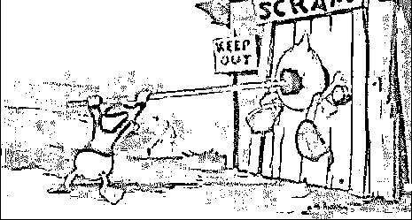**

**过了一会儿后，大夫会让体内还插着肠镜管子的你，带着肠镜一起躺平....** 

**想象那种感觉....**

**并且你全程都可以从屏幕中看到，你的肠子里究竟落下了多少没有排出，**

**体验着同医生一样的体验，而你却多了一份尴尬！**

**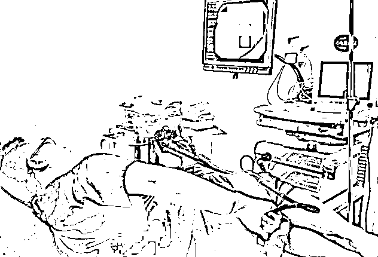**

**据说管子一直要在肠子中来回穿梭 20 分钟才结束，**

**真不知道那些**做无痛**的勇士，是怎样熬过这死亡 20 分钟的！**

**所以说！**

**不要听别人说做全麻伤脑子，所以就不做。**

**伤不伤，伤多少，微乎其微到就连医生都回答不了你。**

**况且又不是每个月都全麻，一两年来一次全麻肠胃镜，啥事儿没有。**

**反正就算是上街要饭，尸哥也还是要做全麻！**

****实在承受不了那份痛，和屏幕中偶尔蹦出来几坨遗落下的翔的尴尬画面。****

**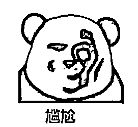**

**话说回来，偶尔去做做肛检还是有必要的，** 

**毕竟**直肠癌**的病发率越来越高了，而它也恰恰是做好检查和预防的！**

**可即便是这样，中国直肠癌患者在全球的占比，居然高达 31% 。**

**为啥？**

**一是因为人们都不够重视，心想一个屁股能作出多大的幺蛾子；**

**再一个就是，不好意思..... 想着那么隐私的地方被别人戳来戳去的。**

**基于这两点，我国的直肠癌患者才会越来越多...**

****没什么不好意思的，难道做肠镜会比死还可怕吗？！****

**但希望大家卖破烂也要做无痛，**

**生而为人，大菊为重！**

**本文源自「不惑先生，ID: buhuoxs」丨作者：尸哥**

********

**← 向右滑动与灰产圈互动交流 →**

****