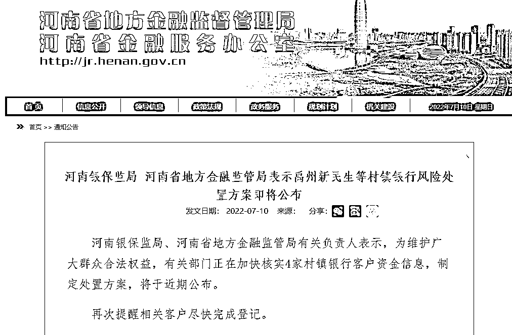
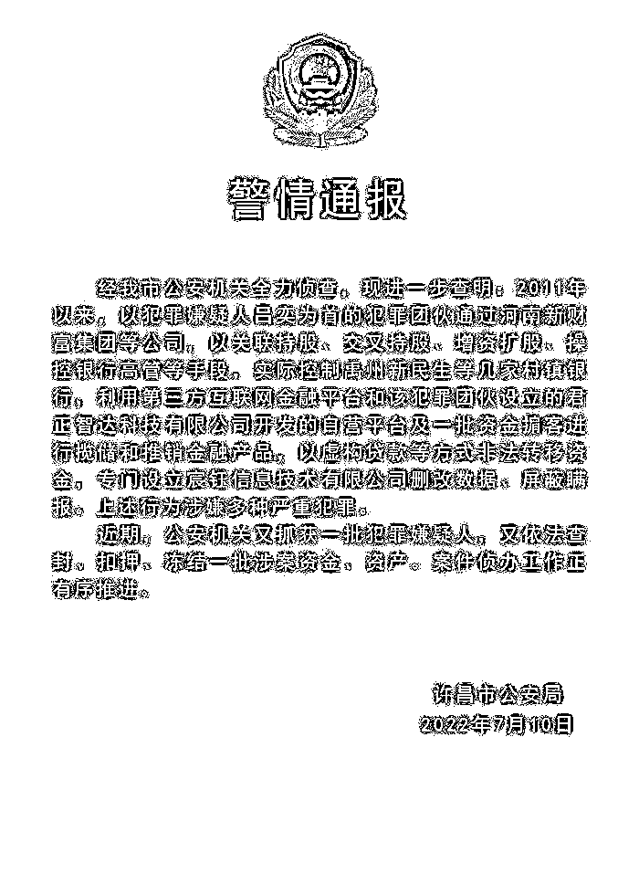

# 河南村镇银行最新进展！处置方案即将公布，警方又抓获一批嫌犯

> 原文：[`mp.weixin.qq.com/s?__biz=MzIyMDYwMTk0Mw==&mid=2247539786&idx=5&sn=f33ff44bc116687f8e9e1c2dd4159354&chksm=97cb9772a0bc1e64b346ccde62ae11d4d2e0e5550337b65002db1f8dc573ff23e99ed91e291d&scene=27#wechat_redirect`](http://mp.weixin.qq.com/s?__biz=MzIyMDYwMTk0Mw==&mid=2247539786&idx=5&sn=f33ff44bc116687f8e9e1c2dd4159354&chksm=97cb9772a0bc1e64b346ccde62ae11d4d2e0e5550337b65002db1f8dc573ff23e99ed91e291d&scene=27#wechat_redirect)

河南部分村镇银行储户“取现难”事件最新进展公布了。

10 日晚，河南省地方金融监管局网站发布公告称，河南银保监局、河南省地方金融监管局有关负责人表示，禹州新民生等村镇银行风险处置方案即将公布。 

并且，“平安许昌”通报，近期，公安机关又抓获一批犯罪嫌疑人，又依法查封、扣押、冻结一批涉案资金、资产。案件侦办工作正有序推进。

**河南：禹州新民生等村镇银行****风险处置方案即将公布**

河南银保监局、河南省地方金融监管局有关负责人表示，为维护广大群众合法权益，有关部门正在加快核实 4 家村镇银行客户资金信息，制定处置方案，将于近期公布。

并再次提醒相关客户尽快完成登记。

**河南警方：又抓获一批村镇银行案嫌犯**

另据“平安许昌”微信公众号消息，7 月 10 日，河南许昌公安通报，经许昌市公安机关全力侦查，现进一步查明：

2011 年以来，以犯罪嫌疑人吕奕为首的犯罪团伙通过河南新财富集团等公司，以关联持股、交叉持股、增资扩股、操控银行高管等手段，实际控制禹州新民生等几家村镇银行，利用第三方互联网金融平台和该犯罪团伙设立的君正智达科技有限公司开发的自营平台及一批资金掮客进行揽储和推销金融产品，以虚构贷款等方式非法转移资金，专门设立宸钰信息技术有限公司删改数据、屏蔽瞒报。上述行为涉嫌多种严重犯罪。

近期，公安机关又抓获一批犯罪嫌疑人，又依法查封、扣押、冻结一批涉案资金、资产。案件侦办工作正有序推进。

**储户“取现难”事件时间线**

**自 4 月 18 日起，有储户发现，禹州新民生村镇银行、上蔡惠民村镇银行、柘城黄淮村镇银行和开封新东方村镇银行等银行线上存款渠道暂时无法取款。**

**5 月 20 日，银保监会召开通气会时，有关负责人回应河南 4 家村镇银行线上服务渠道关闭问题时表示，这几家村镇银行的大股东河南新财富集团利用第三方平台或通过资金掮客吸收公共资金，涉嫌违法犯罪，目前公安机关正在侦查。最后还有待公安机关侦查结果，依照相应的法律法规和证据来处置。**

**6 月 18 日，许昌市公安局发布首份通报时表示，2022 年 4 月 19 日，许昌市公安机关依法对河南新财富集团涉嫌重大犯罪立案侦查。通报显示：现初步查明，2011 年以来，以该公司实际控制人吕某为首的犯罪团伙涉嫌利用村镇银行实施系列严重犯罪。目前，案件侦办取得积极进展，公安机关已抓获一批犯罪嫌疑人，依法查封、扣押、冻结一批涉案资金、资产。**

**许昌公安局称：“该案涉嫌犯罪行为持续时间长、参与人员多、案情十分复杂。公安机关将进一步加大案件侦办力度，不让犯罪分子逍遥法外、逃避惩罚，进一步加大追赃挽损力度，维护人民群众合法权益并适时发布案件侦办阶段性进展情况。”**

**6 月 18 日，河南银保监局、河南省地方金融监管局有关负责人表示，各级金融管理部门密切配合公安机关开展调查，禹州新民生等村镇银行线上交易系统被河南新财富集团操控和利用的犯罪事实已初步查明，相关资金情况正在排查。**

**河南银保监局、河南省地方金融监管局责成相关村镇银行紧紧依靠当地党委政府，积极配合公安机关侦办案件，做好资金信息登记和后续处置工作，依法保护金融消费者的合法权益。同时，提醒相关群众配合做好信息登记工作。**

**6 月 20 日，柘城黄淮村镇银行、上蔡惠民村镇银行、禹州新民生村镇银行、开封新东方村镇银行发布公告称，按照金融管理部门要求，从即日起开展线上客户资金信息登记工作。凡在该行线上交易系统关闭后不能正常办理业务的客户均需登记。**

**7 月 4 日深夜，河南禹州新民生村镇银行、柘城黄淮村镇银行、上蔡惠民村镇银行、开封新东方村镇银行 4 家村镇银行在官网发布有关选举产生新的董事长、监事长和高管人员的公告。**

**公告称：召开了董事会、监事会，选举产生了新的董事长、监事长，通过了高管名单。上述村镇银行在公告中均表示，作出人员调整是根据《公司法》和银行章程规定，按照法定程序召开股东大会，并选举了相关人员。**

**直至如今，该案件又有一批嫌犯被抓获。**

**来源：华夏时报综合自河南省地方金融监督管理局网站、平安许昌、公开信息**

********

**← 向右滑动与灰产圈互动交流 →**

****