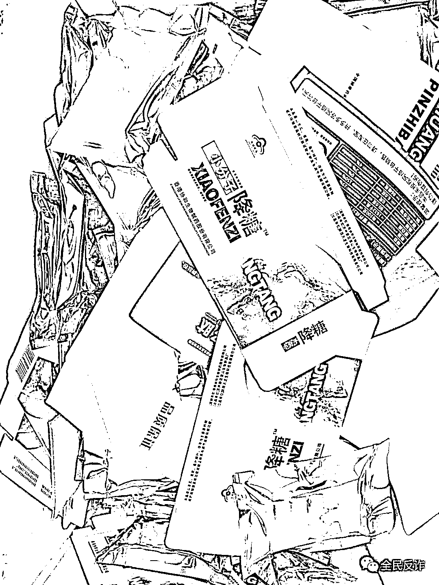
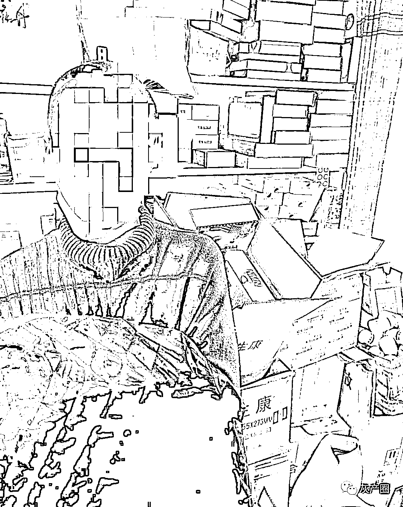
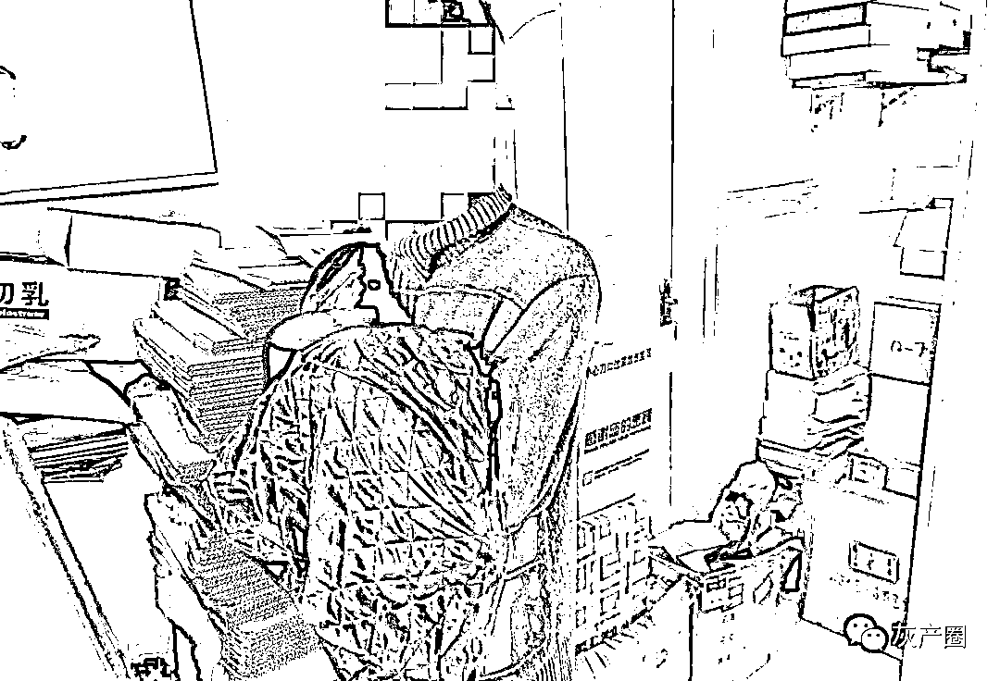
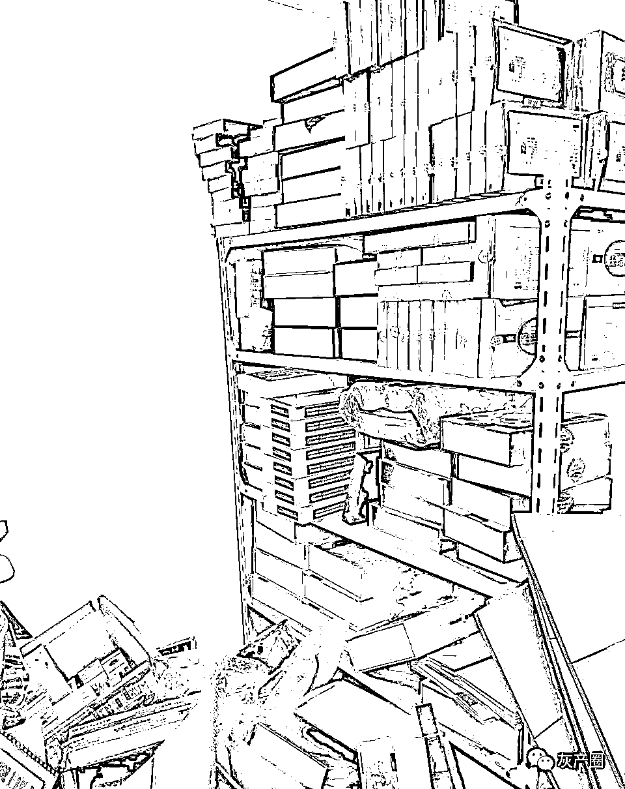
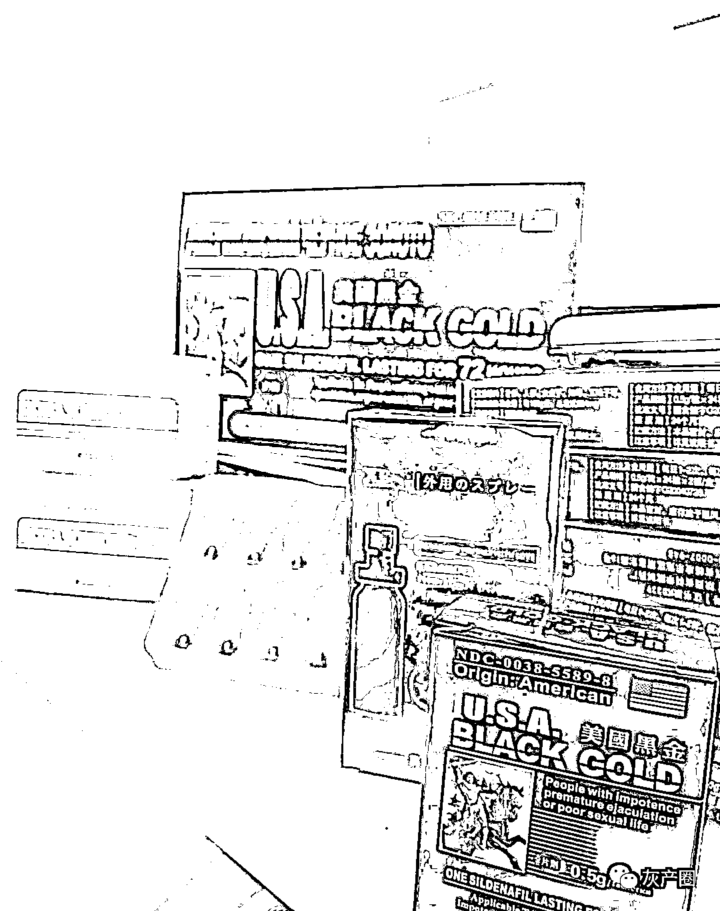
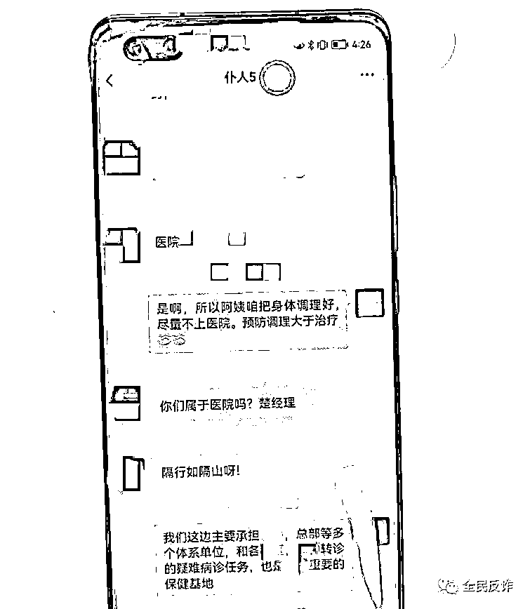
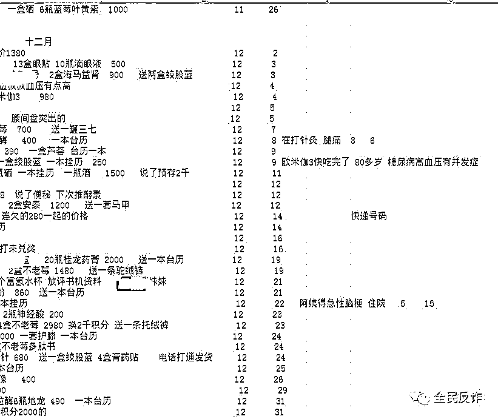
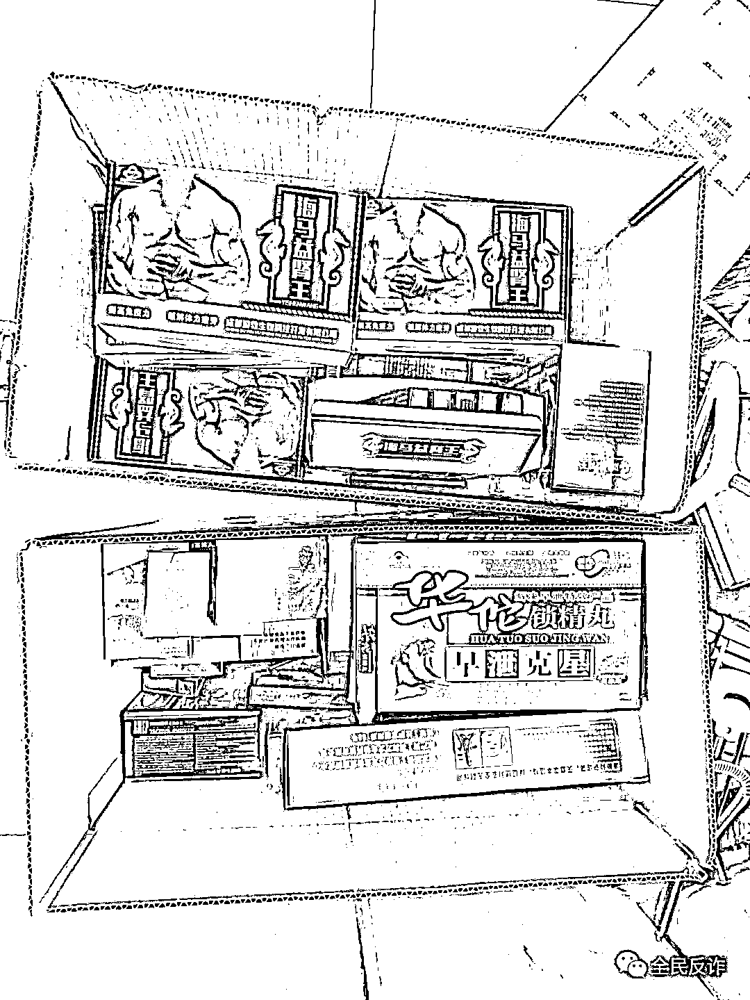

# 卖保健品的骗子有多坏？背地里把客户备注为“仆人”！

> 原文：[`mp.weixin.qq.com/s?__biz=MzIyMDYwMTk0Mw==&mid=2247539786&idx=6&sn=0b0425a202b9d607813106cb8b78eb3b&chksm=97cb9772a0bc1e6424f85726479d7f2b1ea4a4f3230184a7e6c6dc25d6827e4190458e2adb95&scene=27#wechat_redirect`](http://mp.weixin.qq.com/s?__biz=MzIyMDYwMTk0Mw==&mid=2247539786&idx=6&sn=0b0425a202b9d607813106cb8b78eb3b&chksm=97cb9772a0bc1e6424f85726479d7f2b1ea4a4f3230184a7e6c6dc25d6827e4190458e2adb95&scene=27#wechat_redirect)

杭州钱塘警方最近侦破一起向老年人非法销售保健品的案件。

经初步调查，这个犯罪团伙假意嘘寒问暖，通过连哄带骗的方式，向老年人高价推销所谓“名贵滋补品”，非法获利近 400 万元，受害人遍布全国，其中 80 岁以上老人占了大多数，被骗年龄最大的 93 岁，最小 67 岁，被骗最多的老人买了近 30 万元。

警方缴获的保健品，经鉴定里面含有西地那非等非法添加剂，以及其他成分如二甲双胍（guā）、格列本脲（niào）等，都是治疗糖尿病等病的药物，必须要在医嘱下服用，如果服用不当，会导致中毒等，甚至生命危险。

**买保健品送的银碗筷竟然生锈了**

去年年底，钱塘区公安分局环食药大队收到陈先生（化名）的求助。

“我爸最近买了好多保健品，我见都没见过牌子，他说花了好多钱。能不能帮忙看看正不正规的………”陈先生说刚开始他也没在意，他每次去看父亲，发现家里多了保健品，问起来父亲都说有效果，“后来就和进货一样，家里都堆起来了，而且这些‘保健品’牌子看都没看过。”陈先生说。

起先，儿子还会委婉的和父亲说，不要继续在买这些“保健品”了，但是老人根本没听进去，还向他展示了对方寄来的赠品。

直到有次，他发现父亲收到的赠品——银碗筷竟然还生锈了，他说父亲收到的赠品还有很多，“有床单、餐具、古钱币等等，送的东西质量很差，也不实用。老人年纪大，怕说多了会吵起来。我只有报警了。”

陈先生父亲陈大伯 87 岁，2019 年 6 月，接到一个电话，对方是个女的，自称是某老年协会工作人员刘某。

电话里，刘某关切地询问老人的身体状况，陈大伯说自己血压、血糖都比较高，她便开始跟陈大伯推销保健品。

陈大伯平时独居，刚开始他试着买了“降糖”方面的保健品，“吃了感觉确实有效，加上服务特别好，每天都会来电话问情况”，陈大伯被感动到了，觉得刘某像自己亲生女儿一样亲。

渐渐的，从刚开始的 50 元一盒到 2000 元一盒，到后来推销的保健品要一万元一盒，陈大伯也都买了。后来，刘某说他们领导也很关心老人的身体，领导要加他微信，这个领导经常在微信上问候大伯，赠品也都是他送的。

接到线索后，钱塘区公安分局立刻联合区市场监管局，取走陈大伯“保健品”的样品。

经检测，陈大伯购买的“保健品”中，含西地那非、二甲双胍、格列本脲等成分。

“西地那非俗称‘伟哥’，长期服用对老年人会有不良影响，二甲双弧和格列本脲虽然可以治疗糖尿病，但副作用也比较明显，特别是格列本脲，长期大量服用可能会造成低血糖和肾病，甚至死亡……”民警胡立冬说。

**发货都要去远离公司所在地几公里之外**

民警找到了卖保健品的“传康贸易”公司，公司在下沙一个工业园区的高档写字楼内，看起来蛮正规，营业范围也写着保健品销售等。 

公司老板姓余，衢州江山人，30 多岁，他说他们这些保健品，是从正常渠道进货销售保健品，对所销售的保健品是否有害不知情。

真是这样吗？

很快，民警调查清楚了，这家公司包括余某在内共有 4 人，两男两女，其中一个女的张某就是跟陈大伯打电话，自称老年协会刘某的，她跟陈大伯说的领导就是余某。

张某是河南人，40 多岁。好端端的为什么要谎报自己身份呢？

经过调查，民警发现，余某以前也在保健品行业做过，余某在成立公司前在一家健康管理公司工作，算是老手了。

他还有个合伙人吾某，年龄差不多，是他的老乡、发小，2018 年，两人一起成立了这家贸易公司，还找来了两个女的梁某、张某做话务员兼任推销员，向老年人推销保健品，余某也亲自下场推销。

吾某除了推销外还负责管理仓库和包装产品，收货和发货都是余某负责。每次，余某发货的时候，从不在公司或者仓库所在的小区寄件，而是专门跑到附近几个小区，用别人的身份证发货，几乎每次都选择到付的方式收款；而余某收到保健品货物后，把这些“保健品”存储在距离公司 5 公里的员工宿舍隔间里。

**每盒进价才 5.5 元，见人下菜，**

**有的卖 55 元一盒，有的卖 2000 元一盒** 

警方查获了这家公司，在公司的员工宿舍内搜出“保健品”1100 多盒。 

这些保健品经过鉴定，都含有有毒有害成分。 

进一步调查，警方还查到了余某的上家王某，6 月，在河南抓到了王某。

查获的保健品中有一款叫“海马益肾王”，包装上写着含有鹿茸、鹿鞭、人参灵芝提取物，都是高档名贵滋补品。“他们的进货成本 5 元都不到，便宜到离奇，怎么可能会有那些成分”，民警胡立冬说，“每一款印在药品包装上的生产厂家，在网上均查不到。”

王某是批发商，一盒保健品十粒药丸，他每盒进来是 4.5 元，余某再从王某进货，平均进价是 5.5 元一盒，经转手，卖出去 55 元一盒，如果看老人好骗，他们又卖四五百元一盒，甚至高的要卖 2000 元，“都是一样的东西，只是包装换下”，涉及到的有 8 种，“虫草”“美国黑金”“鹿鞭王”“降糖胶囊”等，民警说，余某他们就是见人下菜。

**给被骗老人备注：仆人+编号**

但民警在调查时，还遇到了有人给嫌疑人求情的“难题”。

求情的是受骗上当的陈大伯他们。

“能不能不要处理他们？”陈大伯向民警求情说，他还说余某“他比我儿子还关心我，我都把他当‘干儿子’。”

事实上，向民警求情的受害人不止陈大伯一个，有的甚至放弃报案。

但实际上，被陈大伯认为像干儿子一样的余某，给陈大伯他们这些老人微信备注的是：仆人+编号。

在余某微信上，分别备注着仆人 1 仆人 2 仆人 3……，每次，当客户买到超过七八万元的保健品后，他会主动添加他们的微信，给这些“高端客户”备注好“仆人”，平时在微信上一边嘘寒问暖送这个赠品那个赠品的，一边再推销。

**被骗的老人年龄最大的 93 岁**

警方目前查证，余某这个公司去年销售有 400 多万元，被骗的都是老人，遍布全国，最小的 67 岁，最大的有 93 岁。

这些老人一直被蒙在鼓里，当民警前去调查时，老人还不承认自己买保健品了，不承认自己被骗，“有些老人根本不肯来提供证据或者报案，怕家里人知道，还有的明明我们发现买了十多万元，却说自己才买了 3 万多元”。

其中年龄最大的是外省 93 岁的俞大伯，是位退休教授，从调查情况看他也是被骗最多的，大约有近 30 万元。但当民警上门找老人，老人起先不承认，直到民警从房间里找出来一些保健品，他才说自己买了点，不过不多，也就两三千元。

“我不忍心直接和老人说实情”，胡警官说，调查时，他看到老人哆哆嗦嗦的样子，实在不忍心，“只能让他们家属做工作，但这大大增加了侦查难度。”

**从网上买来 100 多万条信息**

余某到底是怎么有这些老人信息的呢？

从目前调查看，余某从网上买来一些曾购买保健品的老人信息，也有一些是他从以前公司拷贝的，大约有 100 多万条非法获取的信息，再冒充各类老年协会、退伍军人保障协会等名义，逐个向名单里的老年人电话推销。

这个团伙中，两个话务员其中之一梁某，30 多岁，安徽人，还是医科大学毕业生，她交代说，一年半前，自己通过网上招聘进公司的，刚开始看起来公司还正规，有五险一金等，干着干着觉得不对劲，但因为工作也算轻松，收入也不错，所以就干下去了。

另一个张某也是通过网上招聘进来的。余某跟她们约定提成，一盒药提成百分之 3-5 个点。

她们进来后，余某还提供了推销的话术脚本进行培训，每个问题都有相应的答案，“有一本笔记本那么厚”，余某自己下场推销的“业绩”不错，今年 3 月他的工作笔记上记录显示，他每天销售额平均两三万元。

之所以租高档写字楼，他也是想让公司看起来很正规，拍视频发照片给老人看，增加老人信任度，还会定期给老人送所谓养生类的印刷资料、乱七八糟的赠品，都是他去买来的。

因保健品添加了西地那非非法添加物，因刺激，让老人感觉自己好了点，渐渐信任，他们这伙人就会进一步引导老人，说肾虚啊要补肾啊等等，让老人花大价钱买其他的高端保健品。

目前，此案嫌疑人因涉妨害药品管理罪、销售有毒有害食品罪、帮助信息网络犯罪活动罪等被移送起诉，案件正在进一步办理中。

你或者家里老人有遇到保健品诈骗的情况吗？欢迎来跟我们说说。

你有被骗经历吗？或者和骗子斗智斗勇的反诈经验、智慧、故事，请来跟我们分享。

来源：全民反诈 文：杨丽  董超君 编：林纪彤

← 向右滑动与灰产圈互动交流 →

