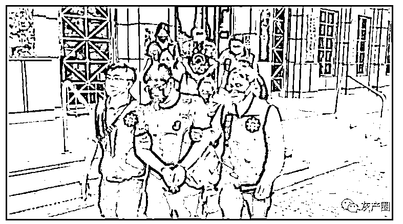

# 震惊！台湾竹联帮卖 82 人到柬埔寨做电信诈骗！

> 原文：[`mp.weixin.qq.com/s?__biz=MzIyMDYwMTk0Mw==&mid=2247539786&idx=7&sn=ebc78fc4021906d93b3401cc2513edc1&chksm=97cb9772a0bc1e64a0ff00ae616427b54862642786948bacd9b13e5dc48f6e36bd7a22e63269&scene=27#wechat_redirect`](http://mp.weixin.qq.com/s?__biz=MzIyMDYwMTk0Mw==&mid=2247539786&idx=7&sn=ebc78fc4021906d93b3401cc2513edc1&chksm=97cb9772a0bc1e64a0ff00ae616427b54862642786948bacd9b13e5dc48f6e36bd7a22e63269&scene=27#wechat_redirect)

台湾警方接获报案，被害人**原本是要到柬埔寨当客服人员，却被囚禁凌虐**，深入追查发现，背后是**竹联帮成员当起人蛇集团**，把台湾人卖去柬埔寨当诈骗集团成员，只要有人不服从，就会被暴打一顿，**一共 82 名被害人**，已经有 9 人成功逃了出来，现在还有 73 人受困柬埔寨。

抓捕现场 图/华视新闻 

连开好几枪破坏门锁，除暴特勤队全副武装破门攻坚，大批警力直捣黄龙，嫌犯一脸错愕，只能举起双手乖乖趴在床上，在犯罪集团据点把人通通逮捕，甚至还查获一把模拟枪，原来他们锁定台湾人，涉嫌人口贩运，先是把被害人骗到饭店内，在护照准备好之后就把人载去机场，卖到柬埔寨。

被害人说：「**也没有去想太多，因为想说只是出国工作，应该也没有什么东西，后来到了才发现是做非法的，整个傻眼然后我心里就一直开始很紧张，就想说是不是我们被人口贩卖了。**」嫌犯先是在网络上刊登广告，标榜只需要会用电脑打字就可以，月入高达 10 万元，实际上是把人带到柬埔寨，他们再抽 30 万元佣金。

而被害人出国后，**才发现自己被关在小房间内，还被迫从事诈骗工作，目前还有 73 名台湾人困在国外**，被害人说：「没有做出成绩什么的，就是要把我转卖掉转到黑公司，黑公司那边可能就是有，电击或者是关在小黑屋，还是说不让你吃。」甚至还有人被骗走后，因为工作能力不好，直接被丢在路边小腿严重溃烂，还有被害人急得上网求救。

而整起事件背后主嫌就是他，**竹联帮主嫌，35 岁的李姓男子，是竹联帮东堂成员，有妨害自由伤害多项前科，**员警将和外交部合作，救回剩下的受困民众，警方也提醒在网络上看到征才广告，一定要小心再小心，以免想着出国发大财，最后换来的却是一场恶梦。

被捕的男子 图/民众网 来源：华视新闻，今日柬闻

← 向右滑动与灰产圈互动交流 →

