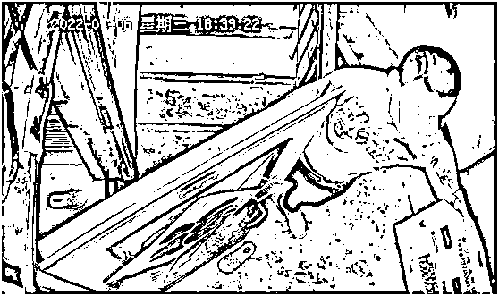

# 雨衣男被刑拘：莱阳警方和妇联的作业请抄一抄

> 原文：[`mp.weixin.qq.com/s?__biz=MzIyMDYwMTk0Mw==&mid=2247539847&idx=1&sn=0f63cf2ae64e6cd18e613175d97722af&chksm=97cb97bfa0bc1ea98f77f5a77988837438f28965d672451b6fa6bec7616db9603cdd818d35f3&scene=27#wechat_redirect`](http://mp.weixin.qq.com/s?__biz=MzIyMDYwMTk0Mw==&mid=2247539847&idx=1&sn=0f63cf2ae64e6cd18e613175d97722af&chksm=97cb97bfa0bc1ea98f77f5a77988837438f28965d672451b6fa6bec7616db9603cdd818d35f3&scene=27#wechat_redirect)

每一个受害者，无论是否在聚光灯下，都希望有“莱阳警方”和“莱阳妇联”在身边。

7 月 12 日，山东莱阳警方发布通报，拖拽母女入室的雨衣男已被刑拘。 

此前，一则视频广为流传：母女到家门前，母亲开锁后，忽然从楼梯间冲下来一穿雨衣的男子，将母女二人先后拽至房间，随后紧闭房门。

该视频号动态不可引用

[`v.qq.com/iframe/preview.html?width=500&height=375&auto=0&vid=j33475fxxav`](https://v.qq.com/iframe/preview.html?width=500&height=375&auto=0&vid=j33475fxxav)

视频来源：星视频

“又一个她身处危险中”，这是观者共同的感受。然而这一次，她会被保护吗？

雨衣男被刑拘，是一个令公众满意的结果。纵观整起事件，几乎可以看作是保护人身权利的样本。它是多方共同努力的胜利。

欣慰之余，也不要忘记这是聚光灯下的案件。如果不是舆论的推动，每一个受害人能否享受同等待遇？

1 或面临两项指控

警方的通报披露了案情细节。

**经查，犯罪嫌疑人战某某与被害人姜某某原系夫妻关系，二人已于 2022 年 6 月 16 日办理离婚手续。7 月 6 日 18 时许，战某某潜入姜某某住处楼梯拐角躲藏，伺机强行将母女二人拽至室内，纠缠姜某某与其复婚。7 月 6 日 22 时许，待孩子熟睡后，战某某强行与姜某某发生性关系，并于事发后潜逃。7 月 11 日，战某某被抓获归案。**

**目前，战某某已被依法刑事拘留，该案正在进一步侦办中。**

寥寥几句话，清楚交代了雨衣男的身份（前夫）、动机（企图复婚）和行为（拽至室内、强行发生性关系）。

随后，警方透露，男子可能面临非法侵入住宅和强奸两项指控。案件将移交至检察院，是否构成犯罪，最终由法院判定。

2 共同努力的胜利

上述的结果来之不易。

首先是受害人，即通报中的母亲。她可能提前意识到前夫的威胁，在房门前安装了监控。开锁前，她抬头望了一眼监控是否正常运行。这是警惕性非常高的表现。可是，尽管警惕性如此高，危险还是突然临近。

正如我们看到的，嫌疑人躲在楼梯拐角，猛然冲上来，根本不给人反应和反抗的时间，就把母女二人拽了进去。

这一幕被监控完整得拍下来。事发后，受害人留存证据、报警、寻求亲属帮助。她有很强的维权意识和自我保护意识。

将嫌疑人绳之以法，接力棒来到警方这里。

警方是一个至关重要的角色，关乎案件如何定性。家暴就是典型例子。直到近年，“家暴不是家务事”的说法才被普遍重视。以前，家暴往往被当作家庭内部纠纷，报警了警察也不会干涉，或者草草调解了事。

莱阳警方至少在此事上没有和稀泥，没有将涉嫌犯罪的刑事案件轻巧转化为“家庭矛盾”，简单予以批评教育。在铁证面前，警方立案侦查、抓获嫌疑人、将证据移交检察院。这是一个再正常不过的流程。事实上，不需要警方特别出色，只要按法律的逻辑和流程办事，许多悲剧就可以避免。

此外，莱阳警方还有可圈可点的地方，包括积极回应媒体问询和公众关切，安排专业人员对母女俩进行心理辅导。

保护人身权利免受侵害，不是一方的责任，是多方共同努力的结果。

3 守护没有终点

“雨衣男”拖拽母女入室案，至此已有阶段性答案。

犯罪嫌疑人很有可能将面临法律的制裁，不过即使被判刑，大概率也是轻刑。这对母女的处境仍然值得担忧。最坏的情况是，犯罪嫌疑人因复婚不成反被刑拘，更添嫉恨之心，出来后予以报复，谁来守护这对母女的安全？

因此，男子被刑拘，可能是舆论关注的终点，守护却没有终点。

莱阳妇联表示，将会持续跟进该起事件，后续将视母女情况对两人进行针对性帮扶。

妇联的承诺，让人看到希望。

人们希望，一个人不必在线上控诉、出卖自己隐私，也不必在线下走特殊关系，就能保障自身安全这一最基本的权利。

人们同样希望，每一个受害者，无论是否在聚光灯下，都有“莱阳警方”和“莱阳妇联”在身边。

来源：潇湘晨报

← 向右滑动与灰产圈互动交流 →

