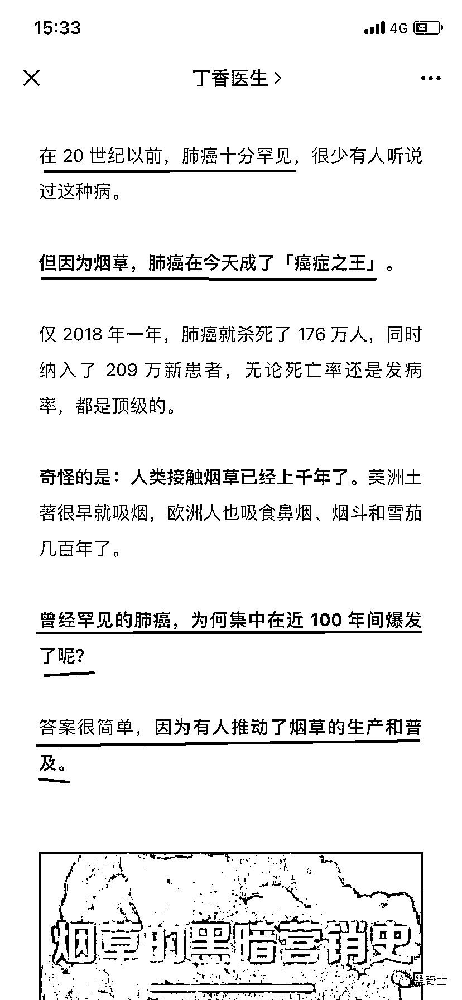
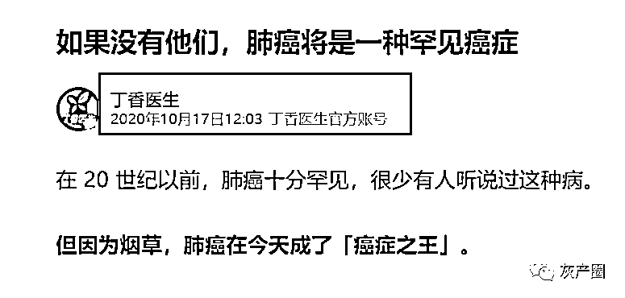

# 说的全是真话，却得出错误的结论，丁香园是怎么误导读者的？

> 原文：[`mp.weixin.qq.com/s?__biz=MzIyMDYwMTk0Mw==&mid=2247539847&idx=3&sn=4862eb3510fba2454839d110c8711ccd&chksm=97cb97bfa0bc1ea9cf54842b4eefc0fd16fc6938df6c550a68ca515a722f44180698997d0fc9&scene=27#wechat_redirect`](http://mp.weixin.qq.com/s?__biz=MzIyMDYwMTk0Mw==&mid=2247539847&idx=3&sn=4862eb3510fba2454839d110c8711ccd&chksm=97cb97bfa0bc1ea9cf54842b4eefc0fd16fc6938df6c550a68ca515a722f44180698997d0fc9&scene=27#wechat_redirect)

2022 年 7 月 2 日，知名医疗专业“丁香园”在自己的公号上推送了一篇文章，《[如果没有他们，肺癌将是一种罕见癌症](https://mp.weixin.qq.com/s?__biz=MjA1ODMxMDQwMQ==&mid=2657747998&idx=1&sn=166bd07b000883b22516d721e62ee511&scene=21#wechat_redirect)》

刚看到这个题目的时候，还觉得挺专业的样子。但打开文章看了一眼，马上发现了问题，这篇文章通过选择性的数据，得出了跟真实情况完全不同的结论。

这是什么意思？

一件事情的发生，有 A、B、C 三个直接因素同时出现，我选择性的只告诉你 A，那你就被我误导了。

丁香园的这篇文章就采用了这种手法。下面，我来详细说一下。

**丁香园通过选择性的提供真实数据，误导读者作出错误结论** 

看下图： 

注意我标出来的 4 句话： 

1、20 世纪之前，肺癌十分罕见（指出事实）

2、因为烟草，肺癌成了癌症之王（提出论点） 

3、曾经罕见的肺癌，为何在 100 年内成为癌症之王？（提出悬念，引人继续读）

4、因为烟草工业的发展（给出完美结论）

这四句话层层推进，看起来是个完美的逻辑闭环。

但这个推演，是有逻辑漏洞的。

固然，烟草是引发肺癌的第一大杀手。但文中也说，人类使用烟草的历史有上千年，为什么过去的烟草没有造成那么大的危害？

文中给出的结论是，因为以前没有商业机构的推广。

但恰好，我知道一点医学在 20 世纪的发展史，这个发展史把这篇文章戳了个大窟窿。

这就是：英国细菌学家亚历山大·弗莱明，在 1928 年发明了青霉素（盘尼西林），青霉素在第二次世界大战中的广泛使用，使得人类寿命得到了大幅提升。

查阅资料可知，我国在刚建国时，因为医疗条件的限制和种种其他因素，人均寿命仅有 35 岁。到了 2021 年，人均寿命已经涨到了 78.2 岁。 

而年龄差异，正是各种肿瘤发作的关键因素。 

根据国家癌症中心发布的肺癌报告（2020），在我国的肺癌患者中，40 岁以下发病率相对较低，此后随着年龄的增长而迅速上升，在 80 至 84 岁达到峰值。（这是考虑了烟草对中国人影响之后的数据）

而 1950 年，我国的人均寿命仅有 35 岁！

那，所谓的“20 世纪之前，肺癌十分罕见”是不是就能解释通了？因为绝大多数中国人根本没活到癌症高发年龄段，就已经逝世。

跟烟草工业毫无关系，那篇文章后面的论证都已经成了屁话。

**同样文章在两年内重复发表，背后有啥隐情？** 

我看到的，是 2022 年 7 月 2 日，丁香园公众号发出的版本。 

但通过百度搜索，我找到了他们在 2020 年 10 月 17 日，在腾讯新闻发布的版本。题目也是《如果没有他们，肺癌将是一种罕见的癌症》，链接是 https://view.inews.qq.com/a/20201017A05V4K00

这种文章，有啥必要一字不改的发来发去？这两年内，肺癌发病率有变化，还是烟草工业有变化？

但我看这篇文章，从题目到内容，一字未改。

想不明白，也许丁香园的老板是个疯狂的禁烟爱好者吧。

**我的一点感想：吸烟确实有害健康，但通过误导公众挑逗公众情绪不可取**

吸烟有害健康已经是目前现代社会的共识，他会引发呼吸系统的肿瘤，会引发心脑血管疾病，危害极大。

但这并不意味着专业医疗网站，就能凭空挑逗公众情绪，用错误的方法去实现自己的目的。

如果是我写这篇文章，比较一下世界上主要国家的吸烟人群比例，以及肺癌在国民中的发病率，就能得出一个可信的结论，干嘛要这么骗人呢？东拉西扯无关的历史，让人觉得你很博学，其实狗屁不通。（我国烟民大约 3.5 亿，肺癌发病率大约 10 万分之 36）

参考资料： 

1、中国肺癌报告：https://www.cn-healthcare.com/articlewm/20201110/content-1161506.html

2、丁香园公众号

3、世界无烟日新闻：https://www.163.com/dy/article/H8KJ5F150530WJIN.html

来源：司马子羽 黑奇士

← 向右滑动与灰产圈互动交流 →

# 原文：[`mp.weixin.qq.com/s?__biz=MzIyMDYwMTk0Mw==&mid=2247539847&idx=4&sn=84cc86deea3bb35623ad7ec6b6c2323b&chksm=97cb97bfa0bc1ea90bfdbfc0222a0cbcea6c71620dcf735ac19688bf4fc82fec26d89423fc72&scene=27#wechat_redirect`](http://mp.weixin.qq.com/s?__biz=MzIyMDYwMTk0Mw==&mid=2247539847&idx=4&sn=84cc86deea3bb35623ad7ec6b6c2323b&chksm=97cb97bfa0bc1ea90bfdbfc0222a0cbcea6c71620dcf735ac19688bf4fc82fec26d89423fc72&scene=27#wechat_redirect)