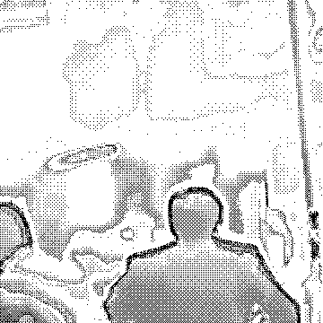
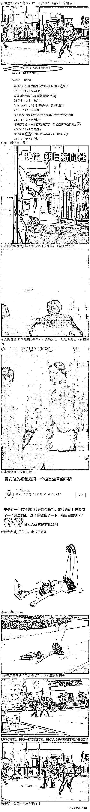
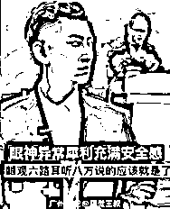
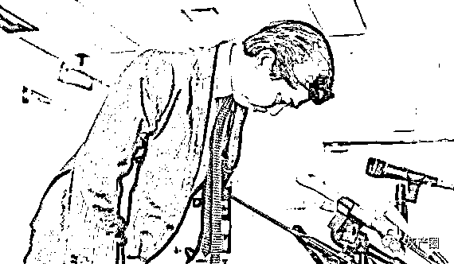

# 安倍被毙现场，保镖把一位 JK 少女撞翻，保镖毫不犹豫，放弃安倍扶 JK

> 原文：[`mp.weixin.qq.com/s?__biz=MzIyMDYwMTk0Mw==&mid=2247539847&idx=5&sn=4c583a832e3441383c86759442fcdbbe&chksm=97cb97bfa0bc1ea9b89185d138897e2fcbbc048ba208bf9616f3053b3a7f741461dc3223063c&scene=27#wechat_redirect`](http://mp.weixin.qq.com/s?__biz=MzIyMDYwMTk0Mw==&mid=2247539847&idx=5&sn=4c583a832e3441383c86759442fcdbbe&chksm=97cb97bfa0bc1ea9b89185d138897e2fcbbc048ba208bf9616f3053b3a7f741461dc3223063c&scene=27#wechat_redirect)

安倍遇刺时，路对面的一位保镖要冲过来救驾
然而却把一位 JK 少女撞得人仰马翻！
保镖毫不犹豫，放弃安倍扶 JK，任由枪手打出了致命的第二枪。

据日本广播协会（NHK)报道,  安倍当天遇袭时两枪间隔近 3 秒，日本警察厅认为现场警官未遵循日本警察应对指南行动来应对。

[`mp.weixin.qq.com/mp/readtemplate?t=pages/video_player_tmpl&action=mpvideo&auto=0&vid=wxv_2478132261583028224`](https://mp.weixin.qq.com/mp/readtemplate?t=pages/video_player_tmpl&action=mpvideo&auto=0&vid=wxv_2478132261583028224)

现场警察按规定在听到第一声枪响时，应首先让保护对象俯身并围在他的中间，然后立即转移至车内或其他安全场所。但现场数十名警察包括便衣在内都没有这么做。

这老图又被翻出来了

最终，日本警察对此事鞠躬道歉。

* * *

编剧-马尼:保镖：他都快死了，我还是扶活人吧。

快速打印激光打印双面打印 3D 打印:唯一一个做了正确事的人

论道询理:这要是同时摔十个，保镖就没人救驾了

来源：微博那些事儿

← 向右滑动与灰产圈互动交流 →

