# WPS 被爆“删除用户本地文件”？你上传的每一个文档，都会被人监视......？

> 原文：[`mp.weixin.qq.com/s?__biz=MzIyMDYwMTk0Mw==&mid=2247539847&idx=6&sn=a03349df3cead256e33e1c44c162b50e&chksm=97cb97bfa0bc1ea9a075ab503d2e80f3e497119bf59b1f4361377bad3c249f80107a9069c83a&scene=27#wechat_redirect`](http://mp.weixin.qq.com/s?__biz=MzIyMDYwMTk0Mw==&mid=2247539847&idx=6&sn=a03349df3cead256e33e1c44c162b50e&chksm=97cb97bfa0bc1ea9a075ab503d2e80f3e497119bf59b1f4361377bad3c249f80107a9069c83a&scene=27#wechat_redirect)

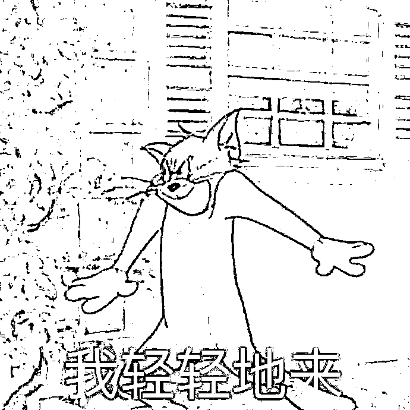

**小伙伴们平时是用什么办公软件呀?**

西西比较习惯用 WPS 写文章。

虽然广告有亿点点多，但用起来还算顺手。 

结果就在昨天......WPS...它就...出事了。

有网友在论坛上曝光，称**自己写的一百多万字的稿子，被 WPS 窥稿并自行封锁严禁访问，连修改都不能修改。**

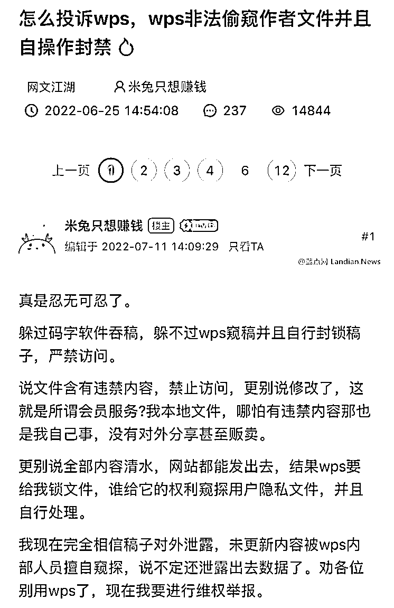

这位网友表示自己文件的内容，不涉黄不涉政，也没有上传或者收藏分享，在其他网站上都能发出去，但却在 WPS 上被锁定。

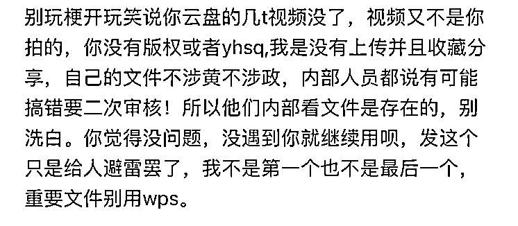

当这位网友向 WPS 申诉的时候，内部人员表示有可能搞错了，需要二次审核。

这就说明**WPS 内部审查文件的事情是存在的。**

当事人曝光这件事后，许多网文圈已经人心惶惶，生怕几十万字的稿子遭遇不测，那么自己的努力和付出就可能打水漂了。许多人开始选择其他软件写文，以免出问题。

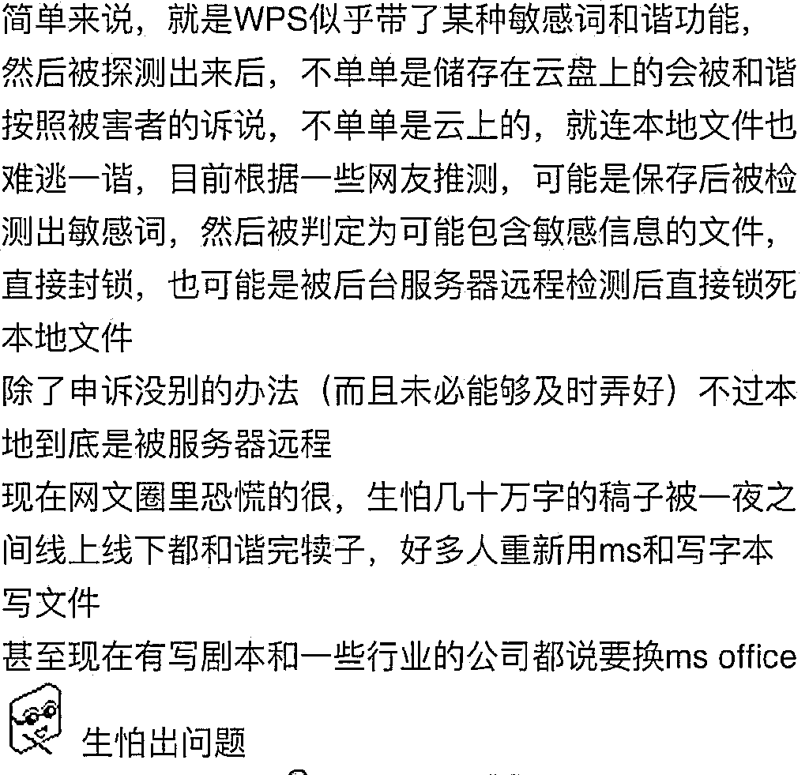

昨天有博主搬运这条爆料，于是**#WPS 被爆会删除用户本地文件#**的话题被冲上热搜。

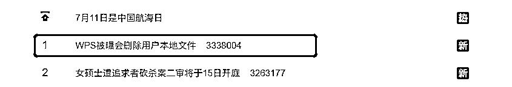

不少网友反馈，终于知道自己的辛苦改的论文和一整套汇报为什么不见了。

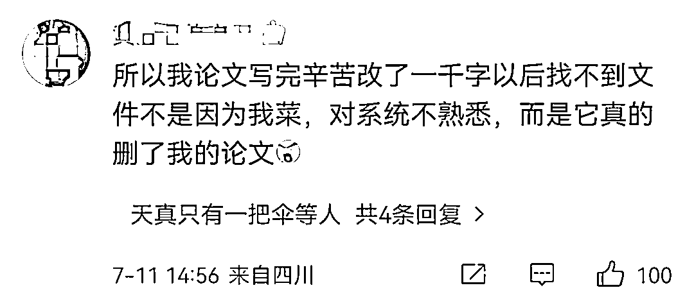

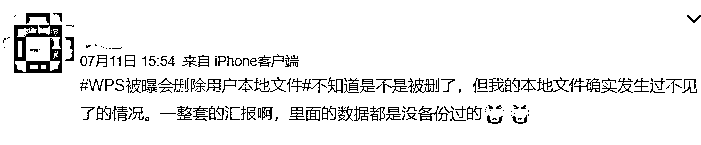

有人表示曾经写剧本被封过文档，丈夫工作原因需要总结外网视频链接，导致几年的表格被封了。 

还有用户在投诉平台上表示，**WPS 未经允许损坏电脑中的文件，如果想恢复可以，但是需要另外收费。**

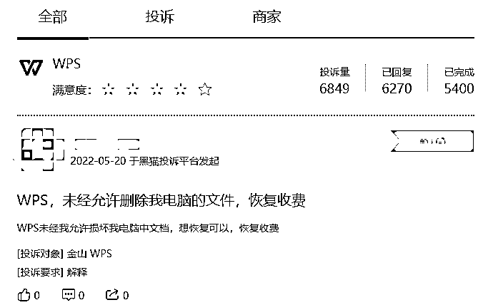

有些类似情况的不在少数。

个人文档这么隐私的东西，WPS 竟然能干这种事？！

有网友表示瑟瑟发抖：

**“有点惶恐每天我在干什么感觉都在被人监视”**

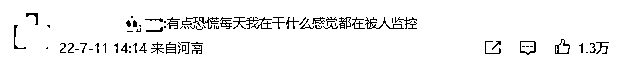

有网友表示见怪不怪：

**“大数据时代，隐私已经不算隐私了。”**

也有网友质疑 WPS：

**“我在本地保存的文件你有什么权利去删除或锁定？”**

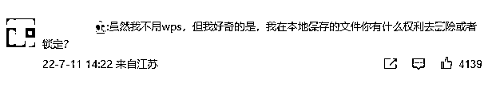

这就问到了点子上了......

软件未经用户许可，直接删除和锁定文件，而用户无法掌控自己的文件，这一点真的合规吗？

而且连论文，汇报等重要资料都被锁定，如果官方不恢复回来，那给软件是不是要承担用户造成的损失......

至关重要的一点是，软件侵犯个人隐私审核文档，怎么能保证文件不会泄露？

如果是写论文写专利写小说，内容都被审完，还要不要发表了？

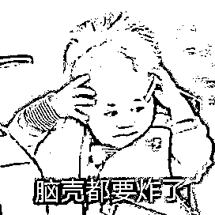

WPS 客服对媒体回应称，目前官方已经注意到这个情况了，技术部门正在核实和处理。

**正常情况下，后台不会操作用户的本地文件。**

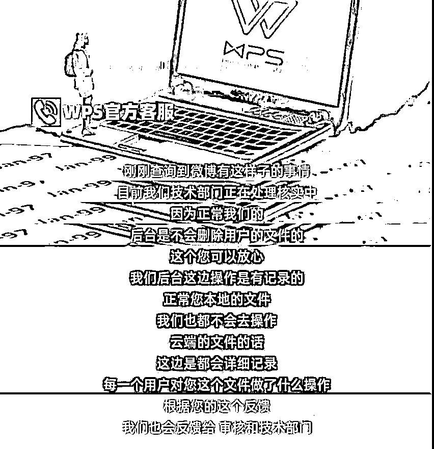

这一回应引起了许多网友的质疑：

**也就说不正常的情况下，后台就能随意操作本地文件？**

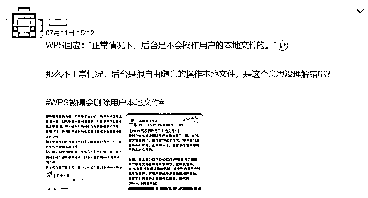

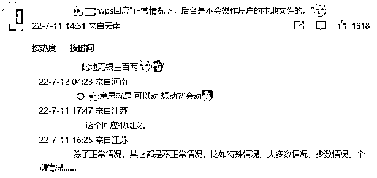

随后，WPS 对此发布了回应声明表示，**“删除用户本地文件”的说法属于讹传，纯属误导。**

由于用户分享的在线文档链接涉嫌违规，WPS 才依法禁止了他人访问该链接。

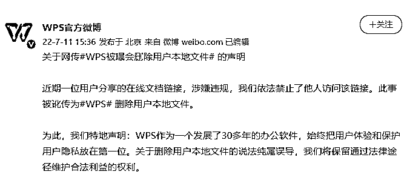

也就是说 WPS 审核和封锁的只是云文档，而不是本地文档......

然而，网友们对 WPS 的回应却并不买账，大部分都认为 WPS 的行为已经越界了。

**“你怎么知道是违规的？你偷偷打开别人文件检查了”**

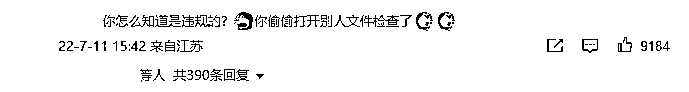

**“你只是个工具，什么时候变执法者了”**

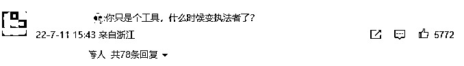

**“你有什么权利屏蔽用户自己在云文档中建立的文本？你可以禁止分享，但是动到源文件就是你越红线。”**

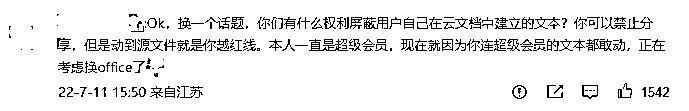

在声明发布没多久，爆料的当事人再次发帖澄清，表示**自己的文件本身没有问题，而是 WPS 检测功能出现漏洞，导致文件被锁。**

而且被锁的文件只在配合 WPS 内部人员调查时分享过，并非官方声明中所说的“用户分享的在线文档链接涉嫌违规”。

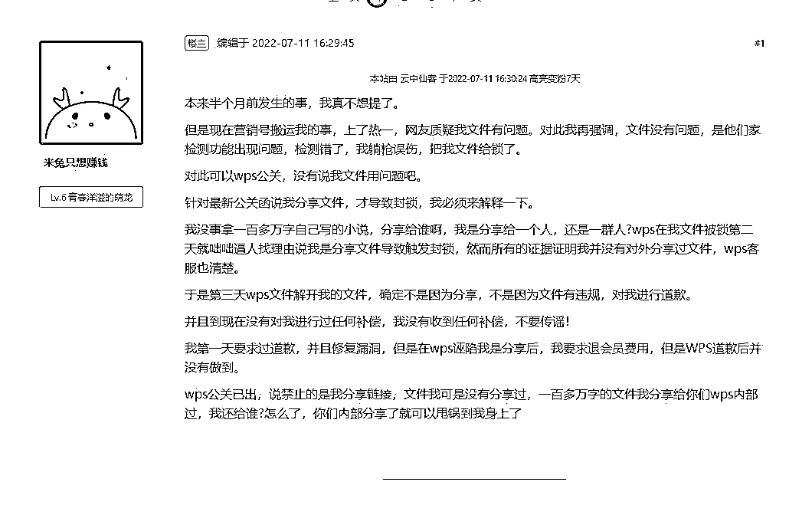

当时 WPS 向她道歉，承诺加强系统检测功能；而现在事情闹大，WPS 就倒打一耙。

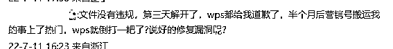

当事人还表示，**她从未说过本地文件被删。**

**本地文件能打开，但是不是编辑后的最新版本。**

而最新版本的文件被 WPS 封锁，无法打开。

**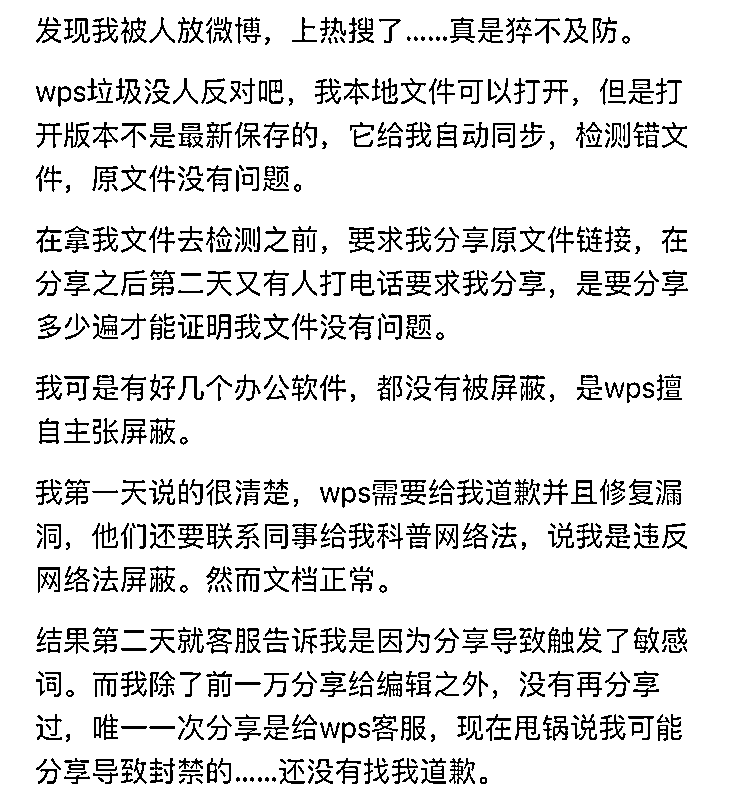**

**所以就是说 WPS 审核文档是真的，封锁在线文档和编辑后的文档是真的，只有删除本地文件是假的。**

**‍‍‍‍‍‍‍‍‍‍‍‍‍‍‍‍‍‍‍‍‍‍‍‍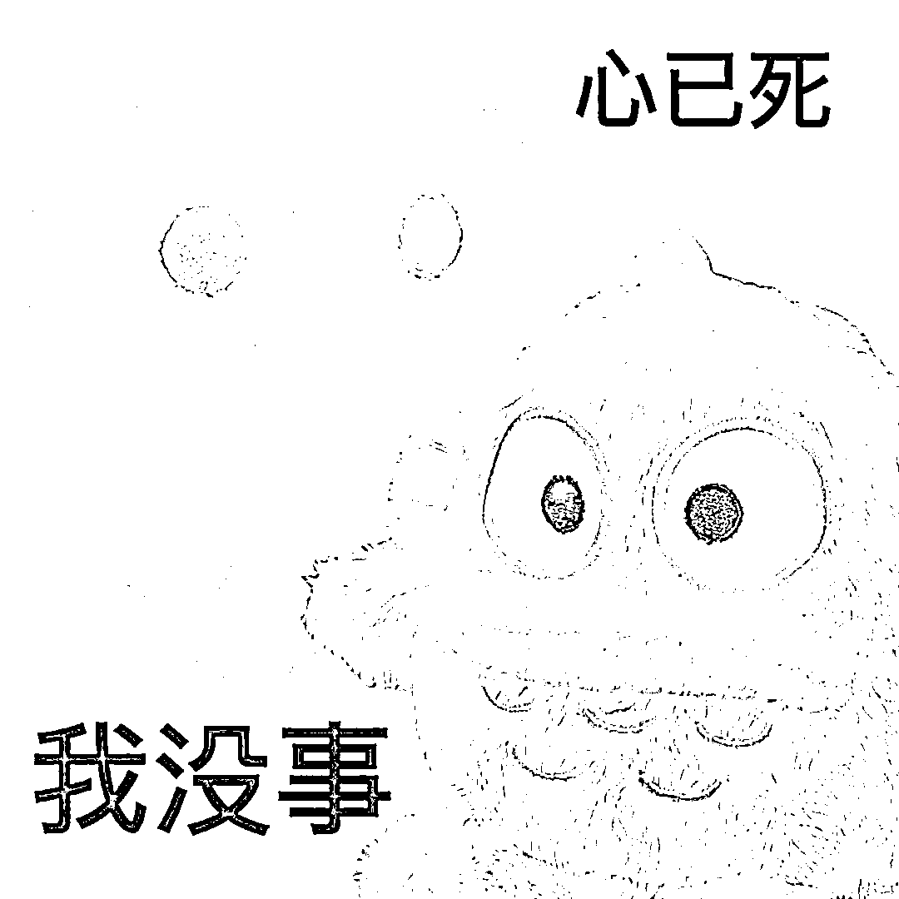‍‍‍‍‍‍‍‍‍‍‍‍‍‍‍‍‍‍‍‍‍‍‍‍**

**云文档审查应该是跟某云盘一样的性质，一旦触碰到违规的敏感内容就要被封锁。**

**但就这么一弄吧，反正西西不敢把任何文件传到云文档上面操作了。**

**你们呢？**

**来源：新媒体管家**

********

**← 向右滑动与灰产圈互动交流 →**

****