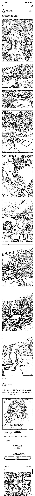
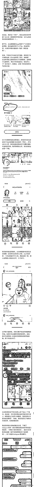
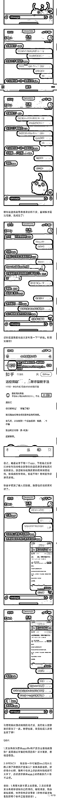

# 蔚来车友 App 出现“擦边女”？

> 原文：[`mp.weixin.qq.com/s?__biz=MzIyMDYwMTk0Mw==&mid=2247539907&idx=1&sn=74a2d8749d14e689a3ef918d8d748b10&chksm=97cb97fba0bc1eed31161e2f967318ad99a0e25890d957f6b2dc68f6edc077929454ca4c5f3e&scene=27#wechat_redirect`](http://mp.weixin.qq.com/s?__biz=MzIyMDYwMTk0Mw==&mid=2247539907&idx=1&sn=74a2d8749d14e689a3ef918d8d748b10&chksm=97cb97fba0bc1eed31161e2f967318ad99a0e25890d957f6b2dc68f6edc077929454ca4c5f3e&scene=27#wechat_redirect)

昨天博主@王落北 在社交平台发文称，@蔚来 App 上被发现有一女用户常常发布自己露骨的“擦边”照片，并获得大量粉丝的关注。经网友调查发现，该用户实则为果聊诈骗团伙的成员。
据了解，该蔚来 App 上的“美女”用户通常会通过与其他车友用户私信聊天的方式，劝说其下载指定的软件以获取更多大尺度照片与所谓的“福利”。据介绍，该诈骗软件在下载完成后，便会自动获取该用户的通讯录、相册等个人信息。在新的软件上，该位“美女”将继续诱导用户进行裸聊，以获取更多私人信息用于后续的威胁转账。

* * *

ddplqbb:我们奔驰车主就没这么多事儿

是谁带走光阴的故事改变了一个人:我们雅迪车主就没有这么多事。

Profeto_:我们五菱车主就没有这么多事。

来源：微博那些事儿

](https://mp.weixin.qq.com/s?__biz=Mzg5ODAwNzA5Ng==&mid=2247487973&idx=1&sn=1b62da6f2018402862a5c375e10c355e&chksm=c06878b2f71ff1a4fbe7df4dec626aa7e696154751693bf16f6c6a302ceaa4d1959040c70518&scene=21#wechat_redirect)

← 向右滑动与灰产圈互动交流 →

