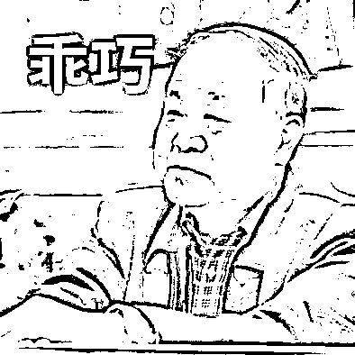

# 莫言在线打假：“快把自己的‘孩子’和稿费领回去”

> 原文：[`mp.weixin.qq.com/s?__biz=MzIyMDYwMTk0Mw==&mid=2247539907&idx=2&sn=e9403de7a3c7ee29d881db858067f49f&chksm=97cb97fba0bc1eedb4df8118b9dccd1a2a60ac45c7b21ad76744f5981b705f6adae99fd2c178&scene=27#wechat_redirect`](http://mp.weixin.qq.com/s?__biz=MzIyMDYwMTk0Mw==&mid=2247539907&idx=2&sn=e9403de7a3c7ee29d881db858067f49f&chksm=97cb97fba0bc1eedb4df8118b9dccd1a2a60ac45c7b21ad76744f5981b705f6adae99fd2c178&scene=27#wechat_redirect)

7 月 11 日， 

中国当代作家、诺贝尔文学奖获得者莫言

在个人公众号上发布一篇名为

**《莫言：这些作品真不是我写的》**的文章。

文章中，

莫言对一些谣传是其本人所写的

文章和诗词金句做了澄清，

还不忘配上本人表情包。

[`mp.weixin.qq.com/mp/readtemplate?t=pages/video_player_tmpl&action=mpvideo&auto=0&vid=wxv_2484918593630126080`](https://mp.weixin.qq.com/mp/readtemplate?t=pages/video_player_tmpl&action=mpvideo&auto=0&vid=wxv_2484918593630126080)

视频中提到的假冒作品包括

《你若懂我，该有多好》《莫言说》

《我》和一些诗词金句等。

对于这些署名莫言的作品，莫言表示：

**“以上都不是我说的。——莫言”**

还配上了“告辞”的表情包↓↓

莫言透露，

自己还曾因诗歌《你若懂我，该有多好》

被选入某大学教材而收到 400 元稿费，

**并在文中向原作者发布了“失物招领”↓↓**

他也一并向《我》等作品的原作者

发出“认领邀请”，

幽默表示**“这些作者都是才华横溢，**

**完全可以用自己的名字发自己的作品，**

**用我的名字，岂不是便宜了我。”**

**多次“打假”的莫言：**

**人在家中坐，“名言”天上来？**

这不是莫言第一次发微博“打假”。

**——“理不糙，可我也想知道这是谁写的。”**

**——“写得挺好，没有必要署我名字。”**

**——“非我所作”“不是俺写的”**

幽默诙谐的语言背后，

是莫言先生的无奈。 

**杨绛、张爱玲......**

**名人名言成为“流量密码”**

除了莫言，网络上也常常流传着

**杨绛、张爱玲**等作家的“名人名言”，

让网友难辨真假。

2013 年，杨绛先生生日前后，

**“杨绛百岁感言”**在网络上流行一时。

杨绛作品版权所属的人民文学出版社

在问询过杨绛本人之后，

正式在官微辟谣。

此外，据媒体报道，

**部分盗版书籍为了营销，**

**往往通过虚构不存在的“名人名言”，**

**制作成短视频进行传播，**

**并和图书捆绑销售。**

而短视频的主角，

一般是知名作家或是商业巨头。

例如，张爱玲语录

“活的认真，笑的放肆，

抬头遇见的都是柔情”，

就是杜撰的。

**冒名作品的最大受害者——鲁迅先生**

多篇作品被收录进教科书的鲁迅先生，

可以说是冒名作品的最大“受害人”。

**一句不知出处的“鸡汤”，**

**加上“鲁迅名言”的标签，**

**瞬间就变得有道理了许多******

“人只要有钱，烦恼就会减掉 90%以上，

情商和智商也会提高，更不会乱发火。”

社交媒体上，

不断有网友发布一些所谓“名人名言”，

并标上“鲁迅说过”。

此前，北京鲁迅博物馆上线了

“鲁迅博物馆资料查询在线检测系统”，

网友可通过该系统查询**“鲁迅说过的话”**，

帮助鲁迅先生一键打假

网友：

**你有没有被伪·名人名言唬住过？** 

**评论区聊聊~**

来源：央视网综合莫言个人公众号、中国青年报、新华社、北京日报、封面新闻

](https://mp.weixin.qq.com/s?__biz=Mzg5ODAwNzA5Ng==&mid=2247487973&idx=1&sn=1b62da6f2018402862a5c375e10c355e&chksm=c06878b2f71ff1a4fbe7df4dec626aa7e696154751693bf16f6c6a302ceaa4d1959040c70518&scene=21#wechat_redirect)

← 向右滑动与灰产圈互动交流 →

