# "嗨兔直播”app 被安徽警方查封！

> 原文：[`mp.weixin.qq.com/s?__biz=MzIyMDYwMTk0Mw==&mid=2247539907&idx=3&sn=8998f7727592935b661a871a80d4be45&chksm=97cb97fba0bc1eed8ad9843862d50ba1a2a9919e9b863fb92316ac2b32749f9a8b8302fdaaef&scene=27#wechat_redirect`](http://mp.weixin.qq.com/s?__biz=MzIyMDYwMTk0Mw==&mid=2247539907&idx=3&sn=8998f7727592935b661a871a80d4be45&chksm=97cb97fba0bc1eed8ad9843862d50ba1a2a9919e9b863fb92316ac2b32749f9a8b8302fdaaef&scene=27#wechat_redirect)

冒充女主播实施诈骗

**"嗨兔直播”app****被安徽警方查封**

**现场抓获犯罪嫌疑人 169 人**

涉案 3000 余万元

▼**先来看一段现场抓捕视频**

[`mp.weixin.qq.com/mp/readtemplate?t=pages/video_player_tmpl&action=mpvideo&auto=0&vid=wxv_2484355389770285058`](https://mp.weixin.qq.com/mp/readtemplate?t=pages/video_player_tmpl&action=mpvideo&auto=0&vid=wxv_2484355389770285058)

6 月 10 日天长警方在对先前破获的

直播类电信网络案件拓展研判发现

2022 年 2 月至今

犯罪嫌疑人罗某等经营的“众锐传媒”公司

**在贵阳利用**

**“嗨兔直播”平台总代理权限**

**招募男性员工冒充女主播**

物色男性客户

并以诱导观看直播

和打赏的方式实施诈骗

数额达 200 余万元

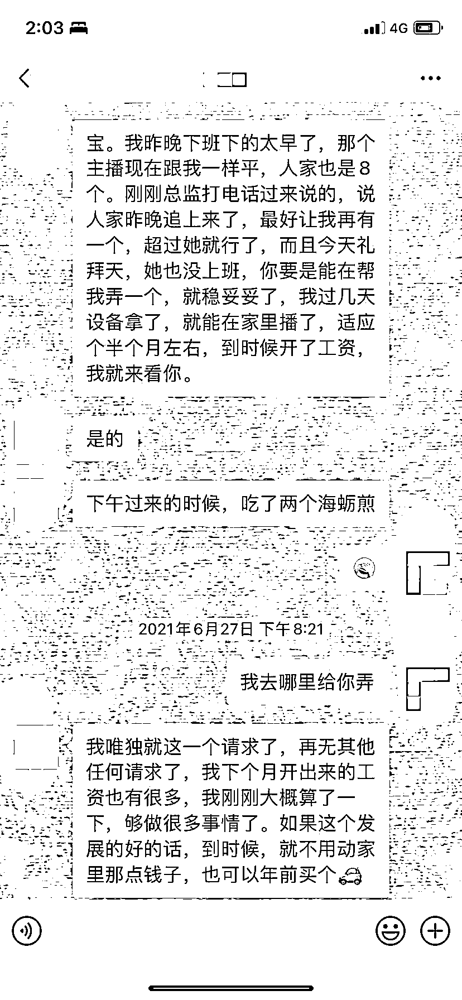▲女主播设虚假 PK 骗受害人充值打赏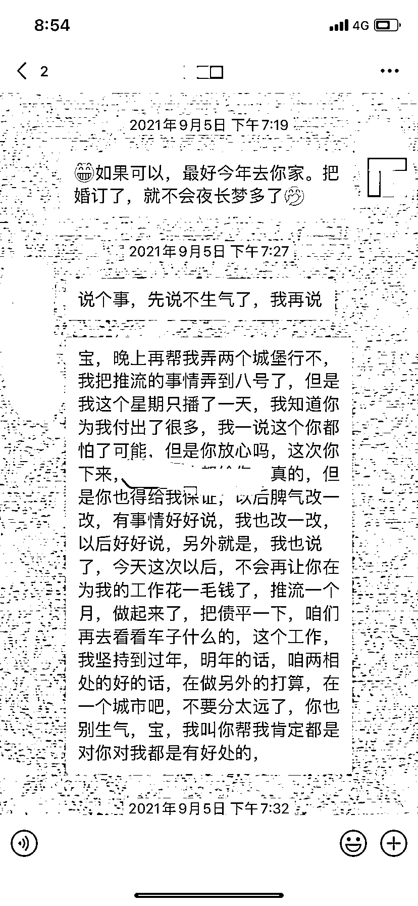▲以恋爱结婚为幌子再三要求受害人充值打赏

发现案件线索后

**天长警方迅速成立专案组**

先后四次前往

贵阳、厦门、长沙等地

开展调查取证工作

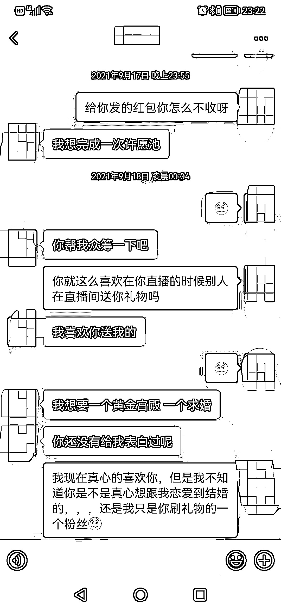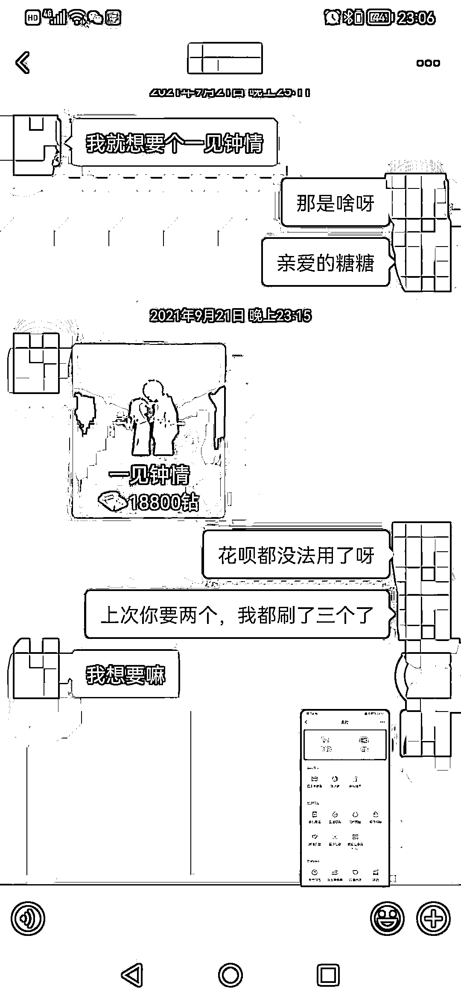

▲“许愿池”“黄金宫殿”“求婚”“一见钟情”是直播平台虚拟礼物，需充值购买打赏女直播

最终查明

**罗某等人为获取非法利益**

主动与厦门某传媒科技集团公司取得联系

**取得“嗨兔直播 APP”贵州总代理权**

以他人名义注册了

“众锐传媒”网络直播公司并发展下线

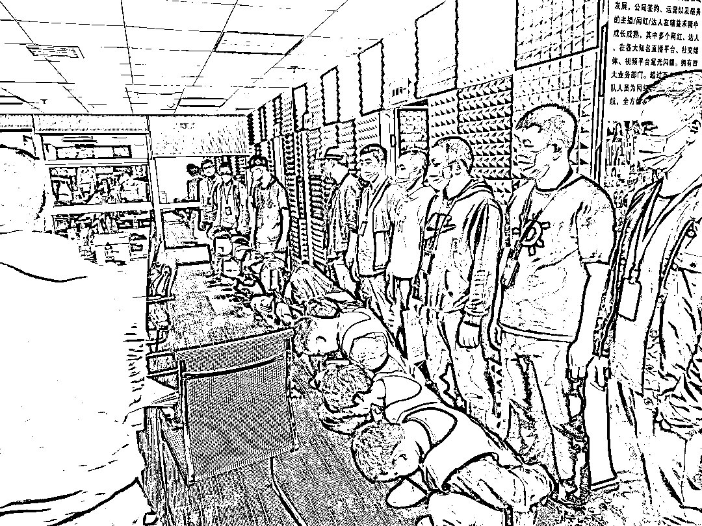

各下级网络直播公司

再通过网络平台在多地

招聘女主播、运营等人员

通过美女网络直播

男运营冒充女主播聊天

编造虚假 PK、“打转正”等方式

引诱粉丝为主播刷礼物从而骗取钱财

**后直播平台公司、网络直播公司**

**主播、运营按比例分成**

受害人遍及全国 31 个省市

涉案资金 3000 余万元

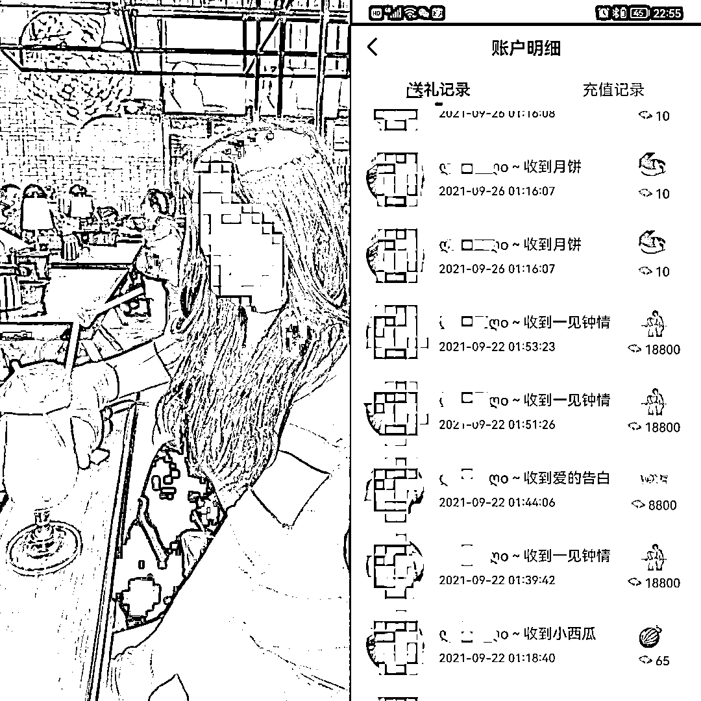

▲女主播编造虚假身份，按照话术本打造人设，骗取受害人充值打赏

该诈骗团伙所使用的

**“嗨兔直播”平台由厦门“星美播”公司开发**

公司经营者林某、曾某等人

在明知其名下公司的“嗨兔直播”平台

**利用男员工冒充女主播**

**并采取谈恋爱、一夜情等方式**

**诈骗粉丝的情况下**

仍为此类网络直播公司

提供主播平台、技术支撑

和支付结算等服务

同时厦门“星美播”公司的母公司为

厦门某传媒科技集团公司

该公司在贵阳市注册有

11 家网络直播公司

均在使用“嗨兔直播”平台进行诈骗

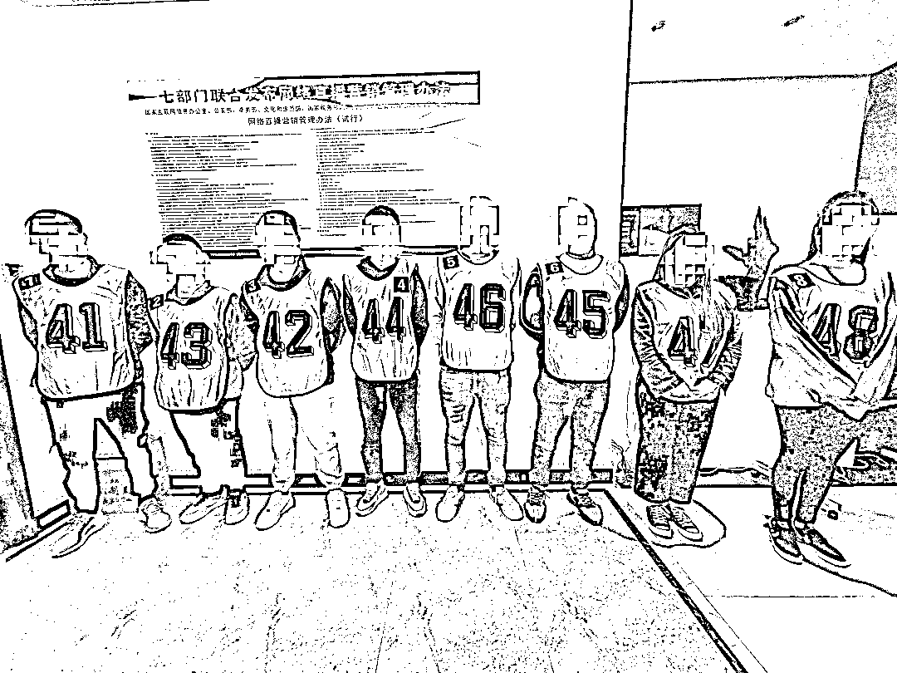

专案组固定大量犯罪证据后

6 月 15 日

**天长警方抽调 120 名警力**

**赶赴厦门、贵阳**

在两地警方的大力支持下

对贵阳、厦门十二个窝点同时收网

成功将罗某、林某等

169 名犯罪嫌疑人抓获

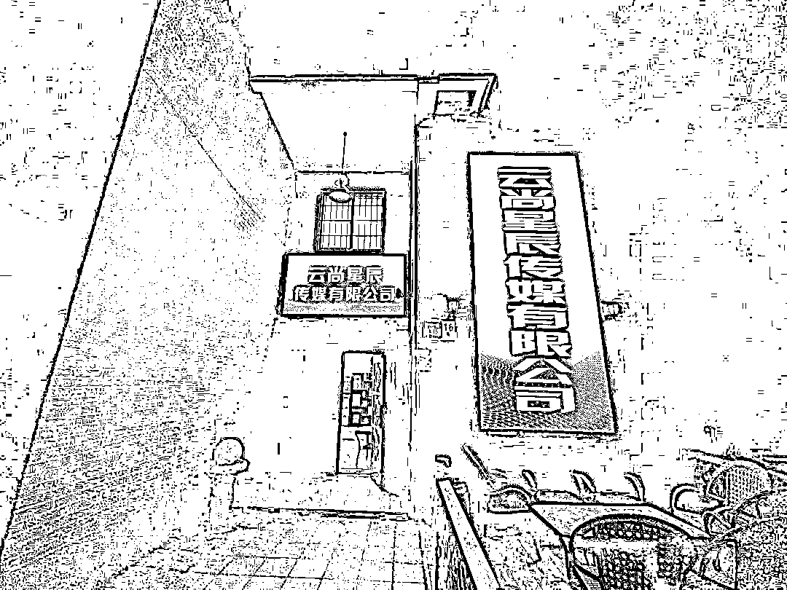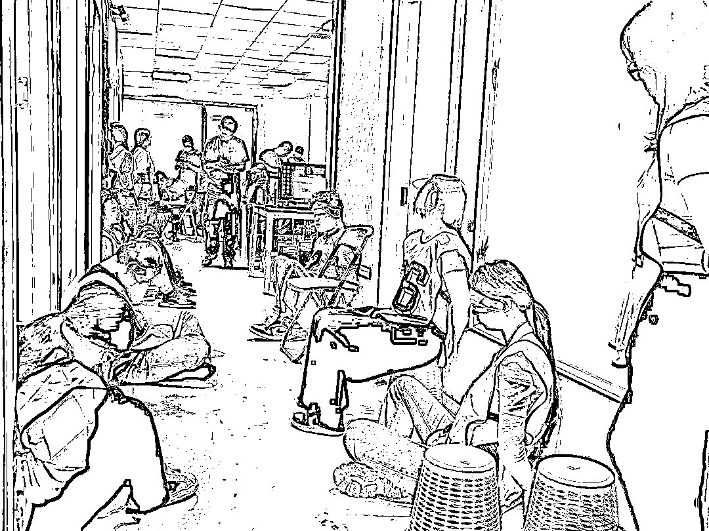

目前

**该案主要犯罪嫌疑人**

**均被天长警方采取刑事强制措施**

此案正在进一步侦查中

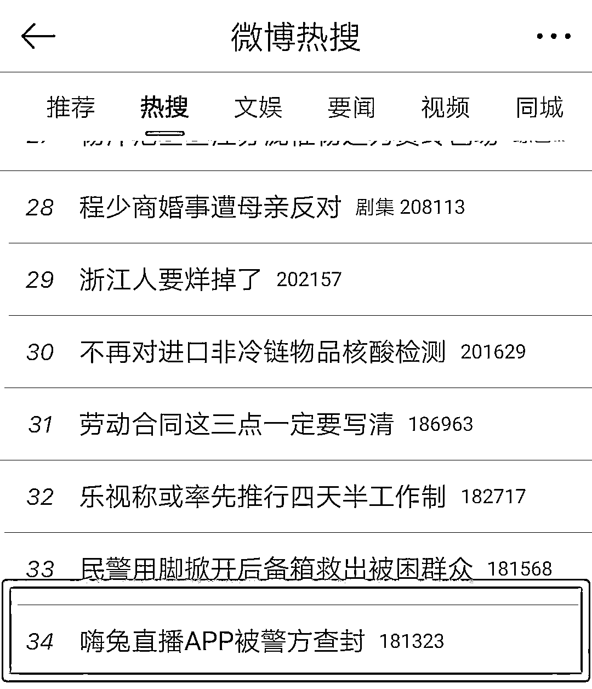

事情传到网上后 

**网友纷纷点赞警方此次行动**

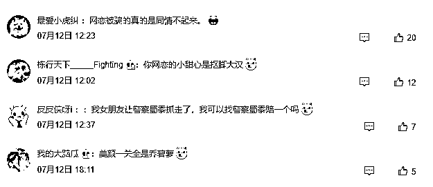

** 警方提醒 **

网络恋爱需谨慎 

涉及钱财要当心

一旦发现被骗

请及时拨打 110 报警

来源：天长警方

](https://mp.weixin.qq.com/s?__biz=Mzg5ODAwNzA5Ng==&mid=2247487973&idx=1&sn=1b62da6f2018402862a5c375e10c355e&chksm=c06878b2f71ff1a4fbe7df4dec626aa7e696154751693bf16f6c6a302ceaa4d1959040c70518&scene=21#wechat_redirect)

← 向右滑动与灰产圈互动交流 →

# 原文：[`mp.weixin.qq.com/s?__biz=MzIyMDYwMTk0Mw==&mid=2247539907&idx=4&sn=8f87576eed6b74bda7a9f20bd265301b&chksm=97cb97fba0bc1eede4e2a90188c151d346e9ebaf7daabac539103bb0a0af5e4802c5c382d480&scene=27#wechat_redirect`](http://mp.weixin.qq.com/s?__biz=MzIyMDYwMTk0Mw==&mid=2247539907&idx=4&sn=8f87576eed6b74bda7a9f20bd265301b&chksm=97cb97fba0bc1eede4e2a90188c151d346e9ebaf7daabac539103bb0a0af5e4802c5c382d480&scene=27#wechat_redirect)