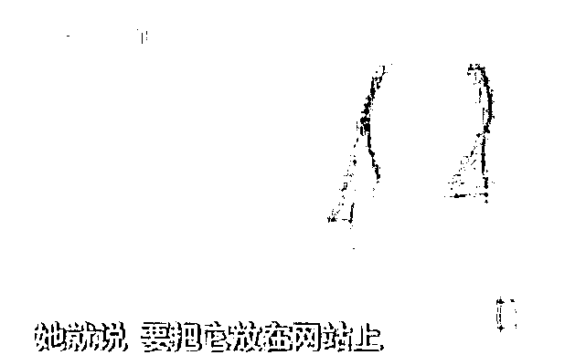
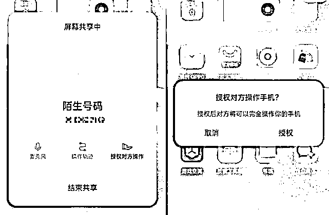
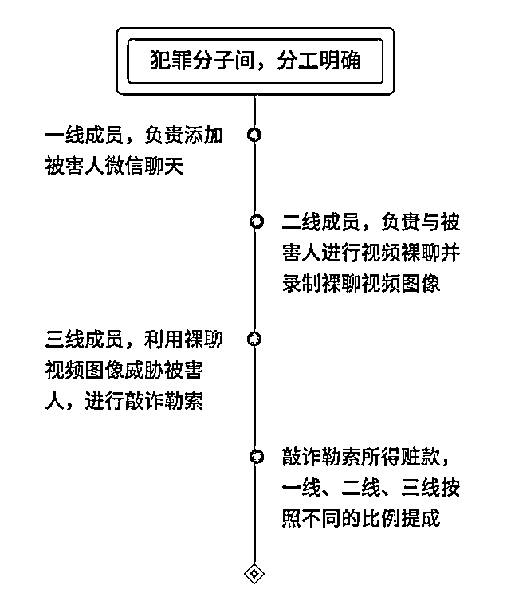

# 裸聊敲诈真实录音曝光！他们就这样落入陷阱的...

> 原文：[`mp.weixin.qq.com/s?__biz=MzIyMDYwMTk0Mw==&mid=2247539907&idx=5&sn=abfde9236d574a61270db0a7ae73ae22&chksm=97cb97fba0bc1eed9526224adccd8f56e7040422b911bd792d2a6b224a35d51bed4bea518617&scene=27#wechat_redirect`](http://mp.weixin.qq.com/s?__biz=MzIyMDYwMTk0Mw==&mid=2247539907&idx=5&sn=abfde9236d574a61270db0a7ae73ae22&chksm=97cb97fba0bc1eed9526224adccd8f56e7040422b911bd792d2a6b224a35d51bed4bea518617&scene=27#wechat_redirect)

近日 

央视公布了一段

裸聊敲诈的真实声音

**“你觉得几千块钱和****你的人格尊严比起来**

**兄弟，你嫌贵**

**那你可以不处理**

**我发出去了，看你怎么做人**

**……”**

[`mp.weixin.qq.com/mp/readtemplate?t=pages/video_player_tmpl&action=mpvideo&auto=0&vid=wxv_2481952170045931521`](https://mp.weixin.qq.com/mp/readtemplate?t=pages/video_player_tmpl&action=mpvideo&auto=0&vid=wxv_2481952170045931521)

案情回顾

案例一

6 月 7 日，网友小嘉（化名）在某柚交友软件上结识了一位“女网友”，二人相谈甚欢，感情迅速升温。次日晚上，小嘉突然接到了该网友的“裸聊”视频邀请，小嘉立即就与对方“坦诚相见”。

▲配图源自网络，与本案无关

过了两天，小嘉突然收到了“女网友”发来自己裸聊的视频片段，紧接着对方以视频要挟小嘉不断向其转账，答应钱到账就删视频。

小嘉因碍于面子希望尽快“了结”此事，便立即按照对方要求将 3800 元、7000 元、2500 元钱一次次转入对方指定的账户。此后，对方仍不断向小嘉提出继续转账的要求，又急又气的小嘉终于意识到这件事就是个无底洞，无奈之下选择了报警。

案例二

5 月 8 日，宿迁警方接到网友小洋（化名）报案，称掉落网络裸聊陷阱。

▲配图源自网络，与本案无关

据小洋讲述，一名陌生女子在某交友软件添加其为好友，简单交流几句后，对方主动提出“裸聊”邀请。在几分钟的“坦诚相见”后，小洋收到了对方发来他的裸聊视频和通讯录截图，对方威胁称要将他的裸聊视频发给亲友。为了息事宁人，小洋向对方转账了 1.2 万余元。

案例三

4 月 19 日，网友小虎（化名）通过 QQ 认识了一个叫“安心”的“女网友”，两人暧昧一段时间后，对方便邀请小虎进行“裸聊”，小虎脑袋一热，便下载了对方提供的某软件并与对方“坦诚相见”。

▲配图源自网络，与本案无关

视频结束后，对方一改之前的“甜言蜜语”，发来刚才的“激情视频”和小虎的手机通讯录，威胁小虎如果不打钱的话，就将这些私密视频发给他的亲朋好友，甚至发到网上。

小虎无计可施，前前后后向对方提供的银行账号内转账 10 次，共计 13.9 万余元，但是对方仍然不依不饶地要求小虎继续汇款，再也没有多余钱的小虎只好选择报警。

总结一下

裸聊的诈骗套路是这样的

**警方提醒**

**请保持洁身自好**

**不要裸聊！**

**不要裸聊！**

**不要裸聊！**

**发现被骗或者被敲诈后**

**不要选择沉默**

**第一时间报警**

**积极配合公安机关调查取证**

来源：深圳市反电信网络诈骗中心

](https://mp.weixin.qq.com/s?__biz=Mzg5ODAwNzA5Ng==&mid=2247487973&idx=1&sn=1b62da6f2018402862a5c375e10c355e&chksm=c06878b2f71ff1a4fbe7df4dec626aa7e696154751693bf16f6c6a302ceaa4d1959040c70518&scene=21#wechat_redirect)

← 向右滑动与灰产圈互动交流 →

