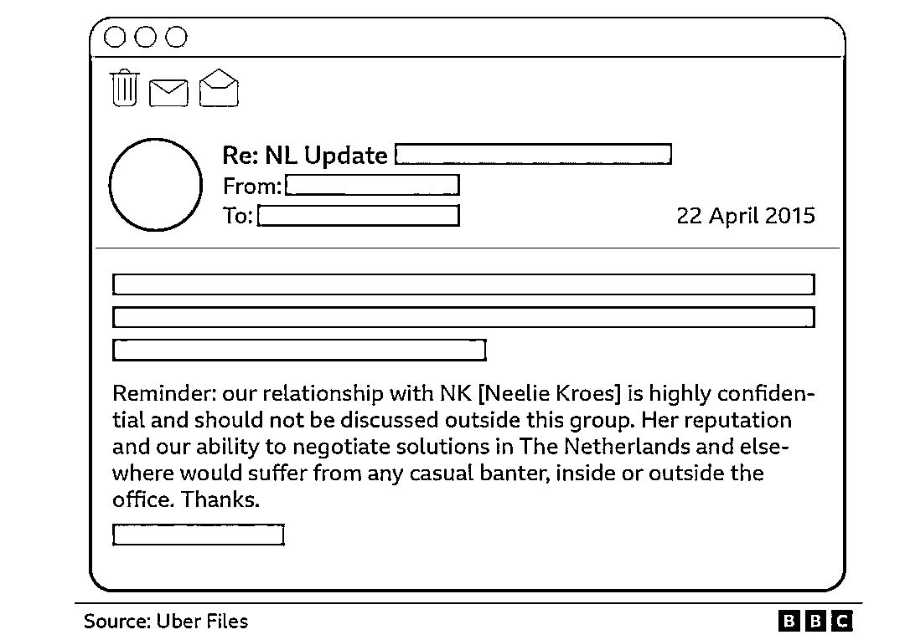

# Uber“最隐秘角落”被公开：12 万份机密资料，曝光黑心发家史

> 原文：[`mp.weixin.qq.com/s?__biz=MzIyMDYwMTk0Mw==&mid=2247539970&idx=1&sn=40379a0b2115c6c38200d2eac3a12fc9&chksm=97cb963aa0bc1f2cf5ce3f66dce06264e9f436c5e09b314592722cf3faadd0b79a66dc8ec2e2&scene=27#wechat_redirect`](http://mp.weixin.qq.com/s?__biz=MzIyMDYwMTk0Mw==&mid=2247539970&idx=1&sn=40379a0b2115c6c38200d2eac3a12fc9&chksm=97cb963aa0bc1f2cf5ce3f66dce06264e9f436c5e09b314592722cf3faadd0b79a66dc8ec2e2&scene=27#wechat_redirect)

斥巨资公关政要、利用司机、逃避监管 

——

文｜Juny   编辑｜VickyXiao

在疫情中沉寂了近两年、市值已然腰斩的全球共享出行巨头 Uber，这两天又重新回到了公众视线的最中心。然而，这一次的回归对于 Uber 来说并不是一件值得高兴的事。从昨天开始，一份由全球 40 多家媒体、180 多位记者共同参与的重磅调查陆续发布，揭露了 Uber 在过去这些年的全球扩张进程中各种毫无底线的操作，包括且不限于：通过政商勾结改写法律法规、恶意利用司机为业务扩张铺平道路、知法犯法删改数据阻挠调查、有组织有计划的大规模避税等。最重要的是，此次 12 万 4 千份来自 Uber 的内部文件，不仅为 Uber 此前各种黑历史传言提供了铁证，同时还打开了一张 Uber 与西方各国政要、亿万富豪、媒体大亨错综复杂的关系网。**在这些曝光文件中，所涉及的人物个个都是政坛“顶流”，包括法国总理马克龙、美国总统拜登、前欧盟委员会副主席尼莉·克罗斯等等。调查显示，该事件所牵扯进的政商届重要人物或超过 1850 人，遍布全球 29 个国家。**目前，此次事件正在不断发酵之中，各国舆论一片哗然。包括法国在内的一些国家已经开始呼吁启动内部调查，甚至一些网友还将此次“优步门”看作是一场“新水门事件“。**｜斥巨资“公关”，直达各国权力中心**此次超过 12 万份的文件由 Uber 前首席游说代表 Mark MacGann 提供，包括了 Uber 高管之间 8.3 万封往来邮件，以及几万份 iMessages 和 Whatsapp 等信息记录、PPT、发票等等，时间跨度在 2013 年到 2017 年。当时的 Uber 主要由其前任 CEO Travis Kalanick 执掌，同时也是 Uber 业务在全球扩张最快的一段时期。2010 年 10 月，Uber 的共享打车业务正式在美国上线，到 2017 年，Uber 就已经成功进入了 全球 80 多个国家，一举成为了硅谷创业场上最耀眼的新星。扩张如此之快的背后，仅仅只是因为其模式的创新吗？**这次的 Uber 档案告诉我们，Uber 最关键的成功助力，是因为他们找对了人。**2014 年，Uber 跟时任法国经济部长的埃马尔·马克龙搭上了线，并由此开始了他们的“秘密联盟”。文件显示，2014 年 10 月，马克龙与 Travis Kalanick 及其他 Uber 高管举行了一次闭门会议，并取得了很多重要“进展”。图片来自 BBC 此后几年，马克龙多次明里暗里为 Uber 站台，包括多次公开表态认可 Uber 模式，签署放宽对 Uber 司机执照的要求的法令，为 Uber 制定拼车服务法规框架等。**从马克龙和 Travis Kalanick 的往来信息中能看出来他们非常熟、利益绑定也非常深。**2015 年 7 月，UberPOP 服务在法国引发巨大争议，Kalanick 便发短信问马克龙：“我们能相信 Caz（法国时任总理 Bernard Cazeneuve）吗？”**马克龙则回复昨天已经与总理进行了会晤，已经与法国内阁秘密达成了交易，他会保证出租车司机们保持冷静，并准备改革法案。**还有一封邮件中，Uber 对马克龙表示感激，说道“我们所受到的开放和欢迎，在任何政商关系中都是不常见的。”而马克龙仅仅只是这场“官商勾结”大戏中的冰山一角而已。**Uber 档案中涉及的另一重要官员是前欧盟委员会副主席尼莉·克罗斯。**她此前主要负责监督数字科技和竞争政策，曾在调查微软和英特尔数字竞争案件中方面发挥了主导作用。此次披露的文件显示，尼莉·克罗斯在在职期间多次要求执法人员为 Uber“开绿灯”，此外她并没有遵守欧盟监管委员行为的 18 个月冷静期规则，在尚未离职期间就已经在商谈加入 Uber 的顾问委员会。在 Uber 的一个内部消息中表示，Uber 明确提出跟尼莉·克罗斯的关系属于高度机密，不允许任何人在群组之外讨论，并且表示尼莉·克罗斯还正在帮忙“游说”时任荷兰首相。图片来自 BBC 文件揭露，在 2016 年达沃斯会议期间，Uber 十几位高管组团参加了此次会议，并通过各种中间人关系跟包括马克令、时任美国副总统拜登、时任以色列总理本雅明内塔尼亚胡、时任爱尔兰总理恩达肯尼、时任爱沙尼亚总统托马斯亨德里克伊尔维斯等世界领导人密会。**当时的 Travis Kalanick 可以说是非常狂妄，在曝光中的短信中他表示，对于迟到的拜登，“ 我已经让我的人让他知道，他每迟到一分钟，他和我在一起的时间就会少一分钟。”**图片来自 The Guardian 而就在他们会面之后，拜登就调整了当天晚些时候在达沃斯上发表的主题演讲，暗地里帮忙为 Uber 宣传。文件显示，光在 2016 年 Uber 用于游说和公关的花费就高达 9000 万美元。**它还曾向俄罗斯、意大利和德国等地的权贵人物，以通过销售 Uber 的股份的方法结成利益相关者，同时招募了大量前公职人员，专门在各国游说政要放松对 Uber 业务的政府监管、改变工人权利政策并起草新的出租车法案等。**据了解，包括法国电信大亨泽维尔尼尔、德国出版大亨阿克塞尔斯普林格、法国时尚大亨伯纳德阿尔诺等都参与其中。在美国，Uber 还为政府官员以提供免费 Uber 乘车服务、“超高级”午餐、免费政治竞选工作、竞选捐款以及各种礼物的方式，来获得美国政府对于 Uber 国际业务的支持。根据此次联合调查组的统计显示，在 2014 - 2016 年间，Uber 高管与 17 个国家的政府高层官员举行了 100 多次会面。**为了更好的与这些政要、富豪和顶级学者保持关联，Uber 还曾委托咨询机构制定了一个在全球 29 个国家超过 1850 人的“利益相关者”名单。**图片来自国际调查记者联盟，The Uber files**｜把混乱当作阶梯：恶意利用司机，转移税收视线**除了使用不正当方式在决策层发力之外，在解决各国爆发的 Uber 抗议危机时，Uber 管理层也采取了大量无底线手段。2016 年，由于 Uber 大力拓展欧洲市场的业务时，引起了比利时、西班牙、意大利、法国等国出租车司机群体的大规模抗议。**对于这些抗议事件，Uber 高层一边积极找各国政要救火，一边居然在下指令让员工煽风点火推动事态升级。**比如，在巴黎的抗议事件中，很多出租车司机的情绪激动，出现了小部分暴力冲突事件。对此，Travis Kalanick 给分公司高管们发信命令进行“报复”，让他们鼓动当地 Uber 司机也发起大规模抗议，意在挑动两边对立升级，引发更大的骚乱，从而达到敦促政府改革法律的效果。在邮件中他说：“拥抱混乱，这意味着你正在做一些有意义的事情……**暴力保证成功**。”一位 Uber 的前高管表示，Uber 当时完全是在“武器化”自己的司机，根本不在乎司机的状况，而是利用他们来逼迫政府让步。图片来自国际调查记者联盟，The Uber files**与此同时，Uber 还会悄悄搜集传统出租车司机在抗议活动中的暴力举动，并将其写成故事，图文并茂地发给当地的媒体，试图在公众中丑化正规的出租车司机的形象。**披露文件中，一位 Uber 的员工向管理层汇报道：“它们（这些报道）明天将在没有我们指纹的情况下在头版发布”。这样的戏码在那几年在很多地方不断上演，成为了 Uber 解决争端的“秘密武器”。**除此之外，Uber 还将原本自己应该承担的税收义务向司机身上转移。**在各国推进业务时，Uber 常常会先发制人地制定确保当地 Uber 司机纳税的 “解决方案”给到政府，从而让各地政府将税收关注对象从公司本身转换到司机身上。这样的策略完全是 Uber 精心策划的。比如在尼日利亚的业务备忘录中，一位当地 Uber 高管就向母公司汇报道“我们会见了拉各斯的税务机关，他们称赞我们在确保司机税收合规方面所做的努力，并成功将他们的重点从优步的‘逃税’转移到共同努力确保司机合规。”除此之外，从 2013 年开始 Uber 就开始谋划“美国—荷兰—百慕大”的避税架构，将欧洲市场的收入，通过知识产权流转机制，全部转移到了避税天堂百慕大，还制造出了 295 亿美元的可抵扣成本，几十年都不用交税。**｜发明 Kill Switch，恶意阻挠监管调查**除此之外，此次文件还披露，面对各国政府对于 Uber 监管和审查，Uber 完全是处于“知法犯法”的状态。在 Uber 内部高管中的对话中可以看到，他们多次提到“我们的业务在许多国家都是不合法的，”“这种做法是非法”的说法，但他们却一致性地选择忽视当地法律，并称自己为“海盗”，表示交通法对于智能手机时代来说已经过时了。**很多国家的监管机构都曾试图突击检查 Uber、搜集其违法经营的证据，但往往都会扑个空，其原因在于 Uber 为了对抗监管，在内部发明了一项名为 Kill Switch 的功能。**这个功能的作用是当 Uber 的办公室遭到突袭时，能够快速切断本地设备对公司主要数据系统的访问。文件显示，这项功能在法国、荷兰、比利时、印度、匈牙利和罗马尼亚等国至少被启用了 12 次。Travis Kalanick 还在一次阿姆斯特丹警方的突击检查前亲自下达命令吗，要求赶紧按下终止开关，一定要赶在警方到来前马上关掉。图片来自 BBC 当终止开关被激活后，经过训练 Uber 员工会集体装傻充愣。 他们会找理由说说是电脑出了问题，或者可能是旧金山总部的技术人员睡着了。Uber 的 Kill Switch 伎俩屡试不爽，这种 “流氓行径“让检查机构明知道他们在撒谎，但却也无可奈何。一位 Uber 高管的汇报短信中甚至”骄傲“地说道，“我们已经多次使用这个剧本了，现在最困难的部分是（对宕机）表现出惊讶。”图片来自 BBC 针对此次曝出的大量事实，Uber 官方并没有否认，但同时也表示，“自从新任 CEO 上任之后再也没有使用过 Kill Switch 开关”、“过去的行为与现在的价值观不符”，“今天 Uber 是一家不同的公司”。的确，可能有人也会说，这都是好几年前的事了，Travis Kalanick 也在 2017 年卸任了，不如就让这些往事随风而散吧。**但从另外一个角度来看，此次全球 180 多名记者共同深入调查此事的意义或许并不在于 Uber 本身，而是想去探究是什么导致了此次丑闻的出现，以及还有没有同样的事情正在发生？**毕竟，当你在阳光下发现一只蟑螂时，或许说明在阴暗处已经多得挤不下了。

参考链接：

1.https://www.icij.org/investigations/uber-files/uber-global-rise-lobbying-violence-technology/

注：封面图背景来自 unsplash，作者 Viktor Avdeev，版权属于原作者，如不同意使用清尽快联系我们。

← 向右滑动与灰产圈互动交流 →

