# 微博这个公告......把大家最爱的谐音梗整没了？

> 原文：[`mp.weixin.qq.com/s?__biz=MzIyMDYwMTk0Mw==&mid=2247539970&idx=5&sn=f55b02fd696ec819e16960272e7a526f&chksm=97cb963aa0bc1f2c41ef41b9aa439f63ccf5dfdf7f847c8e5cbb4020e6c93bc4e5017b39e3c4&scene=27#wechat_redirect`](http://mp.weixin.qq.com/s?__biz=MzIyMDYwMTk0Mw==&mid=2247539970&idx=5&sn=f55b02fd696ec819e16960272e7a526f&chksm=97cb963aa0bc1f2c41ef41b9aa439f63ccf5dfdf7f847c8e5cbb4020e6c93bc4e5017b39e3c4&scene=27#wechat_redirect)

昨天，微博让众多网友炸锅了。 

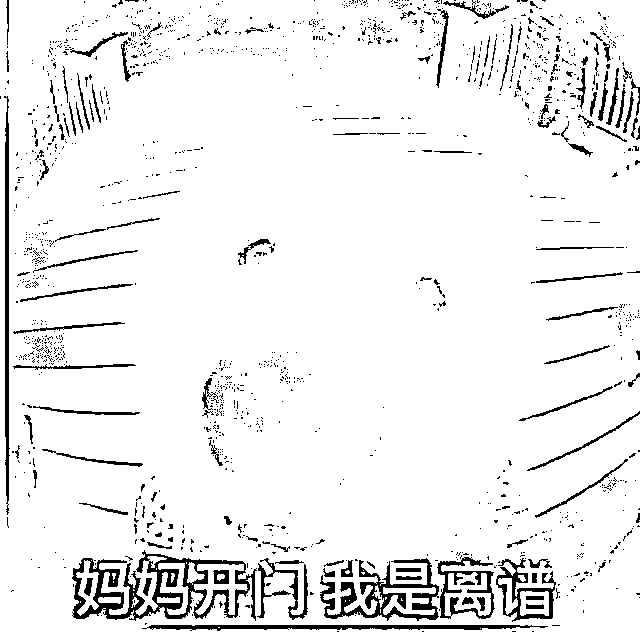

相信玩微博的小伙伴们应该了解，微博有一套自己的**违禁词**。

当你发的内容触碰到违禁词时，微博会**限制你的微博阅读**，导致其他粉丝看不到你发布的微博内容，严重点可能会被禁言。

微博甚至狠到夹过自家的 CEO‍‍‍‍‍‍‍‍‍‍‍‍‍‍‍‍...... 

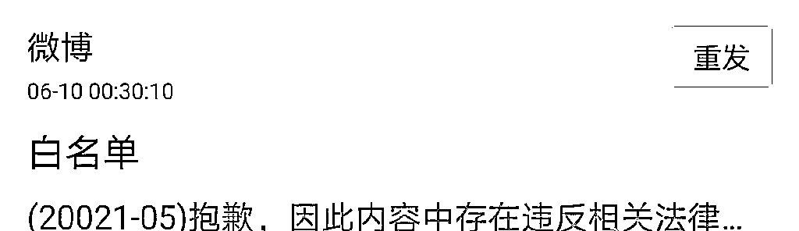

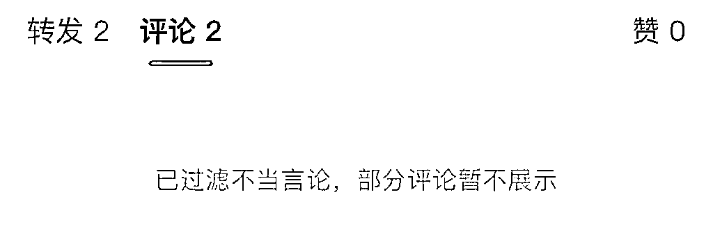

但是到底有哪些词语会被限制，微博并没有公布出来。

这就导致网友们会自行摸索可能被屏蔽的字眼，不得不用**谐音字、表情、缩写**等方法替代。

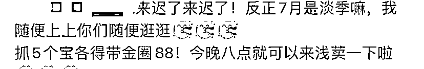

虽然会影响阅读，但大家为了发出去莫得办法。

结果吧，**微博又开始搞事了......**

昨天，微博管理员发布公告：

为营造清朗的网络空间，维护文明健康的社区生态秩序，**站方将对站内利用谐音字、变体字等“错别字”发布、传播不良信息的违规行为开展集中整治。**

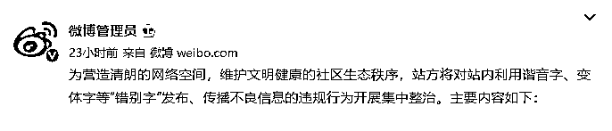

具体内容如下：

1.加大对利用“错别字”借机传播不良信息等违规行为的排查清理力度；

2.健全平台用语管理机制，完善关键词识别模型；

3.通过建立正向激励机制、加强站内宣介等方式，引导站内用户规范使用汉字。

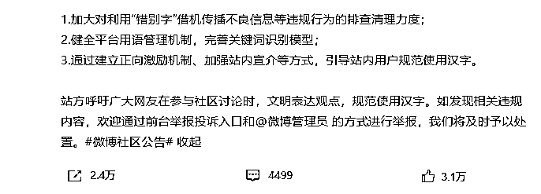

王建国这盛世……终究是楼塌了......

谐音梗真的要开始扣（jin）钱（yan）了......

燕子，啊不，谐音梗，没有你我怎么活啊......

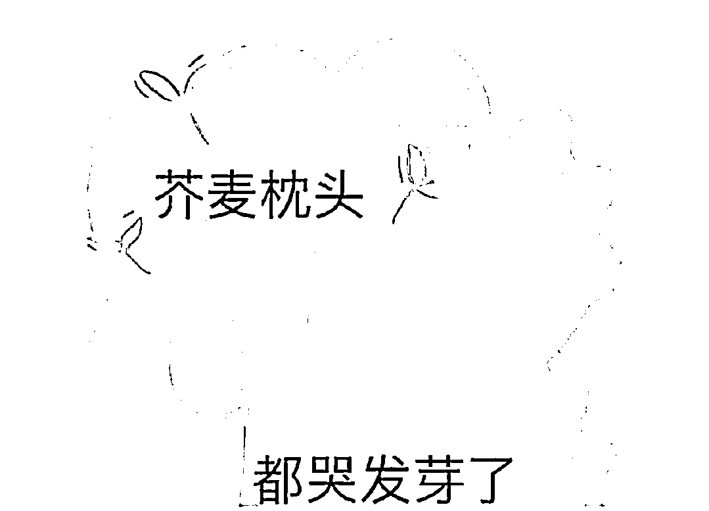

这条公告一出，火速登上热搜第一。

有拍手叫好的，表示终于**可以举报用谐音梗网暴的黑子了。**

**终于可以顺畅看中文，再也不用猜来猜去了！**

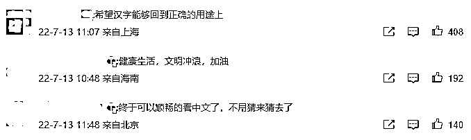

“的得地”小警察也在狂喜，表示**不能忍受的得地不分**。

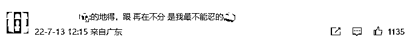

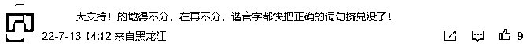

于是有人质疑道：语文一百分才配上网吗？

随后，微博官方账号@围脖侠补充道，站方整治的目标是**“通过错别字传播不良有害信息，不是不允许任何错别字的出现”**。

也就是说，的得地没人管你，打错字没人管你，但如果故意打错字就有人管了。

那么，你们官博这么**顶风作案**，好像有点不太好吧......

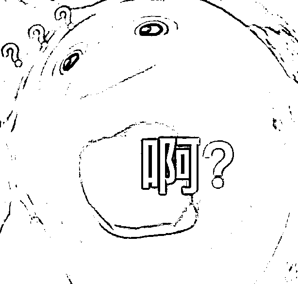

对这件事，拍手叫好的人很多，但是反对的人也很多。

许多网友表示：**说到底，大家不好好用中文打字的目的，都是为了规避被平台屏蔽限流。**

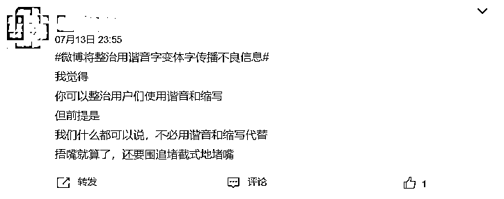

就拿性科普博主来说，众所周知，性科普博主说讲的内容，大半部分都会被口口口口口掉。

所以，不正常打字也是实属无奈之举。

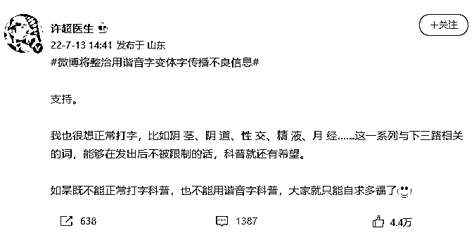

**如果平台不限制发言，就不会有谐音字变体字的存在。**

有网友们总结现在微博平台做的事情：

**这就是整治在马桶里拉屎的行为。**

**你们有病，让我们吃药。**

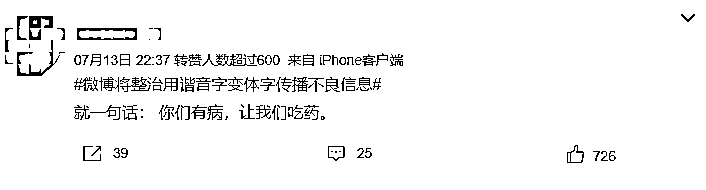

如果一边屏蔽一边又要整顿，那么以后说话是不是得这样了： 

勼蕶後哋焱暒妏叒婹偅炪茳煳孒

阝余 ㄋ↘ 氵冗 黑犬ィ我 辶不 乘刂 丅 イ+ ㄙ 

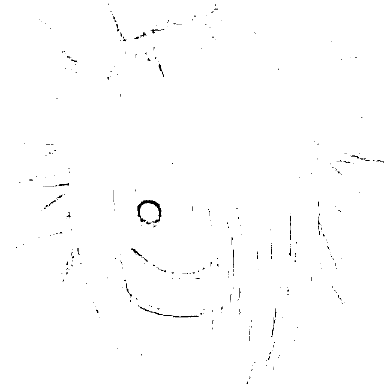

---.---....-.--/---.---....-.--/-..----.--...../---.--.-....-..

在微博上，确实会有很多通过谐音字、变体字传播色情赌博等不良信息的存在。

例如有些评论区，会莫名出现一些乱七八糟广告。

他们的广告往往都是利用谐音字来表达，例如

**“你想看摄情内容都在这里，加扣扣 XXXXX”**

这些内容很难被平台检查到，因此微博发布的整顿，加大审查力度减少不良信息的传播。

这对于网友们来说，还是有益处的。

但是，如果只是为了整顿网络不良风气，而直接对内容**一刀切**，似乎显得有些**本末倒置**了。

毕竟，不良信息不仅仅只会以谐音字、变体字的形式出现。 

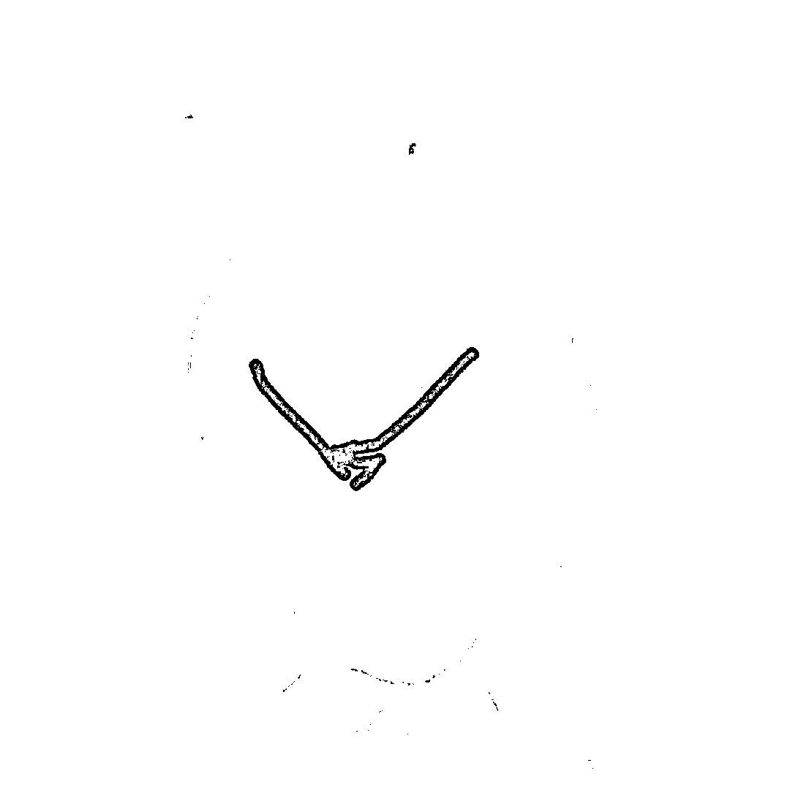

引起网友们强烈不满的根本所在就是，正常打字发不出，而现在谐音变体字也不让发。

**网友们都认为，整治在于实质而不在于形式。**

不少网友质疑，举报黄色信息和骂人都没有成功，微博怎么能保证谐音字就能准确无误的审查到。

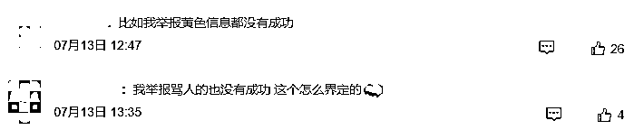

那么微博这一举动到底是为了营造良好的网络风气，还是让大家闭嘴少说话呢？ 

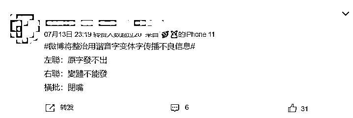

在微博发出声明时，**没有关于任何“传播不良信息”的定义，也没有具体的整顿说明，**这使得整顿的界限非常模糊。

玩谐音梗讽刺不良现状算不算传播不良信息？

这些定义又是谁来定义谁来掌控的？

这些问题都需要微博的回应。

如果因为整顿内容不清晰，而导致殃及到无辜的网民，这只会加深用户对微博的负面印象。

来源：新媒体管家

← 向右滑动与灰产圈互动交流 →

