# 这些都是假的！李小璐的“老”“黄”瓜又刷屏朋友圈，卖片的又有钱赚了，网友：李小璐当炮灰了

> 原文：[`mp.weixin.qq.com/s?__biz=MzIyMDYwMTk0Mw==&mid=2247540105&idx=1&sn=9061306b28eb1440b1962445b8111723&chksm=97cb96b1a0bc1fa7256f29b33dde9ab921136df34ff8432e685560ebbb6792cdf2a372c85f6d&scene=27#wechat_redirect`](http://mp.weixin.qq.com/s?__biz=MzIyMDYwMTk0Mw==&mid=2247540105&idx=1&sn=9061306b28eb1440b1962445b8111723&chksm=97cb96b1a0bc1fa7256f29b33dde9ab921136df34ff8432e685560ebbb6792cdf2a372c85f6d&scene=27#wechat_redirect)

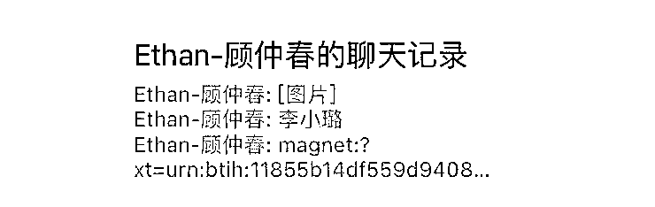

著名的“嫂子”李小璐昨天刷屏了很多人的朋友圈 

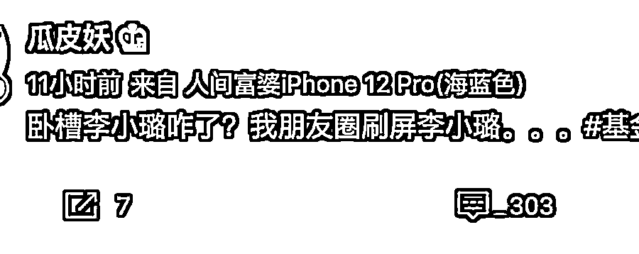

去微博一搜才发现，卖片的又有钱赚了 

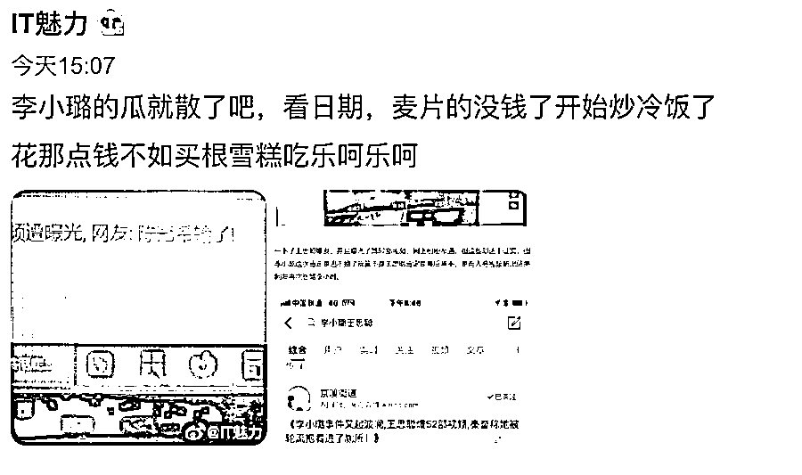

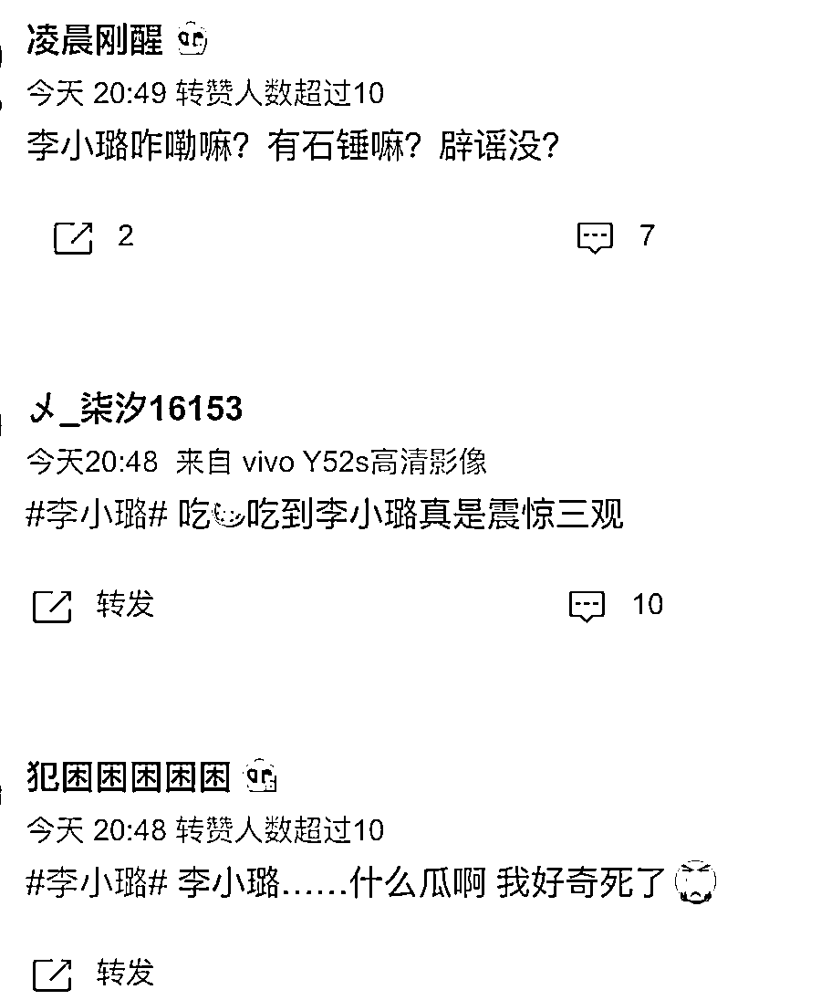

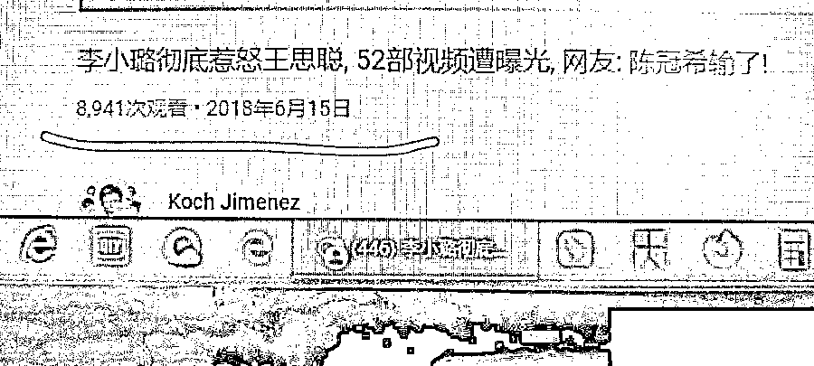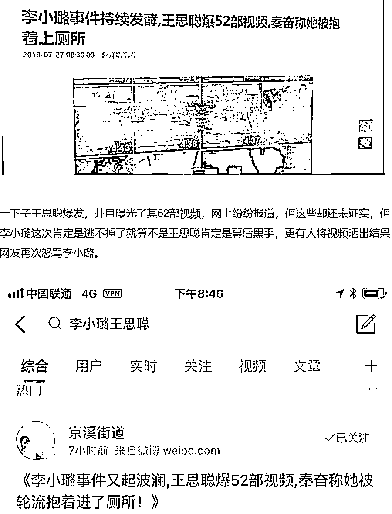

实际上，这事是 18 年发生的事 

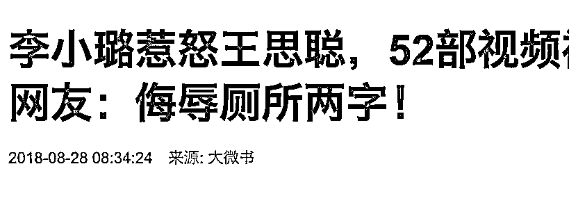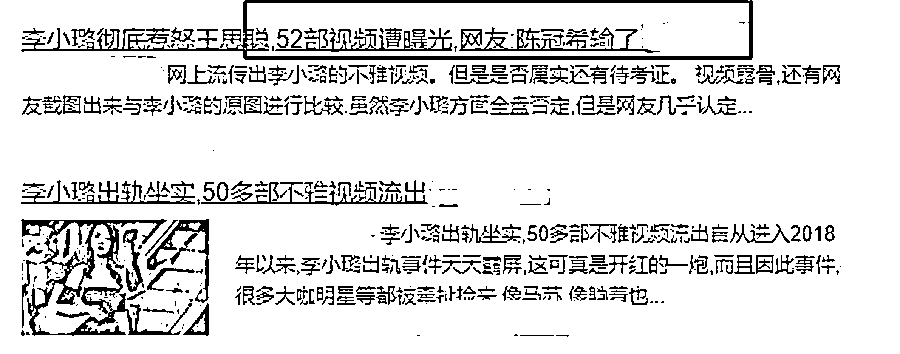

造谣的人最终被起诉，并被判赔钱道歉 

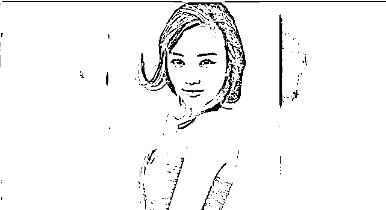

判决书曝光如下：

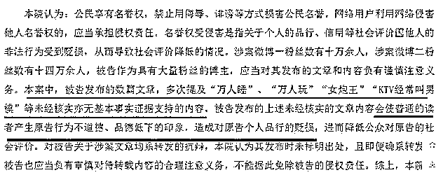

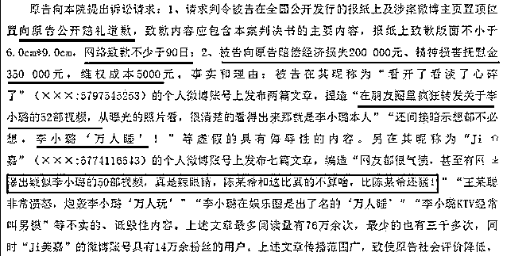

..............................................................................................................

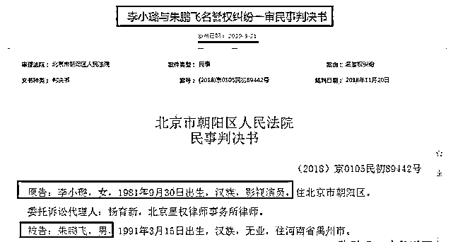

经过法院依法审理，法院认定被告发布的内容构成对原告李小璐名誉权的侵犯。 

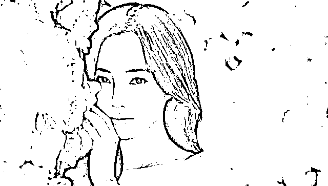

被告连续 7 天置顶道歉声明，且赔偿了李小璐 5 万元精神抚慰金。

[`mp.weixin.qq.com/mp/readtemplate?t=pages/video_player_tmpl&action=mpvideo&auto=0&vid=wxv_2485223864403460096`](https://mp.weixin.qq.com/mp/readtemplate?t=pages/video_player_tmpl&action=mpvideo&auto=0&vid=wxv_2485223864403460096)

看过视频的网友都说：假！

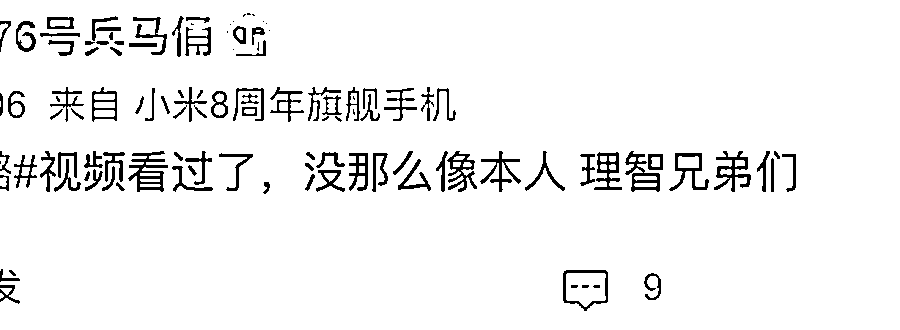

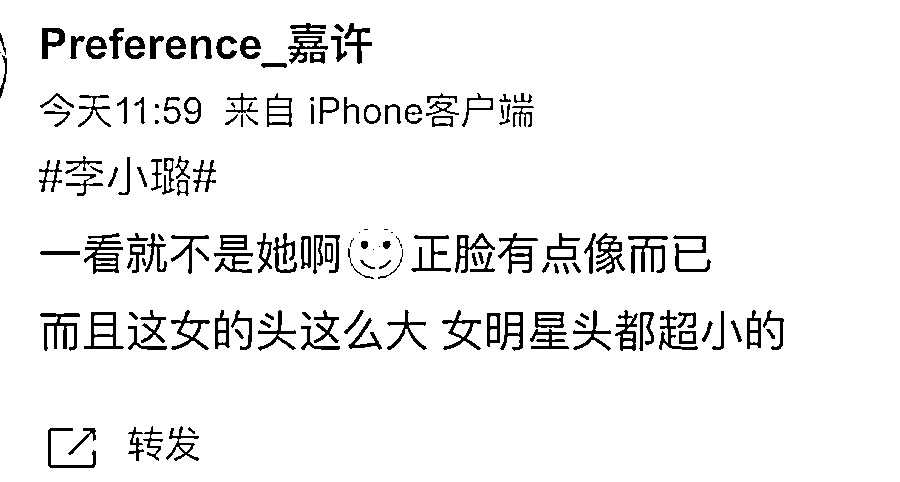

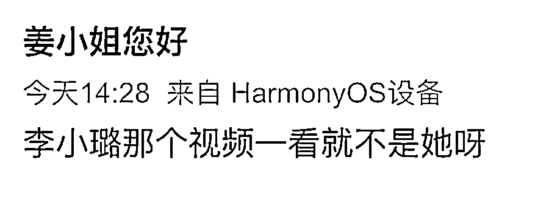

对于被翻出来的老黄谣

不少网都觉得李小璐当了把炮灰

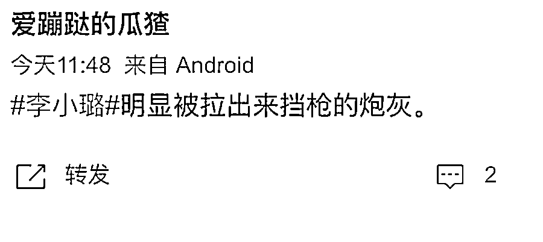

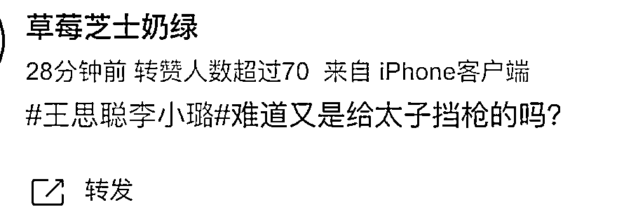

故事也到此可见又是一个旧瓜翻炒并且是造谣的假瓜

警方提醒

需要注意的是，**即使不以牟利为目的，通过微信等聊天软件传播淫秽电子信息，严重时依然可能触犯《刑法》**。按照《中华人民共和国刑法》第三百六十四条，传播淫秽的书刊、影片、音像、图片或者其他淫秽物品，情节严重的，处两年以下有期徒刑、拘役或者管制。 

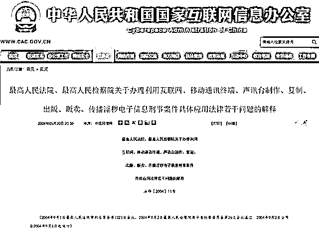

不以牟利为目的，用微信传播多少“小黄片”会触犯法律？

伍继军律师表示**《司法解释》提到了五大标准**：

1、制作、复制、出版、传播淫秽电影、表演、动画等视频文件 40 个以上

2、制作、复制、传播淫秽音频文件 200 个以上

3、制作、复制、传播淫秽电子刊物、图片、文章、短信息 400 件以上

4、制作、复制、传播的淫秽电子信息，实际被点击次数达到两万以上

5、以会员制方式出版、传播淫秽电子信息，注册会员达 400 人以上

此前，有不少案例是嫌疑人因法律意识淡薄，认为不售卖就不犯法，在微信、QQ 群等社交平台上散布淫秽视频，最终自食其果。事实上，**只要群数量达到 40 个以上，或是各类视频、音频、文章、图片达到相应标准，就应以传播淫秽物品罪定罪处罚，以“交流”为名，是无法脱罪的。**

**网络不是法外之地！在网上说话做事也应有与线下同样的法律警觉和道德标准。**

做了亏心事一定会有警察来敲门！

来源：大 R 说安全

← 向右滑动与灰产圈互动交流 →

