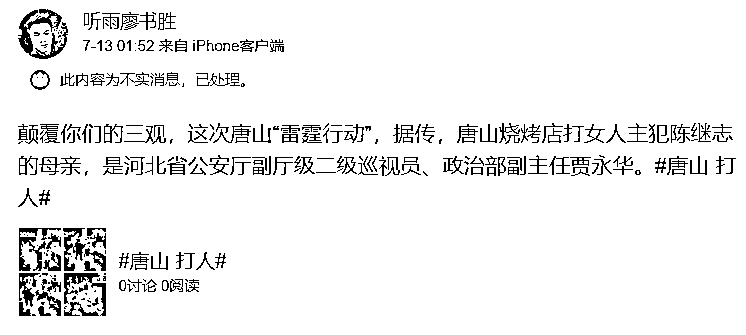
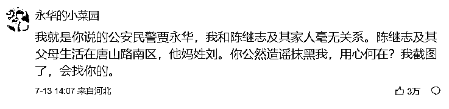
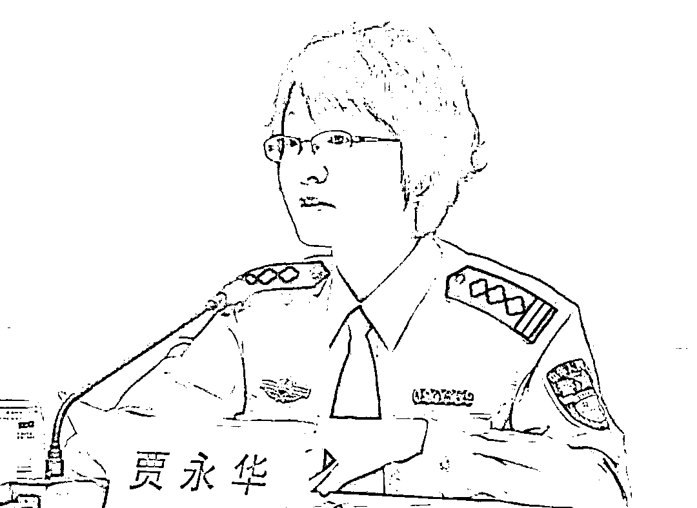
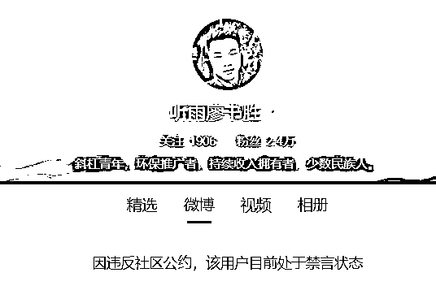
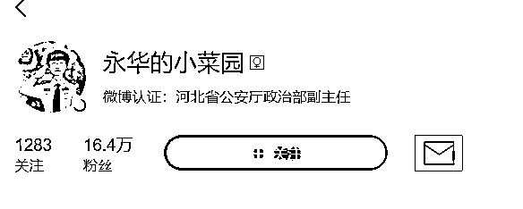
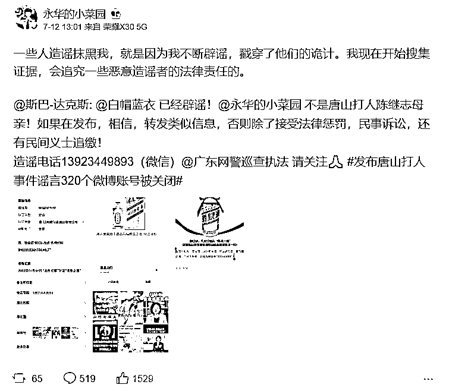
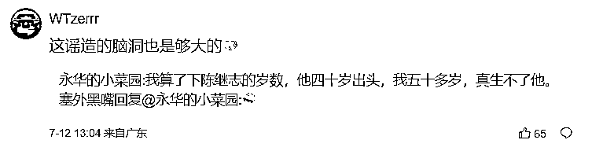
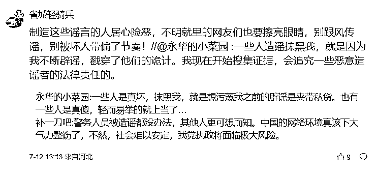
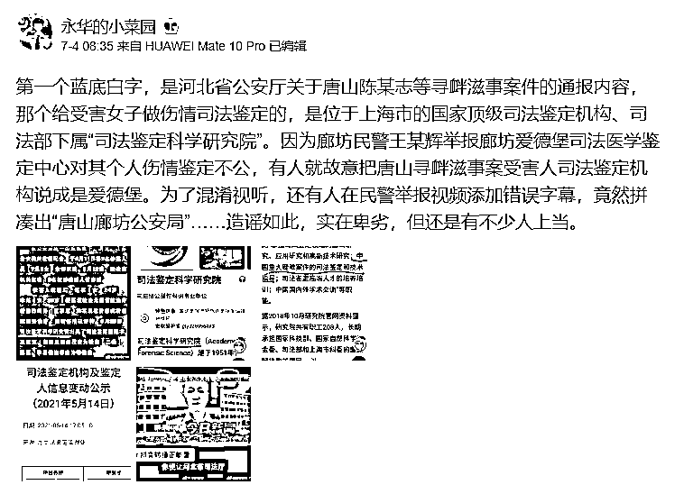
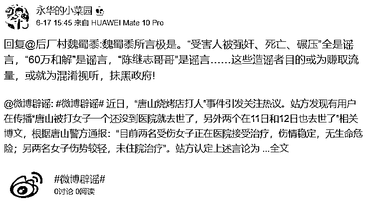

# 唐山打人案主犯系省公安厅政治部副主任儿子？当事人辟谣

> 原文：[`mp.weixin.qq.com/s?__biz=MzIyMDYwMTk0Mw==&mid=2247540105&idx=2&sn=374ca482f4609d23dcf1c286f72da68c&chksm=97cb96b1a0bc1fa7a2c08f8a3109b985d87d99710eaeb05876c32d2c2bdcedd38c541c445ef3&scene=27#wechat_redirect`](http://mp.weixin.qq.com/s?__biz=MzIyMDYwMTk0Mw==&mid=2247540105&idx=2&sn=374ca482f4609d23dcf1c286f72da68c&chksm=97cb96b1a0bc1fa7a2c08f8a3109b985d87d99710eaeb05876c32d2c2bdcedd38c541c445ef3&scene=27#wechat_redirect)

近日，河北省公安厅政治部副主任在微博的一则辟谣受到了外界关注。

7 月 13 日，微博用户@听雨廖书 胜在微博发文称，“据传，唐山烧烤店打女人主犯陈继志的母亲，是河北省公安厅副厅级二级巡视员、政治部副主任贾永华。”

在这则微博之下，@永华的小菜园 留言称，“我就是你说的公安民警贾永华，我和陈继志及其家人毫无关系。陈继志及其父母生活在唐山路南区，他妈姓刘。你公然造谣抹黑我，用心何在？我截图了，会找你的。”

截至发稿，这条留言获赞 3 万。

民警贾永华。（资料图）

目前，@听雨廖书胜 因违反社区公约，被微博禁言。

@永华的小菜园 是河北省公安厅政治部副主任贾永华实名认证的微博，目前粉丝为 16.4 万。

据了解，2015 年 5 月，河北省公安厅政治部副主任贾永华曾接受媒体采访。

她说，现在河北公安微博一方面发布安全提醒、警务动态，提高群众自我保护的意识和能力；另一方面对百姓诉求作出及时回应，帮助群众解决生活中遇到的实际困难。

需要说明的是，这并不是贾永华首次辟谣自己不是陈继志的母亲。

7 月 12 日，她曾在一条转发的微博中写道，“一些人造谣抹黑我，就是因为我不断辟谣，戳穿了他们的诡计。我现在开始搜集证据，会追究一些恶意造谣者的法律责任的。”

贾永华还回复网友称，“我算了下陈继志的岁数，他四十岁出头，我五十多岁，真生不了他。”“一些人是真坏，抹黑我，就是想污蔑我之前的辟谣是夹带私货。也有一些人是真傻，轻而易举的就上当了…”

在这条微博中，还有多个辟谣微博，其中不少都与“唐山打人案”有关。

贾永华还在置顶的一条微博中写道，“因为廊坊民警王某辉举报廊坊爱德堡司法医学鉴定中心对其个人伤情鉴定不公，有人就故意把唐山寻衅滋事案受害人司法鉴定机构说成是爱德堡。为了混淆视听，还有人在民警举报视频添加错误字幕，竟然拼凑出‘唐山廊坊公安局’……造谣如此，实在卑劣，但还是有不少人上当。”

此外，6 月 17 日，贾永华曾在微博中写道，“受害人被强奸、死亡、碾压”全是谣言，“60 万和解”是谣言，“陈继志哥哥”是谣言……这些造谣者目的或为赚取流量，或就为混淆视听，抹黑政府！

6 月 16 日，她辟谣说，确认过了，陈继志是父母独子。

6 月 21 日，她曾转发河北省公安厅《关于陈某志等涉嫌寻衅滋事、暴力殴打他人等案件侦办进展情况的通报》，并称，“我坚信，正义永远不会迟到！”

她还回复留言表示，“唐山教训惨重，我们也在反思。”

来源：观察者网

← 向右滑动与灰产圈互动交流 →

