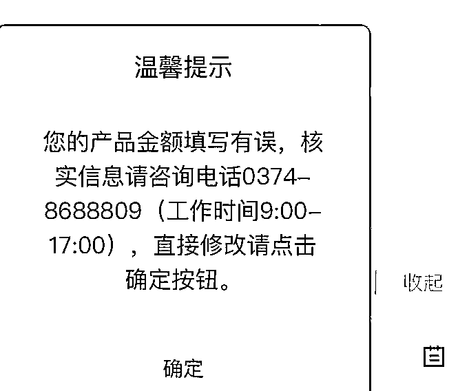

# 今起垫付！4 家河南村镇银行发布操作说明，有储户反映操作并不顺畅

> 原文：[`mp.weixin.qq.com/s?__biz=MzIyMDYwMTk0Mw==&mid=2247540105&idx=5&sn=e78b454c8de468e96c5a288350f5ff81&chksm=97cb96b1a0bc1fa7848bcb634c8bf17335f2baba4248a93d70445a3f25c3764568282b6895d2&scene=27#wechat_redirect`](http://mp.weixin.qq.com/s?__biz=MzIyMDYwMTk0Mw==&mid=2247540105&idx=5&sn=e78b454c8de468e96c5a288350f5ff81&chksm=97cb96b1a0bc1fa7848bcb634c8bf17335f2baba4248a93d70445a3f25c3764568282b6895d2&scene=27#wechat_redirect)

图片来源：视觉中国

记者|张晓云

7 月 15 日，河南禹州新民生村镇银行、上蔡惠民村镇银行、柘城黄淮村镇银行、开封新东方村镇银行均通过官网发布资金垫付操作说明。

7 月 11 日晚间，河南银保监局、河南省地方金融监管局发布公告，根据案件查办和资金资产追缴情况，经研究，对 4 家村镇银行账外业务客户本金分类分批开展先行垫付工作。

公告称，将从 2022 年 7 月 15 日开始首批垫付，垫付对象为单家机构单人合并金额 5 万元（含）以下的客户。单家机构单人合并金额 5 万元以上的，陆续垫付，垫付安排另行公告。

符合上述要求的储户可通过一款名为“村行垫付”的小程序进行提现手续。7 月 15 日是垫付工作开始的第一天，但由于短时间内登录人数过多，多名储户向界面新闻记者反映，操作流程并不大顺利。

其中，有储户表示卡在提交身份证页面，由于提交页面只能拍照上传，不能选手机图库，因此老是失败。

也有储户表示卡在产品金额填写上。“之前村镇银行的小程序打不开，因此只记得个大概数目，通过转入银行卡的历史记录汇总起来填写的，但老是说我填错。打电话一直打不通。”

7 月 15 日中午 12 点左右，界面新闻记者致电官方咨询电话，显示为盲音。

不过，也有操作成功的储户在交流群里晒出了提交成功的截图。

“应该是开发小程序比较匆忙，很多情况没有考虑周全。一下子登录的人太多了，操作不够友好。”一位自称是软件行业的储户在储户群中表示。

据央视财经报道，待 5 万元以下客户本金垫付工作完成后，下一步将陆续启动其他金额客户垫付工作。在垫付资金来源方面，地方公安机关在案件查办过程中，查封、扣押、冻结的新财富集团部分资产依法处置变现所得资金用于垫付。

关于利息问题，有关专家表示，目前公告垫付客户本金，客户资金利息相关合法权益仍保留，视后续案件查办情况再作出相应安排。有关专家还表示，资金垫付后，若发现客户存在额外渠道获取高息或违法违规行为，保留追缴垫付资金的权力。保护绝大多数普通客户合法权益。

此外，针对 7 月 13 日晚，市场流传在追查河南村镇银行储户钱款流向时，发现南京银行是结算行，中国人民银行南京分行营业管理部相关负责人表示，南京银行代理村镇银行资金清算业务是按照中国人民银行支付系统的相关规定办理的，有关资金清算服务合法合规，与有关村镇银行案件没有任何关联。

来源：界面新闻

← 向右滑动与灰产圈互动交流 →

