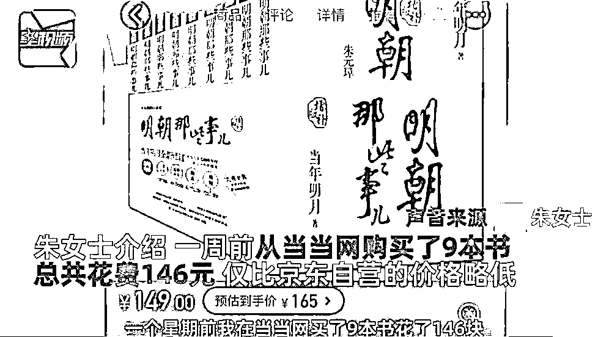
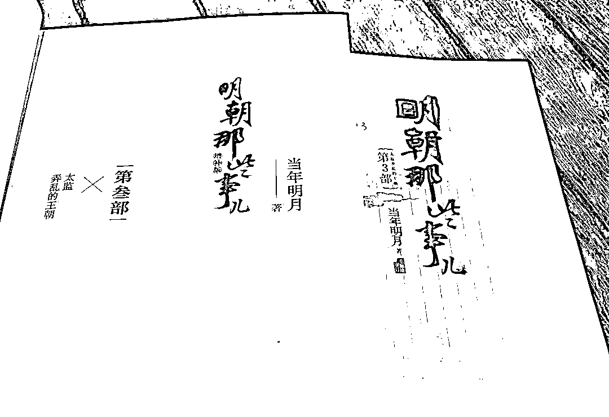
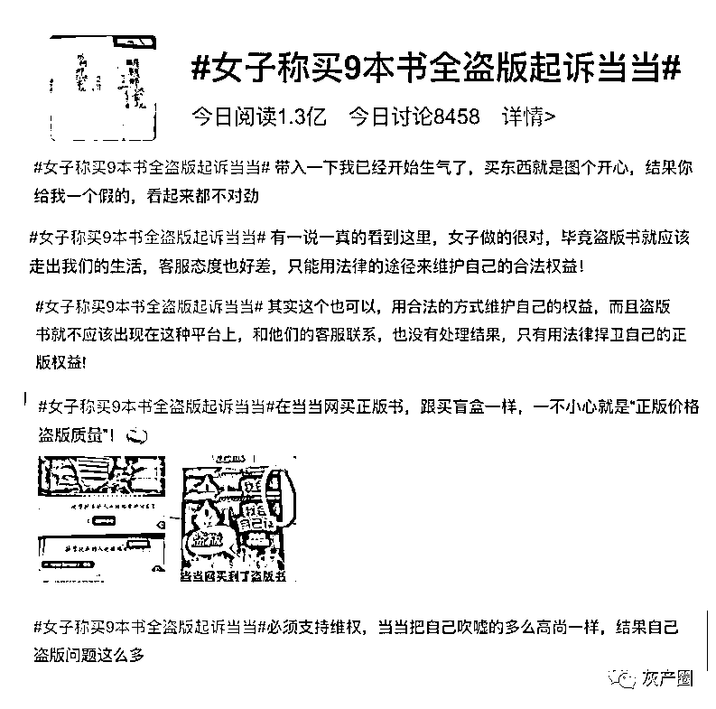
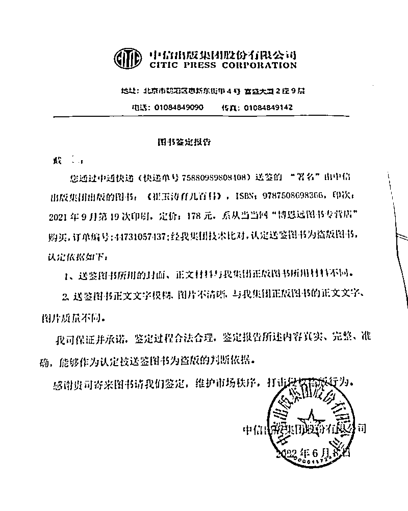
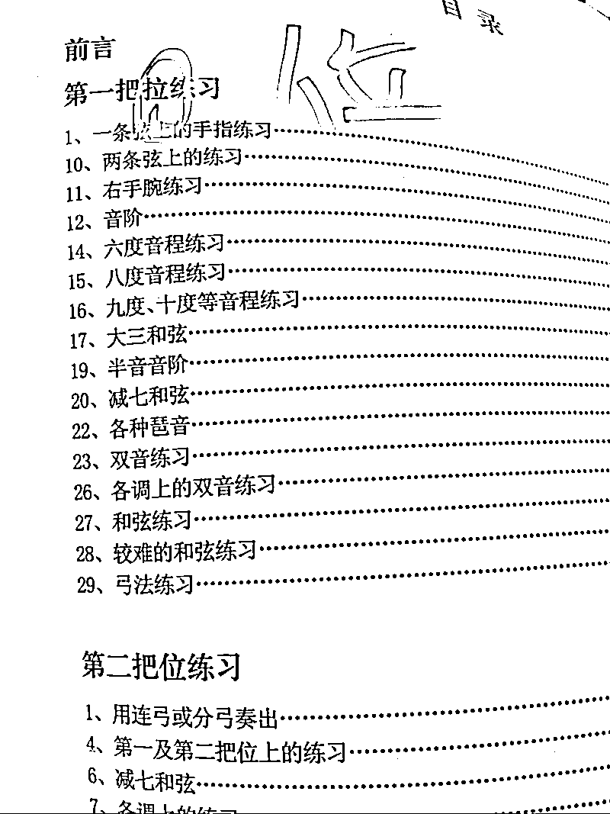
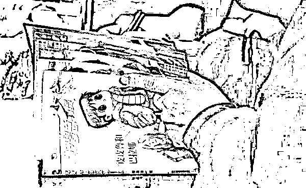
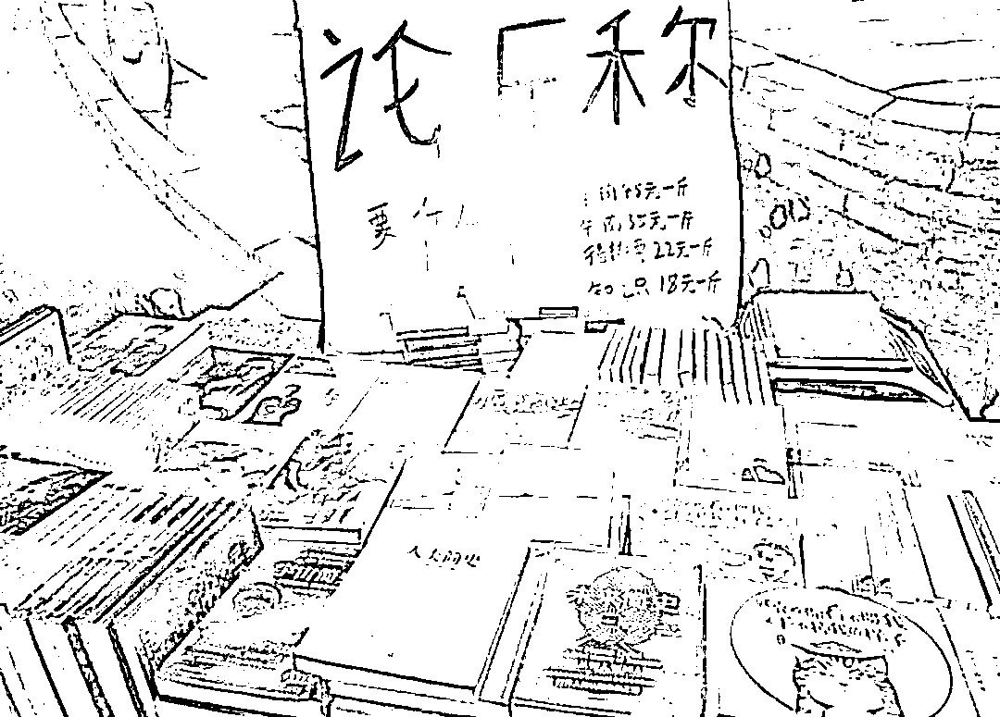

# 在当当买 9 本书都是盗版？！网友炸锅了

> 原文：[`mp.weixin.qq.com/s?__biz=MzIyMDYwMTk0Mw==&mid=2247540105&idx=6&sn=7857ce9056d237c1a58a5615de0f9967&chksm=97cb96b1a0bc1fa718d464ef6ac572880cad066cc37887f0157691e482e34a515f1a9b9049af&scene=27#wechat_redirect`](http://mp.weixin.qq.com/s?__biz=MzIyMDYwMTk0Mw==&mid=2247540105&idx=6&sn=7857ce9056d237c1a58a5615de0f9967&chksm=97cb96b1a0bc1fa718d464ef6ac572880cad066cc37887f0157691e482e34a515f1a9b9049af&scene=27#wechat_redirect)

当当网又上热搜了。

7 月 14 日，河南郑州朱女士称大约一周前，她从当当网上购买了 9 本《明朝那些事儿（增补版）》系列图书，折后订单金额为 146 元。

收到书后，她发现这套图书印刷质量低劣，使用纸张质量粗糙，而且味道刺鼻，因此怀疑买到了盗版。朱女士还找朋友借来了一本正版图书进行对比，发现差异非常明显，于是开始找客服维权。

多次通过电话和当当 APP 上的客服系统沟通，皆无人应答。朱女士将当当网告上了法庭，认为当当网虚假宣传构成欺诈，要求三倍赔偿并赔礼道歉。

图自@星视频

7 月 15 日，#女子称买 9 本书全盗版起诉当当#冲上微博热搜前三，网友、读者们在社交平台上热议“盗版书就不应该出现在这种平台上”“在当当网买正版书，就跟买盲盒一样”“盗版书应该走出我们的生活”……

据悉，目前，郑州市中牟县人民法院已对本案正式立案。 

而网络平台售卖盗版书再次引发公众关注。 

****

****用户投诉所购图书为盗版，****

******出版社出具鉴定后仍未获赔******

****南都记者注意到，网络平台针对盗版图书的投诉持续存在，有用户反映，将所购图书邮寄至出版社，鉴定确为盗版书后，仍未获得平台赔偿。****

****此外，有平台入驻商家被诉出售盗版书籍，平台方面辩称“正品保障是涉事商家作出的保障，并非该公司承诺”。****

****在此前的采访中，作家郑渊洁曾向南都记者表示，“书籍制作的成本在那里。现在一般正规图书店打折最多也能到 5 点几折，盗版卖 5 折以上是竞争不过正版书籍的”****

****近日，网络平台盗版书乱象再引关注。南都记者在“黑猫投诉”平台检索发现，有用户在今年 6 月投诉称，5 月 14 日，其在当当网“博思远图书专营店”购买了一本《崔玉涛育儿百科》，到货图书质量很差、图片模糊、纸质粗糙，经出版社鉴定为盗版书。****

****据其提供的图书鉴定报告显示，该用户将从当当网所购图书邮寄至该书“出版社”中信出版集团股份有限公司（下称“中信出版集团”）进行鉴定。中信出版集团出具的报告称，经该集团技术对比，认定送鉴图书为盗版图书。****

********

****中信出版集团表示，送鉴图书所用的封面、正文材料与该集团正版图书所用材料不同。送鉴图书正文文字模糊、图片不清晰，与该集团正版图书的正文文字、图片质量不同。****

****前述用户表示，其联系当当网客服进行投诉，却被要求提供开箱视频。“但我买书的时候本着相信当当网，哪里想到去拍开箱视频，现在当当客服以此为由不继续处理。”该用户说。****

****6 月，有用户在网上吐槽称其在当当网购买的《小提琴左手技巧练习》，条形码扫不到，书中存在明显的错别字，印刷模糊。联系商家被告知需提供盗版证明。****

********

****另据公开报道显示，2021 年 7 月，长沙的张女士在当当 App 的“启高图书专营店”花 145.5 元购买了一套店铺承诺正版的图书，但张女士收到后认为印刷质量有问题疑为盗版书，联系客服却被告知需要提供相关证明。****

****张女士随后将所购图书邮寄至出版社，出版社向其出具的鉴定结果显示该书确为盗版图书。张女士将鉴定报告发给当当客服，却又被告知需要同时出具开箱证明和鉴定报告，才能按照法律规定的条款进行解决和赔偿。****

****值得注意的是，当当网曾公开表态“拒绝盗版书，坚决主张正版维权”。****

**********平台称“正品保障”非其承诺 ，******

******仅为销售商提供网络销售平台******

****前述案例显示，售卖盗版图书的多为电商平台的入驻商家。如果入驻商家售卖盗版书，平台是否需要承担责任？南都记者在中国裁判文书网检索发现，曾有电商平台因销售盗版书被诉的案例。****

****据该案判决书显示，天津博源图图书有限公司（下称博源图公司）在北京当当科文电子商务有限公司（下称当当科文公司）运营的“当当网”开设“博源图图书专营店”，相关服务中均带有“正品保障”标识。****

****2021 年，中国财政经济出版社将前述两公司告上法庭。财经出版社诉称，该公司长期为中国注册会计师协会组织的注册会计师考试出版全国统一考试辅导教材，享有 2020 注册会计师全国统一考试辅导教材《经济法》的专有出版权。“博源图图书专营店”销售涉案图书的盗版书籍侵害了该公司的专有出版权。****

****当当科文公司对博源图公司销售的被诉侵权图书进行了正品保障，做出了正品的承诺，当当科文公司应尽到更高的审查义务，但当当科文公司未尽审查义务，主观上具有过错，应当与博源图公司承担连带责任。****

****当当科文公司辩称，该公司仅为博源图公司提供了网络销售平台。正品保障是博源图公司作出的保障，并非该公司承诺。该公司尽到了合理注意义务，不应承担侵权责任。****

****法院审理认定被诉侵权图书为盗版书籍。一审判决被告天津博源图图书有限公司赔偿原告中国财政经济出版社经济损失 9000 元。****

****对于当当是否应当承担连带责任，法院认为，当当科文公司作为电子商务平台运营者，仅为博源图公司的销售行为提供了帮助，不应承担侵权责任。****

****此事并非孤例，入驻商家售卖盗版图书引发平台是否有连带责任的争议一直存在。2017 年，有消费者向媒体反映，在当当买到了盗版的《人民的名义》。****

****报道中，记者比对了该网友购买到的《人民的名义》版本和从新华书店购买的正版《人民的名义》版本后发现，与正版版本相比，该消费者购买的该书缺少环衬页，且用纸、印刷质量均非常粗糙，部分页面有印歪的痕迹，两个版本区别巨大。****

****报道称，涉事的当当网“悦心图书专营店”在其“服务保障”网页一栏展示了“正品保证”标志。****

****对此，当当网一名工作人员表示，“如果发生了，会对商家有这样一个处理的，如果真的定下来了，我们会按照规定对商家进行严惩。”随后，记者尝试搜索当当网“悦心图书专营店”时发现，该店铺的网站框架仍在，但各个栏目下方已无具体内容。****

************

******郑渊洁曾为打击盗版图书发声******

****针对盗版图书，“童话大王”郑渊洁曾向南都记者表示，如何让普通读者鉴别图书真伪，他认为最简单是看价格，如果图书的销售价格是标价的 5 折以下，基本上这本书是盗版的可能性就相当大。****

******** 

****2012 年福州，郑渊洁读者签售会****

****南都此前报道，2019 年 2 月，北京皮皮鲁总动员文化科技有限公司曾举报欣盛公司和宏瑞公司通过网络交易、物流发货方式兜售盗版《皮皮鲁总动员》系列图书，侵犯了著作权。****

****获取线索后，江苏省淮安市公安局淮阴公安分局迅速成立专案组，抽调精干警力参加，迅速启动侦办工作。****

****经缜密侦查，2019 年 2 月 22 日、27 日，专案民警会同文化市场综合执法人员，分别在江苏省淮安市和北京市通州区捣毁涉案公司的 2 处仓储窝点，当场查扣《郑渊洁四大名传》《肚子里有个火车站》《皮肤国的大麻烦》《牙齿大街的新鲜事》《幼儿园的一天》等 75 种侵权盗版书籍 11 万余册。****

****经查，2017 年 4 月以来，王某为牟取更多利润，以其实际经营，其母亲及其本人担任法人的欣盛公司、宏瑞公司为掩护，取得销售图书许可，从犯罪嫌疑人柴某某、郭某某处购买侵犯著作权的书籍印刷文稿，交由犯罪嫌疑人李某某等 5 人进行印刷，并贴上浙江省苍南县吴某某印制的“防伪标识”。****

****侵犯著作权书籍印刷后，王某安排漆某某等 5 人通过网络平台进行销售，再从仓储点通过物流发货，形成制版、印刷、储存、运输、销售、制作防伪标识等“一条龙”。****

****为躲避侦查、迷惑客户，有意将相关环节分离，形成“在北京接单、在河北印刷、在淮安（北京通州）发货”。****

****为让人难以识别，王某还“别有用心”地从正规渠道购买极少量正版书籍，挂在网络平台，进行盗版、正版混搭销售。印刷、销售书籍的选择基本是“什么火印什么”，小说、绘本、教辅、童书等“来者不拒”，郑渊洁、余华、路遥等多位知名作家图书被盗版。****

****谈及如何让普通读者鉴别图书真伪，郑渊洁认为最简单是看价格。“书籍制作的成本在那里。现在一般正规图书店打折最多也能到 5 点几折，盗版卖 5 折以上是竞争不过正版书籍的”****

******** 

****这一方法也是郑渊洁公司打假团队的常用方法之一：如果发现实际售价低于定价 5 折的图书，就买回公司鉴定。据郑渊洁介绍，他的书籍平均每天销售 27000 本，但盗版的销售数量是他的三倍，几乎每天他们都能在网络平台发现盗版书籍。他旗下工作人员给南都记者看了他们在某平台举报的情况，仅一天就举报了 10 家店铺存在售假现象。****

****对于鉴别图书真伪，江苏省淮安市公安局相关负责人还曾指出，普通读者可以注意纸张是否光滑，裁纸是否整齐，是否有错字，装订是否整齐，是否有防伪标识等，还可以通过防伪标上附的联系方式进行核实。****

****郑渊洁建议，图书作者们如果发现自己的图书被盗版，可以通过向电商平台举报或是向全国和各级“扫黄打非”办公室举报，维护自身权益。****

****来源：南都 APP·新业态法治研究****************](http://mp.weixin.qq.com/s?__biz=Mzg5ODAwNzA5Ng==&mid=2247488051&idx=1&sn=1ad64c0293a2731910bb4823694deb98&chksm=c0687b64f71ff27226524aa2a4d77cc1119ffb9ff5938f2973505bb619c73402a8a6b2e59e60&scene=21#wechat_redirect)****

****← 向右滑动与灰产圈互动交流 →****

********