# 这次，我力挺贾永华！

> 原文：[`mp.weixin.qq.com/s?__biz=MzIyMDYwMTk0Mw==&mid=2247540170&idx=1&sn=661e6e10bcdc6962fb2700f0e527de47&chksm=97cb96f2a0bc1fe44f1231f07b4caa26dcaaaac1d14bc6c02d6416b484987dce3e945a5ae178&scene=27#wechat_redirect`](http://mp.weixin.qq.com/s?__biz=MzIyMDYwMTk0Mw==&mid=2247540170&idx=1&sn=661e6e10bcdc6962fb2700f0e527de47&chksm=97cb96f2a0bc1fe44f1231f07b4caa26dcaaaac1d14bc6c02d6416b484987dce3e945a5ae178&scene=27#wechat_redirect)

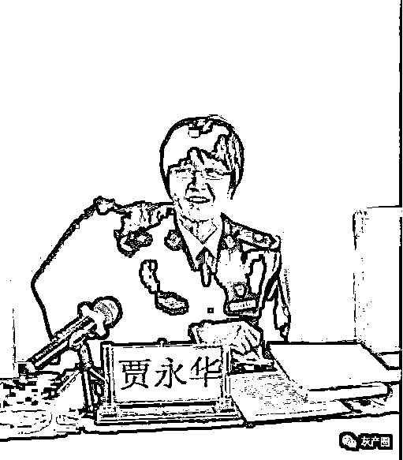

坏人，永远比你想象的要坏。因为，好人之所以是好人，是他知道什么是善，什么是恶，什么该做，什么不该做。好人即便生气，即便愤怒，也不会去做伤天害理的事，因为好人是有底线和敬畏心的，明白“人在做，天在看”。但坏人不是这样，无论他做的事多么的不正常，多么的不合情理，对别人造成了多大的伤害，他都认为自己是没有问题的，为达目的，不计后果，不择手段。

贾永华被坏人盯上了。因为她不停地辟谣辟谣，一次又一次地把人家的脸打得生疼。于是，造谣的人干脆把她直接拖下水，试图让她陷进谣言的漩涡里，无暇再去管“闲事”。

贾永华是谁？微博认证：河北省公安厅政治部副主任。她的微博名是“永华的小菜园”，粉丝数：16.6 万。

近日，贾永华因为被造谣是唐山烧烤店打女人主犯陈继志的母亲，被推上风口浪尖。

 7 月 13 日 01:52，正是丑时，《诗经·汝日鸡鸣》里说：“汝日鸡鸣，士日昧旦。”古时勤快的人就要起床干活了，牛在这时候也吃完草，准备休息了。IP 地址为广东的微博用户@听雨廖书胜 却半夜鸡叫，抖出一个“猛料”：“据传，唐山烧烤店打女人主犯陈继志的母亲，是河北省公安厅副厅级二级巡视员、政治部副主任贾永华。”

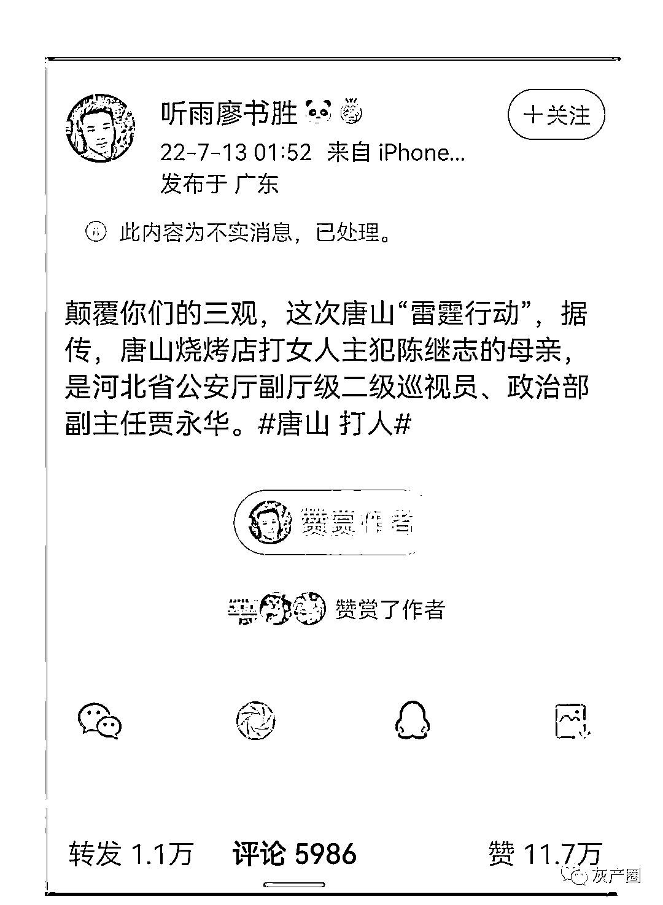

当日 14:07，@永华的小菜园 回应：我就是你说的公安民警贾永华，我和陈继志及其家人毫无关系。陈继志及其父母生活在唐山路南区，他妈姓刘。你公然造谣抹黑我，用心何在？我截图了，会找你的。

到今天(7 月 16 日）中午 12 点，被判定为“不实消息”的造谣贴，转发已达 1.1 万次，@永华的小菜园  的辟谣跟帖留言获赞 3.5 万人次。

 @永华的小菜园  辟谣帖下面的评论是这样的：

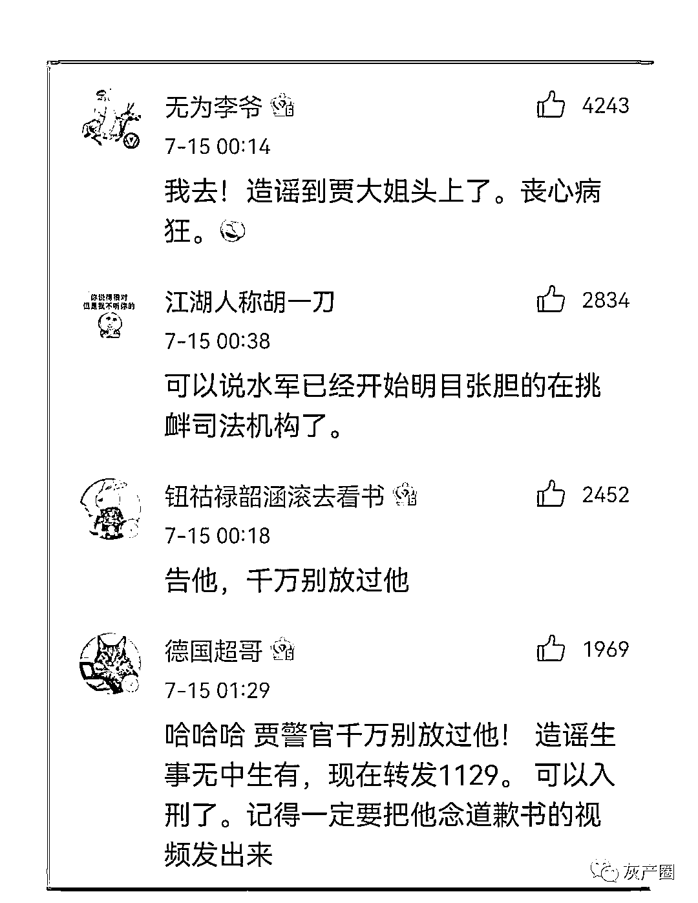

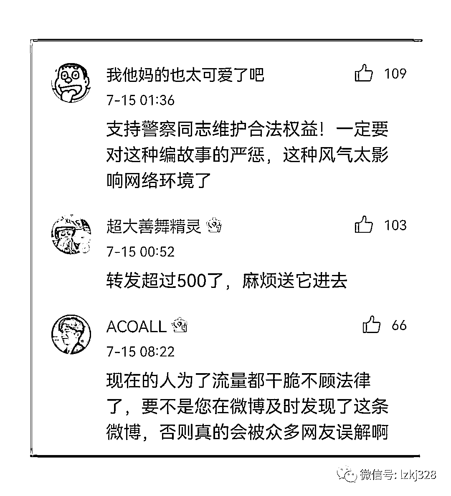

身在广东的@听雨廖书胜 为什么敢公开造谣？宾曰语云了解到，@听雨廖书胜 并非第一个造谣者，在此之前的 7 月 10 日，微信群已有谣言传出，也许是此君看传来传去没人追究，于是胆子便大了起来，直接把谣言通过微博进行“独家发布”。这不由使人想起意大利作家卡洛·科洛迪《木偶奇遇记》里那句著名的话：村口的狗叫了，于是村里的狗也跟着一起叫，他们也不知道为什么叫，叫的什么意思，但是跟着叫。

为什么有人要造谣贾永华？因为她总在打造谣者的脸。

随着唐山烧烤店打人事件的爆出，与案件相关的谣言从来就没有停止过，单是受害人的死法，流传的就多达 6 种。

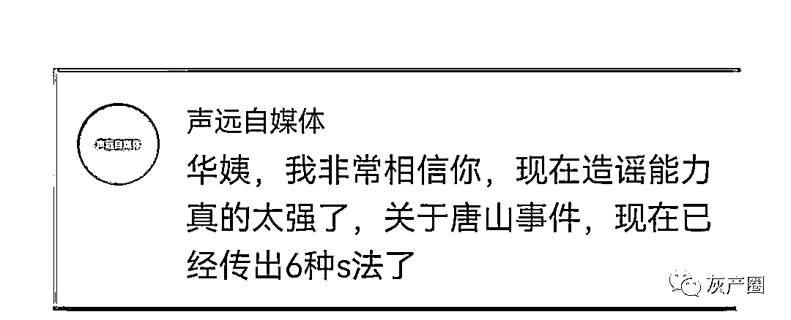

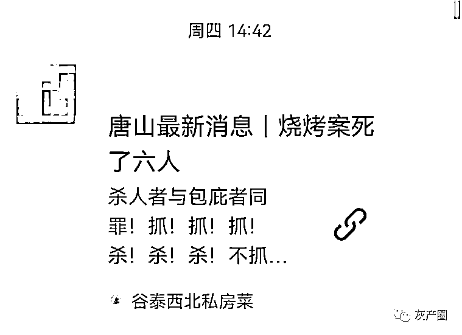

贾永华也一直在辟谣。

6 月 14 日，微信公众号冒出一篇猛料：唐山又出恶性大事件……

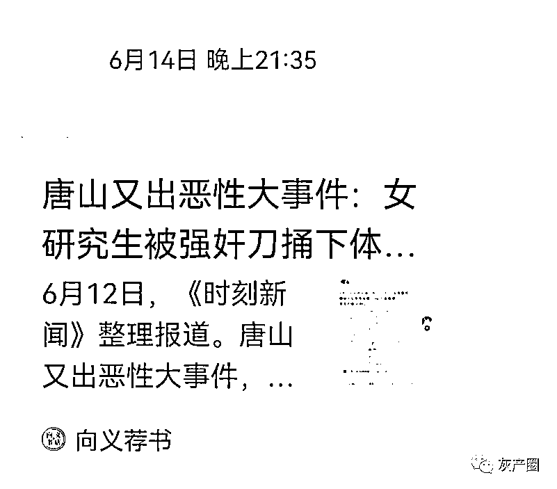

贾永华辟谣：谣言!

贾永华说，造谣者传谣者如此猖獗，难道法律不该让他付出代价吗? 还有故意说被打女孩是高中生的!她提醒“善良网民不可不防!”

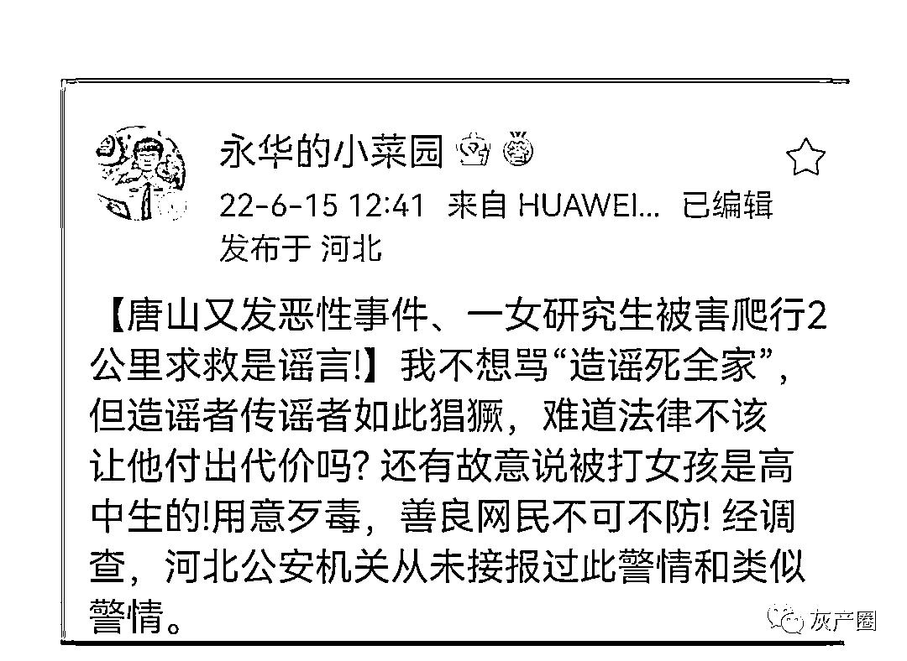

6 月 15 日，网上出来个陈继志哥哥要花 100 万和解的视频，贾永华辟谣“这个声音让我想起经常接到的电信诈骗分子”，她斥责造谣者是“哗众取宠蹭流量的混球”。

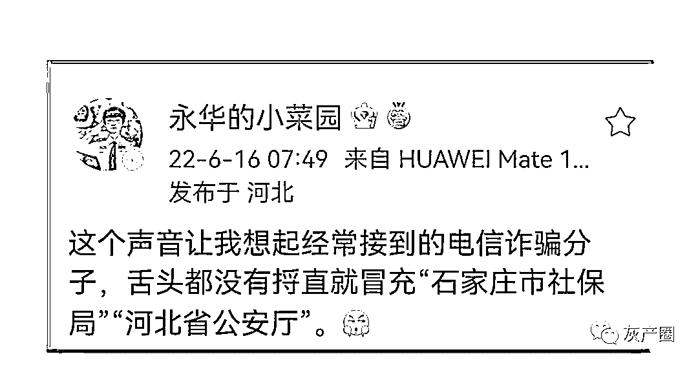

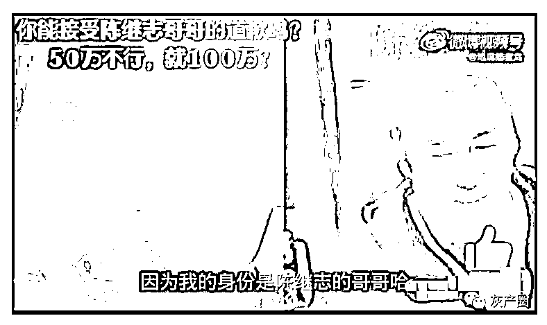

7 月初，廊坊市公安局广阳分局民警王艳辉在网上实名举报廊坊爱德堡司法医学鉴定中心主任马某昌。廊坊爱德堡司法医学鉴定中心的监管单位是司法局，所以王艳辉发视频說希望被司法系统看到。可有人故意混淆视听，把给唐山寻衅滋事案受害人做伤情司法鉴定的司法部下属的国家顶级司法鉴定机构“司法鉴定科学研究院”，故意说成是廊坊爱德堡司法医学鉴定中心。

为了以假乱真，有人甚至在民警举报视频上添加错误字幕，故意拼凑出“唐山廊坊公安局”，做了一个“举报廊坊市公安局”这样一个话题。贾永华发微博怒斥造谣者“造谣如此，实在卑劣”。

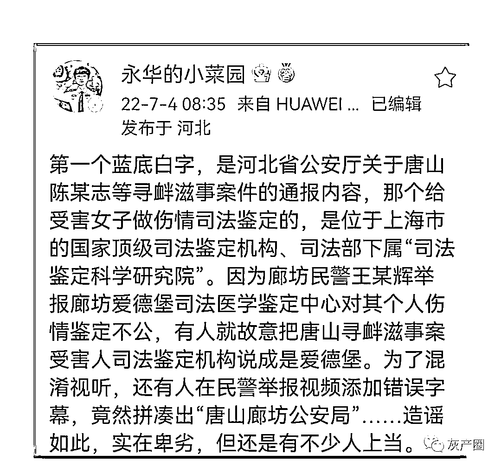

因为贾永华的辟谣来路权威，事实清楚，证据确实，常常让造谣者把人丢到了姥姥家，有的还受到了法律制裁。于是，有人开始把矛头指向贾永华本人。

于是，她就成了@听雨廖书胜 们嘴里的“唐山烧烤店打女人主犯陈继志的母亲”。贾永华回复网友说：我算了下陈继志的岁数，他四十岁出头，我五十多岁，真生不了他。

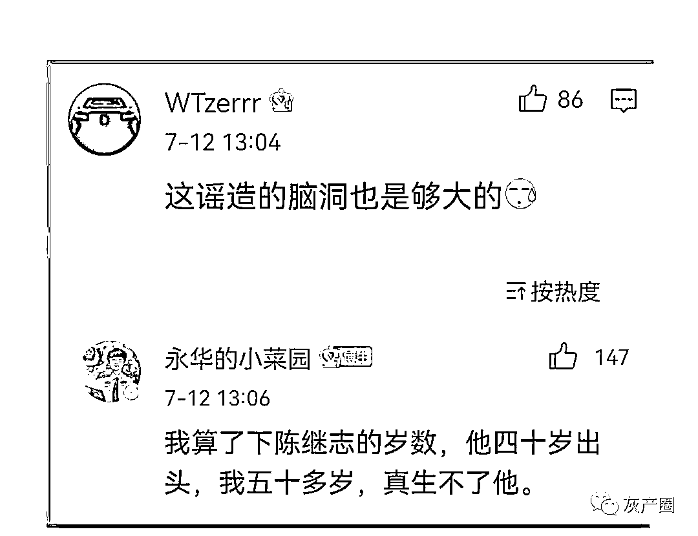

贾永华辟谣后，造谣者又改口她是陈继志的三姨。 

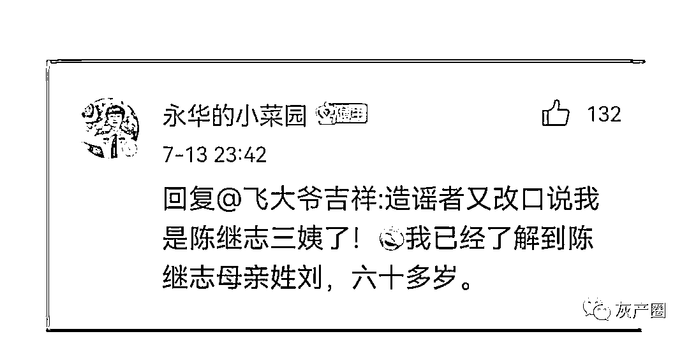

这次，我力挺贾永华！

我为什么相信贾永华。贾永华是个老报人，最早在河北日报工作。1995 年初，河北日报筹办燕赵都市报，贾永华是创办者之一，后来担任副总编。她执笔的《燕赵红色之旅》、《千里寻亲梦圆》、《愤怒与悲哀》(评论)曾获河北新闻奖特等奖、一等奖等大奖。

当时，正是纸媒最辉煌的时候，许多都市报、晚报都有整版的特稿文章，燕赵都市报的特稿版面叫“社会扫描”，那时，我是燕赵都市报“社会扫描”版的特约作者，在“社会扫描”发表过《芜湖一女教师举报校长后跳江自杀》、《中国第一聋哑警察》、《东方白雪公主谢玲》、《功勋犬“微乔”传奇》等多篇文章。

也就是在那个时候，我认识了贾总。贾总是个非常认真的人，每逢她值班签版时，对文章的每一处细节、疑问，都亲自打电话进行核实、确认。2002 年，贾总离开工作了 18 年的纸媒，到了河北省公安厅，最初时还担任《警视窗》杂志的老总，自然没少向我约稿。 

说起来，我和贾永华相识已经 20 多年了。

贾永华当年的同事这样评价她：**贾总人是很正的，她不会做那些亏心的事情。她很有爱心，在工作上是个很执着、认真、无私的一个人。**

燕赵都市报的朋友说，贾永华离开报社到省公安厅后，报社很多活动还是会邀请她参加。燕赵都市报与河北省文明办每年都有一个“感动河北”年度人物颁奖典礼活动，贾永华都是评委。

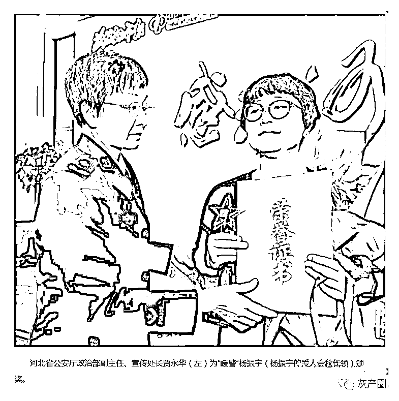

唐山烧烤店打人事件发生后，作为河北省公安厅政治部副主任的贾永华一直在关注着案件的进展。6 月 21 日，《关于陈某志等涉嫌寻衅滋事、暴力殴打他人等案件侦办进展情况的通报》发布后，贾永华第一时间转发，她表示：我坚信，正义永远不会迟到！”

她在与网友互动时，从来不回避自己的态度：

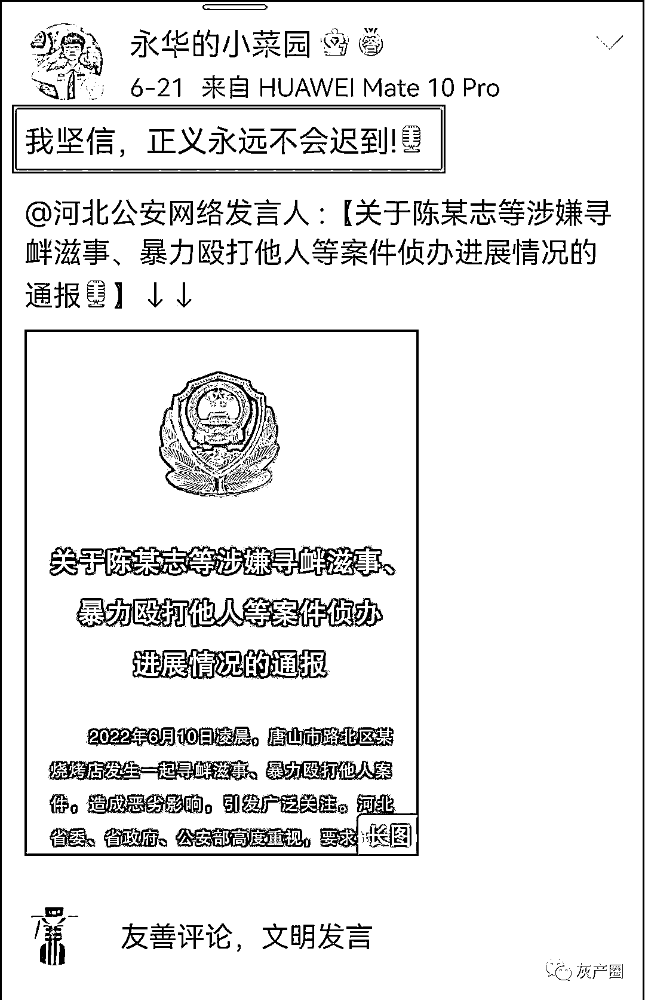

这是她作为一个老报人的职业底线，一个人民警察的责任与胸襟。

来源：宾曰语云  ID 号：lzkj328

](https://mp.weixin.qq.com/s?__biz=Mzg5ODAwNzA5Ng==&mid=2247487973&idx=1&sn=1b62da6f2018402862a5c375e10c355e&chksm=c06878b2f71ff1a4fbe7df4dec626aa7e696154751693bf16f6c6a302ceaa4d1959040c70518&scene=21#wechat_redirect)

← 向右滑动与灰产圈互动交流 →

