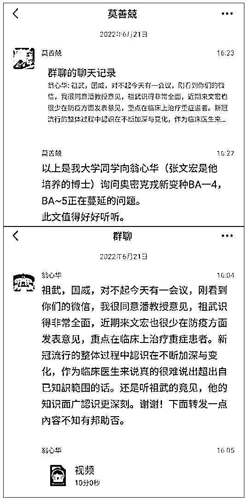
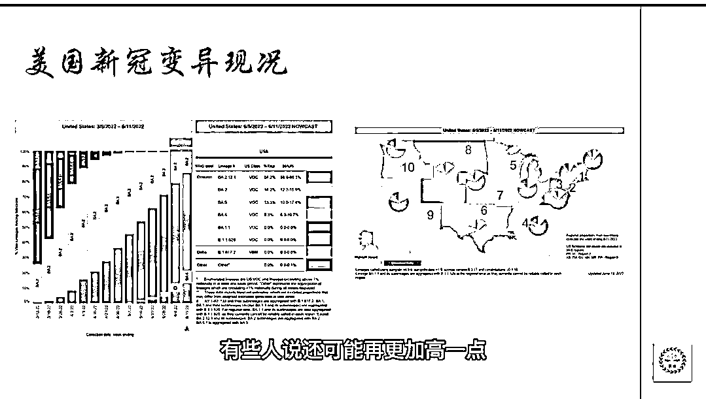
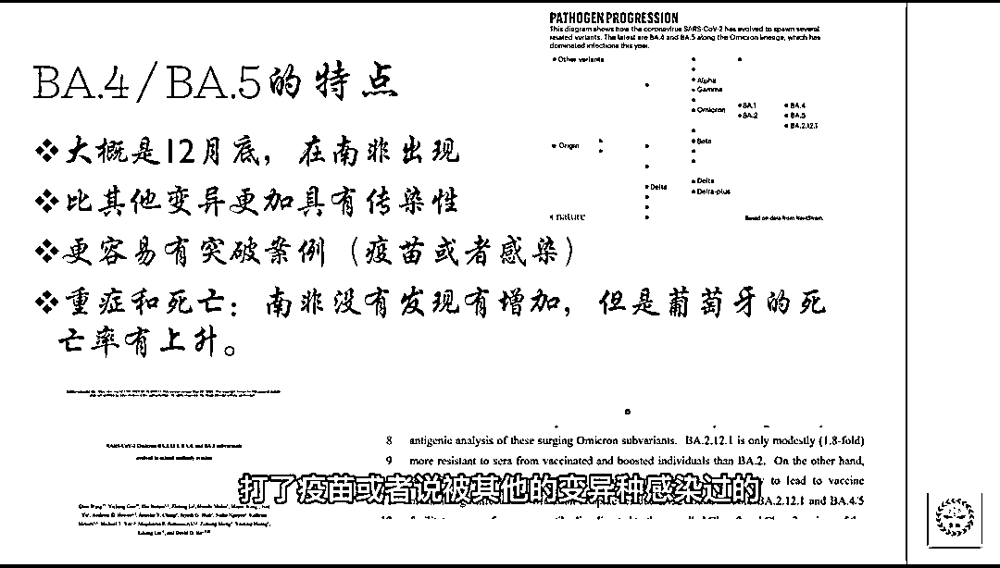

# 张文宏恩师翁心华教授谈奥密克戎 BA5：恐怕所有人都要感染一次！

> 原文：[`mp.weixin.qq.com/s?__biz=MzIyMDYwMTk0Mw==&mid=2247540170&idx=3&sn=1f77da443997cfc1b573bd6636fa0d30&chksm=97cb96f2a0bc1fe41e289233962bf03a647ec176fd472e90ef0a368c818d4ff6fc23ce1e4369&scene=27#wechat_redirect`](http://mp.weixin.qq.com/s?__biz=MzIyMDYwMTk0Mw==&mid=2247540170&idx=3&sn=1f77da443997cfc1b573bd6636fa0d30&chksm=97cb96f2a0bc1fe41e289233962bf03a647ec176fd472e90ef0a368c818d4ff6fc23ce1e4369&scene=27#wechat_redirect)

近日，在我国西安、北京、上海等地接连发现了传播力更强的奥密克戎 BA.5 变种。

在大多数人还不知道 BA5 是什么东西的时候，它却已经成为多个国家主要毒株，占据确诊量的 50%以上。 

下面我们通过翁心华教授(张文宏导师)发来的视频来了解一下这个新的变种。

[`mp.weixin.qq.com/mp/readtemplate?t=pages/video_player_tmpl&action=mpvideo&auto=0&vid=wxv_2482329562195214338`](https://mp.weixin.qq.com/mp/readtemplate?t=pages/video_player_tmpl&action=mpvideo&auto=0&vid=wxv_2482329562195214338)

点击视频播放：祖武博士讲解新变种 BA.4/BA.5

**根据视频的介绍，BA4、BA5 的传染性比原来****的 BA2 高很多，突破案例也非常多，现有的疫苗预防作用再次降低，作者认为：**

**所有人恐怕都需要准备感染一次 BA4 或者 BA5。**

***【***温馨提醒：******疫苗预防作用虽然降低，但预防重症和死亡率仍然十分有效，高危人群应及时接种。***】***

**早在几个星期之前，在奥密克戎 BA4、BA5 还没有传到中国之前，我国感染科的顶级专家就在讨论这个问题。**

下面这个聊天记录，就是翁心华(张文宏导师)和他的同学的聊天记录，这二位都是八十多岁的老专家。

**祖武博士对 BA4、BA5 所做的介绍，大体上可以总结为这么几点：**

① BA4、BA5 已经在葡萄牙造成大规模传染，在 6 月 21 日已经占美国总感染的 20％或更高一些，即将取代其他病毒变种，成为主流。

②BA4、BA5 的传染性比原来的 BA2 高 4.2 倍。所有的疫苗对它作用不大。即便以前感染过其他新冠病毒，也无法抵抗再次感染。所以祖武认为**所有人（包括他自己在内）都需要准备感染一次 BA4 或者 BA5。**

③对于 BA4、BA5、病毒，目前只能靠戴口罩、隔离、减少接触，核酸检测的办法对 BA4 和 BA5 无作用，做更多的核酸检测可能都无法阻止这两种病毒的传染。

**所以当务之急是加强基础设施，加强人员培训，而不是把大量的人用于做核酸检测。**

来源：新洞察

](https://mp.weixin.qq.com/s?__biz=Mzg5ODAwNzA5Ng==&mid=2247487973&idx=1&sn=1b62da6f2018402862a5c375e10c355e&chksm=c06878b2f71ff1a4fbe7df4dec626aa7e696154751693bf16f6c6a302ceaa4d1959040c70518&scene=21#wechat_redirect)

← 向右滑动与灰产圈互动交流 →

