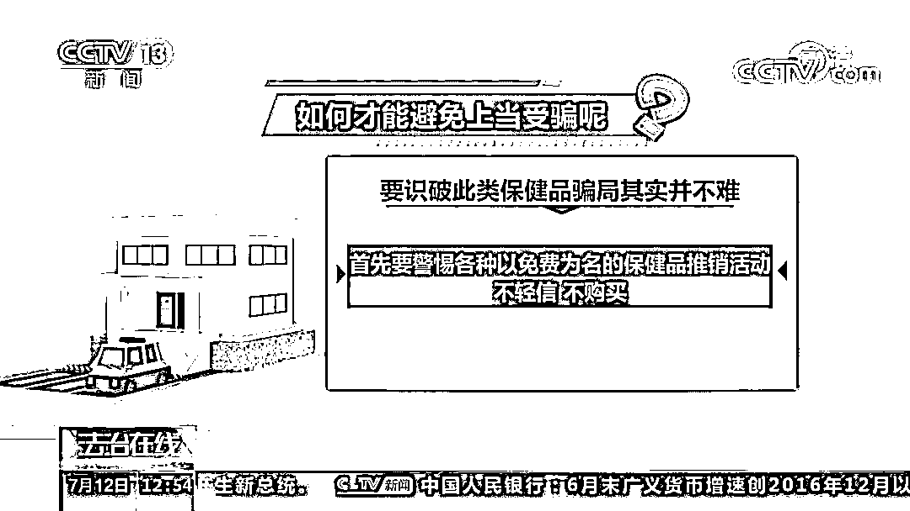

# 打击养老诈骗之保健品骗局！理疗毯、减肥药、保健药，老人为何“自愿”掏出养老钱？

> 原文：[`mp.weixin.qq.com/s?__biz=MzIyMDYwMTk0Mw==&mid=2247540170&idx=6&sn=e0a34116141a9c541d3b01e565911417&chksm=97cb96f2a0bc1fe4ead442613f120f4953230a813dfacb08376e5527b1cb4d93b3fe4a44ac22&scene=27#wechat_redirect`](http://mp.weixin.qq.com/s?__biz=MzIyMDYwMTk0Mw==&mid=2247540170&idx=6&sn=e0a34116141a9c541d3b01e565911417&chksm=97cb96f2a0bc1fe4ead442613f120f4953230a813dfacb08376e5527b1cb4d93b3fe4a44ac22&scene=27#wechat_redirect)

近年来，一些诈骗分子盯上了老年人和他们的养老钱，为了维护老年人的合法权益，全国政法机关正在开展打击整治养老诈骗的专项行动。央视新闻频道《法治在线》栏目推出与此相关的系列节目，通过典型案例，揭露与养老有关的诈骗手法和骗局，提高老年人的防范意识。7 月 14 日刊载第一期节目《打击养老诈骗之保健品骗局》。

[`mp.weixin.qq.com/mp/readtemplate?t=pages/video_player_tmpl&action=mpvideo&auto=0&vid=wxv_2485005799703150593`](https://mp.weixin.qq.com/mp/readtemplate?t=pages/video_player_tmpl&action=mpvideo&auto=0&vid=wxv_2485005799703150593)

上万元理疗毯 背后藏何猫腻

被害人刘女士回忆，当时她听朋友说，在这家店听养生课有免费的鸡蛋领，于是她抱着试一试的心态就去了这家养生会馆。没想到店里的老人非常多，业务员也十分热情，不仅给他们介绍了一些基本的养生常识，而且还为每个人都做了免费体检，这让在场的老人们都很开心，现场的气氛也非常热闹。

现场做完体检后，体检报告很快就出来了，这个免费的体检报告显示，刘女士身体存在一些健康问题，需要好好调理。之后，业务员热心地向她介绍了店里的特效理疗产品，也就是那条一万多元的理疗毛毯，称这条毛毯对调理刘女士的身体有奇效。此外，业务员还告诉刘女士，在购买了产品后她可以成为店里的会员，以后就有资格经常来店里领取鸡蛋、米面等礼品。在业务员热情地推荐下，刘女士头脑一热就买下了这条一万多块的理疗毛毯。

当天晚上，家人听了刘女士的叙述后都十分惊讶，在看了刘女士买到的所谓理疗毛毯后，家人们都无法相信，就这么一条普通的毛毯竟然价值一万多元。他们都认为刘女士一定是被骗了，于是陪同刘女士向警方报了案。随后，警方对此展开了深入调查，很快一个以售卖保健品为幌子的诈骗团伙浮出了水面。今年 5 月 6 日，深圳南山警方出动 50 多名警力，对这个团伙实施了抓捕，当场抓获嫌疑人 9 人，现场缴获了话术本等作案工具一大批。

据警方介绍，为了骗取老人们的信任，这个团伙经常会邀请所谓的“权威专家”给老人们上养生课，并提供免费体检，向在场的老人们推销具有神奇疗效的保健用品和保健食品。

> 深圳市公安局南山分局南头派出所民警 邓立国：
> 
> 我们现在抓获的这些人，平均学历在初中水平，冒充所谓的专家，比如广州市某眼科医院所谓的主任，放一些视频，其实说的都不是一回事，只是互相接近，偷换概念。

警方委托相关部门对这个诈骗团伙售卖的保健品进行了鉴定，鉴定结果显示，这些保健品根本不具备宣传中所说的疗效，只是普通的日用品和食品，刘女士购买的理疗毛毯也一样，根本没有所谓的理疗保健功能。

据警方初步调查，从 2021 年 3 月以来，这个诈骗团伙涉案 900 多万元，受害者达 400 多人。目前 9 名嫌疑人已被依法刑事拘留，案件正在进一步办理中。

减肥药“吃了就不能停” 捏造理由 危言耸听

2022 年 5 月，家住重庆市涪陵区的胡女士向警方报案称，自己遭遇了诈骗。想到自己 1 个多月以来的经历，胡女士身心俱疲。

> 被害人 胡女士： 
> 
> 心里很难受，睡觉都睡不着，几天都睡不着，我们本来是想减肥的，最后变成拿钱买命了。

胡女士说，自己上了年纪之后体重一直增加，饱受三高的困扰。今年 4 月初，胡女士在家中看手机时被一则减肥广告打动了，通过广告上的二维码，她添加了一个客服人员的微信。

> 被害人 胡女士：
> 
> 客服和我联系，说他们产品是国家认证的，不节食不运动都可以减肥，700 多块钱也不是太贵，能减肥也是很好的。

在客服的推荐下，胡女士购买了价值 799 元的“膳体纤茶”减肥套餐。

> 被害人 胡女士：
> 
> 但是产品来了以后，她（客服）就不管了，退出了，叫一个顾问和我联系，叫我先吃，吃了还没两天，一包都没吃完，就介绍医生。

这个销售顾问以胡女士购买的产品缺乏针对性为由，建议她接受专业评估指导，选择适合她体质的产品套餐，还让胡女士添加了一位叫黄先生的医生为好友。

> 被害人 胡女士：
> 
> 跟我聊家常，然后说保证我可以减 50 斤，那会的话产品价格也不贵，4180，我就把这个钱又交了，然后在吃第二个黄先生这个产品时，套路又来了，说黄先生要去开会了，因为他承诺了我瘦 50 斤，产品来了两天我还没有服用，就又换了一个人了。

在这名所谓的医生之后，销售顾问又介绍了另一位自称是“高级营养师”的人给胡女士。

> 被害人 胡女士：
> 
> 这个一来他就说是高级营养师，说在这方面你放心好了，怎么怎么的，产品没吃几天，说我配合得很好，内脏脂肪、血液脂肪都配合得很好，都（分解）出来了，要把这个脂肪排出来，就让我交钱。

随后这名高级营养师以“产品升级换代”、未按计划服用就会导致截肢危险”等为由，又推荐胡女士购买了多款减肥营养套餐产品。

短短一个月的时间，胡女士为购买这些所谓的减肥降脂产品先后花费了九万多元。

> 被害人 胡女士：
> 
> 第一次 799，第二次 4180，第三四次都是四万五。她说我，你没钱，借不到钱，你无能，我被她打击很深。

接到胡女士的报案后，重庆警方对全市范围内同类警情进行综合分析，发现了多起类似的案件。

警方立即对案件展开了深入调查，发现这伙嫌疑人成立了两个公司，分别名叫某膳体纤电子商务有限公司和某膳康丽健康科技有限公司，主要经营者为何某和桂某。经过 20 多天的缜密侦查，警方充分掌握了这个诈骗团伙的确凿证据。2022 年 6 月 10 日，专案组调集警力 300 余人，展开集中收网，共抓获以何某、桂某为首的涉案人员 399 名，捣毁涉案窝点 5 个。

> 重庆市公安局涪陵分局刑警支队副支队长 查禹：
> 
> 这些全部是嫌疑人售卖给我们受害人的一些产品，只是一些普通的食品、饮品而已，有的产品出厂价格就几十块钱，他们通过一系列的包装、层层套路，卖到受害人的手里面就是几千上万，有的甚至十几万元。

调查显示，这个诈骗团伙先是通过广告投放、电话推销等方式，吸引有减肥养生意向的中老年人上钩，然后由业务员进行联系。

揭秘诈骗手段

首先是第一线嫌疑人最先与受害人取得联系，兜售一些廉价的产品高价卖给受害人，关键是强调服用减肥产品时不能自己独立服用，其实就是为二线诈骗进行铺垫。第二线的嫌疑人冒充所谓的“高级营养师”、“体质规划师”，将成本极低的普通食品和保健食品，吹嘘成具有神奇疗效的减肥降脂产品，以此诱导老年人继续购买更多的、价格更高的产品。冒充的营养师，指导你服用他们的产品，控制你的心理，骗你说如果你不相信营养师的话，就会导致非常严重的后果。

据统计，该案被害人遍及全国各地，人数多达上万人，其中最多的一名被害人被骗走了 100 多万元。目前，重庆警方已对 218 名犯罪嫌疑人依法采取了刑事强制措施，案件正在进一步侦办中。

炮制神药骗局 一粒药卖七千元

前不久，广州警方接到了一个报警电话，这名报案人称他的父亲何先生在两年多的时间内，前前后后被人骗走了 27 万元。

> 广州市公安局天河区分局棠下派出所副所长  肖悦：
> 
>     （被害人）被骗子带去银行取款时，银行工作人员发现老人家年纪非常大，取大量现金觉得很可疑，就主动联系了他的家属。然后家属就说不要给他取款，马上过来了解一下什么情况，过来就发现这个老人应该是被骗了。

据被害人何先生说，他之所以去银行取钱是为了购买一款名叫“至宝丹”的保健药，那么这款名叫“至宝丹”的保健药究竟有什么功效，何先生竟然前后花费了 27 万元呢？这还要从两年前说起。

原来，两年前，何先生和往常一样在小区附近闲逛，走着走着就被一名拿着宣传单的业务员拦住，说他们公司在搞优惠促销活动，3.8 元就可以买 30 个鸡蛋。此外业务员还告诉何先生，他们公司还有很多其它活动，都是专门服务老年人的。

何先生想着一个人回家坐着也是无聊，有人陪着聊天也挺好的，于是就跟着这个业务员去了他们的公司。去到公司之后，业务员热情地招呼老人，关心他身体的状况，并推荐了几款保健药品。但何先生并没有购买，只是花了 3.8 元购买了 30 个鸡蛋。30 个鸡蛋要求分两次来领取，一次只能领 15 个，通过这种方式让客户反复来他们公司进行洗脑。

有了第一次买鸡蛋的经历，何先生对这家公司产生了好感，于是经常到公司来了解相关的优惠活动。取得老人家的信任之后，会推出他们所谓的专家教授出来，对老人进行一个专门的诊疗，因为事先掌握了老人的情况，一见面专家教授就能说出这个老人有什么什么病，老人家就会非常地相信。

所谓的专家面诊，加上业务员无微不至的关心，何先生从心理上已经相信了这些保健药品真的有效。直到这些专家说，想要身体彻底康复，只要吃一款名叫“至宝丹”的独家药品，每一粒的价格高达近 7000 元，由于深信不疑，何先生毫不犹豫就去银行取款了。了解到情况后，民警迅速展开调查。

通过对犯罪嫌疑人谢某的跟踪调查，民警很快发现了这家公司所在的位置。经过梳理，警方发现有两百多名老人遭遇到了这个团伙的诈骗。今年 5 月 12 日，广州警方立即对犯罪嫌疑人实施了抓捕，在广州和茂名两地抓获包括谢某在内的 18 名犯罪嫌疑人。在搜查中，民警查获了一大批包括鸡蛋大米以及养生仪器等涉案物品。

老人家带上公司来，除了 3.8 元买 30 个鸡蛋之外还可以花一块钱或者直接免费体验这些足疗，或者他叫护臀疗。在做这个治疗的过程中，嫌疑人就会跟事主进行一个嘘寒问暖，套取事主的个人信息，包括身体情况这些。

在一张名叫十全十美活动套餐的宣传单上，只要 321 元就可以买到宣传单上列出的十件商品，看似优惠，其实却内藏玄机。因为领这十样东西必须要参加他的讲课，参加一次讲课只能领一样东西，这就意味着客户只要买了这个套餐必须要听 10 次课，才能把所有的东西领走，在这个听课过程中就会被所谓的专家教授进行洗脑，从而进行诈骗。

目前，案件还在进一步的侦办调查当中。

**公安部刑侦局权威提示** 

**公安机关在梳理相关案件的时候发现，被骗的老人大多是独居状态，由于子女不在身边，这些老人普遍存在缺少关爱、缺乏情感交流的问题，而诈骗分子正是抓住了这一点。**

****

> **公安部刑侦局侵犯财产案件侦查处 二级调研员 王华：**
> 
> **      他们与社会和家人的联系比较少，孤独感比较强，一些不法分子通过与老年人长期的交往，通过聊天、聚会等等旅行等等方式，在情感上取得老年人的信任，降低了老年人的这种警惕和防范的意识。**

**为了能够成功实施诈骗，这些不法分子往往会采取循序渐进的方式进行作案，一步一步将老人带进诈骗陷阱。为了获取老人的信任，不法分子首先会打着免费赠送礼品、免费体检、免费旅游等幌子，博得老人的好感，然后再通过嘘寒问暖等手段进一步拉近与老人的关系，最终以关心老人的身体健康为由，通过虚假宣传、夸大疗效的方式，向老年人高价销售保健品。**

> **公安部刑侦局侵犯财产案件侦查处 二级调研员 王华：**
> 
> **有的是打着免费讲座、免费体检这种幌子来吸引老年人，有的是通过送鸡蛋、送大米、食用油等小恩小惠来博取老年人的好感，这样降低老年人的警觉性，甚至有的还会给老年人进行按摩、认干妈这种途径，就是亲情打动来出售保健品。**

**除了感情攻势之外，充分利用老年人追求健康的心理需求，也是诈骗分子屡屡得手的原因之一。为了抓住老人们的这个心理，诈骗分子往往还会给他们演一出专家看病的戏。**

**** 

> **公安部刑侦局侵犯财产案件侦查处 二级调研员 王华：**
> 
> **一些不法分子会冒充自己是老中医或者是专家，中老年人大多数或多或少都有一些慢性疾病，他们就利用中老年人关注养生的心理，通过问诊的方式归结病因，进行虚假宣传说自己的保健品可以包治百病等等，将廉价的保健品高价出售给中老年人。**

****

**那么如何才能避免上当受骗呢？对此公安机关提示，要识破此类保健品骗局其实并不难，首先要警惕各种以免费为名的保健品推销活动，不轻信、不购买；其次要养成正确的就医看病习惯，不要相信所谓专家的夸张宣传和神奇疗效，更不要相信有包治百病的的灵丹妙药。**

**此外，公安机关还特别提示，子女的关爱对于防范保健品骗局也十分重要，如果儿女们能够时常探望，多与父母进行沟通交流，诈骗分子就不会有可乘之机。**

**来源：公安部刑侦局**

******](https://mp.weixin.qq.com/s?__biz=Mzg5ODAwNzA5Ng==&mid=2247487973&idx=1&sn=1b62da6f2018402862a5c375e10c355e&chksm=c06878b2f71ff1a4fbe7df4dec626aa7e696154751693bf16f6c6a302ceaa4d1959040c70518&scene=21#wechat_redirect)**

**← 向右滑动与灰产圈互动交流 →**

****