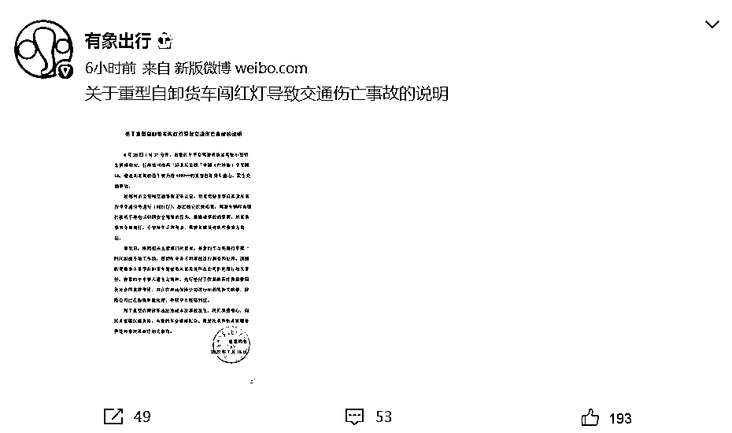
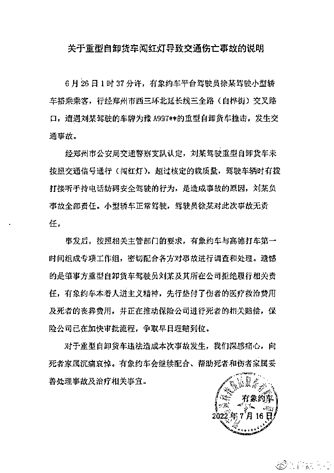
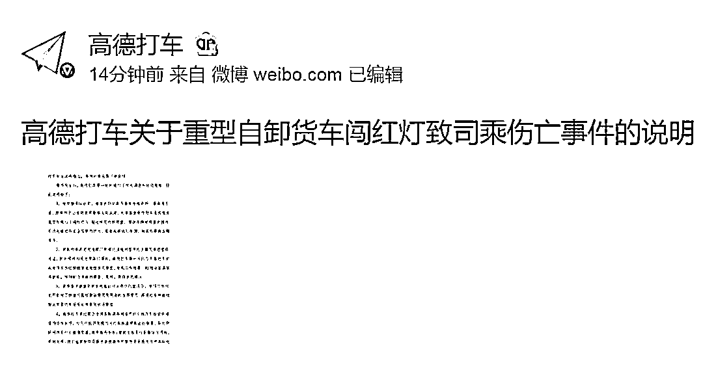
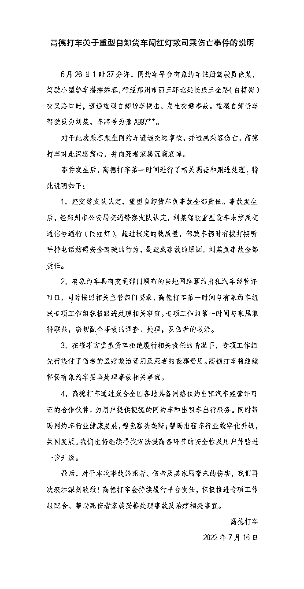

# 女生打网约车遇车祸身亡，交警认定系肇事货车司机全责，高德打车、有象出行回应...

> 原文：[`mp.weixin.qq.com/s?__biz=MzIyMDYwMTk0Mw==&mid=2247540254&idx=5&sn=6409771d5ce9de00cb7fafc34037bacd&chksm=97cb9526a0bc1c300592ce58eaf56d5c80c752670f10b4b9f15ad21250092753da9fe898a559&scene=27#wechat_redirect`](http://mp.weixin.qq.com/s?__biz=MzIyMDYwMTk0Mw==&mid=2247540254&idx=5&sn=6409771d5ce9de00cb7fafc34037bacd&chksm=97cb9526a0bc1c300592ce58eaf56d5c80c752670f10b4b9f15ad21250092753da9fe898a559&scene=27#wechat_redirect)

6 月 26 日，郑州一女大学生和朋友在郑州乘坐由高德打车平台派发给“有象约车”的网约车时遭遇车祸，不幸去世，同车人员还有两人重伤，两人轻伤。

据新黄河客户端 7 月 16 日报道，此次出事故的网约车属于高德打车聚合平台下的“有象约车”，打开高德打车 APP，其下有十几家与高德有聚合关系的网约车平台。新黄河记者注意到，7 月 16 日，“有象约车”仍然在高德平台正常接单。

去世女生的哥哥告诉新黄河记者，前几天找高德方面沟通，高德方面表示让“有象出行”对接，高德方不出面，涉事网约车司机证件审核工作不属于高德方。

[`v.qq.com/iframe/preview.html?width=500&height=375&auto=0&vid=l3347dv6n3y`](https://v.qq.com/iframe/preview.html?width=500&height=375&auto=0&vid=l3347dv6n3y)

## **有象出行：驾驶员徐某对此次事故无责任**

## 7 月 16 日，有象出行官方微博发布关于重型自卸货车闯红灯导致交通伤亡事故的说明：

6 月 26 日 1 时 37 分许，有象约车平台驾驶员徐某驾驶小型轿车搭乘乘客，行经郑州市西三环北延长线三全路（白桦街）交叉路口，遭遇刘某驾驶的车牌为豫 A997＊＊的重型自卸货车撞击，发生交通事故。

经郑州市公安局交通警察支队认定，刘某驾驶重型自卸货车未按照交通信号通行（闯红灯），超过核定的载质量，驾驶车辆时有拨打接听手持电话妨碍安全驾驶的行为，是造成事故的原因，刘某负事故全部责任。**小型轿车正常驾驶，驾驶员徐某对此次事故无责任**。

事发后，按照相关主管部门的要求，有象约车与高德打车第一时间组成专项工作组，密切配合各方对事故进行调查和处理。遗憾的是肇事方重型自卸货车驾驶员刘某及其所在公司拒绝履行相关责任，有象约车本着人道主义精神，先行垫付了伤者的医疗救治费用及死者的丧葬费用，并正在推动保险公司进行死者的相关赔偿，保险公司已在加快审批流程，争取早日理赔到位。

## **高德打车回应**

## 7 月 16 日晚间，高德打车发布“关于重型自卸货车闯红灯致司乘伤亡事件的说明”：

6 月 26 日 1 时 37 分许，网约车平台有象约车注册驾驶员徐某，驾驶小型轿车搭乘乘客，行经郑州市西三环北延长线三全路（白桦街）交叉路口时，遭遇重型自卸货车撞击，发生交通事故。重型自卸货车驾驶员为刘某，车牌号为豫 A997*。

对于此次乘客乘坐网约车遭遇交通事故，并造成乘客伤亡，高德打车对此深感痛心，并向死者家属沉痛哀悼。

事件发生后，高德打车第一时间进行了相关调查和跟进处理，特此说明如下：

1，经交警支队认定，重型自卸货车负事故全部责任。事故发生后，经郑州市公安局交通警察支队认定，**刘某驾驶重型货车未按照交通信号通行（闯红灯）**，超过核定的载质量，驾驶车辆时有拨打接听手持电话妨碍安全驾驶的行为，是造成事故的原因，**刘某负事故全部责任**。

2，有象约车具有交通部门颁布的当地网络预约出租汽车经营许可证，同时按照相关主管部门要求，高德打车第一时间与有象约车组成专项工作组积极跟进处理相关事宜。专项工作组第一时间与家属取得联系，密切配合事故的调查、处理，及伤者的救治。

3，**在肇事方重型货车拒绝履行相关责任的情况下**，专项工作组先行垫付了伤者的医疗救治费用及死者的丧葬费用。高德打车将继续督促有象约车妥善处理事故相关事宜。

4，高德打车通过聚合全国各地具备网络预约出租汽车经营许可证的合作伙伴，为用户提供便捷的网约车和出租车出行服务。同时帮助网约车行业健康发展，避免寡头垄断；帮助出租车行业数字化升级，共同发展。我们也将继续寻找方法提高各环节的安全性及用户体验进一步升级。

最后，对于本次事故给死者、伤者及其家属带来的伤害，我们再次表示深刻致歉！高德打车会持续履行平台责任，积极推进专项工作组配合、帮助死伤者家属妥善处理事故及治疗相关事宜。

来源：每日经济新闻综合自新黄河客户端

← 向右滑动与灰产圈互动交流 →

