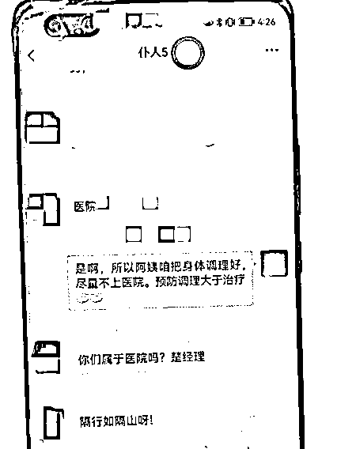
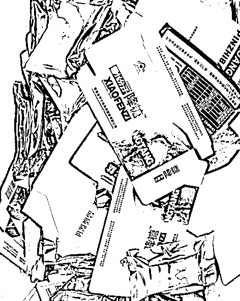
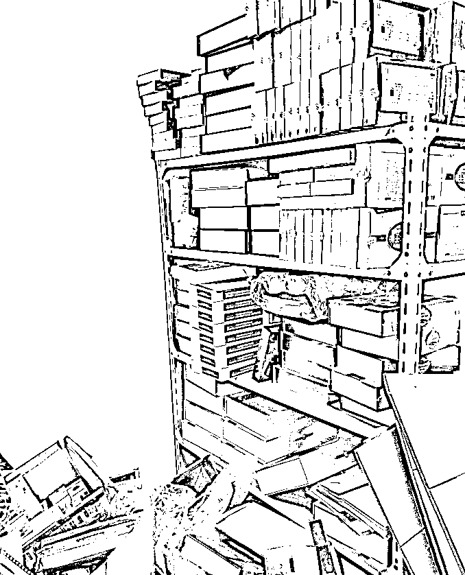
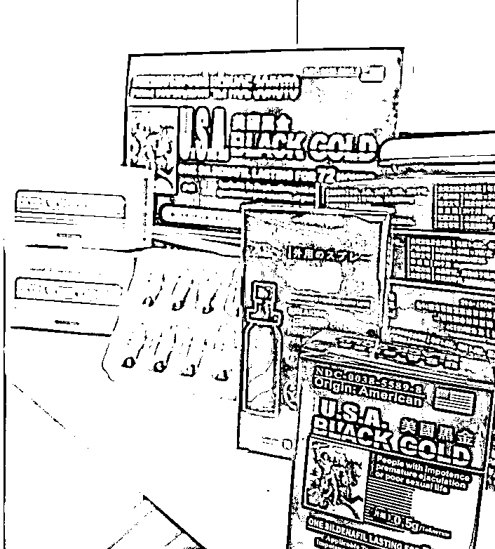
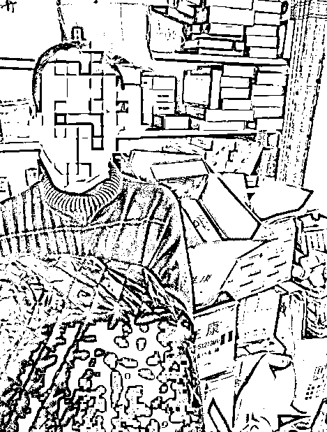

# “他比我儿子还关心我，能不能放一马？”被骗后，老人仍为骗子求情

> 原文：[`mp.weixin.qq.com/s?__biz=MzIyMDYwMTk0Mw==&mid=2247540254&idx=7&sn=2a1d30f9e2fb45162e24c58716f27bff&chksm=97cb9526a0bc1c305b93709ebed7d6a3ef3dc268b8246ec2b11a4acbbdcccd606c78e37b4547&scene=27#wechat_redirect`](http://mp.weixin.qq.com/s?__biz=MzIyMDYwMTk0Mw==&mid=2247540254&idx=7&sn=2a1d30f9e2fb45162e24c58716f27bff&chksm=97cb9526a0bc1c305b93709ebed7d6a3ef3dc268b8246ec2b11a4acbbdcccd606c78e37b4547&scene=27#wechat_redirect)

“警察同志，能不能不要处理他们。”80 多岁的陈大伯（化名）面对民警，竟然开口给骗子求情，让民警都暗暗吃惊。

“他比我儿子还关心我，我都把他当‘干儿子’。”

陈大伯此时还不知道，他认的这个“干儿子”，手机里陈大伯的备注是“仆人 4”。除了“仆人 4”之外，“干儿子”还联系着更多的“仆人”。无不是通过假意嘘寒问暖，连哄带骗的方式，向老年人高价推销所谓的“名贵滋补品”。

让很多老人彻底感到伤心的是，那些自己用养老金退休金买的滋补品，经鉴定只是含有西地那非、二甲双胍、格列本脲等非法添加剂的东西，百害而无一利。

近日，浙江杭州钱塘区公安分局侦破一起向老年人非法销售保健品的案件。经初步调查，该案团伙非法获利近 400 万元，被害人遍布全国，其中绝大部分，为 80 岁以上的老人。

**案子棘手之处还在于，像陈大伯这样的老人不止一个，有的人甚至放弃报案。**民警胡立冬唏嘘不已：“这些‘保健品’跟保健完全不搭边，还伤身体。我也是老人家的孩子，真的到最后不忍心直接和老人说，只能让他们家属做工作。还有些老人，根本不肯来提供证据或者报案，怕家里人知道，怕家里人骂，这也大大增加了侦查难度。”

**老爸在“干儿子”这里花了上万元**

**亲儿子最终发现不对劲**

去年年底，钱塘区公安分局环食药大队收到市民陈先生（化名）的求助。

“我爸最近买了好多保健品，牌子我见都没见过。老头子承认说花了好多钱，能不能帮忙看看正不正规………”

民警很快找到了陈大伯。面对警察，陈大伯不像和儿子沟通那样支支吾吾，而是把大致情况讲的比较清楚。

87 岁的陈大伯，在 3 年前的夏天认识了自称是某老年协会工作人员刘某。刘某当时是主动打电话来的，刘某先介绍了老年协会关爱老年人的政策，又试探询问他的身体状况。一听到陈大伯血压、血糖都比较高，刘某就开始跟陈大伯唠家常推销。

“我最早就试着买了点‘降糖胶囊’，吃了之后，感觉确实有效。加上他的售后特别好，每天都打电话过来，问我身体情况好不好。”

独居老人陈大伯被刘某的热情打动了。陈大伯心里也有数，**刘某卖的保健品价格逐渐走高，从 50 元，到 2000 元，最后上万元，保健品越买越多，越卖越贵。**

********

****打心底，陈大伯把刘某当成了自己的“干儿子”。直到亲儿子发现，情况不对了。****

****“我去看我父亲的时候，发现他房间里多了一些‘保健品’。他说吃的有用，我想想也没当回事。后来家里跟进货一样，都堆起来了，而且这些东西牌子从来没听过。”****

****亲儿子的劝说效果甚微。陈大伯还有点愠怒，给儿子展示了对方寄来的赠品。“床单、餐具、古钱币等等，这都什么东西啊！老头子还和我说，他们微信一直在联系，不像是骗子。我不想和我爸吵架，只有报警。”****

****之后，钱塘区公安分局联合区市场监管局，前往陈大伯家中取走“保健品”的样品。经检测，陈大伯购买的“保健品”中，含西地那非、二甲双胍、格列本脲等非法添加剂成分。****

******进价 5 元卖出 2000 元******

******里面还有对人体有害成分******

****民警调查发现，这些“保健品”，进货价格 5 元。被犯罪嫌疑人一包装，最高可以卖到 2000 元。****

****但这并不是犯罪嫌疑人最可恶的地方。为了让老人家“感受”到“保健品”有疗效，还添加了不少对人体，尤其是老人有害的成分，让老人家深信不疑。****

****正如民警所说，**“这些嫌疑人嘴上说着关心，心里却比谁都狠心。”******

******陈老伯买的“保健品”中，添加剂西地那非、二甲双胍、格列本脲是什么？******

******西地那非，俗称“伟哥”！长期服用，对老年人心脏等会有不良影响，二甲双胍和格列本脲虽然可以治疗糖尿病，但副作用也比较明显，特别是格列本脲，长期大量服用可能会造成低血糖和肾病，甚至死亡……******

************

******“举个例子。他们卖的一款东西叫‘海马益肾王’。包装上写着，含有鹿茸、鹿鞭、人参灵芝提取物，都是高档名贵滋补品对不对？但嫌疑人交代，他们进货成本 5 元都不到，这些名贵药材怎么可能有？”胡立冬说，“除此之外，每一款印在药品包装上的生产厂家，在网上均查不到。”******

******很多来到派出所，并得知这全部是一场骗局的老人，都陷入了深深的沉思。民警向记者展示了一张骗子记录的表格。信息显示，犯罪嫌疑人根据老人购买的价格高低，会“回赠”一点小礼物，让老人家高兴。******

******比如买了几百块，送一本台历；买了大几千，送一套马甲。像陈大伯这样的“仆人”，会送一些驼绒裤、老酒等等。在暴利面前，这些礼品根本算不上多少成本。******

********但偏偏是这些礼物，让老人们对骗子愈加深信不疑，觉得骗子是真的关心自己，把自己当亲人。********

******起底爱做“干儿子”的嫌疑人******

******保健品行业出身，获取大量老人信息******

****经过一系列的调查，民警很快锁定了犯罪嫌疑人余某某。余某某反侦查意识之强，让民警调查起来也非常困难。****

****2018 年，他与朋友吾某一起成立了一家贸易公司，主要目的就是向老年人推销保健品。他们从上级王某处进货，“一共有 8 种，什么‘虫草’‘美国黑金’‘鹿鞭王’‘降糖胶囊’等。”****

********

****这家公司一般会选择在高档写字楼租办公室，定期还会搬家。“保健品”不放在公司，而是放在距离公司 5 公里的员工宿舍隔间。****

****平时，由余某某亲自负责收发货，吾某则负责管理仓库和包装产品，他们另外招了两名客服负责电话销售。****

****整个公司，就这么 4 个人在运作。他们是如何找推销对象的呢？****

********

****86 年出生的余某某，此前在一家健康管理公司工作。在这行做久了，他明白一个道理：**老年人渴望长寿、渴望关爱、渴望交流。这也是他能屡屡行骗成功的最大原因。******

******之后，他私自拷贝了原公司的客户名单，还在网上花钱非法获得大量老人信息。******

******随后，余某某团伙便虚构各类老年协会、退伍军人保障协会等名义，逐个向名单里的老年人电话推销。******

******余某某行骗还有两大特征，值得大家警惕。他从不在公司或者仓库所在的小区寄件，而是专门跑到附近几个小区，用别人的身份证发货，而且几乎每次都选择到付的方式收款。民警回头追查起来，就非常困难。******

******民警将余某某、吾某、张某等人采取刑事强制措施后，又在其员工宿舍内搜出 8 类有毒有害保健品 1100 余盒。为使证据链完整，今年 6 月，钱塘警方赶赴河南，将余某某的上家王某某抓获。******

******王某某也并非生产厂家，而是一个二道贩子，可见“保健品”成本之低。******

******目前，此案嫌疑人因涉嫌妨害药品管理罪、销售有毒有害食品罪、帮助信息网络犯罪活动罪等被移送起诉，案件正在进一步办理中。******

******民警感叹，老年人的骗局，其实最重要的一点就是子女关心。子女关心了，老人才不会去别的地方寻找关爱，才不会买了大量假货后才被发觉，才不会要靠“保健品”去治愈疾病。******

********子女的关心关爱，才是老人家健康最好的“保健品”。********

****    来源：中央政法委长安剑，****

****************

****← 向右滑动与灰产圈互动交流 →****

********