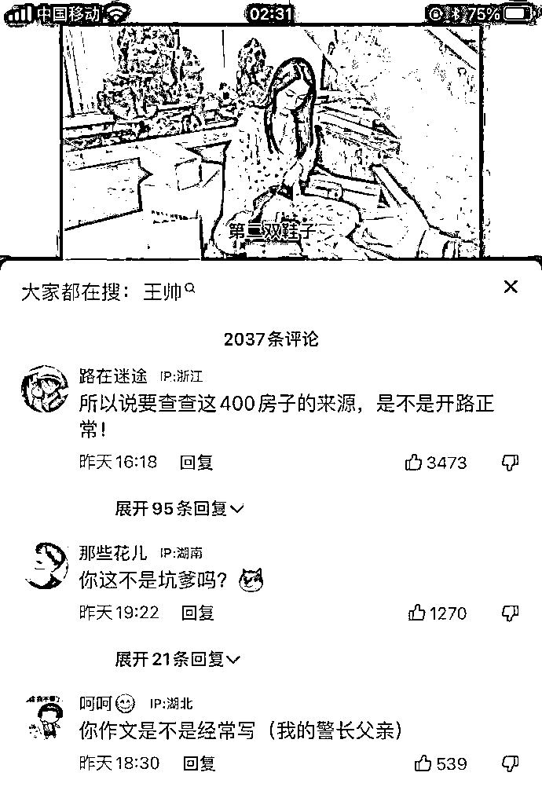

# 王澄澄的创业史：四年买了豪车豪宅，身价已经数亿！

> 原文：[`mp.weixin.qq.com/s?__biz=MzIyMDYwMTk0Mw==&mid=2247540320&idx=1&sn=398855a139c8281492e2e6025f667b65&chksm=97cb9558a0bc1c4e874d0cd0f350a6740cddb40412f1176fa03658ff10ab90c2eea902a6db9a&scene=27#wechat_redirect`](http://mp.weixin.qq.com/s?__biz=MzIyMDYwMTk0Mw==&mid=2247540320&idx=1&sn=398855a139c8281492e2e6025f667b65&chksm=97cb9558a0bc1c4e874d0cd0f350a6740cddb40412f1176fa03658ff10ab90c2eea902a6db9a&scene=27#wechat_redirect)

**01**

近日，一用户名为”王澄澄“的网红登上热搜：**生活在沈阳，创业四年就已经有豪宅和豪车，穿戴都是奢侈品。**

然而，其与身着警服的父亲合影，以及用印有“辽宁”字样的警用直升机拍摄商业短视频，受到网友质疑。

对此，“王澄澄”强硬地回怼说：**房和车都是自己买的，自 22 岁起没拿过家里一分钱，都是自己创业所得！**

随即，网友以“一分未花赵德汉，白手起家王澄澄”对其进行调侃，也有网友调侃其为“商业奇才”。

目前，账号“王澄澄”在短视频平台上已不可见。

更有网友喊话说：

**王澄澄是不是应该好好和小镇做题家们分享一下自己的成功心得呢？——你的肩膀是我豁达的天堂，我爱你爸爸！**

有网友称，**“22 岁是大学刚毕业的年纪，白手起家去创业，这启动资金就不是一笔小数目。而且现在的市场竞争这么激烈，除非是有特别出彩的技术专利在手，否则很难吸引到投资人的注意。”**

**煮夕：**夏洛你能跟人家袁华比吗，人家袁华年年三好学生优秀干部，对了说到袁华同学，我要着重的表扬一下，就在昨天，袁华同学获得了全区作文比赛的一等奖，作文题目是《我的区长父亲》，掌声鼓励 ！

**蓬勃昌盛：**商业奇才赵瑞龙，胜天半子祁同伟。

**我太爱上班啦：**别怪她了，她可能真的不知道，生意一谈就成，还总是让利，也不拖欠货款，这都是他父亲的影响

很快，她的资料就被网友给扒出来了。

**王澄澄的真名叫王宣澄，辽宁沈阳人，在新加坡读了 10 年的书。22 岁大学毕业后回国，响应沈阳“三引三回”号召，财大气粗地拿出 500 万元创业，为家乡做贡献。**

此后四年，她从奶茶店跨界到文化传媒，然后还入职能源科技公司。

**愣是凭能力赚到了 400 平的豪宅，一辆保时捷和 2 亿身家……**

网络是个好东西，随着事情的闹大，辽宁省沈阳市公安局迅速发布警方通报，具体内容如下：

**警方通报**

7 月 16 日，针对网民“王澄澄”在视频平台发布其与身着警礼服的父亲合影视频以及利用直升机为背景的视频引发网民热议问题，沈阳市公安局会同沈阳市纪检监察部门组成联合调查组开展了调查，调查情况如下:

1.网民“王澄澄”，真实姓名王某澄，31 岁。其父王某江于 2022 年 2 月退休，原系沈阳市公安局巡警支队某中队教导员，2010 年因病退出科级领导岗位，退休时为二级高级警长，三级警监警衔。 

2.网民“王澄澄”拍摄视频所用背景直升机，为辽宁通飞通用航空有限公司所属 H155 型民用直升机。该机停放于法库县财湖民用机场，日常管理维护由公司负责，沈阳市公安局仅在承担特殊任务时租用。网民“王澄澄”在拍摄视频时，该公司总经理鲁某未经批准擅自同意其拍摄。对此，集团公司已决定免去鲁某总经理职务。

3.王某澄于 2017 年开始自主创业，2021 年结婚，其丈夫赵某为沈阳一企业法人。其父王某江在职期间，已按规定将女儿王某澄创业经商情况进行了报告。

沈阳市公安局

2022 年 7 月 17 日

**02**

应该说，以上只是王澄澄事件的第一段，随着警方通报，事件的第二段刚刚才开始。

# 公众号“人格志”发文：**《今天“王澄澄”的通报来了，她的瓜会比郭美美更大吗？》**

在这个物欲吞噬人心的年代，王澄澄以“住在 400 平米的豪宅是什么体验”“厨师切好水果仆人送来”“逛逛商场三十万，想买就买”之类的主题，展示着自己的奢侈糜烂的生活，竟然获粉 300 多万！

那么，一个 22 岁的女生，到底凭什么实现经济独立，挥手就能投资 500 万开奶茶店，倒闭了还能豪车豪宅豪消费？

有网友进一步深扒，发现这个**王澄澄还兼任沈阳天源天一能源科技股份有限公司的高管**。

**而这家公司的母公司湖北天源环保集团，则是一家面向政府采购的垃圾渗滤液及高难度污废水处理企业，曾在新三板挂牌过，目前正在冲刺创业板 IPO。** 

**这么一家涉及政务的湖北前上市公司子公司，为什么会选择这样一个只会扭捏作态的女生作为高管？**

**王澄澄到底何德何能，何以会让一家如此巨大的资本抛出绣球？**

这一切，王澄澄展示的豪宅、豪车、奢侈品、名贵珠宝，当然难以给出答案。

不过，有一种脑残，叫“坑爹”。干爹亲爹，都坑。然后，拔出萝卜带出泥。

这一次，真正引爆舆情的，是王澄澄拖出了她的警察父亲与警方所用飞机：

**只要有起码的常识判断，就会觉得，这种制服、徽章，不只代表级别较高身份，更是权力资源的象征。**

特别是，这架飞机直接刺激人心：

**一个炫富秀下限的女子拍视频，竟然把这种警方使用的飞机作为拍视频的道具，这背后是否存在权力寻租？**

从炫富到炫父，王澄澄沿着郭美美的那条路，一路狂奔，把其父和警方，都直接拉进了一场惊天的舆论洪流中。

于是，才有了今天沈阳警报的通报。

**03**

根据通报：**原来，王澄澄父亲今年 2 月退休了，退休前曾任沈阳公安局巡警支队某中队教导员，是二级高级警长。**

这表明，其父级别确实不低。

根据通报：**王澄澄拍视频利用的直升机，是沈阳公安局承担特殊任务时租用的飞机，是负责管理维护公司的总经理鲁某擅自同意给王澄澄拍摄视频的，现在鲁经理已被免职。**

这表明，其中确有违规行为。

根据通报：**王澄澄自主创业，以及丈夫经商，为沈阳一企业法人，当初其父已按规定进行了报告。**

这表明？相关事项已经报告，难道就等同于无责？

这个通报内容，给人的想象空间无限。

**毕竟，王澄澄父亲手握权力资源是事实，拍摄飞机与警方权力系统有关也是事实，干部子女经商仍是事实。**

**至于事实背后还有多少不为人知的事实，每一个有常识判断和理性思维的人，都会陷于无穷的想象之中。**

必须要强调，这种想象，是现代社会每个公民的权利与自由。

但也必须强调，任何想象，永远都不能作为事实，来进行有罪推定。

所以，王澄澄事件到目前为止，结果也正如这名网友评价：

> **鲁经理借也不是不借也不是，终是一个人扛下了所有**

要想民意不再质疑追问，恐怕应该有更多的细节回应与透明展示。 

当然，还有一个可以判断的事实是，王澄澄属于无才无德、脑残炫富的花瓶，不可能如她所说，由她白手起家，靠创业致富完成如此巨大的财富积累。

如果这连种二货都能创业成功，那创业又怎么可能属于“九死一生”的艰难探险呢？

**如果这种笑料都能作为招引人才，我现在对东北经济不再灰头土脸，而是腾飞升级的梦想，也真是彻底碎了。**

想当初，郭美美不也是如此言之凿凿地强调，她是靠自身实力实现穿金戴银的吗？后来事实证明，“自身”，原来只是指“自己的身体”。

**不论如何，王澄澄发布的那些视频，都足以充当一份翔实的举报材料。**

关键是，相关部门是否愿意真的围绕这个议程设置，一查到底，透明公示。

说白了，人们都在担心：**王澄澄背后，会不会有比郭美美更大的瓜。**

所以，王澄澄事件如此通报，不应是终章，只能是开篇……

来源：公家人必读 洞释

](http://mp.weixin.qq.com/s?__biz=Mzg5ODAwNzA5Ng==&mid=2247488051&idx=1&sn=1ad64c0293a2731910bb4823694deb98&chksm=c0687b64f71ff27226524aa2a4d77cc1119ffb9ff5938f2973505bb619c73402a8a6b2e59e60&scene=21#wechat_redirect)

← 向右滑动与灰产圈互动交流 →

