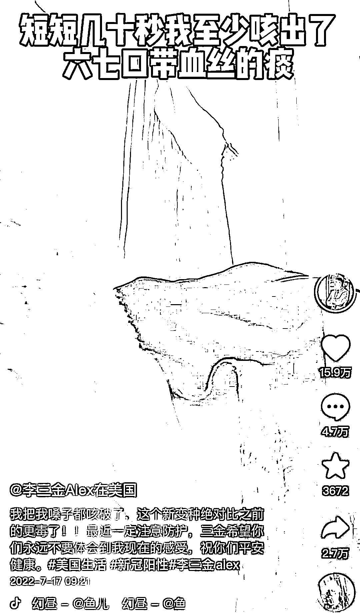
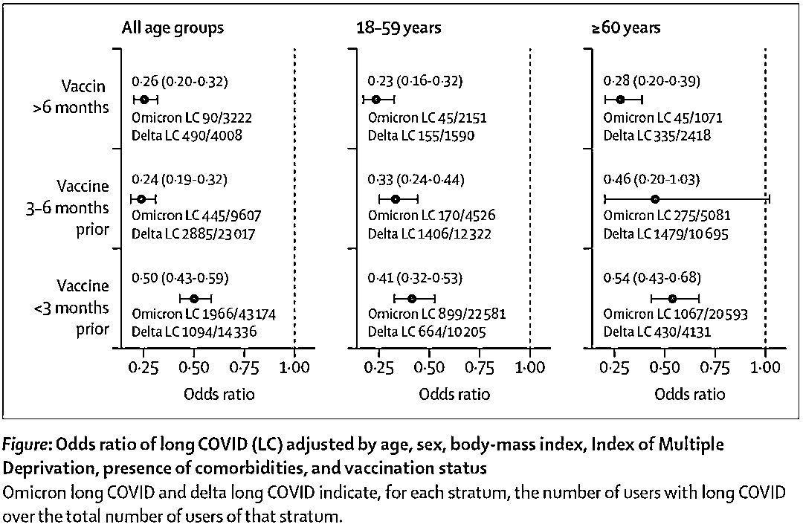
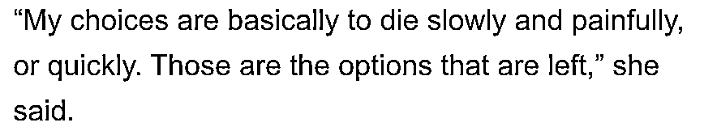
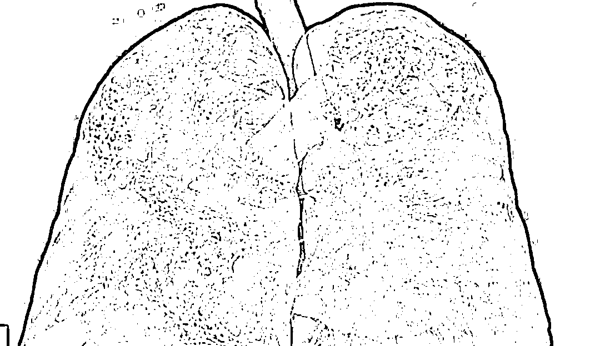
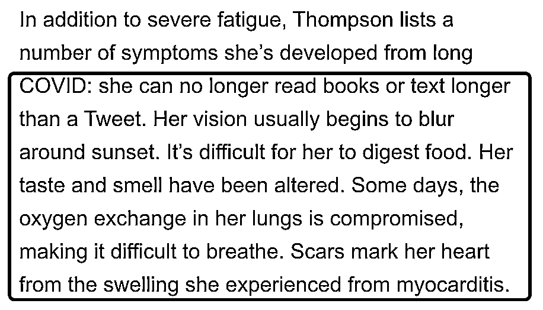
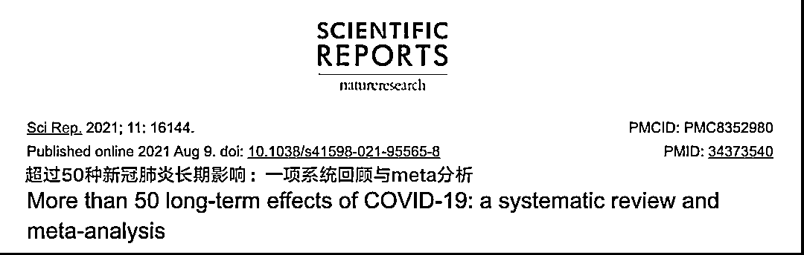
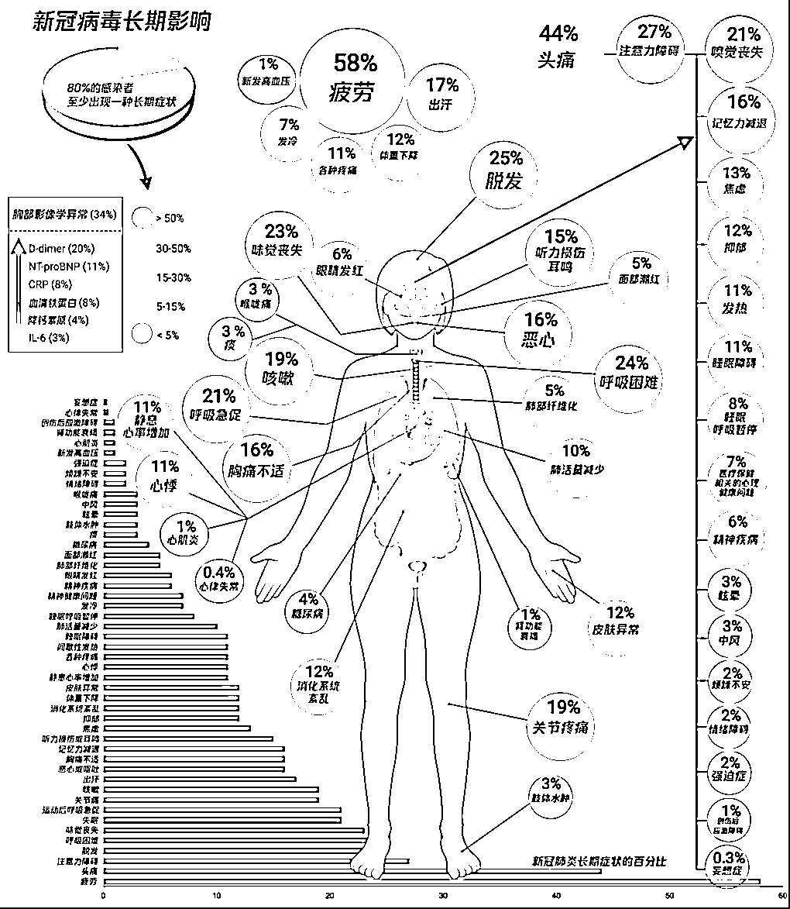

# 百万博主得新冠咳血住院，原来年轻人得新冠真的也会很严重啊！

> 原文：[`mp.weixin.qq.com/s?__biz=MzIyMDYwMTk0Mw==&mid=2247540320&idx=4&sn=c56f11713b1b00c088368e8433e119dd&chksm=97cb9558a0bc1c4e01f1e977867ddf0bc3722013e5bc597d5ea5bf289639bab2cb28d2b5114a&scene=27#wechat_redirect`](http://mp.weixin.qq.com/s?__biz=MzIyMDYwMTk0Mw==&mid=2247540320&idx=4&sn=c56f11713b1b00c088368e8433e119dd&chksm=97cb9558a0bc1c4e01f1e977867ddf0bc3722013e5bc597d5ea5bf289639bab2cb28d2b5114a&scene=27#wechat_redirect)

**一直以来在各种舆论对冲中**

**很多人觉得新冠对年轻人伤害不大**

**都是无症状顶多算大感冒** 

**但真实的新冠跟抽盲盒似的** 

**有时候就会很严重** 

**你愿不愿意拿命赌一把？**

最近，抖音上的一位身在美国的 up 主李三金 Alex 晒出了自己的感染新冠奥秘克戎 BA5 变异毒株后的反应，结果出人意料，不是说感染新冠没有什么严重的反应吗？ 

带着好奇，我看完了这位 up 主的视频。

虽然已经接种了三针疫苗，但还是感染了，刚开始感染，情况并不严重，只是喉咙很不舒服，拼命喝水。

但是，喉咙痛得情况并没随时间的推移变好，反而越来越严重。

up 主自称：“打了三针还是混打的，为什么还这么难受？”

再次更视频的时候，这位 up 主已经没有味觉了，不是说辉瑞已经出了新冠特效药吗？ 

特效药是有，但是需要医生的处方，药店才可以卖。

于是他约了家庭医生，但是医生要下周才有空，所以在此期间，他只能忍着。

没想到，情况有发生了转变。 

可能是由于长期咳嗽，嗓子里开始咳血，不确定是肺部问题，还是上呼吸道的问题。

感染第四天，他觉得不能再等下去了，情况没有自行缓解，也就是说新冠没有自愈，肺部功能都快保保不住了。

Alex 决定去医院，在排队将近 5 个小时后，终于见到了医生，安排住院，虽然没有到需要上呼吸机的程度，但症状非常明显。 

整个过程看下来，感觉 Alex 非常痛苦。

他在视频中也提到，在医院大部分都是老年人，像他这种年轻人没有几个，但怎么说呢？新冠 BA5 的严重症状，也还是会存在于年轻群体中的。

6 月 18 日《柳叶刀》（The Lancet）发表同行评议通讯，评估与 SARS-CoV-2 的德尔塔变异株和奥密克戎变异株相关的新冠长期症状风险。

研究发现，根据年龄和疫苗接种后的时间，奥密克戎变异株与德尔塔变异株相比，出现新冠长期症状的几率降低。

但是，在特定时间出现新冠长期症状的绝对人数取决于大流行曲线的形状和幅度。

也就是说，并不是没有症状，只是比例概率相对低很多而已。

凡事无绝对。 

研究显示——

在奥密克戎病例中，4.5%（2,501/56,003）出现新冠长期症状，而在德尔塔病例中，10.8%（4,469/41,361）出现新冠长期症状。

就疫苗接种各时间段的时间而言，奥密克戎病例出现新冠长期症状的可能性均较低，OR 范围为 0.24（0.20-0.32）至 0.50（0.43-0.59）。

上述结果在不同年龄组中也得到了证实。

而在全球范围内，有一群人在对抗“新冠长期症状”（Long COVID-19）。

甚至，有研究表明，要想缓解这种症状，需要像白血病人那样换血才行。

Beate Jaeger 是德国的心血管专家，她觉得“长期新冠”的症状可能是因为血液中细小的凝块造成的。

这些小凝块会阻碍氧气流动，导致疲劳和肌肉酸痛。

如果使用“洗血”治疗，可以把患者血液中多余的小凝块和蛋白质清洗掉，结合使用抗凝剂、血液稀释剂等药物，帮助清理毛细血管，促进血液循环，从而缓解症状。

Jaeger 医生发表过一份报告，介绍实验性治疗的结果。

她表示，最初有两位患者接受了实验性治疗，后来又有 60 人进行了尝试。

一名坐轮椅的“长期新冠”患者在治疗后可以站起来走路了，另一位走路费劲儿的患者治疗后可以慢跑了。

因此，她在成千上万患者身上看到了“治疗将非常成功”的希望。

一些被“长期新冠”折磨的患者发现“洗血”疗法后，也燃起了新的希望。

个别患者抱着死马当活马医的心态，决定试一试。

其中就包括荷兰的 Gitte。

她找到一家塞浦路斯的“长期新冠”治疗中心，能提供“洗血”项目，今年 3 月可以接待她来治疗。

“我想过，去治疗试一试的话，最差的结果是什么？”Gitte 说。

“唯一的损失就是钱，好吧，这样的话为啥不试一试呢？”

于是，Gitte 坐飞机飞了 1700 英里，来到塞浦路斯，在当地海滩上租了一个房子暂住。

她预约了“洗血”治疗，每周一次，还试了一些未经验证的“附加疗法”，比如高压氧舱吸氧和静脉注射维生素。

“我对附加治疗有点儿犹豫，但我跟自己下了决心，到那儿之后什么可能有用的方法都要试一试。”

Gitte 进行了 6 轮“洗血”，每次要花 1685 欧元，

还有有 9 轮高压氧舱治疗，每次 150 欧元，以及多次静脉注射维生素，每次 50 欧元。

医生还给她开了抗凝治疗的药物，并建议她在回国之前开三个月的药。

医药费加上旅费和生活费，Gitte 一共花了 1.5 万欧元（折合人民币约 10.1 万）。

回到荷兰的家时，Gitte 几乎花光了全部积蓄。

最让她难过的是治疗效果不尽如人意，“长期新冠”的症状并没有缓解。

但也有一些患者称经过“换血”，自己的症状明显减轻了很多。 

有一些患者称，他们在几轮治疗后感觉好多了，尽管没有一种治疗方法能治愈所有症状。

患有新冠长期症状的曼彻斯特呼吸科医生表示，

自己在经过约 21 轮的治疗和高昂花费后，自己的症状有极大改善。

注意，是 21 轮治疗。 

“新冠长期症状”不容忽视，因为它实在是太折磨人了，没办法治愈，又无法正常生活工作，一旦患上，现代医学的手段目前无解。

加拿大一名女子 Tracey Thompson 因为无法忍受新冠病毒带来的长期后遗症，竟然选择了安乐死。

自最初感染以来已经两年多，但她的痛苦症状一直支配着她的日子。

她每天都会感到极度疲劳，这也剥夺了她的精力和工作能力。

她绝望地表示：

“我能选择的，无非是慢慢地、痛苦地死去，或者很快地死去。”

除了严重的疲劳之外，她还列出了她因长期感染新冠病毒而出现的一些症状，包括：

她不能再阅读比推特更长的书或文本；她的视力通常在日落时分开始模糊；

她很难消化食物、她的味道和气味都发生了变化。

有时，她肺部的氧气交换受到影响，导致呼吸困难...

其不仅存在新冠长期症状，而且 Tracey Thompson 还丧失了经济来源，

所以她才想选择安乐死， 

她还预计在大约五个月内将用完钱。

什么是新冠肺炎长期症状？常见症状都有哪些？严重程度如何？让我们来看一下顶级医学期刊上的权威证据。

在 2021 年 10 月 6 日，世界卫生组织（WHO）首次公布新冠长期症状（Long COVID-19）的官方临床定义：

新冠肺炎长期症状是指，新冠肺炎确诊患者或疑似新冠病毒感染者，在感染后 3 个月内出现，持续至少 2 个月，并且无法由其他诊断解释的症状。

目前，全球出现新冠肺炎长期症状患者的具体人数尚不明确。但约 10~20%的急性新冠病毒感染者在感染后会有数周至数月的残留症状。

2021 年 8 月《自然》期刊旗下的《科学报告》刊登了一篇名为《超过 50 种新冠肺炎长期影响：一项系统回顾与 meta 分析》的研究报告。

图片来源：研究封面 4 

该项研究共涉及 47910 位感染者，年龄范围 17~87 岁。

研究表明，80%的感染者康复后数周至数月内，至少出现一个长期症状。

该研究共确认了 55 种长期症状，其中，最常见的 5 种是疲劳（58%）、头痛（44%）、注意力障碍（27%）、脱发（25%）和呼吸困难（24%）。此外还有嗅觉和味觉丧失、咳嗽、关节疼痛等。

在这些感染者中，肺部 CT 异常也较常见，35%的感染者在首次肺部 CT 扫描 60~100 天后，肺部 CT 显示仍存在异常。

（新冠病毒肺炎的长期影响。图片来源：Lopez-Leon, S., Wegman-Ostrosky, T., Perelman, C. et al. More than 50 long-term effects of COVID-19: a systematic review and meta-analysis.） 

遗憾的是，此篇论文并未提及这些长期症状会持续多久；也没有数据能够说明，有多大的可能性会伴随终生。

不过还有一点需要注意：这项研究的对象，都是 2021 年 1 月 1 日前的感染者。也就是说，他们基本上感染的是新冠病毒原始毒株，而不是目前在全球占主导地位的奥密克戎（Omicron）毒株。

可见，近 1 年的新冠病毒感染者和论文的研究对象存在较大的差异，虽然仍存在一定的参考价值，但还需要不断的研究。

所以说，新冠真的是一种令人费解的病毒，这种完全随机开盲盒式的重症概率，让这场疫情成为了全人类的一场大型轮盘赌。

**给今天的评论区打个预防针，肯定有一堆喷的，模板我都给你们写好了，直接复制粘贴就行了，生命很短暂很宝贵，节省时间：** 

***别在这里散播焦虑了，你这个防疫爱好者！他那都是演戏！宣传经费批下来了吧，清零到死吧你！核酸企业给你了多少钱？全世界也就我们这么防疫。多少人都吃不上饭了你知道吗？呸！垃圾！（复制粘贴时记得删掉括号）*** 

来源：蜻蜓队长 北美留学生日报

← 向右滑动与灰产圈互动交流 →

