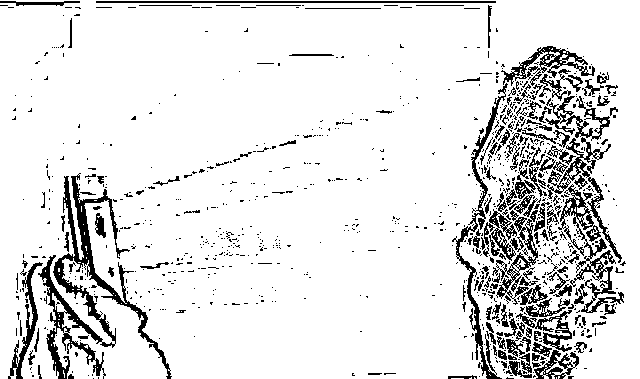

# 当银行人脸识别系统被攻破

> 原文：[`mp.weixin.qq.com/s?__biz=MzIyMDYwMTk0Mw==&mid=2247540320&idx=5&sn=90faf9f9bff1c4f22f5c1499ebfbe362&chksm=97cb9558a0bc1c4e3a4a356c5bb1c0073fd4af860fc7b00b801d4c395da3b23841b09ce6f466&scene=27#wechat_redirect`](http://mp.weixin.qq.com/s?__biz=MzIyMDYwMTk0Mw==&mid=2247540320&idx=5&sn=90faf9f9bff1c4f22f5c1499ebfbe362&chksm=97cb9558a0bc1c4e3a4a356c5bb1c0073fd4af860fc7b00b801d4c395da3b23841b09ce6f466&scene=27#wechat_redirect)

据中国新闻周刊报道： 

李红（化名）万万没想到，诈骗人员从她的交通银行卡偷走近 43 万元，如入无人之境。

要想从交通银行卡中转账，需要用户在手机银行 App 上进行人脸识别，并进行短信验证。李红陷入了诈骗分子的圈套，她的手机短信被拦截，手机号被设置了呼叫转移，令她的验证码落入他人手中，且无法接听银行的确认电话。

更严重的是，“人脸识别”被攻破了。银行系统后台显示，在进行密码重置和大额转账时，“李红”进行了 6 次人脸识别比对，均显示“活检成功”。

那几次人脸识别并不是身在北京的李红本人操作，登录者的 IP 地址显示在台湾。当李红本人登录手机银行时，卡里的钱已被悉数转走。她去派出所报案，警察很快认定她遭遇了电信诈骗，并立案侦查。

既然不是本人操作，为何还能“活检成功”？李红怀疑交通银行人脸识别系统的安全性，并以“借记卡纠纷”为由将交通银行告上法庭，要求赔偿。

2022 年 6 月 30 日，北京市丰台区人民法院一审驳回了李红的全部诉求。她准备继续上诉。

每个人只有一张脸，因其不易被仿冒，人脸识别被认为具有较高安全性，近年来被普遍适用于银行验证中，用来保障资金安全。但超出普通人认知的是，人脸具有唯一性的生物识别信息，是敏感个人信息，它裸露在无处不在的摄像头下，极易获得。在如今人脸识别系统并不成熟的情况下，用合成活动人脸骗过审核系统的案例屡见不鲜。

**一夜间背上巨债，你可要高度警惕**。

[`mp.weixin.qq.com/mp/readtemplate?t=pages/video_player_tmpl&action=mpvideo&auto=0&vid=wxv_2487424461495992323`](https://mp.weixin.qq.com/mp/readtemplate?t=pages/video_player_tmpl&action=mpvideo&auto=0&vid=wxv_2487424461495992323)

来源：实测

← 向右滑动与灰产圈互动交流 →

